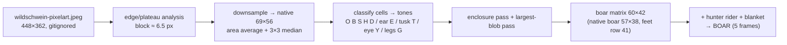

# Boar sprite (Wildschwein) — hunter rider + plain saddle blanket

Procedural pixel art for the **forest** theme racer. Faces **right**, one boar per lane.
Traced from the user reference `wildschwein-pixelart.jpeg` (repo root, `448×362`,
user-mirrored to face right). No image files at runtime: the matrices below drive
`drawSprite`. Conventions follow [`docs/art/camel-sprite.md`](camel-sprite.md)
(legend discipline, `O`-enclosure pass, single 4-connected blob, feet on the bottom
row, 1 standing + 4 walk frames, plain saddle blanket (team name = canvas label above
the animal), per-lane robe char `R`).

> **Change log.** 2026-10-06 (user request): per-lane digit retired from the saddle
> blanket; the team name is drawn as a canvas label above the animal (12 px monospace
> `#e8e0d0` on a dark pill, clamped to the canvas).
>
> 2026-10-04 (user request): enlarged tusks (near canine + a
> smaller far-side tusk) and white-sclera eyes with a black pupil dot.

> **Reference is copyrighted & gitignored.** `.gitignore` keeps
> `wildschwein-pixelart.jpeg` out of git. It is **never committed, never linked or
> embedded in docs, never loaded at runtime**. Only the matrices below are shipped.

| Item | Value |
|---|---|
| Size | **60 × 42** buffer px (matrix, uniform all frames); painted bbox ≤ **57 × 42** |
| Frames | 1 standing + 4-frame walk: `contact A → pass A → contact B → pass B` |
| Feet | on the **bottom row** (`row 41`) in every frame |
| Height budget | 42 px sprite (42 ≤ `laneFit.spriteHMax = 70`); 8-lane slack `74 − 70 = 4 px` |
| Rider | **hunter** — forest-green cap `C`, skin `K`, lane-colour tunic/robe `R`, reins `D`, boots `D` |
| Blanket | `L #bfe3ea`, plain pad **6 wide × 10 tall** (`cols 18–23, rows 18–27`); no digit area, no digit |
| Status | authoritative forest animal; consumed by `THEMES.forest.animal` (Task 9) |

## Reference trace — detected native grid

The reference is upscaled pixel art. Native block size was detected programmatically:

- **Edge/plateau analysis.** Top-edge and left-edge staircases (silhouette boundary
  as a function of x / y) have plateau run-lengths dominated by **6 and 7 px**
  (histogram: 6×12, 7×6, 14×5, 15×3, …) → mean block **≈ 6.5 px** (integer scans at
  s = 3…10 show no exact block, so the upscale factor is non-integer).
- **Native grid** = `round(448 / 6.5) × round(362 / 6.5)` = **69 × 56**.
- **Native boar bbox** (luminance `< 210` mask, background white): original
  `x 44–415, y 52–299` → native `x 7–63, y 8–46` → **57 × 38 px** (feet native row 45).
- The `/tmp` throwaway script area-averages the JPEG to the `69 × 56` grid
  (box/area resample, 3×3 median denoise), aligns native cell `(i,j)` to matrix
  cell `(col, row) = (i − 6, j − 4)`, then classifies each cell by nearest palette
  tone.



## Palette

Fixed tones (grizzled brown-grey bristle, sampled from the trace clusters).
Contrast ratios are WCAG (luminance method).

| Token | Char | Hex | Use |
|---|---|---|---|
| `outline` | `O` | `#16120b` | silhouette outline **and hooves** |
| `body` | `B` | `#4c4332` | boar body (grizzled brown-grey) |
| `shade` | `S` | `#3c372a` | belly / lee side / bulk |
| `bristle` | `D` | `#26221a` | dark bristle ridge + reins + boots |
| `highlight` | `H` | `#5f5745` | lit bristle bands |
| `ear` | `E` | `#787160` | pale ear |
| `tusk` | `T` | `#f0ece0` | tusks — near canine + smaller far-side (cream) |
| `eyeWhite` | `W` | `#f0ece0` | eye sclera (white; same hex as tusk, distinct char) |
| `pupil` | `Y` | `#14100b` | eye pupil (also the hunter's eye) |
| `legs` | `G` | `#2e2918` | darker legs |
| `robe` | `R` | **lane colour** | hunter tunic (per-lane) |
| `skin` | `K` | `#d8a878` | hunter face + hand |
| `cap` | `C` | `#2f6b3a` | forest-green hunter cap |
| `blanket` | `L` | `#bfe3ea` | saddle blanket (plain) |

Lane colours (tunic `R` only, in lane order, shared with the camel):

| Lane | 0 | 1 | 2 | 3 | 4 | 5 | 6 | 7 |
|---|---|---|---|---|---|---|---|---|
| | `#e84a3a` | `#3a6ae8` | `#3aa84a` | `#e8c83a` | `#9a4ae8` | `#e88a3a` | `#3ad8d8` | `#e85a9a` |

Contrast: tusk `#f0ece0` on body `#4c4332` = **8.25**; blanket on body = **7.14**;
outline on a forest-floor green `#5a7a3a` = **3.80** (silhouette reads; large flat
shape, outline-on-background — same reading rule as the camel).

## Legend (char → palette)

Every char routes through the sprite's palette object (`BOAR_PAL`, see
[Implementer notes](#implementer-notes)). Only **`R` is per-lane**; all others fixed.

| char | meaning | colour | per-lane? |
|---|---|---|---|
| `.` | transparent | — | — |
| `O` | outline + hooves | `#16120b` | no |
| `B` | boar body | `#4c4332` | no |
| `S` | boar shade | `#3c372a` | no |
| `D` | bristle / reins / boots | `#26221a` | no |
| `H` | bristle highlight | `#5f5745` | no |
| `E` | pale ear | `#787160` | no |
| `T` | tusks (near + far) | `#f0ece0` | no |
| `W` | eye-white sclera | `#f0ece0` | no |
| `Y` | eye pupil (+ hunter eye) | `#14100b` | no |
| `G` | legs | `#2e2918` | no |
| `R` | hunter tunic (robe) | lane colour | **yes** |
| `K` | hunter skin | `#d8a878` | no |
| `C` | hunter cap | `#2f6b3a` | no |
| `L` | saddle blanket | `#bfe3ea` | no |

> Boar legend is independent of the camel legend (`G` = legs here, `G` = harness
> there). Resolve each sprite through its own palette object; keep
> `X` = checker-dark for the finish flag.

## Matrices

`BOAR` — 5 frames, each **42 rows × 60 chars**. Dressed form is what the game
renders. Rider + blanket drift **+1 row** with the body on bob frames `2, 4`.

```js
const BOAR = [
    [ // frame 0 — standing (idle; traced gait, feet row 41)
      '.......................OOOOO................................',
      '........................OCO.................................',
      '.......................OCCCO................................',
      '.......................OCCCO................................',
      '......................OKKKKKO......OOO......................',
      '......................OKKKYKO.....OSESOO....................',
      '......................OKKKKKO....OSEEESSO...................',
      '.....................ORRRRRRRO...OSEEEDDSO..................',
      '.....................ORRRRRRRRO..OSEEEDDSSO.................',
      '.....................ORRRRRRRROOOOHEEDDSSSSOO...............',
      '.....................ORRRRRRRROKOHBDDDDSSSSSSO..............',
      '.....................ORRRRRRRRODDHBBSSSSSSSSSSO.............',
      '.....................ORRRRRRRRODDDBBBSSSSSSSSSSO............',
      '.....................ORRRRRRRROSSDDBSSSSSSSSSSSDO...........',
      '................OO..OOOOOOOOOOBSSSDDSSSSSHHHSSSDO...........',
      '...............OBHOOBDDOGGGOSBBBBSSDDSSSSSSSWYSDSO..........',
      '..............ODSBHHHDDOGGGOBBBBBSSDDDSSSSSSWWSSSSO.........',
      '............OOSSBBBBBBODDDDOBBBBSSDDDDDSSSSSSSSSSSSO........',
      '...........OSSSSBBLLLLLLHHHHBBBSSDDSSBDDSSSSSSSSSSSSO.......',
      '..........OSSSSBBBLLLLLLHHHBBBSSDDDSBBSDDSSSSSSSTSSSSO......',
      '.........OSSSSSSBBLLLLLLBBBBSSSSDDSBBBSSDDSSSSSTTHSSSBOO....',
      '........OSSSSSSSSBLLLLLLBBBBSBBBSDDSBBSSSDDDSSTTTHSSSBHHO...',
      '........OSSSSSSSSBLLLLLLBBBBBHBSSSDDBBBSSSDDDDTTTSSSBHHBBO..',
      '.......OSSSSSBBBBBLLLLLLBBBBBBBSSSDDSBBBBSSDDODTTSSSBHHBBO..',
      '......ODSSSBBBBBBBLLLLLLBBBBBBBBSSDDSSBBBBSSDDDDDOOSBBBBBO..',
      '.....OSDDSBBBBBBBSLLLLLLBBBBBBBBBSDDDDDSBBBSSDDDDDODDBBBO...',
      '....OSOOOSBBBBBBSSLLLLLLHBBBBBBBBSSDDDDDDSSSSDDDOOOOOOOO....',
      '..OODDOODSSSSSSSSDLLLLLLBBBBBBBBSSSSDDDDDDDOOBHSDDDO........',
      '.OSSDDSOSSSSSSSSSDDBBBBBBBBBBBSSSSSSSSSSDDOOOHOOOOO.........',
      '.OSSSSHHSSSSSSSSSDDSBBBBBBBBSSSDDDDSSSSSSOOODO..............',
      '.OGGGGHHGGGGGGGGGGGGGGGGGGGGGGGGGOGGGGGGGOOOGO..............',
      '.OGGGGHHGGGGGGGGGOOGGGGGGGGGGGGOOOGGGGGGGOGGO...............',
      '..OGGGOHGGGGGGGGOOOOOGGGOOGGGGO..OGGGGGGOOGGO...............',
      '..OHHO.OHGGGGGGGHHOOOGGGOOOOOO....OGGGGGOOGO................',
      '...OO...OGGGGGGOOOHGGGGGGO........OGGGGGOGGO................',
      '.........OGGGGO...OGGGGGO.........OGGGGOGGGGO...............',
      '.........OGGGGO...OGGGGGO........OGGGGGGGGGGGO..............',
      '..........OGGGO....OGGGGO.......OGGGGGGGGGGGGO..............',
      '..........OGGGGO....OGGGGO......OGGGGGOOOGGGGO..............',
      '..........OGGGGGO...OGGGGGO.....OGGGGO...OGGGO..............',
      '...........OGGGOGO...OGGGOGO....OGGGBO...OGGOGO.............',
      '...........OGGGGHO....OGGGHO.....OGHO.....OGGHO.............',
    ],
    [ // frame 1 — contact A (legs stride wide)
      '.......................OOOOO................................',
      '........................OCO.................................',
      '.......................OCCCO................................',
      '.......................OCCCO................................',
      '......................OKKKKKO......OOO......................',
      '......................OKKKYKO.....OSESOO....................',
      '......................OKKKKKO....OSEEESSO...................',
      '.....................ORRRRRRRO...OSEEEDDSO..................',
      '.....................ORRRRRRRRO..OSEEEDDSSO.................',
      '.....................ORRRRRRRROOOOHEEDDSSSSOO...............',
      '.....................ORRRRRRRROKOHBDDDDSSSSSSO..............',
      '.....................ORRRRRRRRODDHBBSSSSSSSSSSO.............',
      '.....................ORRRRRRRRODDDBBBSSSSSSSSSSO............',
      '.....................ORRRRRRRROSSDDBSSSSSSSSSSSDO...........',
      '................OO..OOOOOOOOOOBSSSDDSSSSSHHHSSSDO...........',
      '...............OBHOOBDDOGGGOSBBBBSSDDSSSSSSSWYSDSO..........',
      '..............ODSBHHHDDOGGGOBBBBBSSDDDSSSSSSWWSSSSO.........',
      '............OOSSBBBBBBODDDDOBBBBSSDDDDDSSSSSSSSSSSSO........',
      '...........OSSSSBBLLLLLLHHHHBBBSSDDSSBDDSSSSSSSSSSSSO.......',
      '..........OSSSSBBBLLLLLLHHHBBBSSDDDSBBSDDSSSSSSSTSSSSO......',
      '.........OSSSSSSBBLLLLLLBBBBSSSSDDSBBBSSDDSSSSSTTHSSSBOO....',
      '........OSSSSSSSSBLLLLLLBBBBSBBBSDDSBBSSSDDDSSTTTHSSSBHHO...',
      '........OSSSSSSSSBLLLLLLBBBBBHBSSSDDBBBSSSDDDDTTTSSSBHHBBO..',
      '.......OSSSSSBBBBBLLLLLLBBBBBBBSSSDDSBBBBSSDDODTTSSSBHHBBO..',
      '......ODSSSBBBBBBBLLLLLLBBBBBBBBSSDDSSBBBBSSDDDDDOOSBBBBBO..',
      '.....OSDDSBBBBBBBSLLLLLLBBBBBBBBBSDDDDDSBBBSSDDDDDODDBBBO...',
      '....OSOOOSBBBBBBSSLLLLLLHBBBBBBBBSSDDDDDDSSSSDDDOOOOOOOO....',
      '..OODDOODSSSSSSSSDLLLLLLBBBBBBBBSSSSDDDDDDDOOBHSDDDO........',
      '.OSSDDSOSSSSSSSSSDDBBBBBBBBBBBSSSSSSSSSSDDOOOHOOOOO.........',
      '.OOOOOOOOOSSSSSSOOOOBBBBBBBBSSSDDDDSSOOOOOOODO..............',
      '..........OGGGGO....OGGGGO.....OGGGGO....OGGGGO.............',
      '..........OGGGGO....OGGGGO.....OGGGGO....OGGGGO.............',
      '.........OGGGGO......OGGGGO...OGGGGO.....OGGGGO.............',
      '.........OGGGGO......OGGGGO...OGGGGO......OGGGGO............',
      '.........OGGGGO......OGGGGO...OGGGGO......OGGGGO............',
      '........OGGGGO........OGGGGO..OGGGGO......OGGGGO............',
      '........OGGGGO........OGGGGO.OGGGGO.......OGGGGO............',
      '........OGGGGO........OGGGGO.OGGGGO.......OGGGGO............',
      '........OGGGGO........OGGGGO.OGGGGO........OGGGGO...........',
      '.......OGGGGO..........OGGGGOGGGGO.........OGGGGO...........',
      '.......OGGGGO..........OGGGGOGGGGO.........OGGGGO...........',
      '......OOOOOOO.........OOOOOOOOOOOO........OOOOOOO...........',
    ],
    [ // frame 2 — pass A (bob: body +1 row; legs vertical)
      '............................................................',
      '.......................OOOOO................................',
      '........................OCO.................................',
      '.......................OCCCO................................',
      '.......................OCCCO................................',
      '......................OKKKKKO......OOO......................',
      '......................OKKKYKO.....OSESOO....................',
      '......................OKKKKKO....OSEEESSO...................',
      '.....................ORRRRRRRO...OSEEEDDSO..................',
      '.....................ORRRRRRRRO..OSEEEDDSSO.................',
      '.....................ORRRRRRRROOOOHEEDDSSSSOO...............',
      '.....................ORRRRRRRROKOHBDDDDSSSSSSO..............',
      '.....................ORRRRRRRRODDHBBSSSSSSSSSSO.............',
      '.....................ORRRRRRRRODDDBBBSSSSSSSSSSO............',
      '.....................ORRRRRRRROSSDDBSSSSSSSSSSSDO...........',
      '................OO..OOOOOOOOOOBSSSDDSSSSSHHHSSSDO...........',
      '...............OBHOOBDDOGGGOSBBBBSSDDSSSSSSSWYSDSO..........',
      '..............ODSBHHHDDOGGGOBBBBBSSDDDSSSSSSWWSSSSO.........',
      '............OOSSBBBBBBODDDDOBBBBSSDDDDDSSSSSSSSSSSSO........',
      '...........OSSSSBBLLLLLLHHHHBBBSSDDSSBDDSSSSSSSSSSSSO.......',
      '..........OSSSSBBBLLLLLLHHHBBBSSDDDSBBSDDSSSSSSSTSSSSO......',
      '.........OSSSSSSBBLLLLLLBBBBSSSSDDSBBBSSDDSSSSSTTHSSSBOO....',
      '........OSSSSSSSSBLLLLLLBBBBSBBBSDDSBBSSSDDDSSTTTHSSSBHHO...',
      '........OSSSSSSSSBLLLLLLBBBBBHBSSSDDBBBSSSDDDDTTTSSSBHHBBO..',
      '.......OSSSSSBBBBBLLLLLLBBBBBBBSSSDDSBBBBSSDDODTTSSSBHHBBO..',
      '......ODSSSBBBBBBBLLLLLLBBBBBBBBSSDDSSBBBBSSDDDDDOOSBBBBBO..',
      '.....OSDDSBBBBBBBSLLLLLLBBBBBBBBBSDDDDDSBBBSSDDDDDODDBBBO...',
      '....OSOOOSBBBBBBSSLLLLLLHBBBBBBBBSSDDDDDDSSSSDDDOOOOOOOO....',
      '..OODDOODSSSSSSSSDLLLLLLBBBBBBBBSSSSDDDDDDDOOBHSDDDO........',
      '.OSSDDSOSSSSSSSSSDDBBBBBBBBBBBSSSSSSSSSSDDOOOHOOOOO.........',
      '.OOOOOOOOOSSSSSSOOOOBBBBBBOOOOODDDDSSOOOOOOODO..............',
      '..........OGGGGO....OGGGGO.....OGGGGO....OGGGGO.............',
      '..........OGGGGO....OGGGGO.....OGGGGO....OGGGGO.............',
      '..........OGGGGO....OGGGGO.....OGGGGO....OGGGGO.............',
      '..........OGGGGO....OGGGGO.....OGGGGO....OGGGGO.............',
      '..........OGGGGO....OGGGGO.....OGGGGO....OGGGGO.............',
      '.........OGGGGO......OGGGGO.....OGGGGO....OGGGGO............',
      '.........OGGGGO......OGGGGO.....OGGGGO....OGGGGO............',
      '.........OGGGGO......OGGGGO.....OGGGGO....OGGGGO............',
      '.........OGGGGO......OGGGGO.....OGGGGO....OGGGGO............',
      '.........OGGGGO......OGGGGO.....OGGGGO....OGGGGO............',
      '........OOOOOOO.....OOOOOOO....OOOOOOO...OOOOOOO............',
    ],
    [ // frame 3 — contact B (opposite stride)
      '.......................OOOOO................................',
      '........................OCO.................................',
      '.......................OCCCO................................',
      '.......................OCCCO................................',
      '......................OKKKKKO......OOO......................',
      '......................OKKKYKO.....OSESOO....................',
      '......................OKKKKKO....OSEEESSO...................',
      '.....................ORRRRRRRO...OSEEEDDSO..................',
      '.....................ORRRRRRRRO..OSEEEDDSSO.................',
      '.....................ORRRRRRRROOOOHEEDDSSSSOO...............',
      '.....................ORRRRRRRROKOHBDDDDSSSSSSO..............',
      '.....................ORRRRRRRRODDHBBSSSSSSSSSSO.............',
      '.....................ORRRRRRRRODDDBBBSSSSSSSSSSO............',
      '.....................ORRRRRRRROSSDDBSSSSSSSSSSSDO...........',
      '................OO..OOOOOOOOOOBSSSDDSSSSSHHHSSSDO...........',
      '...............OBHOOBDDOGGGOSBBBBSSDDSSSSSSSWYSDSO..........',
      '..............ODSBHHHDDOGGGOBBBBBSSDDDSSSSSSWWSSSSO.........',
      '............OOSSBBBBBBODDDDOBBBBSSDDDDDSSSSSSSSSSSSO........',
      '...........OSSSSBBLLLLLLHHHHBBBSSDDSSBDDSSSSSSSSSSSSO.......',
      '..........OSSSSBBBLLLLLLHHHBBBSSDDDSBBSDDSSSSSSSTSSSSO......',
      '.........OSSSSSSBBLLLLLLBBBBSSSSDDSBBBSSDDSSSSSTTHSSSBOO....',
      '........OSSSSSSSSBLLLLLLBBBBSBBBSDDSBBSSSDDDSSTTTHSSSBHHO...',
      '........OSSSSSSSSBLLLLLLBBBBBHBSSSDDBBBSSSDDDDTTTSSSBHHBBO..',
      '.......OSSSSSBBBBBLLLLLLBBBBBBBSSSDDSBBBBSSDDODTTSSSBHHBBO..',
      '......ODSSSBBBBBBBLLLLLLBBBBBBBBSSDDSSBBBBSSDDDDDOOSBBBBBO..',
      '.....OSDDSBBBBBBBSLLLLLLBBBBBBBBBSDDDDDSBBBSSDDDDDODDBBBO...',
      '....OSOOOSBBBBBBSSLLLLLLHBBBBBBBBSSDDDDDDSSSSDDDOOOOOOOO....',
      '..OODDOODSSSSSSSSDLLLLLLBBBBBBBBSSSSDDDDDDDOOBHSDDDO........',
      '.OSSDDSOSSSSSSSSSDDBBBBBBBBBBBSSSSSSSSSSDDOOOHOOOOO.........',
      '.OOOOOOOOOSSSSSSSDDSBBBBBBOOOOODDDDSSSSSSOOODO..............',
      '..........OGGGGO....OGGGGO.....OGGGGO....OGGGGO.............',
      '..........OGGGGO....OGGGGO.....OGGGGO....OGGGGO.............',
      '...........OGGGGO...OGGGGO......OGGGGO...OGGGGO.............',
      '...........OGGGGO..OGGGGO.......OGGGGO..OGGGGO..............',
      '...........OGGGGO..OGGGGO.......OGGGGO..OGGGGO..............',
      '............OGGGGO.OGGGGO.......OGGGGO..OGGGGO..............',
      '............OGGGGO.OGGGGO........OGGGGO.OGGGGO..............',
      '............OGGGGO.OGGGGO........OGGGGO.OGGGGO..............',
      '............OGGGGOOGGGGO.........OGGGGOOGGGGO...............',
      '.............OGGGGOGGGGO..........OGGGGOGGGGO...............',
      '.............OGGGGOGGGGO..........OGGGGOGGGGO...............',
      '............OOOOOOOOOOOO.........OOOOOOOOOOOO...............',
    ],
    [ // frame 4 — pass B (bob: body +1 row; legs vertical)
      '............................................................',
      '.......................OOOOO................................',
      '........................OCO.................................',
      '.......................OCCCO................................',
      '.......................OCCCO................................',
      '......................OKKKKKO......OOO......................',
      '......................OKKKYKO.....OSESOO....................',
      '......................OKKKKKO....OSEEESSO...................',
      '.....................ORRRRRRRO...OSEEEDDSO..................',
      '.....................ORRRRRRRRO..OSEEEDDSSO.................',
      '.....................ORRRRRRRROOOOHEEDDSSSSOO...............',
      '.....................ORRRRRRRROKOHBDDDDSSSSSSO..............',
      '.....................ORRRRRRRRODDHBBSSSSSSSSSSO.............',
      '.....................ORRRRRRRRODDDBBBSSSSSSSSSSO............',
      '.....................ORRRRRRRROSSDDBSSSSSSSSSSSDO...........',
      '................OO..OOOOOOOOOOBSSSDDSSSSSHHHSSSDO...........',
      '...............OBHOOBDDOGGGOSBBBBSSDDSSSSSSSWYSDSO..........',
      '..............ODSBHHHDDOGGGOBBBBBSSDDDSSSSSSWWSSSSO.........',
      '............OOSSBBBBBBODDDDOBBBBSSDDDDDSSSSSSSSSSSSO........',
      '...........OSSSSBBLLLLLLHHHHBBBSSDDSSBDDSSSSSSSSSSSSO.......',
      '..........OSSSSBBBLLLLLLHHHBBBSSDDDSBBSDDSSSSSSSTSSSSO......',
      '.........OSSSSSSBBLLLLLLBBBBSSSSDDSBBBSSDDSSSSSTTHSSSBOO....',
      '........OSSSSSSSSBLLLLLLBBBBSBBBSDDSBBSSSDDDSSTTTHSSSBHHO...',
      '........OSSSSSSSSBLLLLLLBBBBBHBSSSDDBBBSSSDDDDTTTSSSBHHBBO..',
      '.......OSSSSSBBBBBLLLLLLBBBBBBBSSSDDSBBBBSSDDODTTSSSBHHBBO..',
      '......ODSSSBBBBBBBLLLLLLBBBBBBBBSSDDSSBBBBSSDDDDDOOSBBBBBO..',
      '.....OSDDSBBBBBBBSLLLLLLBBBBBBBBBSDDDDDSBBBSSDDDDDODDBBBO...',
      '....OSOOOSBBBBBBSSLLLLLLHBBBBBBBBSSDDDDDDSSSSDDDOOOOOOOO....',
      '..OODDOODSSSSSSSSDLLLLLLBBBBBBBBSSSSDDDDDDDOOBHSDDDO........',
      '.OSSDDSOSSSSSSSSSDDBBBBBBBBBBBSSSSSSSSSSDDOOOHOOOOO.........',
      '.OOOOOOOOOSSSSSSOOOOBBBBBBOOOOODDDDSSOOOOOOODO..............',
      '..........OGGGGO....OGGGGO.....OGGGGO....OGGGGO.............',
      '..........OGGGGO....OGGGGO.....OGGGGO....OGGGGO.............',
      '..........OGGGGO....OGGGGO.....OGGGGO....OGGGGO.............',
      '..........OGGGGO....OGGGGO......OGGGGO....OGGGGO............',
      '..........OGGGGO....OGGGGO......OGGGGO....OGGGGO............',
      '...........OGGGGO..OGGGGO.......OGGGGO....OGGGGO............',
      '...........OGGGGO..OGGGGO.......OGGGGO....OGGGGO............',
      '...........OGGGGO..OGGGGO........OGGGGO....OGGGGO...........',
      '...........OGGGGO..OGGGGO........OGGGGO....OGGGGO...........',
      '...........OGGGGO..OGGGGO........OGGGGO....OGGGGO...........',
      '..........OOOOOOO.OOOOOOO.......OOOOOOO...OOOOOOO...........',
    ],
];
```

### Bare standing (trace reference — `BOAR_BARE[0]`)

Body + traced legs, no rider/blanket/reins. Painted bbox **57 × 38**
(x 1–57, y 4–41); IoU against the trace is measured on this silhouette.
This is the **raw trace** form (small dark eye, single traced tusk); the shipped
dressed `BOAR` above carries the enlarged-tusk / white-eye art tweak.

```
      '............................................................',
      '............................................................',
      '............................................................',
      '............................................................',
      '...................................OOO......................',
      '..................................OSESOO....................',
      '.................................OSEEESSO...................',
      '.................................OSEEEDDSO..................',
      '.................................OSEEEDDSSO.................',
      '.................................OHEEDDSSSSOO...............',
      '................................OHBDDDDSSSSSSO..............',
      '...............................OHHBBSSSSSSSSSSO.............',
      '...........................OOOODOOBBBSSSSSSSSSSO............',
      '......................OOOOOBBBSSSSBBSSSSSSSSSSSDO...........',
      '................OO..OODDSSSSBBBSSSSSSSSSSHHHSSSDO...........',
      '...............OBHOOBDDSSBSSSBBBBSSSDSSSSSSSYYSDSO..........',
      '..............ODSBHHHDDBBBBSBBBBBSSDDSSSSSSSYSSSSSO.........',
      '............OOSSBBBBBBBBHHHHBBBBSSDDDBBSSSSSSSSSSSSO........',
      '...........OSSSSBBBBBBBHHHHHBBBSSDDSSBBSSSSSSSSSSSSSO.......',
      '..........OSSSSBBBBBBBBBHHHBBBSSDDDSBBSSSSSSSSSSTSSSSO......',
      '.........OSSSSSSBBBBBBBBBBBBSSSSDDSBBBSSSSSSSSSTTHSSSBOO....',
      '........OSSSSSSSSBBHBBBBBBBBSBBBSDDSBBSSSDDDSSSTTHSSSBHHO...',
      '........OSSSSSSSSBBHBBBBBBBBBHBSSSDDBBBSSSDDDDSTTSSSBHHBBO..',
      '.......OSSSSSBBBBBBHBHBBBBBBBBBSSSDDSBBBBSSDDODHTSSSBHHBBO..',
      '......ODSSSBBBBBBBBBBBHHBBBBBBBBSSDDSSBBBBSSDDDDDOOSBBBBBO..',
      '.....OSDDSBBBBBBBSSSSBBBBBBBBBBBBSDDDDDSBBBSSDDDDDODDBBBO...',
      '....OSOOOSBBBBBBSSSSSBBBHBBBBBBBBSSDDDDDDSSSSDDDOOOOOOOO....',
      '..OODDOODSSSSSSSSDDSBBBBBBBBBBBBSSSSDDDDDDDOOBHSDDDO........',
      '.OSSDDSOSSSSSSSSSDDBBBBBBBBBBBSSSSSSSSSSDDOOOHOOOOO.........',
      '.OSSSSHHSSSSSSSSSDDSBBBBBBBBSSSDDDDSSSSSSOOODO..............',
      '.OGGGGHHGGGGGGGGGGGGGGGGGGGGGGGGGOGGGGGGGOOOGO..............',
      '.OGGGGHHGGGGGGGGGOOGGGGGGGGGGGGOOOGGGGGGGOGGO...............',
      '..OGGGOHGGGGGGGGOOOOOGGGOOGGGGO..OGGGGGGOOGGO...............',
      '..OHHO.OHGGGGGGGHHOOOGGGOOOOOO....OGGGGGOOGO................',
      '...OO...OGGGGGGOOOHGGGGGGO........OGGGGGOGGO................',
      '.........OGGGGO...OGGGGGO.........OGGGGOGGGGO...............',
      '.........OGGGGO...OGGGGGO........OGGGGGGGGGGGO..............',
      '..........OGGGO....OGGGGO.......OGGGGGGGGGGGGO..............',
      '..........OGGGGO....OGGGGO......OGGGGGOOOGGGGO..............',
      '..........OGGGGGO...OGGGGGO.....OGGGGO...OGGGO..............',
      '...........OGGGOGO...OGGGOGO....OGGGBO...OGGOGO.............',
      '...........OGGGGHO....OGGGHO.....OGHO.....OGGHO.............',
```

## Anatomy (shared)

- **Snout** lower-right (`S`/`B` bulk, `O` rim); **tusks** `T` (cream): the
  **near canine** `cols 47–48, rows 19–23` (2 px wide, tip on row 19) dominates;
  a **smaller far-side tusk** sits at `col 46, rows 21–22` (1 × 2). Enlarged so
  both read at 1×.
- **Pale ear** `E` — pointed patch `cols 35–37, rows 5–9`, `O`-capped.
- **Eye** `cols 44–45, rows 15–16`: white sclera `W` (3 px) with a 1 px dark
  pupil `Y` at `col 45, row 15` (round-ish 2 × 2 white, pupil forward/up-right).
- **Bristle ridge** `D`/`H` bands along the spine (`rows 8–14`, `cols 9–45`).
- **Tail** thin `S`/`O` line from the rump (left).
- **Legs** `G` shanks with `O` edges, `O` hoof blocks on **row 41** (4 legs).
- **Hunter rider** (facing right): cap `C`/`O` `rows 0–4`; face `K` + eye `Y`
  `rows 4–6`; tunic `R` `rows 7–14`; hand `K` `cols 31–32, rows 9–10`; boots `D`
  `rows 15–17`. Reins `D` staircase `(row 11,col 31) → (row 21,col 42)` to the head.
- **Blanket** `L` pad `cols 18–23, rows 18–27` on the flank, under the rider.

## Gait & timing

```
contact A ──► pass A ──► contact B ──► pass B ──┐
    ▲                                            │
    └────────────────────────────────────────────┘
```

- Cycle = 4 walk frames × **320 ms** ≈ **1280 ms**; idle = frame 0, **no idle motion**.
- Index while animating: `(Math.floor(now / 320) % 4) + 1`, else `0` (identical rule
  to the camel).
- **Contact** (1, 3): hooves stride wide (feet `9/25/30/45` vs `15/20/36/41`);
  body stays put; legs curve from the hip.
- **Pass** (2, 4): legs near-vertical; **whole upper body + rider + blanket drop
  `1 px`** (the bob); feet stay on row 41. A/B differ in hoof placement and stride
  (`11/23/34/44` vs `13/21/35/45`).
- Only **legs, the `1 px` bob and the blanket/reins drift** move; head, tusk, ear,
  rider torso and body outline stay put → no silhouette jitter.

```mermaid
sequenceDiagram
  participant T as rAF loop (now)
  participant A as boar.animUntil
  participant D as drawSprite
  A-->>T: walk active?
  T->>D: frame = animUntil>now ? (floor(now/320)%4)+1 : 0
  D->>D: paint matrix (R = lane colour)
  D->>D: paint matrix (plain blanket; team name = canvas label)
```

## Saddle blanket

- **Blanket area** = `rows 18–27` × `cols 18–23` (6 wide × 10 tall), flat `L` on
  every frame; on bob frames `2, 4` it shifts **1 px down** (`rows 19–28`).
- The pad is **plain** `#bfe3ea` — **no digit, no reserved digit area**, nothing is
  painted on the blanket.
- Lane/team identity = the **canvas team-name label above the animal**: team name in
  **12 px monospace** `#e8e0d0` on a dark pill, 4 px above the sprite, **clamped to
  the canvas** (plus the lane colour). Digit `#123a44` retired (user request).

## Similarity evidence

Measured against the reference trace (downsampled native mask), matched bbox scale:

| Measurement | Value | Target |
|---|---|---|
| detected native block | **≈ 6.5 px** (plateaus 6–7) | — |
| native boar bbox | **57 × 38 px** (native grid 69 × 56) | — |
| standing **bare** silhouette IoU (bbox 57 × 38) | **0.934** | ≥ 0.90 ✓ |
| standing dressed IoU (incl. rider/blanket/reins) | 0.794 | informational |

Method: crop the standing frame's boar silhouette (rider/blanket/reins chars
excluded) to its painted bbox `57 × 38`, resize the reference boar mask to `57 × 38`
(nearest), `IoU = |trace ∩ reference| / |trace ∪ reference|`. Overlay:
`test-results/ux-tmp/boar-hires-vs-trace.png`.

## Validation (throwaway script; all frames pass)

**Dims & legend:** every frame exactly **42 rows × 60 chars**; only legend chars
`. O B S H D E T W Y G R K C L`.

| Check | frame 0 | 1 | 2 | 3 | 4 |
|---|---|---|---|---|---|
| exact 42 × 60 | ✓ | ✓ | ✓ | ✓ | ✓ |
| legend-only chars | ✓ | ✓ | ✓ | ✓ | ✓ |
| `O` outline encloses body (no fill 4-adjacent to exterior `.`) | ✓ | ✓ | ✓ | ✓ | ✓ |
| single 4-connected blob (no strays / border fill) | ✓ | ✓ | ✓ | ✓ | ✓ |
| feet on bottom row (row 41) | ✓ | ✓ | ✓ | ✓ | ✓ |
| painted bbox ≤ 57 × 42 | 57×42 | 57×42 | 57×41 | 57×42 | 57×41 |
| blanket pad flat `L` (6×10, +1 row bob) | ✓ | ✓ | ✓ | ✓ | ✓ |
| tusk pixels `T` | 11 | 11 | 11 | 11 | 11 |
| eye-white pixels `W` | 3 | 3 | 3 | 3 | 3 |
| pupil/eye pixels `Y` (1 boar + 1 hunter) | 2 | 2 | 2 | 2 | 2 |

- **All 5 poses distinct.** Closest pair similarity = **0.943** (< 0.98); no duplicate
  frames. `pass A` vs `pass B` differ in hoof placement and stride.
- Enclosure method: fill adjacent to exterior `.` → `O` (concave notches and inter-leg
  gaps stay open; border fill banned). Hooves are already `O`.
- Runner script (throwaway, not committed) reproduced dims / legend / enclosure /
  blob / feet / distinct / blanket-flat, plus per-frame `T` / `W` / `Y` counts,
  then the IoU above. Both counts by frame: `T` 11, `W` 3, `Y` 2 (1 boar pupil at
  `col 45 / row 15` [+1 row on bob frames 2, 4] + 1 hunter eye at `col 26 / row 5`).

## Implementer notes

- **Constants**: `BOAR_W = 60`, `BOAR_H = 42`, `ANIM_FRAME_MS = 320`
  (walk cycle `1280 ms`). `BOAR` = 5 frames, each `42` rows × `60` chars.
- **Palette factory** (copy verbatim):

  ```js
  const BOAR_PAL = (laneColor) => ({
    outline:'#16120b', body:'#4c4332', shade:'#3c372a', bristle:'#26221a',
    highlight:'#5f5745', ear:'#787160', tusk:'#f0ece0', eyeWhite:'#f0ece0',
    eye:'#14100b', legs:'#2e2918', robe: laneColor, skin:'#d8a878', cap:'#2f6b3a',
    blanket:'#bfe3ea',
  });
  ```

- **`drawSprite` legend** (char → palette key):
  `O→outline, B→body, S→shade, D→bristle, H→highlight, E→ear, T→tusk,
  W→eyeWhite, Y→eye, G→legs, R→robe, K→skin, C→cap, L→blanket` (`.` skipped).
  Route every char through
  the sprite's palette object; keep the fallback `COL` for decoration sprites.
- **Per-frame data**: bob on frames `2, 4` (upper body + rider + blanket `+1 row`);
  feet always on row 41; hooves are `O` blocks and never move with the bob.
- **Digit draw retired** (user request): do not overlay a glyph on the blanket after
  `drawSprite(BOAR[frame], left, top, BOAR_PAL(c.color))`; `BOAR_ANCHOR`,
  `blanket.anchor` and `blanket.digitColor` go with it. The team is identified by the
  canvas team-name label above the animal (same label code as the camel).
- **Forest-theme wiring** (`THEMES.forest.animal`):

  ```js
  animal: {
    id: 'boar', sprite: BOAR, pal: BOAR_PAL, w: 60, h: 42,
    rider: 'hunter',
    bobOffset: 1,
  },
  laneFit: { spriteHMax: 70, laneMinPx: 74 },
  ```

- **No runtime image load** — the reference JPEG is never read by `index.html`.

## Previews (gitignored `test-results/ux-tmp/`)

Generated locally at design time. **`pnpm test` wipes `test-results/`** — copy any PNG
needed for human review out of `test-results/` before running the suite.

- `test-results/ux-tmp/boar-hires-frames.png` — 5 frames 8× + 10 px grid, forest green
- `test-results/ux-tmp/boar-hires-vs-trace.png` — standing boar 8× beside the downsampled reference silhouette at matched bbox scale
- `test-results/ux-tmp/boar-hires-dressed.png` — 3 robe colours (red/blue/green) × 8 lanes (pre-retirement preview: still shows the retired digit)
- `test-results/ux-tmp/boar-hires-1x.png` — 1× strip on forest-floor green
- `test-results/ux-tmp/boar-tusks-frames.png` — 5 frames 8× + grid (tusk/eye tweak)
- `test-results/ux-tmp/boar-tusks-1x.png` — 1× strip on forest-floor green (tusk/eye tweak)
- `test-results/ux-tmp/boar-tusks-eye-detail.png` — 16× head zoom (eye + tusk)

## Acceptance criteria (Playwright-testable)

1. **Sprite size** — the painted boar's bounding box is ≤ 60 px wide and ≤ 42 px tall for every lane and frame; the sprite matrix is uniform `60 × 42`.
2. **Feet on the lane** — the lowest painted row equals the lane bottom (`row 41`-equivalent) in every frame; the boar never leaves its lane band (`≤ 70` px tall including bob).
3. **Standing frame** — with no score change the lane samples frame 0 (standing); no idle motion between two rAF ticks.
4. **Walk cycle** — after a score change the frame index advances `1→2→3→4→1` at 320 ms steps and returns to 0 after `ANIM_MS`.
5. **Bob** — on frames 2 and 4 the upper body + rider + blanket sit exactly `1 px` lower than on frames 0/1/3; the hoof blocks stay on the bottom row.
6. **Palette-swap** — blanket pixels are `#bfe3ea`; tunic pixels (`R`) equal the lane colour (`#e84a3a` for lane 0, `#3a6ae8` for lane 1, …); cap is `#2f6b3a`; outline/hooves are `#16120b` in every lane.
7. **Team name** — the team name is drawn as a canvas label above the boar (12 px monospace `#e8e0d0` on a dark pill, clamped to the canvas); no digit is painted on the blanket.
8. **Fixed tones** — body `#4c4332`, tusk `#f0ece0`, eye-white `#f0ece0`, pupil `#14100b`, ear `#787160`, legs `#2e2918` in every lane; only `R` changes with lane colour.
9. **Distinct poses** — all 5 frames pairwise distinct (IoU `< 0.98`); the 4 walk frames alternate contact/pass.
10. **Boar face reads** — every frame has exactly 11 `T` (tusk), 3 `W` (eye-white) and 1 boar `Y` (pupil) at fixed sprite-relative cells: `W` `(15,44),(16,44),(16,45)`, pupil `(15,45)` (all `+1` row on bob frames 2, 4); tusk near canine `cols 47–48 / rows 19–23`, far tusk `col 46 / rows 21–22` (same `+1` row on bob frames).
