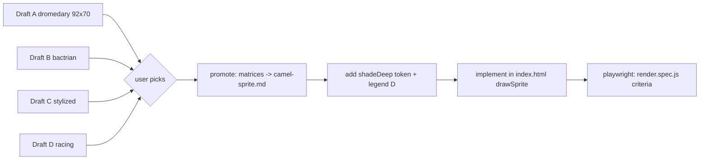

# Camel drafts v3 - four standing drafts (A-D) + walk for the recommended draft

Four distinct **standing** camel drafts, all **92 x 70** in the `1280x720` buffer, facing **right**,
rider + **plain light-blue saddle blanket**, single 4-connected blob, `O` outline enclosing the body,
feet on the bottom row. Drafts were generated and validated by a throwaway script
(`/tmp/art-gen/camel_v6_gen.py`, outside the repo); the matrices below are its output.

**Status: draft A (naturalistic dromedary, 92 x 70) is chosen and shipped** - promoted as v6 in
`docs/art/camel-sprite.md` and implemented in `index.html` (`const CAMEL`: stand + 4 walk frames,
registry `w: 92, h: 70`). Drafts B/C/D were not promoted. The acceptance criteria below are the
shipped standard; criterion 5's blanket threshold was corrected from `>= 300 px` to the validated
**276 px** (see the validation table: 276 L px, holes=0).

**Digit-area convention retired.** v5/boar reserved a 6x10 ink area on the blanket for a per-lane
digit (ink `#123a44`, 3x5 font). That convention is **retired**: the team name is drawn as a canvas
label above the animal (camel-sprite.md v5, team-label commit). None of these drafts carry a reserved
digit area or digit ink - the blanket is a plain patch with harness/strap details only. Do not
reintroduce `#123a44` on the camel.

Geometry budget: lane height at 8 lanes is **74 px**; terrain bobs +-2 px and the feet sit 2 px above
the lane bottom, so the usable sprite box is **<= 96 wide x <= 70 tall**. A 70-tall draft uses the
budget exactly; 66x62 v5 had 12 px slack.

Shared legend (validator whitelist): **`. O B S D G R W K L`** - one new char vs v5:

| char | meaning | notes |
|---|---|---|
| `.` | transparent | |
| `O` | outline | also hooves + eye (v5 parity) |
| `B` | body (lit) | |
| `S` | shade | |
| `D` | deep shade | **new token** `shadeDeep` needed for every draft |
| `G` | harness | neck strap, girth, rein, saddle edge |
| `R` | rider robe | per-lane colour, 8-lane palette unchanged |
| `W` | turban | |
| `K` | skin | face + hands |
| `L` | blanket | plain, no digit |

Lane robe colours (unchanged): `#e84a3a` `#3a6ae8` `#3aa84a` `#e8c83a` `#9a4ae8` `#e88a3a` `#3ad8d8` `#e85a9a`.

Contrast checks (WCAG, computed): outline vs body `8.01:1`, blanket vs body `1.69:1`, blanket vs outline `13.51:1`, robe (lane 0) vs body `1.67:1`. Non-text contrast needs >= 3:1: the outline passes; the blanket is carried by the outline + the blue/orange hue split (the most colour-vision-deficiency-safe pair) rather than luminance.

## Draft A - Dromedary, naturalistic (recommended)

- Size **92 x 70**, feet on the **bottom row** (row 69); painted bbox **84x68**.
- Palette: `O`=#1c1208, `B`=#d9a05b, `S`=#b4763a, `D`=#82521f, `G`=#53565e, `W`=#f0ece0, `K`=#d8a878, `L`=#bfe3ea, `R`=lane.
- Long **S-curved neck** (back edge 53->63, front edge 60->66; 4-7 px wide, tapering upward).
- **One prominent hump**, crest row 19 at x28-31, soft 19->44 body depth.
- **Small wedge head** with a **drooping muzzle** (bottom edge 16->20 toward the tip), 1 px nostril, 2x2 eye with brow shade, enlarged leaf ear (7 px wide, top row 3).
- **Deep narrow chest**: chest front slopes 40->34 and the front leg pair is only 9 px apart.
- **Long thin legs** (hip 2.0 -> knee 2.2 -> ankle 1.3 half-width) with a 1 px knee crease and wide **two-toe hooves** (5 px + 1 px notch).
- Short tufted tail (2 px line + r2 tuft), flicking +2/-2 on the pass frames.
- Rider 17 rows tall (turban 3, face 4, torso 6, leg 2, boot 2); 1 px grey rein, 2 px neck strap, 2 px girth strap, 1 px saddle edge row.

| char | meaning | hex |
|---|---|---|
| `O` | outline / hoof / eye | `#1c1208` |
| `B` | body (lit) | `#d9a05b` |
| `S` | shade (bulk) | `#b4763a` |
| `D` | deep shade (new token) | `#82521f` |
| `G` | harness (straps, girth, rein) | `#53565e` |
| `W` | turban | `#f0ece0` |
| `K` | skin (face, hands) | `#d8a878` |
| `L` | saddle blanket | `#bfe3ea` |
| `R` | robe = lane colour (palette-swap; lane 0 shown) | `#e84a3a` |

**`DRAFT_A` - dressed standing (92 x 70)**

```
const DRAFT_A = [
  [ // frame 0
    '............................................................................................',
    '............................................................................................',
    '....................................................................O.......................',
    '...................................................................OBO......................',
    '..................................................................OBSBO.....................',
    '.................................................................OBSSSO.....................',
    '.................................................................OSSSSBO....................',
    '................................................................OBSSSSSBOOOO................',
    '................................................................OSSSBBBBBBBBOOO.............',
    '..............................OOO...............................OSSBBBBDDDBBBBBOO...........',
    '............................OOWWWO..............................OSBBSSSSOOSSBBBBBO..........',
    '...........................OWWWWWWO............................OOBBSSSSSOOSSSSSBBBO.........',
    '...........................OWWWWWWO...........................OBBBSSSSSSSSSSSSSSSBBO........',
    '............................OKKKKO...........................OBBBSSSSSSSSSSSSSSSSSBBO.......',
    '............................OKKKO..........................OOOBBSSSSSSSSSSSSSSSSSSSBBO......',
    '............................OKKKKO.....................OOOOGGGGGSSSSSSSSSSSSSSSSSSSSBBOO....',
    '............................OKKKKOO...............OOOOOGGGGOBBGGDDDDDDSSSSSSSSSSSSSSSBBBO...',
    '...........................ORRRRRRROOO.......OOOOOGGGGGOOOOOBBGGDOOOOODDDDDSSSSSSSSSSSBBBO..',
    '...........................ORRRRRRRRRRO..OOOOGGGGGOOOOO...OBBGGDO.....OOOOODDDSSSSSSSSOSBBO.',
    '...........................ORRRRRRRRRRKOOGGGGOOOOO.......OBBSGGDO..........OOODDSSSSSSOSSBO.',
    '...........................ORRRRRRROOOKGGOOOO............OBBSGGDO.............OODDDDDDDDDDO.',
    '..........................OBRRRRRRRO..OOO...............OBBSSSDO................OOOOOOOOOO..',
    '.........................OBGRRRRRRRBO...................OBBSSSDO............................',
    '........................OBGLLRRLLLLGBO.................OBBSSSSDO............................',
    '........................OGLLLRRLLLLLGBO................OBBSSSDO.............................',
    '.......................OBLLLLDDDLLLGLGBO..............OBBSSSSDO.............................',
    '.......................OGLLLLDDDDLLGGLGBO.............OBBSSSSDO.............................',
    '......................OBLLLLLLLLLLLGGLLGBO...........OBBSSSSSDO.............................',
    '.....................OBBLLLLLLLLLLLGGLLLGBOO.........OBBSSSSDO..............................',
    '....................OBBSLLLLLLLLLLLGGLLLLGBBOOOOOOOOOBBSSSSSDO..............................',
    '..................OOBBSSLLLLLLLLLLLGGLLLLLGGBBBBBBBBBBBSSSSSDO..............................',
    '................OOBBBSSSLLLLLLLLLLLGGLLLLLLLGGGGBBBBBBBBBBBBOO..............................',
    '..............OOBBBBSSSSLLLLLLLLLLLGGLLLLLLLLLLLSSSSSSSBBBBBBBO.............................',
    '.............OBBBBSSSSSSLLLLLLLLLLLGGLLLLLLLLLLLSSSSSSSSSSSSBBBO............................',
    '.............OBBSSSSSSSSLLLLLLLLLLLGGLLLLLLLLLLLSSSSSSSSSSSSSDBO............................',
    '.............OSSSSSSSSSSLLLLLLLLLLLGGLLLLLLLLLLLSSSSSSSSSSSSSDO.............................',
    '.............ODSSSSSSSSSLLLLLLLLLLLGGLLLLLLLLLLLSSSSSSSSSSSSDDO.............................',
    '............OSDDSSSSSSSSLLLLLLLLLLLGGLLLLLLLLLLLSSSSSSSSSSSDDO..............................',
    '............OSDDSSSSSSSSLLLLLLLLLLLGGLLLLLLLLLLLSSSSSSSSSSDDDO..............................',
    '............OSDDDSSSSSSSLLLLLLLLLLLGGLLLLLLSSSSSSSSSSSSSDDDDO...............................',
    '...........OSDDODDSSSSSSSSSSSSSSSSSGGSSSSSSSSSSSSSSSSDDDDDDO................................',
    '...........OSDOODDDDSSSSSSSSSSSSSSSGGSSSSSSDDDDDDDDDDDDDDDO.................................',
    '...........OSDOOSDDDDDDDDDDDDDDDDDDGGDDDDDDDDDDDDDDDDDDDOO..................................',
    '...........OSDOOSDDDDDDDDBSSSDDDDDDDDDDDDDDDDDDDDDDDDBSSSDO.................................',
    '...........OSDOOSDDDDDDDDBSSSDDDDDDDDDDDDDDOSDDDDOOOOBSSSDO.................................',
    '..........OOSDOOSDDDDOOOOBSSSDOOOOOOOOOOOOOOSDDDDO..OBSSSDO.................................',
    '.........OSSDO.OSDDDO...OBSSSDO............OSDDDDO..OBSSSDO.................................',
    '........ODDDDO.OSDDDO...OBSSSDO............OSDDDO...OBSSSDO.................................',
    '.......ODDDDDO.OSDDDO...OBSSSDO............OSDDDO...OBSSSDO.................................',
    '........ODDDO..OSDDDO...OBSSSDO............OSDDDO...OBSSSDO.................................',
    '.........ODO...OSDDDO...OBSSSDO............OSDDDO...OBSSSDO.................................',
    '..........O....OSDDDO...OBSSSDO............OSDDDO...OBSSSDO.................................',
    '...............OSDDDO..OBSSSSDO............OSDDDO..OBSSSSDO.................................',
    '...............OSDDDO..OBSSSSDO............OSDDDO..OBSSSSDO.................................',
    '...............OSDDDO..OBSSSSDO............OSDDDO..OBSSSSDO.................................',
    '...............OSDDDO..OBSSSSDO............OSDDDO..OBSSSSDO.................................',
    '...............OSDDDO..OBSSSSDO............OSDDDO..OBSDSSDO.................................',
    '...............OSDDDO..OBSSSSDO............OSDDDO..OBSSSSDO.................................',
    '...............OSDDDO..OBSDSSDO............OSDDDO..OBSSSDO..................................',
    '...............OSDDDO..OBSSSDO.............OSDDDO..OBSSSDO..................................',
    '...............OSDDDO..OBSSSDO.............OSDDDO..OBSSSDO..................................',
    '...............OSDDDO..OBSSSDO.............OSDDDO..OBSSSDO..................................',
    '...............OSDDDO..OBSSSDO.............OSDDO....OBSSDO..................................',
    '...............OSDDO...OBSSSDO.............OSDDO....OBSSDO..................................',
    '...............OSDDO....OBSSDO.............OSDDO....OBSSDO..................................',
    '...............OSDDO....OBSDO..............OSDDO....OBSDO...................................',
    '...............OSDDO....OBSDO..............OSDDO....OBSDO...................................',
    '...............OOOOO....OOOOO..............OOOOO....OOOOO...................................',
    '...............OOSOO....OOSOO..............OOSOO....OOSOO...................................',
    '...............OOSOO....OOSOO..............OOSOO....OOSOO...................................',
  ],
]
```

**`DRAFT_A_BARE` - bare standing reference (92 x 70)**

```
const DRAFT_A_BARE = [
  [ // frame 0
    '............................................................................................',
    '............................................................................................',
    '....................................................................O.......................',
    '...................................................................OBO......................',
    '..................................................................OBSBO.....................',
    '.................................................................OBSSSO.....................',
    '.................................................................OSSSSBO....................',
    '................................................................OBSSSSSBOOOO................',
    '................................................................OSSSBBBBBBBBOOO.............',
    '................................................................OSSBBBBDDDBBBBBOO...........',
    '................................................................OSBBSSSSOOSSBBBBBO..........',
    '...............................................................OOBBSSSSSOOSSSSSBBBO.........',
    '..............................................................OBBBSSSSSSSSSSSSSSSBBO........',
    '.............................................................OBBBSSSSSSSSSSSSSSSSSBBO.......',
    '.............................................................OBBSSSSSSSSSSSSSSSSSSSBBO......',
    '............................................................OBBSSSSSSSSSSSSSSSSSSSSSBBOO....',
    '...........................................................OBBSSDDDDDDSSSSSSSSSSSSSSSBBBO...',
    '...........................................................OBBSSDOOOOODDDDDSSSSSSSSSSSBBBO..',
    '.............................OOO..........................OBBSSDO.....OOOOODDDSSSSSSSSOSBBO.',
    '............................OBBBOO.......................OBBSSSDO..........OOODDSSSSSSOSSBO.',
    '...........................OBBBBBBO......................OBBSSSDO.............OODDDDDDDDDDO.',
    '..........................OBBSSSBBBO....................OBBSSSDO................OOOOOOOOOO..',
    '.........................OBBSSSSSSBBO...................OBBSSSDO............................',
    '........................OBBSSSSSSSSBBO.................OBBSSSSDO............................',
    '........................OBSSSSSSSSSSBBO................OBBSSSDO.............................',
    '.......................OBSSSSSSSSSSSSBBO..............OBBSSSSDO.............................',
    '.......................OBSSSSSSSSSSSSSBBO.............OBBSSSSDO.............................',
    '......................OBSSSSSSSSSSSSSSSBBO...........OBBSSSSSDO.............................',
    '.....................OBBSSSSSSSSSSSSSSSSBBOO.........OBBSSSSDO..............................',
    '....................OBBSSSSSSSSSSSSSSSSSSBBBOOOOOOOOOBBSSSSSDO..............................',
    '..................OOBBSSSSSSSSSSSSSSSSSSSSBBBBBBBBBBBBBSSSSSDO..............................',
    '................OOBBBSSSSSSSSSSSSSSSSSSSSSSSBBBBBBBBBBBBBBBBOO..............................',
    '..............OOBBBBSSSSSSSSSSSSSSSSSSSSSSSSSSSSSSSSSSSBBBBBBBO.............................',
    '.............OBBBBSSSSSSSSSSSSSSSSSSSSSSSSSSSSSSSSSSSSSSSSSSBBBO............................',
    '.............OBBSSSSSSSSSSSSSSSSSSSSSSSSSSSSSSSSSSSSSSSSSSSSSDBO............................',
    '.............OSSSSSSSSSSSSSSSSSSSSSSSSSSSSSSSSSSSSSSSSSSSSSSSDO.............................',
    '.............ODSSSSSSSSSSSSSSSSSSSSSSSSSSSSSSSSSSSSSSSSSSSSSDDO.............................',
    '............OSDDSSSSSSSSSSSSSSSSSSSSSSSSSSSSSSSSSSSSSSSSSSSDDO..............................',
    '............OSDDSSSSSSSSSSSSSSSSSSSSSSSSSSSSSSSSSSSSSSSSSSDDDO..............................',
    '............OSDDDSSSSSSSSSSSSSSSSSSSSSSSSSSSSSSSSSSSSSSSDDDDO...............................',
    '...........OSDDODDSSSSSSSSSSSSSSSSSSSSSSSSSSSSSSSSSSSDDDDDDO................................',
    '...........OSDOODDDDSSSSSSSSSSSSSSSSSSSSSSSDDDDDDDDDDDDDDDO.................................',
    '...........OSDOOSDDDDDDDDDDDDDDDDDDDDDDDDDDDDDDDDDDDDDDDOO..................................',
    '...........OSDOOSDDDDDDDDBSSSDDDDDDDDDDDDDDDDDDDDDDDDBSSSDO.................................',
    '...........OSDOOSDDDDDDDDBSSSDDDDDDDDDDDDDDOSDDDDOOOOBSSSDO.................................',
    '..........OOSDOOSDDDDOOOOBSSSDOOOOOOOOOOOOOOSDDDDO..OBSSSDO.................................',
    '.........OSSDO.OSDDDO...OBSSSDO............OSDDDDO..OBSSSDO.................................',
    '........ODDDDO.OSDDDO...OBSSSDO............OSDDDO...OBSSSDO.................................',
    '.......ODDDDDO.OSDDDO...OBSSSDO............OSDDDO...OBSSSDO.................................',
    '........ODDDO..OSDDDO...OBSSSDO............OSDDDO...OBSSSDO.................................',
    '.........ODO...OSDDDO...OBSSSDO............OSDDDO...OBSSSDO.................................',
    '..........O....OSDDDO...OBSSSDO............OSDDDO...OBSSSDO.................................',
    '...............OSDDDO..OBSSSSDO............OSDDDO..OBSSSSDO.................................',
    '...............OSDDDO..OBSSSSDO............OSDDDO..OBSSSSDO.................................',
    '...............OSDDDO..OBSSSSDO............OSDDDO..OBSSSSDO.................................',
    '...............OSDDDO..OBSSSSDO............OSDDDO..OBSSSSDO.................................',
    '...............OSDDDO..OBSSSSDO............OSDDDO..OBSDSSDO.................................',
    '...............OSDDDO..OBSSSSDO............OSDDDO..OBSSSSDO.................................',
    '...............OSDDDO..OBSDSSDO............OSDDDO..OBSSSDO..................................',
    '...............OSDDDO..OBSSSDO.............OSDDDO..OBSSSDO..................................',
    '...............OSDDDO..OBSSSDO.............OSDDDO..OBSSSDO..................................',
    '...............OSDDDO..OBSSSDO.............OSDDDO..OBSSSDO..................................',
    '...............OSDDDO..OBSSSDO.............OSDDO....OBSSDO..................................',
    '...............OSDDO...OBSSSDO.............OSDDO....OBSSDO..................................',
    '...............OSDDO....OBSSDO.............OSDDO....OBSSDO..................................',
    '...............OSDDO....OBSDO..............OSDDO....OBSDO...................................',
    '...............OSDDO....OBSDO..............OSDDO....OBSDO...................................',
    '...............OOOOO....OOOOO..............OOOOO....OOOOO...................................',
    '...............OOSOO....OOSOO..............OOSOO....OOSOO...................................',
    '...............OOSOO....OOSOO..............OOSOO....OOSOO...................................',
  ],
]
```
## Draft B - Bactrian, naturalistic

- Size **92 x 70**, feet on the **bottom row** (row 69); painted bbox **84x68**.
- Palette: `O`=#191006, `B`=#cb8b4a, `S`=#9a6730, `D`=#6f4718, `G`=#53565e, `W`=#f0ece0, `K`=#d8a878, `L`=#bfe3ea, `R`=lane.
- **Two proper humps**: front hump (x40-41, crest row 19) slightly larger than the rear (x24-25, crest row 24), saddle dip row 27 at x29-33.
- **Shaggier**: mane ticks on every neck row, spine fur dashes every 5 px along both humps, leg fur dashes every 3rd row on the outer leg edges.
- Shorter, 9 px-wide neck at the base, stockier legs (hip 2.3 -> knee 2.5), belly row 45.
- Blanket spans the saddle dip (x29-49) so both humps stay visible.

| char | meaning | hex |
|---|---|---|
| `O` | outline / hoof / eye | `#191006` |
| `B` | body (lit) | `#cb8b4a` |
| `S` | shade (bulk) | `#9a6730` |
| `D` | deep shade (new token) | `#6f4718` |
| `G` | harness (straps, girth, rein) | `#53565e` |
| `W` | turban | `#f0ece0` |
| `K` | skin (face, hands) | `#d8a878` |
| `L` | saddle blanket | `#bfe3ea` |
| `R` | robe = lane colour (palette-swap; lane 0 shown) | `#e84a3a` |

**`DRAFT_B` - dressed standing (92 x 70)**

```
const DRAFT_B = [
  [ // frame 0
    '............................................................................................',
    '............................................................................................',
    '.....................................................................O......................',
    '....................................................................OBO.....................',
    '...................................................................OBSBO....................',
    '..................................................................OBSSSO....................',
    '..................................................................OSSSSBO...................',
    '.................................................................OBSSSSSO...................',
    '.................................................................OSSSSSSOOOO................',
    '.......................................OOO.......................OSSSDBBBBBBOO..............',
    '.....................................OOWWWO......................OSSBBBBDDDBBBO.............',
    '....................................OWWWWWWO.....................ODBBBSSSOOSBBBOO...........',
    '....................................OWWWWWWO.....................OBBSSSSSOOSSSBBBO..........',
    '.....................................OKKKKO.................OOOOOBBSSSSSSSSSSSSBBBO.........',
    '.....................................OKKKO.................ODBBSSBSSSSSSSSSSSSSSSBBO........',
    '.....................................OKKKKO................ODBBSSSSSSSSSSSSSSSSSSSBBO.......',
    '.....................................OKKKKOO............OOODGGGGSSSSSSSSSSSSSSSSSSSBBOOO....',
    '....................................ORRRRRRROOO......OOOGGGGBBGGSDDDDDDDSSSSSSSSSSSSBBBBO...',
    '....................................ORRRRRRRRRRO.OOOOGGGOODBBSGGSDOOOOOODDDDSSSSSSSSSBBBBO..',
    '....................................ORRRRRRRRRRKOGGGGOOO.ODBBGGSSDO.....OOOODDDDSSSSSSOSBBO.',
    '....................................ORRRRRRROOOKGOOOO...ODBBSGGSDO..........OOOODDDDDDOSSBO.',
    '....................................ORRRRRRRO..OO.......ODBBSGGSDO..............OODDDDDDDDO.',
    '....................................ORRRRRRRBO.........ODBBSSSSDO.................OOOOOOOO..',
    '........................OO..........ODRRLLLLGBO........ODBBSSSSDO...........................',
    '.......................OBBO........OBGRRLLLLLGO.......ODBBSSSSSDO...........................',
    '......................OBBBBO......OBGLDDDLLLLLBO......ODBBSSSSSDO...........................',
    '......................OBSSBDOOOOOOBGLGDDDDLLLLGDO....ODBBSSSSSDO............................',
    '.....................ODSSSSBBBBBDBGLGGLLLLLLLLLGBO...ODBBSSSSSDO............................',
    '....................OBBSSSSSBGGGGGLLGGLLLLLLLLLLGBO.ODBBSSSSSSDO............................',
    '....................OBSSSSSSSLLLLLLLGGLLLLLLLLLLLGBOODBBSSSSSDO.............................',
    '...................OBSSSSSSSSLLLLLLLGGLLLLLLLLLLLLBBDBBSSSSSSDO.............................',
    '..................OBBSSSSSSSSLLLLLLLGGLLLLLLLLLLLLSBDBBSSSSSSDO.............................',
    '................OOBBSSSSSSSSSLLLLLLLGGLLLLLLLLLLLLSSSSSSSSBBBBO.............................',
    '..............OOBDBSSSSSSSSSSLLLLLLLGGLLLLLLLLLLLLSSSSSSSSSSBBO.............................',
    '.............OBBBBSSSSSSSSSSSLLLLLLLGGLLLLLLLLLLLLSSSSSSSSSSDDO.............................',
    '.............OBBSSSSSSSSSSSSSLLLLLLLGGLLLLLLLLLLLLSSSSSSSSSSDO..............................',
    '.............OSSSSSSSSSSSSSSSLLLLLLLGGLLLLLLLLLLLLSSSSSSSSSDDO..............................',
    '.............ODSSSSSSSSSSSSSSLLLLLLLGGLLLLLLLLLLLLSSSSSSSSDDO...............................',
    '............OSDDSSSSSSSSSSSSSLLLLLLLGGLLLLLLLLLLLLSSSSSSSDDDO...............................',
    '............OSDDSSSSSSSSSSSSSLLLLLLLGGLLLLLLLLLLLLSSSSSSDDDO................................',
    '............OSDDDSSSSSSSSSSSSLLLLLLLGGLLLLLLSSSSSSSSSSSDDDO.................................',
    '............OSDODDSSSSSSSSSSSSSSSSSSGGSSSSSSSSSSSSSSSDDDDO..................................',
    '...........OSDOODDDDSSSSSSSSSSSSSSSSGGSSSSSSDDDDDDDDDDDDO...................................',
    '...........OSDOOSDDDDDDDDDDDDDDDDDDDGGDDDDDDDDDDDDDDDDDOOOO.................................',
    '...........OSDOOSDDDDDDDDDBSSSDDDDDDDDDDDDDDDDDDDDDDDOBSSSDO................................',
    '...........OSDOODDDDDDDDDDDSSSDDDDDDDDDDDDDDODDDDDOOOODSSSDO................................',
    '..........OSDDOOSDDDDOOOOOBSSSDOOOOOOOOOOOOOOSDDDDO..OBSSSDO................................',
    '.........OSSDO.OSDDDDO...OBSSSDO............OSDDDDO..OBSSSDO................................',
    '........ODDDDO.ODDDDDO..ODSSSSDO............ODDDDDO.ODSSSSDO................................',
    '.......ODDDDDO.OSDDDDO..OBSSSSDO............OSDDDDO.OBSSSSDO................................',
    '........ODDDO..OSDDDDO..OBSSSSDO............OSDDDDO.OBSSSSDO................................',
    '.........ODO...ODDDDDO..ODSSSSDO............ODDDDDO.ODSSSSDO................................',
    '..........O....OSDDDDO..OBSSSSDO............OSDDDDO.OBSSSSDO................................',
    '...............OSDDDDO..OBSSSSDO............OSDDDDO.OBSSSSDO................................',
    '...............ODDDDO...ODSSSSDO............ODDDDDO.ODSSSSDO................................',
    '...............OSDDDO...OBSSSSDO............OSDDDO..OBSSSSDO................................',
    '..............OSDDDDO...OBSSSSDO...........OSDDDDO..OBSDSSDO................................',
    '..............ODDDDDO...ODSSSSDO...........ODDDDDO..ODSSSSDO................................',
    '..............OSDDDDO...OBSDSSDO............OSDDDO..OBSSSSDO................................',
    '..............OSDDDDO...OBSSSSDO............OSDDDO..OBSSSDO.................................',
    '..............ODDDDDO...ODSSSDO.............ODDDDO..ODSSSDO.................................',
    '...............OSDDDO...OBSSSDO.............OSDDDO..OBSSSDO.................................',
    '...............OSDDDO...OBSSSDO.............OSDDDO..OBSSSDO.................................',
    '...............ODDDDO...ODSSSDO.............ODDDDO..ODSSSDO.................................',
    '...............OSDDO....OBSSSDO.............OSDDO...OBSSSDO.................................',
    '...............OSDDO.....OBSSDO.............OSDDO....OBSSDO.................................',
    '...............ODDDO.....ODSDO..............ODDDO....ODSDO..................................',
    '...............OOOOO.....OOOOO..............OOOOO....OOOOO..................................',
    '...............OOSOO.....OOSOO..............OOSOO....OOSOO..................................',
    '...............OOSOO.....OOSOO..............OOSOO....OOSOO..................................',
  ],
]
```
## Draft C - Stylized / charming

- Size **92 x 70**, feet on the **bottom row** (row 69); painted bbox **72x61**.
- Palette: `O`=#2a1808, `B`=#e5ad62, `S`=#bd8238, `D`=#8a5620, `G`=#53565e, `W`=#f0ece0, `K`=#d8a878, `L`=#bfe3ea, `R`=lane.
- **Stylized / charming**: short thick neck (20 rows) and a **big rounded head** (26 px wide, crest row 12, rounded drooping muzzle) with a 2x2 eye + white glint, 4 px brow and a rounded ear.
- Round single hump (crest row 27, x27-30) over a deep barrel body (hump crest row 27 -> belly row 48).
- Chunky legs (hip 2.5 -> knee 2.7) with **7 px two-toe hooves** and a curled tufted tail.
- Brighter sand palette, warmer outline; character reads at 1x while the hump/neck/legs stay camel-specific.

| char | meaning | hex |
|---|---|---|
| `O` | outline / hoof / eye | `#2a1808` |
| `B` | body (lit) | `#e5ad62` |
| `S` | shade (bulk) | `#bd8238` |
| `D` | deep shade (new token) | `#8a5620` |
| `G` | harness (straps, girth, rein) | `#53565e` |
| `W` | turban | `#f0ece0` |
| `K` | skin (face, hands) | `#d8a878` |
| `L` | saddle blanket | `#bfe3ea` |
| `R` | robe = lane colour (palette-swap; lane 0 shown) | `#e84a3a` |

**`DRAFT_C` - dressed standing (92 x 70)**

```
const DRAFT_C = [
  [ // frame 0
    '............................................................................................',
    '............................................................................................',
    '............................................................................................',
    '............................................................................................',
    '............................................................................................',
    '............................................................................................',
    '............................................................................................',
    '............................................................................................',
    '............................................................................................',
    '..............................................................O.............................',
    '.............................................................OBO............................',
    '............................................................OBSBOOOOOOO.....................',
    '...........................................................OBSSSBBBBBBBOO...................',
    '...........................................................OSSBBBBBBBBBBBO..................',
    '..........................................................OBSBBDDDDSSSSBBBO.................',
    '..........................................................OSBBSSOWSSSSSSSBBO................',
    '..........................................................OBBSSSOOSSSSSSSSBBO...............',
    '.............................OOO.........................OBBSSSSSSSSSSSSSSSBBO..............',
    '...........................OOWWWO........................OGGSSSSSSSSSSSSSSSSBBO.............',
    '..........................OWWWWWWO......................OBGGSSSSSSSSSSSSSSSSSBBO............',
    '..........................OWWWWWWO......................OBGGSSSSSSSSSSSSSSSSSSBBO...........',
    '...........................OKKKKO....................OOOGGGSSSSSSSSSSSSSSSSSSSSBBO..........',
    '...........................OKKKO..................OOOGGGBGGSSSSSSSSSSSSSSSSSSSSOOBO.........',
    '...........................OKKKKO..............OOOGGGOOBBGGSSSSSSSSSSSSSSSSSSSSSSBBO........',
    '...........................OKKKKOO...........OOGGGOOO.OBBSDSSSSSSSSSSSSSSSSSSSSSSDBO........',
    '..........................ORRRRRRROOO.....OOOGGOOO...OBBSSSDDSSSDDDDDDDDSSSSSSDDDOO.........',
    '..........................ORRRRRRRRRRO.OOOGGGOO......OBBSSSDODDDOOOOOOOODDDDDDOOO...........',
    '..........................ORRRRRRRRRRKOGGGOOO.......OBBSSSSDOOOO........OOOOOO..............',
    '.........................OBRRRRRRROOOKGOOO..........OBBSSSSDO...............................',
    '........................OBGRRRRRRRO..OO............OBBSSSSDO................................',
    '.......................OBBLRRRRRRRBO...............OBBSSSSDO................................',
    '......................OBBSLLRRLLLLGBO.............OBBSSSSSDO................................',
    '.....................OBBSSLLRRLLLLLGBO............OBBSSSSDO.................................',
    '....................OBBSSSLLDDDLLLLLGBO..........OBBSSSSSDO.................................',
    '...................OBBSSSSLLDDDDLLLLLGBO.........OBBSSSSDO..................................',
    '..................OBBSSSSSLLLLLLLLLLLLGBO......OOBBSSSSSDO..................................',
    '.................OBBSSSSSSLLLLLLLLLLLGLGBOOOOOOBBBBBBBBSSO..................................',
    '................OBBSSSSSSSLLLLLLLLLLLGGLGBBBBBBGGBBBBSSSDO..................................',
    '...............OBBSSSSSSSSLLLLLLLLLLLGGLLGGGGGGLLSSSSSSDDO..................................',
    '...............OBSSSSSSSSSLLLLLLLLLLLGGLLLLLLLLLLSSSSSDDDO..................................',
    '..............OSSSSSSSSSSSLLLLLLLLLLLGGLLLLLLLLLLSSSSDDDO...................................',
    '..............OSDSSSSSSSSSLLLLLLLLLLLGGLLLLLLLLLLSSSDDDO....................................',
    '.............OSDDDSSSSSSSSLLLLLLLLLLLGGLLLLLLLSSSSSDDDO.....................................',
    '.............OSDDDSSSSSSSSLLLLLLLLLLLGGLLSSSSSSSSDDDDO......................................',
    '............OSDDODDSSSSSSSSSSSSSSSSSSGGSSSSSSSDDDDDDOOOOO...................................',
    '............OSDO.ODDSSSSSSSSSSSSSSSSSGGSSDDDDDDDDDBSSSSSDO..................................',
    '............OSDO.ODDDDDDDDDDDDDDDDDDDGGDDDDDDDDDDOBSSSSDO...................................',
    '............OSDSOOSDDDDDDDDDBSSSDDDDDDDDDDDDDDDDDOBSSSSDO...................................',
    '.............ODDDOSDDDDDDDDBSSSSDDDDDDDDDOOOSDDDDOBSSSSDO...................................',
    '............ODDDDDSDDDDOOOOBSSSSDOOOOOOOO..OSDDDDOBSSSSDO...................................',
    '.............ODDDOSDDDDO..OBSSSSDO.........OSDDDDOBSSSSDO...................................',
    '..............ODOOSDDDDO..OBSSSSDO.........OSDDDDOBSSSSDO...................................',
    '...............O.OSDDDDO..OBSSSSDO.........OSDDDDOBSSSSDO...................................',
    '.................OSDDDDO..OBSSSSDO.........OSDDDDOBSSSSDO...................................',
    '................OSDDDDDO..OBSSSSDO........OSDDDDDOBSSSSDO...................................',
    '................OSDDDDDO..OBSSSSDO........OSDDDDDOBSSSSDO...................................',
    '................OSDDDDDO..OBSSSSDO........OSDDDDDOBSSSSDO...................................',
    '................OSDDDDDO..OBSSSSDO........OSDDDDDOBSDSSDO...................................',
    '................OSDDDDDO..OBSSSSDO........OSDDDDOOBSSSSDO...................................',
    '................OSDDDDO...OBSDSSDO........OSDDDDOOBSSSSDO...................................',
    '................OSDDDDO...OBSSSSDO........OSDDDDOOBSSSSDO...................................',
    '................OSDDDDO...OBSSSSDO........OSDDDDOOBSSSDO....................................',
    '................OSDDDDO...OBSSSDO.........OSDDDDOOBSSSDO....................................',
    '................OSDDDDO...OBSSSDO..........OSDDDOOBSSSDO....................................',
    '.................OSDDDO...OBSSSDO..........OSDDDOOBSSSDO....................................',
    '.................OSDDDO...OBSSSDO..........OSDDO.OBSSSDO....................................',
    '.................OSDDO....OBSSSDO..........OSDDO.OBSSSDO....................................',
    '................OOOOOOO...OOOOOOO.........OOOOOOOOOOOOOO....................................',
    '................OOOSOOO...OOOSOOO.........OOOSOOOOOOSOOO....................................',
    '................OOOSOOO...OOOSOOO.........OOOSOOOOOOSOOO....................................',
  ],
]
```
## Draft D - Racing dromedary

- Size **92 x 70**, feet on the **bottom row** (row 69); painted bbox **86x67**.
- Palette: `O`=#1b1206, `B`=#d29a52, `S`=#a86e30, `D`=#7a4a1a, `G`=#53565e, `W`=#f0ece0, `K`=#d8a878, `L`=#bfe3ea, `R`=lane.
- **Racing posture**: long neck stretched up-forward (base row 29 at x50-57 -> head rows 6-20) and a small racing hump (crest row 23, x24-28).
- **Mid-stride**: hind hooves swept back (far x4, near x12), front hooves reaching forward (far x70, near x82); all four hooves still contact the bottom row.
- Thin athletic legs (hip 1.8 -> ankle 1.1) with knee row 52; low horizontal body (back row 29-30, belly row 41-42).
- Jockey-style rider seated forward (cx 31, top row 18) with the rein running up to the neck strap.

| char | meaning | hex |
|---|---|---|
| `O` | outline / hoof / eye | `#1b1206` |
| `B` | body (lit) | `#d29a52` |
| `S` | shade (bulk) | `#a86e30` |
| `D` | deep shade (new token) | `#7a4a1a` |
| `G` | harness (straps, girth, rein) | `#53565e` |
| `W` | turban | `#f0ece0` |
| `K` | skin (face, hands) | `#d8a878` |
| `L` | saddle blanket | `#bfe3ea` |
| `R` | robe = lane colour (palette-swap; lane 0 shown) | `#e84a3a` |

**`DRAFT_D` - dressed standing (92 x 70)**

```
const DRAFT_D = [
  [ // frame 0
    '............................................................................................',
    '............................................................................................',
    '............................................................................................',
    '................................................................O...........................',
    '...............................................................OBO..........................',
    '..............................................................OBSBOOOOOO....................',
    '.............................................................OBSSSBBBBBBOO..................',
    '.............................................................OSSBBBBBBBBBBO.................',
    '............................................................OBSBBBSSDDDSBBBO................',
    '...........................................................OOSBBSSSSSOOSSSBBO...............',
    '..........................................................OBBBBSSSSSSOOSSSSBBO..............',
    '..........................................................OBBBSSSSSSSSSSSSSSBBO.............',
    '.........................................................OBBBSSSSSSSSSSSSSSSSBBO............',
    '.........................................................OBBBSSSSSSSSSSSSSSSSSBBO...........',
    '.............................OOO........................OBGGGGSSSSSSSSSSSSSSSSSBBO..........',
    '...........................OOWWWO.....................OOOGBSGGSSDDDDSSSSSSSSSSSSBBO.........',
    '..........................OWWWWWWO...................OGGGBSSSGGDOOOODDSSSSSSSSSSSBBO........',
    '..........................OWWWWWWO................OOOGOOBBSSDGGO....OODDDSSSSSSSSSBBO.......',
    '...........................OKKKKO................OGGGOOBBSSSSDO.......OOODDDSSSSSSSBBO......',
    '...........................OKKKO..............OOOGOOO.OBBSSSSDO..........OOODDDSSSSSBOO.....',
    '...........................OKKKKO............OGGGO...OBBSSSSSDO.............OOODDDDDDBBO....',
    '...........................OKKKKOO........OOOGOOO....OBBSSSSDO.................OOOOOOOO.....',
    '........................OOORRRRRRROOO....OGGGO......OBBSSSSSDO..............................',
    '.......................OBBBRRRRRRRRRROOOOGOOO.......OBBSSSSDO...............................',
    '......................OBBBBRRRRRRRRRRKGGGO.........OBBSSSSSDO...............................',
    '.....................OBBSSSRRRRRRROOOKOOO..........OBBSSSSDO................................',
    '....................OBBSSSSRRRRRRROO.O............OBBSSSSSDO................................',
    '..................OOBBSSSSSRRRRRRRBBOOO...........OBBSSSSSDO................................',
    '.............OOOOOBBBSSSSSSLRRLLLLGGBBBOOOO......OBBSSSSSDO.................................',
    '............OBBBBBBBSSSSSSSLRRLLLLLLGGGBBBBOOOOOOOBBSSSSSDO.................................',
    '...........OBBBBBBSSSSSSSSSLDDDLLLLLLLLGGGGBBBBBBBBBBBBBBO..................................',
    '...........OBSSSSSSSSSSSSSSLDDDDLLLLGGLLLLLGGGGGGBSSSSSSSO..................................',
    '...........OSSSSSSSSSSSSSSSLLLLLLLLLGGLLLLLLLLLLLSSSSSSSDO..................................',
    '...........OSSSSSSSSSSSSSSSLLLLLLLLLGGLLLLLLLLLLLSSSSSSSDO..................................',
    '..........OSSSSSSSSSSSSSSSSLLLLLLLLLGGLLLLLLLLLLLSSSSSSDDO..................................',
    '..........OSSSSSSSSSSSSSSSSLLLLLLLLLGGLLLLLLLLLLLSSSSSDDO...................................',
    '.........OSDSSSSSSSSSSSSSSSLLLLLLLLLGGLLLLLLLLLLLSSSSDDDO...................................',
    '.........OSDSSSSSSSSSSSSSSSLLLLLLLLLGGLLLLLLLLLLSSSDDDDO....................................',
    '.........OSDDSSSSSSSSSSSSSSLLLLLLLLLGGLLLSSSSSSSDDDDDDO.....................................',
    '........OSDODDSSSSSSSSSSSSSSSSSSSSSSGGSSSDDDDDDDDDBSSSDO....................................',
    '........OSDODDDDDDDDDDDDDDDDDDDDDDDDGGDDDDDDDDDDDDDBSSSDO...................................',
    '........OSDOODDDDDDDDDBSSSDDDDDDDDDDGGDDDDDDDDDDDOOOBSSSDO..................................',
    '........OSDO.ODDDDDDDDBSSDDDDDDDDDDDDDDDDOOOOOSDDDO.OBSSSDO.................................',
    '.......OSDO..OSDDDOOOBSSSDOOOOOOOOOOOOOOO.....OSDDDO.OOBSSDO................................',
    '......OSSDO.OSDDDO..OBSSDO.....................OSDDDO..OBSSDOO..............................',
    '.....ODDDDO.OSDDDO.OBSSSDO......................OSDDDO..OBSSSDO.............................',
    '....ODDDDDOOSDDDO..OBSSDO........................OSDDDO..OBSSSDO............................',
    '.....ODDDO.OSDDDO.OBSSSDO.........................OSDDDO..OBSSSDO...........................',
    '......ODO.OSDDDO..OBSSSDO..........................OSDDDO..OBSSSDO..........................',
    '.......O..OSDDDO.OBSSSDO............................OSDDDO..OBSSSDO.........................',
    '.........OSDDDO..OBSSSDO.............................OSDDDO..OBSSSDO........................',
    '.........OSDDDO.OBSSSDO...............................OSDDDO..OBSSSDO.......................',
    '........OSDDDO..OBSDSDO...............................OSDDDDO..OBSDSDO......................',
    '........OSDDDO.OBSSSDO.................................OSDDDDO..OOBSSDOO....................',
    '.......OSDDDO..OBSSSDO..................................OSDDDO....OBSSSDO...................',
    '.......OSDDDO.OBSSSDO....................................OSDDDO....OBSSSDO..................',
    '......OSDDDO..OBSSSDO.....................................OSDDDO....OBSSSDO.................',
    '......OSDDDO..OBSSDO.......................................OSDDDO....OBSSSDO................',
    '......OSDDO..OBSSDO.........................................OSDDDO....OBSSSDO...............',
    '.....OSDDDO..OBSSDO..........................................OSDDDO....OOBSSDO..............',
    '.....OSDDO..OBSSDO............................................OSDDDO.....OBSSDO.............',
    '....OSDDDO..OBSSDO.............................................OSDDDO.....OBSSDO............',
    '....OSDDO...OBSDO...............................................OSDDO......OBSSDO...........',
    '...OSDDO...OBSSDO................................................OSDDO......OBSSDO..........',
    '...OSDDO...OBSDO..................................................OSDDO......OOBSDO.........',
    '...OSDO...OBSSDO...................................................OSDDO.......OBSDO........',
    '..OSDDO...OBSDO.....................................................OSDDO.......OBSDO.......',
    '..OOOOO...OOOOO.....................................................OOOOO.......OOOOO.......',
    '..OOSOO...OOSOO.....................................................OOSOO.......OOSOO.......',
    '..OOSOO...OOSOO.....................................................OOSOO.......OOSOO.......',
  ],
]
```
## Recommended draft - walk cycle (A, dressed)

5 frames, each **92 x 70**, feet on row 69. `stand` is the idle frame; the walk is
`contact A -> pass A -> contact B -> pass B`.

| frame | bob | hoof x (far-rear, rear-near, front-far, front-near) | swing lift |
|---|---|---|---|
| 0 stand | 0 | 17 / 26 / 45 / 54 | - |
| 1 contact A | 0 | 12 / 33 / 52 / 49 | - (all four planted, max spread) |
| 2 pass A | +1 (body up, feet stay) | 17 / 27 / 45 / 54 | far-rear + near-front lifted 1 px; tail tuft +2 |
| 3 contact B | 0 | 24 / 21 / 41 / 60 | - (mirrored spread) |
| 4 pass B | +1 (body up, feet stay) | 17 / 26 / 45 / 53 | rear-near + rear-far lifted 1 px; tail tuft -2 |

Bob is **baked into the matrices**: on frames 2/4 the whole body, neck, head, blanket and
rider shift up 1 px, while the planted hooves stay on row 69. Walk-frame IoU:

```
             stand cA    pA    cB    pB   
  stand 1.000 0.769 0.902 0.789 0.895
  cA    0.769 1.000 0.714 0.672 0.713
  pA    0.902 0.714 1.000 0.716 0.954
  cB    0.789 0.672 0.716 1.000 0.713
  pB    0.895 0.713 0.954 0.713 1.000
```

Closest walk pair **walk2 v walk4 = 0.954** (< 0.98 required).

**`CAMEL_A` - stand + 4 walk frames (dressed, 92 x 70)**

```
const CAMEL_A = [
  [ // frame 0
    '............................................................................................',
    '............................................................................................',
    '....................................................................O.......................',
    '...................................................................OBO......................',
    '..................................................................OBSBO.....................',
    '.................................................................OBSSSO.....................',
    '.................................................................OSSSSBO....................',
    '................................................................OBSSSSSBOOOO................',
    '................................................................OSSSBBBBBBBBOOO.............',
    '..............................OOO...............................OSSBBBBDDDBBBBBOO...........',
    '............................OOWWWO..............................OSBBSSSSOOSSBBBBBO..........',
    '...........................OWWWWWWO............................OOBBSSSSSOOSSSSSBBBO.........',
    '...........................OWWWWWWO...........................OBBBSSSSSSSSSSSSSSSBBO........',
    '............................OKKKKO...........................OBBBSSSSSSSSSSSSSSSSSBBO.......',
    '............................OKKKO..........................OOOBBSSSSSSSSSSSSSSSSSSSBBO......',
    '............................OKKKKO.....................OOOOGGGGGSSSSSSSSSSSSSSSSSSSSBBOO....',
    '............................OKKKKOO...............OOOOOGGGGOBBGGDDDDDDSSSSSSSSSSSSSSSBBBO...',
    '...........................ORRRRRRROOO.......OOOOOGGGGGOOOOOBBGGDOOOOODDDDDSSSSSSSSSSSBBBO..',
    '...........................ORRRRRRRRRRO..OOOOGGGGGOOOOO...OBBGGDO.....OOOOODDDSSSSSSSSOSBBO.',
    '...........................ORRRRRRRRRRKOOGGGGOOOOO.......OBBSGGDO..........OOODDSSSSSSOSSBO.',
    '...........................ORRRRRRROOOKGGOOOO............OBBSGGDO.............OODDDDDDDDDDO.',
    '..........................OBRRRRRRRO..OOO...............OBBSSSDO................OOOOOOOOOO..',
    '.........................OBGRRRRRRRBO...................OBBSSSDO............................',
    '........................OBGLLRRLLLLGBO.................OBBSSSSDO............................',
    '........................OGLLLRRLLLLLGBO................OBBSSSDO.............................',
    '.......................OBLLLLDDDLLLGLGBO..............OBBSSSSDO.............................',
    '.......................OGLLLLDDDDLLGGLGBO.............OBBSSSSDO.............................',
    '......................OBLLLLLLLLLLLGGLLGBO...........OBBSSSSSDO.............................',
    '.....................OBBLLLLLLLLLLLGGLLLGBOO.........OBBSSSSDO..............................',
    '....................OBBSLLLLLLLLLLLGGLLLLGBBOOOOOOOOOBBSSSSSDO..............................',
    '..................OOBBSSLLLLLLLLLLLGGLLLLLGGBBBBBBBBBBBSSSSSDO..............................',
    '................OOBBBSSSLLLLLLLLLLLGGLLLLLLLGGGGBBBBBBBBBBBBOO..............................',
    '..............OOBBBBSSSSLLLLLLLLLLLGGLLLLLLLLLLLSSSSSSSBBBBBBBO.............................',
    '.............OBBBBSSSSSSLLLLLLLLLLLGGLLLLLLLLLLLSSSSSSSSSSSSBBBO............................',
    '.............OBBSSSSSSSSLLLLLLLLLLLGGLLLLLLLLLLLSSSSSSSSSSSSSDBO............................',
    '.............OSSSSSSSSSSLLLLLLLLLLLGGLLLLLLLLLLLSSSSSSSSSSSSSDO.............................',
    '.............ODSSSSSSSSSLLLLLLLLLLLGGLLLLLLLLLLLSSSSSSSSSSSSDDO.............................',
    '............OSDDSSSSSSSSLLLLLLLLLLLGGLLLLLLLLLLLSSSSSSSSSSSDDO..............................',
    '............OSDDSSSSSSSSLLLLLLLLLLLGGLLLLLLLLLLLSSSSSSSSSSDDDO..............................',
    '............OSDDDSSSSSSSLLLLLLLLLLLGGLLLLLLSSSSSSSSSSSSSDDDDO...............................',
    '...........OSDDODDSSSSSSSSSSSSSSSSSGGSSSSSSSSSSSSSSSSDDDDDDO................................',
    '...........OSDOODDDDSSSSSSSSSSSSSSSGGSSSSSSDDDDDDDDDDDDDDDO.................................',
    '...........OSDOOSDDDDDDDDDDDDDDDDDDGGDDDDDDDDDDDDDDDDDDDOO..................................',
    '...........OSDOOSDDDDDDDDBSSSDDDDDDDDDDDDDDDDDDDDDDDDBSSSDO.................................',
    '...........OSDOOSDDDDDDDDBSSSDDDDDDDDDDDDDDOSDDDDOOOOBSSSDO.................................',
    '..........OOSDOOSDDDDOOOOBSSSDOOOOOOOOOOOOOOSDDDDO..OBSSSDO.................................',
    '.........OSSDO.OSDDDO...OBSSSDO............OSDDDDO..OBSSSDO.................................',
    '........ODDDDO.OSDDDO...OBSSSDO............OSDDDO...OBSSSDO.................................',
    '.......ODDDDDO.OSDDDO...OBSSSDO............OSDDDO...OBSSSDO.................................',
    '........ODDDO..OSDDDO...OBSSSDO............OSDDDO...OBSSSDO.................................',
    '.........ODO...OSDDDO...OBSSSDO............OSDDDO...OBSSSDO.................................',
    '..........O....OSDDDO...OBSSSDO............OSDDDO...OBSSSDO.................................',
    '...............OSDDDO..OBSSSSDO............OSDDDO..OBSSSSDO.................................',
    '...............OSDDDO..OBSSSSDO............OSDDDO..OBSSSSDO.................................',
    '...............OSDDDO..OBSSSSDO............OSDDDO..OBSSSSDO.................................',
    '...............OSDDDO..OBSSSSDO............OSDDDO..OBSSSSDO.................................',
    '...............OSDDDO..OBSSSSDO............OSDDDO..OBSDSSDO.................................',
    '...............OSDDDO..OBSSSSDO............OSDDDO..OBSSSSDO.................................',
    '...............OSDDDO..OBSDSSDO............OSDDDO..OBSSSDO..................................',
    '...............OSDDDO..OBSSSDO.............OSDDDO..OBSSSDO..................................',
    '...............OSDDDO..OBSSSDO.............OSDDDO..OBSSSDO..................................',
    '...............OSDDDO..OBSSSDO.............OSDDDO..OBSSSDO..................................',
    '...............OSDDDO..OBSSSDO.............OSDDO....OBSSDO..................................',
    '...............OSDDO...OBSSSDO.............OSDDO....OBSSDO..................................',
    '...............OSDDO....OBSSDO.............OSDDO....OBSSDO..................................',
    '...............OSDDO....OBSDO..............OSDDO....OBSDO...................................',
    '...............OSDDO....OBSDO..............OSDDO....OBSDO...................................',
    '...............OOOOO....OOOOO..............OOOOO....OOOOO...................................',
    '...............OOSOO....OOSOO..............OOSOO....OOSOO...................................',
    '...............OOSOO....OOSOO..............OOSOO....OOSOO...................................',
  ],
  [ // frame 1
    '............................................................................................',
    '............................................................................................',
    '....................................................................O.......................',
    '...................................................................OBO......................',
    '..................................................................OBSBO.....................',
    '.................................................................OBSSSO.....................',
    '.................................................................OSSSSBO....................',
    '................................................................OBSSSSSBOOOO................',
    '................................................................OSSSBBBBBBBBOOO.............',
    '..............................OOO...............................OSSBBBBDDDBBBBBOO...........',
    '............................OOWWWO..............................OSBBSSSSOOSSBBBBBO..........',
    '...........................OWWWWWWO............................OOBBSSSSSOOSSSSSBBBO.........',
    '...........................OWWWWWWO...........................OBBBSSSSSSSSSSSSSSSBBO........',
    '............................OKKKKO...........................OBBBSSSSSSSSSSSSSSSSSBBO.......',
    '............................OKKKO..........................OOOBBSSSSSSSSSSSSSSSSSSSBBO......',
    '............................OKKKKO.....................OOOOGGGGGSSSSSSSSSSSSSSSSSSSSBBOO....',
    '............................OKKKKOO...............OOOOOGGGGOBBGGDDDDDDSSSSSSSSSSSSSSSBBBO...',
    '...........................ORRRRRRROOO.......OOOOOGGGGGOOOOOBBGGDOOOOODDDDDSSSSSSSSSSSBBBO..',
    '...........................ORRRRRRRRRRO..OOOOGGGGGOOOOO...OBBGGDO.....OOOOODDDSSSSSSSSOSBBO.',
    '...........................ORRRRRRRRRRKOOGGGGOOOOO.......OBBSGGDO..........OOODDSSSSSSOSSBO.',
    '...........................ORRRRRRROOOKGGOOOO............OBBSGGDO.............OODDDDDDDDDDO.',
    '..........................OBRRRRRRRO..OOO...............OBBSSSDO................OOOOOOOOOO..',
    '.........................OBGRRRRRRRBO...................OBBSSSDO............................',
    '........................OBGLLRRLLLLGBO.................OBBSSSSDO............................',
    '........................OGLLLRRLLLLLGBO................OBBSSSDO.............................',
    '.......................OBLLLLDDDLLLGLGBO..............OBBSSSSDO.............................',
    '.......................OGLLLLDDDDLLGGLGBO.............OBBSSSSDO.............................',
    '......................OBLLLLLLLLLLLGGLLGBO...........OBBSSSSSDO.............................',
    '.....................OBBLLLLLLLLLLLGGLLLGBOO.........OBBSSSSDO..............................',
    '....................OBBSLLLLLLLLLLLGGLLLLGBBOOOOOOOOOBBSSSSSDO..............................',
    '..................OOBBSSLLLLLLLLLLLGGLLLLLGGBBBBBBBBBBBSSSSSDO..............................',
    '................OOBBBSSSLLLLLLLLLLLGGLLLLLLLGGGGBBBBBBBBBBBBOO..............................',
    '..............OOBBBBSSSSLLLLLLLLLLLGGLLLLLLLLLLLSSSSSSSBBBBBBBO.............................',
    '.............OBBBBSSSSSSLLLLLLLLLLLGGLLLLLLLLLLLSSSSSSSSSSSSBBBO............................',
    '.............OBBSSSSSSSSLLLLLLLLLLLGGLLLLLLLLLLLSSSSSSSSSSSSSDBO............................',
    '.............OSSSSSSSSSSLLLLLLLLLLLGGLLLLLLLLLLLSSSSSSSSSSSSSDO.............................',
    '.............ODSSSSSSSSSLLLLLLLLLLLGGLLLLLLLLLLLSSSSSSSSSSSSDDO.............................',
    '............OSDDSSSSSSSSLLLLLLLLLLLGGLLLLLLLLLLLSSSSSSSSSSSDDO..............................',
    '............OSDDSSSSSSSSLLLLLLLLLLLGGLLLLLLLLLLLSSSSSSSSSSDDDO..............................',
    '............OSDDDSSSSSSSLLLLLLLLLLLGGLLLLLLSSSSSSSSSSSSSDDDDO...............................',
    '...........OSDDODDSSSSSSSSSSSSSSSSSGGSSSSSSSSSSSSSSSSDDDDDDO................................',
    '...........OSDOODDDDSSSSSSSSSSSSSSSGGSSSSSSDDDDDDDDDDDDDDDO.................................',
    '...........OSDOOSDDDDDDDDDDDDDDDDDDGGDDDDDDDDDDDDDDDDDDDOO..................................',
    '...........OSDOOSDDDDDDDDBSSSDDDDDDDDDDDDDDDDDDDDDDDDBSSSDO.................................',
    '...........OSDOOSDDDDDDDDBSSSDDDDDDDDDDDDDDOOSDDDOOOOBSSSDO.................................',
    '..........OOSDOOSDDDOOOOOBSSSSDOOOOOOOOOOOO.OSDDDO.OBSSSSDO.................................',
    '.........OSSDOOSDDDDO....OBSSSDO............OSDDDO.OBSSSDO..................................',
    '........ODDDDOOSDDDO.....OBSSSDO............OSDDDDOOBSSSDO..................................',
    '.......ODDDDDOOSDDDO.....OBSSSDO.............OSDDDOOBSSSDO..................................',
    '........ODDDO.OSDDDO.....OBSSSSDO............OSDDDOBSSSSDO..................................',
    '.........ODO.OSDDDDO......OBSSSDO............OSDDDDBSSSDO...................................',
    '..........O..OSDDDO.......OBSSSDO............OSDDDDBSSSDO...................................',
    '.............OSDDDO.......OBSSSDO.............OSDDDBSSSDO...................................',
    '.............OSDDDO.......OBSSSSDO............OSDDBSSSSDO...................................',
    '............OSDDDDO........OBSSSDO............OSDDBSSSDO....................................',
    '............OSDDDO.........OBSSSDO............OSDDBSSSDO....................................',
    '............OSDDDO.........OBSSSSDO............OSBSSDSDO....................................',
    '...........OSDDDDO.........OBSSSSDO............OSBSSSDO.....................................',
    '...........OSDDDDO..........OBSDSDO............OSBSSSDO.....................................',
    '...........OSDDDO...........OBSSSDO.............OBSSSDO.....................................',
    '...........OSDDDO...........OBSSSDO.............OBSSDO......................................',
    '...........OSDDDO............OBSSSDO............OBSSDO......................................',
    '...........OSDDO.............OBSSSDO...........OBSSSDO......................................',
    '..........OSDDDO..............OBSSDO...........OBSSDDO......................................',
    '..........OSDDDO..............OBSSDO...........OBSSDDDO.....................................',
    '..........OSDDO...............OBSSDO...........OBSSDDDO.....................................',
    '..........OSDDO................OBSDO...........OBSDSDDO.....................................',
    '..........OOOOO................OOOOO...........OOOOOOOO.....................................',
    '..........OOSOO................OOSOO...........OOSOOSOO.....................................',
    '..........OOSOO................OOSOO...........OOSOOSOO.....................................',
  ],
  [ // frame 2
    '............................................................................................',
    '....................................................................O.......................',
    '...................................................................OBO......................',
    '..................................................................OBSBO.....................',
    '.................................................................OBSSSO.....................',
    '.................................................................OSSSSBO....................',
    '................................................................OBSSSSSBOOOO................',
    '................................................................OSSSBBBBBBBBOOO.............',
    '..............................OOO...............................OSSBBBBDDDBBBBBOO...........',
    '............................OOWWWO..............................OSBBSSSSOOSSBBBBBO..........',
    '...........................OWWWWWWO............................OOBBSSSSSOOSSSSSBBBO.........',
    '...........................OWWWWWWO...........................OBBBSSSSSSSSSSSSSSSBBO........',
    '............................OKKKKO...........................OBBBSSSSSSSSSSSSSSSSSBBO.......',
    '............................OKKKO............................OBBSSSSSSSSSSSSSSSSSSSBBO......',
    '............................OKKKKO.........................OOBGGSSSSSSSSSSSSSSSSSSSSBBOO....',
    '............................OKKKKOO..................OOOOOOGGGGGDDDDDDSSSSSSSSSSSSSSSBBBO...',
    '...........................ORRRRRRROOO.........OOOOOOGGGGGGOBBGGDOOOOODDDDDSSSSSSSSSSSBBBO..',
    '...........................ORRRRRRRRRRO..OOOOOOGGGGGGOOOOOOBBGGDO.....OOOOODDDSSSSSSSSOSBBO.',
    '...........................ORRRRRRRRRRKOOGGGGGGOOOOOO....OBBSGGDO..........OOODDSSSSSSOSSBO.',
    '...........................ORRRRRRROOOKGGOOOOOO..........OBBSGGDO.............OODDDDDDDDDDO.',
    '..........................OBRRRRRRRO..OOO...............OBBSSSDO................OOOOOOOOOO..',
    '.........................OBGRRRRRRRBO...................OBBSSSDO............................',
    '........................OBGLLRRLLLLGBO.................OBBSSSSDO............................',
    '........................OGLLLRRLLLLLGBO................OBBSSSDO.............................',
    '.......................OBLLLLDDDLLLGLGBO..............OBBSSSSDO.............................',
    '.......................OGLLLLDDDDLLGGLGBO.............OBBSSSSDO.............................',
    '......................OBLLLLLLLLLLLGGLLGBO...........OBBSSSSSDO.............................',
    '.....................OBBLLLLLLLLLLLGGLLLGBOO.........OBBSSSSDO..............................',
    '....................OBBSLLLLLLLLLLLGGLLLLGBBOOOOOOOOOBBSSSSSDO..............................',
    '..................OOBBSSLLLLLLLLLLLGGLLLLLGGBBBBBBBBBBBSSSSSDO..............................',
    '................OOBBBSSSLLLLLLLLLLLGGLLLLLLLGGGGBBBBBBBBBBBBOO..............................',
    '..............OOBBBBSSSSLLLLLLLLLLLGGLLLLLLLLLLLSSSSSSSBBBBBBBO.............................',
    '.............OBBBBSSSSSSLLLLLLLLLLLGGLLLLLLLLLLLSSSSSSSSSSSSBBBO............................',
    '.............OBBSSSSSSSSLLLLLLLLLLLGGLLLLLLLLLLLSSSSSSSSSSSSSDBO............................',
    '.............OSSSSSSSSSSLLLLLLLLLLLGGLLLLLLLLLLLSSSSSSSSSSSSSDO.............................',
    '.............ODSSSSSSSSSLLLLLLLLLLLGGLLLLLLLLLLLSSSSSSSSSSSSDDO.............................',
    '............OSDDSSSSSSSSLLLLLLLLLLLGGLLLLLLLLLLLSSSSSSSSSSSDDO..............................',
    '............OSDDSSSSSSSSLLLLLLLLLLLGGLLLLLLLLLLLSSSSSSSSSSDDDO..............................',
    '............OSDDDSSSSSSSLLLLLLLLLLLGGLLLLLLSSSSSSSSSSSSSDDDDO...............................',
    '............OSDODDSSSSSSSSSSSSSSSSSGGSSSSSSSSSSSSSSSSDDDDDDO................................',
    '...........OSDOODDDDSSSSSSSSSSSSSSSGGSSSSSSDDDDDDDDDDDDDDDO.................................',
    '...........OSDOOSDDDDDDDDDDDDDDDDDDGGDDDDDDDDDDDDDDDDDDDOO..................................',
    '...........OSDOOSDDDDDDDDBSSSDDDDDDDDDDDDDDDDDDDDDDDDBSSSDO.................................',
    '...........OSDOOSDDDDDDDDBSSSDDDDDDDDDDDDDDOSDDDDOOOOBSSSDO.................................',
    '..........OSDDOOSDDDDOOOOBSSSDOOOOOOOOOOOOOOSDDDDO..OBSSSDO.................................',
    '..........OSDO.OSDDDO...OBSSSDO............OSDDDDO..OBSSSDO.................................',
    '..........OSDO.OSDDDO...OBSSSDO............OSDDDO...OBSSSDO.................................',
    '.........OSOO..OSDDDO...OBSSSDO............OSDDDO...OBSSSDO.................................',
    '........ODDDO..OSDDDO...OBSSSDO............OSDDDO...OBSSSDO.................................',
    '.......ODDDDDO.OSDDDO...OBSSSDO............OSDDDO...OBSSSDO.................................',
    '........ODDDO..OSDDDO...OBSSSDO............OSDDDO...OBSSSDO.................................',
    '.........ODO...OSDDDO...OBSSSDO............OSDDDO..OBSSSSDO.................................',
    '..........O....OSDDDO...OBSSSDO............OSDDDO..OBSSSSDO.................................',
    '...............OSDDDO...OBSSSDO............OSDDDO..OBSSSSDO.................................',
    '...............OSDDDO...OBSSSDO............OSDDDO..OBSSSSDO.................................',
    '...............OSDDDO...OBSSSDO............OSDDDO..OBSDSSDO.................................',
    '...............OSDDDO...OBSSSDO............OSDDDO..OBSSSSDO.................................',
    '...............OSDDDO...OBSDSDO............OSDDDO..OBSSSDO..................................',
    '...............OSDDDO...OBSSSDO............OSDDDO..OBSSSDO..................................',
    '...............OSDDDO...OBSSSDO............OSDDDO..OBSSSDO..................................',
    '...............OSDDDO...OBSSSDO............OSDDDO..OBSSSDO..................................',
    '...............OSDDDO...OBSSSDO............OSDDDO...OBSSDO..................................',
    '...............OSDDO....OBSSSDO............OSDDO....OBSSDO..................................',
    '...............OSDDO....OBSSSDO............OSDDO....OBSSDO..................................',
    '...............OSDDO.....OBSDO.............OSDDO....OBSDO...................................',
    '...............OSDDO.....OBSDO.............OSDDO....OBSDO...................................',
    '...............OOOOO.....OBSDO.............OSDDO....OOOOO...................................',
    '...............OOSOO.....OOOOO.............OOOOO....OOSOO...................................',
    '...............OOSOO.....OOSOO.............OOSOO....OOSOO...................................',
    '.................O.......OOSOO.............OOSOO......O.....................................',
  ],
  [ // frame 3
    '............................................................................................',
    '............................................................................................',
    '....................................................................O.......................',
    '...................................................................OBO......................',
    '..................................................................OBSBO.....................',
    '.................................................................OBSSSO.....................',
    '.................................................................OSSSSBO....................',
    '................................................................OBSSSSSBOOOO................',
    '................................................................OSSSBBBBBBBBOOO.............',
    '..............................OOO...............................OSSBBBBDDDBBBBBOO...........',
    '............................OOWWWO..............................OSBBSSSSOOSSBBBBBO..........',
    '...........................OWWWWWWO............................OOBBSSSSSOOSSSSSBBBO.........',
    '...........................OWWWWWWO...........................OBBBSSSSSSSSSSSSSSSBBO........',
    '............................OKKKKO...........................OBBBSSSSSSSSSSSSSSSSSBBO.......',
    '............................OKKKO..........................OOOBBSSSSSSSSSSSSSSSSSSSBBO......',
    '............................OKKKKO.....................OOOOGGGGGSSSSSSSSSSSSSSSSSSSSBBOO....',
    '............................OKKKKOO...............OOOOOGGGGOBBGGDDDDDDSSSSSSSSSSSSSSSBBBO...',
    '...........................ORRRRRRROOO.......OOOOOGGGGGOOOOOBBGGDOOOOODDDDDSSSSSSSSSSSBBBO..',
    '...........................ORRRRRRRRRRO..OOOOGGGGGOOOOO...OBBGGDO.....OOOOODDDSSSSSSSSOSBBO.',
    '...........................ORRRRRRRRRRKOOGGGGOOOOO.......OBBSGGDO..........OOODDSSSSSSOSSBO.',
    '...........................ORRRRRRROOOKGGOOOO............OBBSGGDO.............OODDDDDDDDDDO.',
    '..........................OBRRRRRRRO..OOO...............OBBSSSDO................OOOOOOOOOO..',
    '.........................OBGRRRRRRRBO...................OBBSSSDO............................',
    '........................OBGLLRRLLLLGBO.................OBBSSSSDO............................',
    '........................OGLLLRRLLLLLGBO................OBBSSSDO.............................',
    '.......................OBLLLLDDDLLLGLGBO..............OBBSSSSDO.............................',
    '.......................OGLLLLDDDDLLGGLGBO.............OBBSSSSDO.............................',
    '......................OBLLLLLLLLLLLGGLLGBO...........OBBSSSSSDO.............................',
    '.....................OBBLLLLLLLLLLLGGLLLGBOO.........OBBSSSSDO..............................',
    '....................OBBSLLLLLLLLLLLGGLLLLGBBOOOOOOOOOBBSSSSSDO..............................',
    '..................OOBBSSLLLLLLLLLLLGGLLLLLGGBBBBBBBBBBBSSSSSDO..............................',
    '................OOBBBSSSLLLLLLLLLLLGGLLLLLLLGGGGBBBBBBBBBBBBOO..............................',
    '..............OOBBBBSSSSLLLLLLLLLLLGGLLLLLLLLLLLSSSSSSSBBBBBBBO.............................',
    '.............OBBBBSSSSSSLLLLLLLLLLLGGLLLLLLLLLLLSSSSSSSSSSSSBBBO............................',
    '.............OBBSSSSSSSSLLLLLLLLLLLGGLLLLLLLLLLLSSSSSSSSSSSSSDBO............................',
    '.............OSSSSSSSSSSLLLLLLLLLLLGGLLLLLLLLLLLSSSSSSSSSSSSSDO.............................',
    '.............ODSSSSSSSSSLLLLLLLLLLLGGLLLLLLLLLLLSSSSSSSSSSSSDDO.............................',
    '............OSDDSSSSSSSSLLLLLLLLLLLGGLLLLLLLLLLLSSSSSSSSSSSDDO..............................',
    '............OSDDSSSSSSSSLLLLLLLLLLLGGLLLLLLLLLLLSSSSSSSSSSDDDO..............................',
    '............OSDDDSSSSSSSLLLLLLLLLLLGGLLLLLLSSSSSSSSSSSSSDDDDO...............................',
    '...........OSDDODDSSSSSSSSSSSSSSSSSGGSSSSSSSSSSSSSSSSDDDDDDO................................',
    '...........OSDOODDDDSSSSSSSSSSSSSSSGGSSSSSSDDDDDDDDDDDDDDDO.................................',
    '...........OSDOOSDDDDDDDDDDDDDDDDDDGGDDDDDDDDDDDDDDDDDDDOO..................................',
    '...........OSDO.OSDDDDDDDBSSSDDDDDDDDDDDDDDDDDDDDDDDDBSSSDO.................................',
    '...........OSDO.OSDDDDDDDBSSSDDDDDDDDDDDDDDOSDDDOOOOOBSSSDO.................................',
    '..........OOSDO.OSDDDOOOBSSSSDOOOOOOOOOOOOOOSDDDO...OBSSSDO.................................',
    '.........OSSDO..OSDDDDOOBSSSDO.............OSDDDO....OBSSSDO................................',
    '........ODDDDO...OSDDDOOBSSSDO............OSDDDDO....OBSSSDO................................',
    '.......ODDDDDO...OSDDDOOBSSSDO............OSDDDDO....OBSSSDO................................',
    '........ODDDO....OSDDDOBSSSSDO............OSDDDO.....OBSSSDO................................',
    '.........ODO.....OSDDDDBSSSDO.............OSDDDO.....OBSSSSDO...............................',
    '..........O.......OSDDDBSSSDO.............OSDDDO......OBSSSDO...............................',
    '..................OSDDDBSSSDO............OSDDDDO......OBSSSDO...............................',
    '..................OSDDBSSSSDO............OSDDDDO......OBSSSDO...............................',
    '..................OSDDBSSSDO.............OSDDDO.......OBSSSSDO..............................',
    '...................OSDBSSSDO.............OSDDDO.......OBSSSSDO..............................',
    '...................OSBSSSSDO............OSDDDDO........OBSDSDO..............................',
    '...................OSBSSSSDO............OSDDDDO........OBSSSDO..............................',
    '...................OSBSDSDO.............OSDDDO.........OBSSSDO..............................',
    '....................OBSSSDO.............OSDDDO..........OBSSDO..............................',
    '....................OBSSSDO.............OSDDDO..........OBSSSDO.............................',
    '...................OBSSSDO..............OSDDO...........OBSSSDO.............................',
    '...................OBSSSDO..............OSDDO...........OBSSSDO.............................',
    '...................OBSSDDDO............OSDDDO............OBSSDO.............................',
    '...................OBSSDDDO............OSDDDO............OBSSDO.............................',
    '...................OBSSDDDO............OSDDO.............OBSSDO.............................',
    '...................OBSDSDDO............OSDDO..............OBSDO.............................',
    '...................OOOOOOOO............OOOOO..............OOOOO.............................',
    '...................OOSOOSOO............OOSOO..............OOSOO.............................',
    '...................OOSOOSOO............OOSOO..............OOSOO.............................',
  ],
  [ // frame 4
    '............................................................................................',
    '....................................................................O.......................',
    '...................................................................OBO......................',
    '..................................................................OBSBO.....................',
    '.................................................................OBSSSO.....................',
    '.................................................................OSSSSBO....................',
    '................................................................OBSSSSSBOOOO................',
    '................................................................OSSSBBBBBBBBOOO.............',
    '..............................OOO...............................OSSBBBBDDDBBBBBOO...........',
    '............................OOWWWO..............................OSBBSSSSOOSSBBBBBO..........',
    '...........................OWWWWWWO............................OOBBSSSSSOOSSSSSBBBO.........',
    '...........................OWWWWWWO...........................OBBBSSSSSSSSSSSSSSSBBO........',
    '............................OKKKKO...........................OBBBSSSSSSSSSSSSSSSSSBBO.......',
    '............................OKKKO............................OBBSSSSSSSSSSSSSSSSSSSBBO......',
    '............................OKKKKO.........................OOBGGSSSSSSSSSSSSSSSSSSSSBBOO....',
    '............................OKKKKOO..................OOOOOOGGGGGDDDDDDSSSSSSSSSSSSSSSBBBO...',
    '...........................ORRRRRRROOO.........OOOOOOGGGGGGOBBGGDOOOOODDDDDSSSSSSSSSSSBBBO..',
    '...........................ORRRRRRRRRRO..OOOOOOGGGGGGOOOOOOBBGGDO.....OOOOODDDSSSSSSSSOSBBO.',
    '...........................ORRRRRRRRRRKOOGGGGGGOOOOOO....OBBSGGDO..........OOODDSSSSSSOSSBO.',
    '...........................ORRRRRRROOOKGGOOOOOO..........OBBSGGDO.............OODDDDDDDDDDO.',
    '..........................OBRRRRRRRO..OOO...............OBBSSSDO................OOOOOOOOOO..',
    '.........................OBGRRRRRRRBO...................OBBSSSDO............................',
    '........................OBGLLRRLLLLGBO.................OBBSSSSDO............................',
    '........................OGLLLRRLLLLLGBO................OBBSSSDO.............................',
    '.......................OBLLLLDDDLLLGLGBO..............OBBSSSSDO.............................',
    '.......................OGLLLLDDDDLLGGLGBO.............OBBSSSSDO.............................',
    '......................OBLLLLLLLLLLLGGLLGBO...........OBBSSSSSDO.............................',
    '.....................OBBLLLLLLLLLLLGGLLLGBOO.........OBBSSSSDO..............................',
    '....................OBBSLLLLLLLLLLLGGLLLLGBBOOOOOOOOOBBSSSSSDO..............................',
    '..................OOBBSSLLLLLLLLLLLGGLLLLLGGBBBBBBBBBBBSSSSSDO..............................',
    '................OOBBBSSSLLLLLLLLLLLGGLLLLLLLGGGGBBBBBBBBBBBBOO..............................',
    '..............OOBBBBSSSSLLLLLLLLLLLGGLLLLLLLLLLLSSSSSSSBBBBBBBO.............................',
    '.............OBBBBSSSSSSLLLLLLLLLLLGGLLLLLLLLLLLSSSSSSSSSSSSBBBO............................',
    '.............OBBSSSSSSSSLLLLLLLLLLLGGLLLLLLLLLLLSSSSSSSSSSSSSDBO............................',
    '.............OSSSSSSSSSSLLLLLLLLLLLGGLLLLLLLLLLLSSSSSSSSSSSSSDO.............................',
    '.............ODSSSSSSSSSLLLLLLLLLLLGGLLLLLLLLLLLSSSSSSSSSSSSDDO.............................',
    '............OSDDSSSSSSSSLLLLLLLLLLLGGLLLLLLLLLLLSSSSSSSSSSSDDO..............................',
    '............OSDDSSSSSSSSLLLLLLLLLLLGGLLLLLLLLLLLSSSSSSSSSSDDDO..............................',
    '............OSDDDSSSSSSSLLLLLLLLLLLGGLLLLLLSSSSSSSSSSSSSDDDDO...............................',
    '............OSDODDSSSSSSSSSSSSSSSSSGGSSSSSSSSSSSSSSSSDDDDDDO................................',
    '...........OSDOODDDDSSSSSSSSSSSSSSSGGSSSSSSDDDDDDDDDDDDDDDO.................................',
    '...........OSDOOSDDDDDDDDDDDDDDDDDDGGDDDDDDDDDDDDDDDDDDDOO..................................',
    '..........OOSDOOSDDDDDDDDBSSSDDDDDDDDDDDDDDDDDDDDDDDDBSSSDO.................................',
    '.........OSOSDOOSDDDDDDDDBSSSDDDDDDDDDDDDDDOSDDDDOOOOBSSSDO.................................',
    '........ODDDDDOOSDDDDOOOOBSSSDOOOOOOOOOOOOOOSDDDDO..OBSSSDO.................................',
    '.......ODDDDDO.OSDDDO...OBSSSDO............OSDDDDO..OBSSSDO.................................',
    '........ODDDDO.OSDDDO...OBSSSDO............OSDDDO...OBSSSDO.................................',
    '.........ODOO..OSDDDO...OBSSSDO............OSDDDO...OBSSSDO.................................',
    '..........O....OSDDDO...OBSSSDO............OSDDDO..OBSSSSDO.................................',
    '...............OSDDDO...OBSSSDO............OSDDDO..OBSSSSDO.................................',
    '...............OSDDDO...OBSSSDO............OSDDDO..OBSSSDO..................................',
    '...............OSDDDO..OBSSSSDO............OSDDDO..OBSSSDO..................................',
    '...............OSDDDO..OBSSSSDO............OSDDDO..OBSSSDO..................................',
    '...............OSDDDO..OBSSSSDO............OSDDDO..OBSSSDO..................................',
    '...............OSDDDO..OBSSSSDO............OSDDDO..OBSSSDO..................................',
    '...............OSDDDO..OBSSSSDO............OSDDDO..OBSDSDO..................................',
    '...............OSDDDO..OBSSSSDO............OSDDDO..OBSSSDO..................................',
    '...............OSDDDO..OBSDSSDO............OSDDDO..OBSSSDO..................................',
    '...............OSDDDO..OBSSSDO.............OSDDDO..OBSSSDO..................................',
    '...............OSDDDO..OBSSSDO.............OSDDDO..OBSSDO...................................',
    '...............OSDDDO..OBSSSDO.............OSDDDO..OBSSDO...................................',
    '...............OSDDDO..OBSSSDO.............OSDDO...OBSSDO...................................',
    '...............OSDDO...OBSSSDO.............OSDDO...OBSSDO...................................',
    '...............OSDDO....OBSSDO.............OSDDO...OBSSDO...................................',
    '...............OSDDO....OBSDO..............OSDDO...OBSSDO...................................',
    '...............OSDDO....OBSDO..............OSDDO...OBSDO....................................',
    '...............OSDDO....OOOOO..............OOOOO...OBSDO....................................',
    '...............OOOOO....OOSOO..............OOSOO...OOOOO....................................',
    '...............OOSOO....OOSOO..............OOSOO...OOSOO....................................',
    '...............OOSOO......O..................O.....OOSOO....................................',
  ],
]
```
## Validation (throwaway script, /tmp/art-gen/camel_v6_gen.py)

Every matrix below was regenerated and checked by the validator; results:

| matrix | dims exact | legend-only | enclosed | one blob | feet row 69 | strays | bbox | digit area |
|---|---|---|---|---|---|---|---|---|
| A walk set (5 frames, dressed) | ok | ok | ok | ok | ok | ok | 84x69 | none - retired (blanket flat, 276 L px, holes=0) |
| A bare standing | ok | ok | ok | ok | ok | ok | 84x68 | none - retired (blanket flat, n/a) |
| Draft B dressed standing | ok | ok | ok | ok | ok | ok | 84x68 | none - retired (blanket flat, 263 L px, holes=0) |
| Draft B bare standing | ok | ok | ok | ok | ok | ok | 84x68 | none - retired (blanket flat, n/a) |
| Draft C dressed standing | ok | ok | ok | ok | ok | ok | 72x61 | none - retired (blanket flat, 173 L px, holes=0) |
| Draft C bare standing | ok | ok | ok | ok | ok | ok | 72x61 | none - retired (blanket flat, n/a) |
| Draft D dressed standing | ok | ok | ok | ok | ok | ok | 86x67 | none - retired (blanket flat, 162 L px, holes=0) |
| Draft D bare standing | ok | ok | ok | ok | ok | ok | 86x67 | none - retired (blanket flat, n/a) |

All four standing drafts and the A walk set pass every check; walk-frame max similarity 0.9538 < 0.98. "digit area" is reported as **retired**: no digit ink char exists in the legend and the blanket L region is one hole-free 4-connected patch in every dressed frame.
## Previews

Rendered by the same throwaway script (outside the repo):

- `/tmp/art-previews/camel-v6-drafts-contact.png` - 4 drafts, bare row + dressed row at 6x with 1 px grid on sand `#c9a25a`, plus a 1x strip.
- `/tmp/art-previews/camel-v6-walk.png` - recommended draft A: standing + 4 walk frames at 4x with grid.

## Implementer handoff (recommended draft A)

```js
const CAMEL_PAL_A = { O: '#1c1208', B: '#d9a05b', S: '#b4763a', D: '#82521f',
                      G: '#53565e', W: '#f0ece0', K: '#d8a878', L: '#bfe3ea' };
// robe R resolves to the lane colour (8-lane palette, unchanged)
// CAMEL_A = [stand, contactA, passA, contactB, passB]; 92 x 70 each, row 69 = feet
```

- Legend -> palette: `.` transparent, `O` outline `#1c1208` (also hooves + eye), `B` body `#d9a05b`,
  `S` shade `#b4763a`, `D` deep shade `#82521f` (**one new token** `shadeDeep`), `G` harness `#53565e`,
  `W` turban `#f0ece0`, `K` skin `#d8a878`, `L` blanket `#bfe3ea`, `R` lane robe.
- Frames: `CAMEL_A[0..4]`, all **92 x 70**, drawn 1:1; row 69 is the feet row.
- Feet offset: place the sprite so row 69 sits **2 px above the lane bottom**; lane height 74 -> row 69 + 2 + 2 (dune) = 74, so 70-tall drafts use the full budget (v5 66x62 had 12 px slack).
- Bob: baked in - frames 2 and 4 are shifted up 1 px except the planted hooves; no runtime offset needed.
- **Digit retired**: no digit ink, no 6x10 area, no 3x5 font on the camel; the team name is the canvas label above the animal (already shipped in `camel-sprite.md` v5 and `render.spec.js`).

## Acceptance criteria (Playwright-testable, proposed for the promoted draft)

1. All camel frames are exactly **92 x 70**; the painted bbox never exceeds **92 x 70** and no camel ink lies above the lane top or below `laneBottom - 2`.
2. The camel silhouette is a **single 4-connected blob** (flood-fill of non-transparent camel pixels returns 1 region; no isolated pixel).
3. Outlines enclose every fill pixel: flood-fill from the canvas border through transparent pixels never touches a camel fill pixel.
4. **No digit ink `#123a44`** is drawn on any camel in any lane (keep the existing render.spec.js assertion).
5. The blanket patch `#bfe3ea` is one hole-free region of **>= 276 px** per dressed camel (validated/shipped value: 276 L px; the earlier draft said `>= 300 px`), with no dark pixel inside its interior; the girth strap `#53565e` crosses it.
6. Each lane N camel paints **>= 40 px** of that lane colour (rider robe) - lanes stay distinguishable by robe colour.
7. Walking camels: pass frames (2, 4) show the body exactly **1 px higher** than contact frames (sample the turban-top row), while at least two hooves touch the lane bottom in every frame.
8. The idle/standing frame is used for `count n` camels before the race starts; sprite bottom stays 2 px above the lane bottom on every frame (no jitter).

## Selection



**Recommendation: draft A.** It refines the salvaged 92x70 dromedary direction (clear single-hump
silhouette, thin S-neck, drooping muzzle, readable legs) at the full lane budget; walk frames are
included for it so promotion is immediate. B/C/D are standing-only alternatives (B if the game wants
the classic two-hump Bactrian, C if charm at small size wins, D if the race read should be speed).
