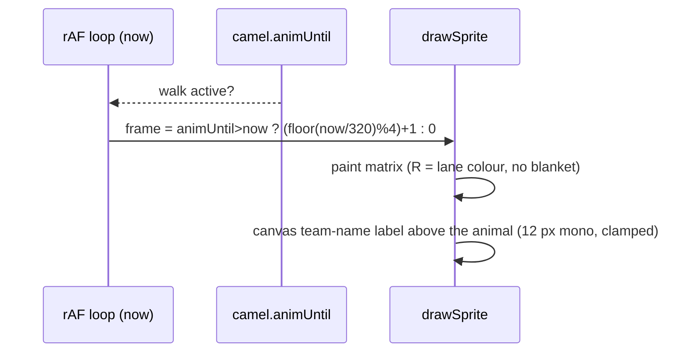

# Camel drafts v4 - reference-look dromedary, rider on top, no saddle blanket

Pixel art for the **desert** theme racer. Faces **right**, one camel per lane. Traced from
the user reference `camel-pixalart.png` (repo root, gitignored): 508x564 px, camel bbox
**397x397 px** (feet on the last row) - i.e. a **stocky ~1:1 dromedary with one hump**.
No image files at runtime: the matrices below drive `drawSprite`. Conventions follow
[`docs/art/camel-sprite.md`](camel-sprite.md) (legend discipline, `O`-enclosure pass, single
4-connected blob, feet on the bottom row, 1 standing + 4 walk frames) and
[`docs/art/boar-sprite.md`](boar-sprite.md).

**Two user requests drive this revision**

1. *the camel must look like the reference image* -> three drafts traced from it (A/B/C below);
2. *remove the light-blue saddle blanket "box" from camel **and** boar - just animal + rider on top* ->
   the camel legend no longer contains `L`, no blanket pixel exists in any frame, and
   `CAMEL_PAL` drops the `blanket` key. Lane/team identity = the **canvas team-name label**
   above the animal + the **rider robe colour** `R` (per-lane palette swap), never a patch.

**Status - superseded by v8.** [`camel-drafts-v5.md`](camel-drafts-v5.md) (`84 x 70`,
reference-traced decorated dromedary with the rider on the saddle) replaced this round;
`index.html` now ships v8, and the matrices below stay as the v7 history.
**Status (this round) - draft A was chosen and shipped as v7 (`76 x 70`).** It was
implemented in `index.html` at the time:
`const CAMEL` = `CAMEL_A_STAND[0]` + `CAMEL_A_WALK` (byte-identical), registry
`{ id: 'camel', sprite: CAMEL, pal: CAMEL_PAL, w: 76, h: 70, rider: 'turban' }`, `CAMEL_PAL`
without the `blanket` key. Draft **B** (84 x 70, ~15 % longer legs) and draft **C** (64 x 62,
coarse blocks) remain documented but **unshipped** - neither has walk frames; only A has the full
5-frame cycle. Supersedes `camel-drafts-v3.md` (shipped v6 camel, 92 x 70, with blanket).

## Goals

| # | Goal | Met by |
|---|---|---|
| 1 | match the reference silhouette (stocky dromedary, one hump, thick short legs) | A (72 x 68 painted, 1:1 body), B, C |
| 2 | stay inside the lane budget (shipped budget 76 x 70, feet on the bottom row, faces right) | A 76 x 70 (shipped); B 84 x 70, C 64 x 62 (documented, unshipped) |
| 3 | no blanket / no digit cells anywhere | validator row `no L px` = 0 for all 3 drafts, 5 frames each |
| 4 | animation-ready: standing + 4 walk frames, 1 px bob baked in | `CAMEL_A_WALK` below |
| 5 | 3 body tones + dark outline only (clean reference palette) | `B`/`S`/`D` + `O`, palette table below |

## Where it renders

Race canvas **1280 x 720**; 8 lanes -> lane height **74 px** (`laneFit.laneMinPx`), terrain bob
+-2 px, feet 2 px above the lane bottom -> usable sprite box **<= 76 x <= 70**
(shipped camel matrix `76 x 70`; `laneFit.spriteHMax: 70`). The sprite is drawn at 1x by `drawSprite` (no scaling, no image load).
Sprites are centred on the lane's `left` + `laneW/2 - w/2`; a matrix whose painted content is
not centred (drafts are centred: A content centre col 38.5 of 76, B 43.5 of 84, C 31 of 64) would
shift the animal inside its lane.

```mermaid
flowchart LR
  R["camel-pixalart.png<br/>508x564, gitignored, never committed"] --> T["crop to camel bbox<br/>397x397 px, 1:1 stocky"]
  T --> M["measure per 70-row grid<br/>head/neck/hump/legs/tail spans"]
  M --> D["hand-trace to blocky pixel art<br/>2 px step quantisation"]
  D --> A["draft A 76x70<br/>B 84x70 - C 64x62"]
  A --> W["pi &lt;-&gt; standing: legs stride,<br/>1 px body bob baked in"]
  W --> V["validator: dims / legend / enclosure /<br/>blob / feet / no-L / similarity"]
  V --> O["CAMEL (5 frames) + CAMEL_PAL"]
```





## Reference mapping - what was traced, what was adapted

Measured on the reference at a 70-row grid (1 sprite row = 5.67 reference px). "Traced" = the
span was read off the reference and kept; "adapted" = changed for the game (blockiness, lane
budget, no blanket, walk cycle).

| Feature | Reference (70-row grid) | Draft A (76x70) | |
|---|---|---|---|
| overall | 397x397 px, aspect 1.00 | painted 72x68, body 1:1 stocky | traced |
| head + muzzle | top row 0, head cols 49-62, muzzle to col 70, hangs to row ~18 | head rows 3-18, muzzle rows 6-18, to col 73 | traced (blockier steps) |
| ear | dark 2-3 px block top-left of the head | `D` block cols 50-53 rows 3-6 | traced |
| eye | dark 2 px bar, upper-middle of the head | `O` 3x2 at cols 58-60, rows 8-9 | traced |
| muzzle markings | dark band on the muzzle bridge, dark under-jaw | `D` band rows 6-7, `D` rows 17-18 | traced |
| neck | short + thick, cols 49-62, rows 18-27 (~13 wide) | rows 17-30, 14 px wide at the base, 14 rows tall | traced |
| neck strap | grey band down the neck front | `G` 1 px column, rows 22-30 | traced colour, adapted shape |
| hump | single, broad: crest cols 16-41, ~9 rows over the back line | crest 13 px wide rows 20-29, 10 rows, base 33 px | traced |
| saddle hollow | back dips rows 28-31 in front of the hump | rows 29-30 between the hump base (col 44) and the neck | traced |
| girth strap | grey band across the body under the saddle | `G` 1 px, col 44 rows 32-46 | adapted (1 px, no pad) |
| body | deep barrel, belly row 44, widest cols 5-57 | belly row 48, chest col 61, rump col 7 | traced |
| legs | thick, short, pairs merged, feet row 69 | fill 5 px + outline, rear pair 17 px / front pair 16 px, 23 rows | traced (moved for walk cycle) |
| hooves | dark stepped block, ~2 px | `O` 3 rows (67-69) with a 1 px `S` split | traced |
| tail | thin dark line, rear-left, rows 44-56 | `D` 2-3 px line rows 44-59 | traced |
| body shading | 3 tones: lit top, mid bulk, dark belly/lee | `B` rows 27-41 / `S` 42-48 ... see palette | traced |
| blanket/pad | reference has a dark pad band on the back | **dropped** (user request: no box) | adapted |

Palette source: reference body tones sampled at `#de914d` (lit) / `#c37c3a` (mid) /
`#b27035` (dark) with near-black outline (< 90 luminance). The reference has mild compression
noise; the three tones below are the **cleaned** values (no noise, exactly these hexes).

## Legend & palette (all three drafts)

| char | meaning | hex | notes |
|---|---|---|---|
| `.` | transparent | - | |
| `O` | outline + hooves + eye + nostril | `#1c1208` | same near-black as v6 (outline consistency) |
| `B` | body light (lit top surfaces) | `#de914d` | reference lit tone, cleaned |
| `S` | body mid (bulk of the barrel, legs) | `#c37c3a` | reference mid tone, cleaned |
| `D` | body deep (belly, lee edges, seams, tail) | `#b27035` | reference dark tone, cleaned |
| `G` | harness (neck strap + girth) | `#53565e` | unchanged from v5/v6 |
| `R` | rider robe = **lane colour** (palette swap) | lane | 8-lane palette unchanged |
| `W` | turban | `#f0ece0` | |
| `K` | skin (face + hand) | `#d8a878` | |

**`L` (blanket) is gone.** No blanket key, no blanket cell, no digit, no reserved digit area -
in any of the three drafts, in any of the 5 frames (validator column `no L px`).

Lane robe colours (unchanged, shared with the boar):

| Lane | 0 | 1 | 2 | 3 | 4 | 5 | 6 | 7 |
|---|---|---|---|---|---|---|---|---|
| | `#e84a3a` | `#3a6ae8` | `#3aa84a` | `#e8c83a` | `#9a4ae8` | `#e88a3a` | `#3ad8d8` | `#e85a9a` |

WCAG contrast (computed, both themes use the same sprite art so only the sand/desert ground
differs; sprite-internal pairs are theme-independent):

| pair | ratio | note |
|---|---|---|
| `O` #1c1208 vs `B` #de914d | **7.25**:1 | outline reads on the lit tone (>= 3:1 non-text) |
| `O` vs `S` #c37c3a | **5.50**:1 | outline reads on the bulk tone |
| `O` vs `D` #b27035 | **4.62**:1 | outline reads on the deep tone |
| `B` vs `S` | 1.32:1 | 3-tone shading is deliberately low contrast (matches the reference) |
| `B` vs `D` | 1.57:1 | |
| `S` vs `D` | 1.19:1 | the darkest step is subtle by design; the outline carries the silhouette |
| `G` #53565e vs `S` | 2.19:1 | harness strap (thin, decorative - not sole carrier of meaning) |
| `R` lane 0 vs `S` | 1.14:1 | robe identity is also carried by the canvas team label |
| `W` #f0ece0 vs `S` | 2.84:1 | turban |
| `K` #d8a878 vs `S` | 1.56:1 | face/hand |

Silhouette rule (same as v6/boar): the shape is read from `O` against the sand/terrain, not from
tone-on-tone contrast, so the low tone ratios do not hurt legibility. Every camel pixel is either
outline or fully enclosed by outline (`O` enclosure row in the validation table).

## Geometry budget

| draft | matrix | painted bbox | painted px (dressed / bare) | feet row | lane slack |
|---|---|---|---|---|---|
| A | 76 x 70 | 72 x 68 @ (3, 2) | 2584 / 2530 | 69 (bottom row) | 0 px (height budget exact) |
| B | 84 x 70 | 72 x 68 @ (8, 2) | 2639 / 2585 | 69 | 0 px |
| C | 64 x 62 | 57 x 60 @ (3, 2) | 1775 / 1710 | 61 | 8 px |

Centre check: A content cols (3, 74) (centre 38.5 of 76), B (8, 79) (centre 43.5 of 84), C (3, 59) (centre 31 of 64).

## Draft A - reference-faithful, stocky (76 x 70) [shipped]

- **Size** 76 x 70; painted bbox **72 x 68** at (col, row) (3, 2); feet on the **bottom row** (row 69).
- **Palette**: `O` #1c1208, `B` #de914d, `S` #c37c3a, `D` #b27035, `G` #53565e, `W` #f0ece0, `K` #d8a878, `R` = lane colour. **No `L`**.
- **Hump**: single, rows 20-29, crest 13 px wide (cols 20-32), base 33 px, 10 rows tall (crest sits 7 rows above the body back line), `D` seam (`hump_crease`) where the hump's front slope meets the saddle hollow and behind the rump.
- **Body**: barrel rows 27-48 (deep), rump rear col 7, chest front col 61; `B` rim on the rump's rear edge and the chest front, `S` bulk, `D` belly band + lee edge.
- **Neck**: rows 17-30, 14 px wide at the base, 14 rows tall (short + thick, like the reference), 1 px `G` strap down the neck front (rows 22-30).
- **Head**: blocky skull rows 3-18 (cols 53-65) + drooping muzzle rows 6-18 to col 73; `D` ear (cols 50-53 rows 3-6), `O` 3x2 eye (cols 58-60 rows 8-9), `D` muzzle bridge band + `D` under-jaw, `O` nostril (col 73 row 14).
- **Legs**: fill 5 px + outline each, 23 rows (47-69), **rear pair 17 px** wide (fill gap 5 px), **front pair 16 px** (gap 4 px), hooves `O` rows 67-69 with a 1 px `S` split; far legs shaded (`S S D D D`), near legs lit (`B S S S D`).
- **Tail**: `D` line + tuft, rows 44-59, flicking +1 / -1 px on the pass frames.
- **Rider** (17 px tall, 19 px wide): turban 4 rows, face 4, tunic 8, boots `O` 2 - seat row 31, boots land on the body's back band (no blanket, no gap, no float).
- **Reference map**: traced = overall 1:1 aspect, hump shape/position, neck thickness, head+muzzle block, leg thickness, tail, 3-tone shading. Adapted = blanket/saddle pad dropped (user request), 2 px step quantisation for clean blocky edges, the grey reference straps kept as 1 px `G` (neck strap + girth), stance + walk cycle invented (the reference is a single standing pose).

```js
const CAMEL_A_STAND = [
  [ // frame 0 - standing (idle)
    '............................................................................',
    '............................................................................',
    '.................................................OOOOOOOOOOOOOOOO...........',
    '.................................................ODDDDBBBBBBBBBBO...........',
    '.................................................ODDDDBBBBBBBBBBOO..........',
    '.................................................ODDDBBBBBBBBBBBBOOOOOOOOO..',
    '.................................................ODDDBBBBBBBBBBBBBDDDDDDBO..',
    '.................................................OOOOBBBBBBBBBBBBBDDDDDDBOO.',
    '....................................................OBBBBBOOOBBBBBBBBBBBBBO.',
    '....................................................OBBBBBOOOBBBBBBBBBBBBBO.',
    '....................................................OBBBBBBBBBBBBBBBBBBBBBO.',
    '....................................................OBBBBBBBBBBBBBBBBBBBBBO.',
    '....................................................OBBBBBBBBBBBBBBBBBBBBBO.',
    '....................................................OSSSSSSSSSSSBBBBBBBBBBO.',
    '....................................................OSSSSSSSSSSSSSSSSSSSSOO.',
    '....................................................OSSSSSSSSSSSSSSSSSSSOOO.',
    '....................................................OSSSSSSSSSSSSSSSSSSSO...',
    '....................................OOOOO...........OSSSSSSSSSSDDDDDOOOOO...',
    '..................................OOOOOOOO..........OSSSSSSSSSSDDDDDO.......',
    '...................OOOOOOOOOOOOOOOOOOWWWOOO.........OBBBBBBBBBBBBBOOO.......',
    '...................OBBBBBBBBBBBBBOOWWWWWWOO........OOBBBBBBBBBBBBBO.........',
    '.................OOOBBBBBBBBBBBBBOOWWWWWWOO........OBBBBBBBBBBBBBOO.........',
    '.................OBBBBBBBBBBBBBBBBOKKKKKKOO.......OOBBBBBBBBBBBGBO..........',
    '...............OOOBBBBBBBBBBBBBBBBOKKKKKKOO.......OBBBBBBBBBBBBGBO..........',
    '...............OSSSSSSSSSSSSSSSSSSSOKKKKKOOO.....OOBBBBBBBBBBBBGBO..........',
    '.............OOOSSSSSSSSSSSSSSSSSSSOKKKKKOOOOO...ODDBBBBBBBBBBGBOO..........',
    '.............OSSSSSSSSSSSSSSSSSSSORRRRRRROOOOOOOOODDBBBBBBBBBBGBO...........',
    '...........OODDDDDSSSSSSSSSSSSSSSORRRRRRRRRRKOSOODDBBBBBBBBBBGBOO...........',
    '...........OSDDDDDSSSSSSSSSSSSSSSORRRRRRRRROOOSOODDSSSSSSSSSSGSO............',
    '...........OSDDDDDSSSSSSSSSSSSSSSORRRRRRRODDDSSSSDDSSSSSSSSSSGSO............',
    '..........OOOBBBSSSSSSSSSSSSSSSSSORRRRRRROSSSSSSSDDSSSSSSSSSSGSO............',
    '..........OBBBSSSSSSSSSSSSSSSSSSSORRRRRRROSSSSSSSSSSSSSSSSSOOOOO............',
    '..........OBBBSSSSSSSSSSSSSSSSSSSORRRRRRROSSGSSSSSSSSSSSSSSO................',
    '........OOOBBBSSSSSSSSSSSSSSSSSSSORRRROOOOSSGSSSSSSSSSSSSSSOOO..............',
    '........OSSSSSSSSSSSSSSSSSSSSSSSSOOOOOOOOSSSGSSSSSSSSSSSSSSSBO..............',
    '........OSSSSSSSSSSSSSSSSSSSSSSSSSSSSSSSSSSSGSSSSSSSSSSSSSSSBO..............',
    '.......OOSSSSSSSSSSSSSSSSSSSSSSSSSSSSSSSSSSSGSSSSSSSSSSSSSSSBOO.............',
    '.......OSSSSSSSSSSSSSSSSSSSSSSSSSSSSSSSSSSSSGSSSSSSSSSSSSSSSSBO.............',
    '.......ODDSSSSSSSSSSSSSSSSSSSSSSSSSSSSSSSSSSGSSSSSSSSSSSSSSSSBO.............',
    '.......ODDSSSSSSSSSSSSSSSSSSSSSSSSSSSSSSSSSSGSSSSSSSSSSSSSSSSBO.............',
    '......OODDSSSSSSSSSSSSSSSSSSSSSSSSSSSSSSSSSSGSSSSSSSSSSSSSSSSBO.............',
    '......ODDSSSSSSSSSSSSSSSSSSSSSSSSSSSSSSSSSSSGSSSSSSSSSSSSSSSSBO.............',
    '......ODDDDDDDDDDDDDDDDDDDDDDDDDDDDDDDDDDDDDGDDDDDDDDDDDDDDDDBO.............',
    '......ODDDDDDDDDDDDDDDDDDDDDDDDDDDDDDDDDDDDDGDDDDDDDDDDDDDDDDBO.............',
    '......ODDDDDDDDDDDDDDDDDDDDDDDDDDDDDDDDDDDDDGDDDDDDDDDDDDDDDDBO.............',
    '......ODDDDDDDDDDDDDDDDDDDDDDDDDDDDDDDDDDDDDGDDDDDDDDDDDDDDDOOO.............',
    '.....OODDDDDDDDDDDDDDDDDDDDDDDDDDDDDDDDDDDDDGDDDDDDDDDDDDDDDO...............',
    '.....ODDDSSDDDOOOOOBSSSDOOOOOOOOOOOOOSSDDDOOODBSSSDDDDDDDDDDO...............',
    '.....ODDDSSDDDO...OBSSSDO...........OSSDDDO.ODBSSSDDDDDDDDDDO...............',
    '.....ODDDSSDDDO...OBSSSDO...........OSSDDDO.OOBSSSDOOOOOOOOOO...............',
    '.....ODDDSSDDDO...OBSSSDO...........OSSDDDO..OBSSSDO........................',
    '.....ODDDSSDDDO...OBSSSDO...........OSSDDDO..OBSSSDO........................',
    '.....ODDDSSDDDO...OBSSSDO...........OSSDDDO..OBSSSDO........................',
    '....OODDDSSDDDO...OBSSSDO...........OSSDDDO..OBSSSDO........................',
    '....ODDDOSSDDDO...OBSSSDO...........OSSDDDO..OBSSSDO........................',
    '....ODDDOSSDDDO...OBSSSDO...........OSSDDDO..OBSSSDO........................',
    '...OODDDOSSDDDO...OBSSSDO...........OSSDDDO..OBSSSDO........................',
    '...ODDDOOSSDDDO...OBSSSDO...........OSSDDDO..OBSSSDO........................',
    '...ODDDOOSSDDDO...OBSSSDO...........OSSDDDO..OBSSSDO........................',
    '...ODDDOOSSDDDO...OBSSSDO...........OSSDDDO..OBSSSDO........................',
    '...OOOOOOSSDDDO...OBSSSDO...........OSSDDDO..OBSSSDO........................',
    '........OSSDDDO...OBSSSDO...........OSSDDDO..OBSSSDO........................',
    '........OSSDDDO...OBSSSDO...........OSSDDDO..OBSSSDO........................',
    '........OSSDDDO...OBSSSDO...........OSSDDDO..OBSSSDO........................',
    '........OSSDDDO...OBSSSDO...........OSSDDDO..OBSSSDO........................',
    '........OSSDDDO...OBSSSDO...........OSSDDDO..OBSSSDO........................',
    '........OSSDDDO...OBSSSDO...........OSSDDDO..OBSSSDO........................',
    '........OOOOOOO...OOOOOOO...........OOOOOOO..OOOOOOO........................',
    '........OOOSOOO...OOOSOOO...........OOOSOOO..OOOSOOO........................',
    '........OOOSOOO...OOOSOOO...........OOOSOOO..OOOSOOO........................'
  ],
];
```

**`CAMEL_A_BARE` - bare standing (no rider, same camel)**

```js
const CAMEL_A_BARE = [
  [ // frame 0 - standing bare (no rider)
    '............................................................................',
    '............................................................................',
    '.................................................OOOOOOOOOOOOOOOO...........',
    '.................................................ODDDDBBBBBBBBBBO...........',
    '.................................................ODDDDBBBBBBBBBBOO..........',
    '.................................................ODDDBBBBBBBBBBBBOOOOOOOOO..',
    '.................................................ODDDBBBBBBBBBBBBBDDDDDDBO..',
    '.................................................OOOOBBBBBBBBBBBBBDDDDDDBOO.',
    '....................................................OBBBBBOOOBBBBBBBBBBBBBO.',
    '....................................................OBBBBBOOOBBBBBBBBBBBBBO.',
    '....................................................OBBBBBBBBBBBBBBBBBBBBBO.',
    '....................................................OBBBBBBBBBBBBBBBBBBBBBO.',
    '....................................................OBBBBBBBBBBBBBBBBBBBBBO.',
    '....................................................OSSSSSSSSSSSBBBBBBBBBBO.',
    '....................................................OSSSSSSSSSSSSSSSSSSSSOO.',
    '....................................................OSSSSSSSSSSSSSSSSSSSOOO.',
    '....................................................OSSSSSSSSSSSSSSSSSSSO...',
    '....................................................OSSSSSSSSSSDDDDDOOOOO...',
    '....................................................OSSSSSSSSSSDDDDDO.......',
    '...................OOOOOOOOOOOOOOO..................OBBBBBBBBBBBBBOOO.......',
    '...................OBBBBBBBBBBBBBO.................OOBBBBBBBBBBBBBO.........',
    '.................OOOBBBBBBBBBBBBBOOO...............OBBBBBBBBBBBBBOO.........',
    '.................OBBBBBBBBBBBBBBBBBO..............OOBBBBBBBBBBBGBO..........',
    '...............OOOBBBBBBBBBBBBBBBBBOOOO...........OBBBBBBBBBBBBGBO..........',
    '...............OSSSSSSSSSSSSSSSSSSSSSSO..........OOBBBBBBBBBBBBGBO..........',
    '.............OOOSSSSSSSSSSSSSSSSSSSSSSOOOOOOOO...ODDBBBBBBBBBBGBOO..........',
    '.............OSSSSSSSSSSSSSSSSSSSSSSSSSSSDDDDOOOOODDBBBBBBBBBBGBO...........',
    '...........OODDDDDSSSSSSSSSSSSSSSSSSSSSSSDDDDSSOODDBBBBBBBBBBGBOO...........',
    '...........OSDDDDDSSSSSSSSSSSSSSSSSSSSSSSDDDDSSOODDSSSSSSSSSSGSO............',
    '...........OSDDDDDSSSSSSSSSSSSSSSSSSSSSSSDDDDSSSSDDSSSSSSSSSSGSO............',
    '..........OOOBBBSSSSSSSSSSSSSSSSSSSSSSSSSSSSSSSSSDDSSSSSSSSSSGSO............',
    '..........OBBBSSSSSSSSSSSSSSSSSSSSSSSSSSSSSSSSSSSSSSSSSSSSSOOOOO............',
    '..........OBBBSSSSSSSSSSSSSSSSSSSSSSSSSSSSSSGSSSSSSSSSSSSSSO................',
    '........OOOBBBSSSSSSSSSSSSSSSSSSSSSSSSSSSSSSGSSSSSSSSSSSSSSOOO..............',
    '........OSSSSSSSSSSSSSSSSSSSSSSSSSSSSSSSSSSSGSSSSSSSSSSSSSSSBO..............',
    '........OSSSSSSSSSSSSSSSSSSSSSSSSSSSSSSSSSSSGSSSSSSSSSSSSSSSBO..............',
    '.......OOSSSSSSSSSSSSSSSSSSSSSSSSSSSSSSSSSSSGSSSSSSSSSSSSSSSBOO.............',
    '.......OSSSSSSSSSSSSSSSSSSSSSSSSSSSSSSSSSSSSGSSSSSSSSSSSSSSSSBO.............',
    '.......ODDSSSSSSSSSSSSSSSSSSSSSSSSSSSSSSSSSSGSSSSSSSSSSSSSSSSBO.............',
    '.......ODDSSSSSSSSSSSSSSSSSSSSSSSSSSSSSSSSSSGSSSSSSSSSSSSSSSSBO.............',
    '......OODDSSSSSSSSSSSSSSSSSSSSSSSSSSSSSSSSSSGSSSSSSSSSSSSSSSSBO.............',
    '......ODDSSSSSSSSSSSSSSSSSSSSSSSSSSSSSSSSSSSGSSSSSSSSSSSSSSSSBO.............',
    '......ODDDDDDDDDDDDDDDDDDDDDDDDDDDDDDDDDDDDDGDDDDDDDDDDDDDDDDBO.............',
    '......ODDDDDDDDDDDDDDDDDDDDDDDDDDDDDDDDDDDDDGDDDDDDDDDDDDDDDDBO.............',
    '......ODDDDDDDDDDDDDDDDDDDDDDDDDDDDDDDDDDDDDGDDDDDDDDDDDDDDDDBO.............',
    '......ODDDDDDDDDDDDDDDDDDDDDDDDDDDDDDDDDDDDDGDDDDDDDDDDDDDDDOOO.............',
    '.....OODDDDDDDDDDDDDDDDDDDDDDDDDDDDDDDDDDDDDGDDDDDDDDDDDDDDDO...............',
    '.....ODDDSSDDDOOOOOBSSSDOOOOOOOOOOOOOSSDDDOOODBSSSDDDDDDDDDDO...............',
    '.....ODDDSSDDDO...OBSSSDO...........OSSDDDO.ODBSSSDDDDDDDDDDO...............',
    '.....ODDDSSDDDO...OBSSSDO...........OSSDDDO.OOBSSSDOOOOOOOOOO...............',
    '.....ODDDSSDDDO...OBSSSDO...........OSSDDDO..OBSSSDO........................',
    '.....ODDDSSDDDO...OBSSSDO...........OSSDDDO..OBSSSDO........................',
    '.....ODDDSSDDDO...OBSSSDO...........OSSDDDO..OBSSSDO........................',
    '....OODDDSSDDDO...OBSSSDO...........OSSDDDO..OBSSSDO........................',
    '....ODDDOSSDDDO...OBSSSDO...........OSSDDDO..OBSSSDO........................',
    '....ODDDOSSDDDO...OBSSSDO...........OSSDDDO..OBSSSDO........................',
    '...OODDDOSSDDDO...OBSSSDO...........OSSDDDO..OBSSSDO........................',
    '...ODDDOOSSDDDO...OBSSSDO...........OSSDDDO..OBSSSDO........................',
    '...ODDDOOSSDDDO...OBSSSDO...........OSSDDDO..OBSSSDO........................',
    '...ODDDOOSSDDDO...OBSSSDO...........OSSDDDO..OBSSSDO........................',
    '...OOOOOOSSDDDO...OBSSSDO...........OSSDDDO..OBSSSDO........................',
    '........OSSDDDO...OBSSSDO...........OSSDDDO..OBSSSDO........................',
    '........OSSDDDO...OBSSSDO...........OSSDDDO..OBSSSDO........................',
    '........OSSDDDO...OBSSSDO...........OSSDDDO..OBSSSDO........................',
    '........OSSDDDO...OBSSSDO...........OSSDDDO..OBSSSDO........................',
    '........OSSDDDO...OBSSSDO...........OSSDDDO..OBSSSDO........................',
    '........OSSDDDO...OBSSSDO...........OSSDDDO..OBSSSDO........................',
    '........OOOOOOO...OOOOOOO...........OOOOOOO..OOOOOOO........................',
    '........OOOSOOO...OOOSOOO...........OOOSOOO..OOOSOOO........................',
    '........OOOSOOO...OOOSOOO...........OOOSOOO..OOOSOOO........................'
  ],
];
```


## Draft B - reference-faithful, slightly leggier (84 x 70)

Same build, proportions, head shape, tones and rider as A - only the **legs are 4 rows longer**
(fill rows 43-69 vs A's 47-69) while the body keeps the stocky barrel (belly row 44).
Payoff: a wider stride reads better when 8 animals stand side by side, and the 84 px matrix adds
8 px of horizontal slack for the walk spread. Cost: a 3 px shorter neck (rows 17-27 vs A's 17-30) and a higher belly - a slightly
less "reference-exact" silhouette than A.

- **Size** 84 x 70 (dx = +5, content centred at col 43.5); painted bbox **72 x 68** at (8, 2); feet row 69.
- **Palette**: identical to A (`O B S D G W K R`, no `L`).
- **Hump**: rows 16-25, crest 13 px (cols 20-32), base 33 px, 10 rows.
- **Legs**: 27 rows (fill rows 43-69 + the 3 hoof rows), rear pair 17 px / front pair 16 px.
- **Neck**: rows 17-27, 14 px at the base.
- **Rider**: seat row 27, boots on the back band, no blanket.

```js
const CAMEL_B_STAND = [
  [ // frame 0 - standing (idle)
    '....................................................................................',
    '....................................................................................',
    '......................................................OOOOOOOOOOOOOOOO..............',
    '......................................................ODDDDBBBBBBBBBBO..............',
    '......................................................ODDDDBBBBBBBBBBOO.............',
    '......................................................ODDDBBBBBBBBBBBBOOOOOOOOO.....',
    '......................................................ODDDBBBBBBBBBBBBBDDDDDDBO.....',
    '......................................................OOOOBBBBBBBBBBBBBDDDDDDBOO....',
    '.........................................................OBBBBBOOOBBBBBBBBBBBBBO....',
    '.........................................................OBBBBBOOOBBBBBBBBBBBBBO....',
    '.........................................................OBBBBBBBBBBBBBBBBBBBBBO....',
    '.........................................................OBBBBBBBBBBBBBBBBBBBBBO....',
    '.........................................................OBBBBBBBBBBBBBBBBBBBBBO....',
    '.........................................OOOOO...........OSSSSSSSSSSSBBBBBBBBBBO....',
    '.......................................OOOOOOOO..........OSSSSSSSSSSSSSSSSSSSSOO....',
    '........................OOOOOOOOOOOOOOOOOOWWWOOO.........OSSSSSSSSSSSSSSSSSSSOOO....',
    '........................OBBBBBBBBBBBBBOOWWWWWWOO.........OSSSSSSSSSSSSSSSSSSSO......',
    '......................OOOBBBBBBBBBBBBBOOWWWWWWOO.........OSSSSSSSSSSDDDDDOOOOO......',
    '......................OBBBBBBBBBBBBBBBBOKKKKKKOO.........OSSSSSSSSSSDDDDDO..........',
    '....................OOOBBBBBBBBBBBBBBBBOKKKKKKOO.........OBBBBBBBBBBBBBOOO..........',
    '....................OSSSSSSSSSSSSSSSSSSSOKKKKKOOO.......OOBBBBBBBBBBBBBO............',
    '..................OOOSSSSSSSSSSSSSSSSSSSOKKKKKOOOOO.....OBBBBBBBBBBBBBOO............',
    '..................OSSSSSSSSSSSSSSSSSSSORRRRRRROOOOOOO..OOBBBBBBBBBBBGBO.............',
    '................OODDDDDSSSSSSSSSSSSSSSORRRRRRRRRRKOSO..OBBBBBBBBBBBBGBO.............',
    '................OSDDDDDSSSSSSSSSSSSSSSORRRRRRRRROOOSOOOODDBBBBBBBBBBGBO.............',
    '................OSDDDDDSSSSSSSSSSSSSSSORRRRRRRODDDSSSSSDDSSSSSSSSSSGSOO.............',
    '...............OOOBBBSSSSSSSSSSSSSSSSSORRRRRRROSSSSSSSSDDSSSSSSSSSSGSO..............',
    '...............OBBBSSSSSSSSSSSSSSSSSSSORRRRRRROSSSSSSSSDDSSSSSSSSSSGSO..............',
    '...............OBBBSSSSSSSSSSSSSSSSSSSORRRRRRROSSGSSSSSSSSSSSSSSOOOOOO..............',
    '.............OOOBBBSSSSSSSSSSSSSSSSSSSORRRROOOOSSGSSSSSSSSSSSSSSOOO.................',
    '.............OSSSSSSSSSSSSSSSSSSSSSSSSOOOOOOOOSSSGSSSSSSSSSSSSSSSBO.................',
    '.............OSSSSSSSSSSSSSSSSSSSSSSSSSSSSSSSSSSSGSSSSSSSSSSSSSSSBO.................',
    '............OOSSSSSSSSSSSSSSSSSSSSSSSSSSSSSSSSSSSGSSSSSSSSSSSSSSSBOO................',
    '............OSSSSSSSSSSSSSSSSSSSSSSSSSSSSSSSSSSSSGSSSSSSSSSSSSSSSSBO................',
    '............ODDSSSSSSSSSSSSSSSSSSSSSSSSSSSSSSSSSSGSSSSSSSSSSSSSSSSBO................',
    '............ODDSSSSSSSSSSSSSSSSSSSSSSSSSSSSSSSSSSGSSSSSSSSSSSSSSSSBO................',
    '...........OODDSSSSSSSSSSSSSSSSSSSSSSSSSSSSSSSSSSGSSSSSSSSSSSSSSSSBO................',
    '...........ODDSSSSSSSSSSSSSSSSSSSSSSSSSSSSSSSSSSSGSSSSSSSSSSSSSSSSBO................',
    '...........ODDDDDDDDDDDDDDDDDDDDDDDDDDDDDDDDDDDDDGDDDDDDDDDDDDDDDDBO................',
    '...........ODDDDDDDDDDDDDDDDDDDDDDDDDDDDDDDDDDDDDGDDDDDDDDDDDDDDDDBO................',
    '...........ODDDDDDDDDDDDDDDDDDDDDDDDDDDDDDDDDDDDDGDDDDDDDDDDDDDDDDBO................',
    '...........ODDDDDDDDDDDDDDDDDDDDDDDDDDDDDDDDDDDDDGDDDDDDDDDDDDDDDOOO................',
    '..........OODDDDDDDDDDDDDDDDDDDDDDDDDDDDDDDDDDDDDGDDDDDDDDDDDDDDDO..................',
    '..........ODDDSSDDDOOOOOBSSSDOOOOOOOOOOOOOSSDDDOOODBSSSDDDDDDDDDDO..................',
    '..........ODDDSSDDDO...OBSSSDO...........OSSDDDO.ODBSSSDDDDDDDDDDO..................',
    '..........ODDDSSDDDO...OBSSSDO...........OSSDDDO.OOBSSSDOOOOOOOOOO..................',
    '..........ODDDSSDDDO...OBSSSDO...........OSSDDDO..OBSSSDO...........................',
    '..........ODDDSSDDDO...OBSSSDO...........OSSDDDO..OBSSSDO...........................',
    '..........ODDDSSDDDO...OBSSSDO...........OSSDDDO..OBSSSDO...........................',
    '.........OODDDSSDDDO...OBSSSDO...........OSSDDDO..OBSSSDO...........................',
    '.........ODDDOSSDDDO...OBSSSDO...........OSSDDDO..OBSSSDO...........................',
    '.........ODDDOSSDDDO...OBSSSDO...........OSSDDDO..OBSSSDO...........................',
    '........OODDDOSSDDDO...OBSSSDO...........OSSDDDO..OBSSSDO...........................',
    '........ODDDOOSSDDDO...OBSSSDO...........OSSDDDO..OBSSSDO...........................',
    '........ODDDOOSSDDDO...OBSSSDO...........OSSDDDO..OBSSSDO...........................',
    '........ODDDOOSSDDDO...OBSSSDO...........OSSDDDO..OBSSSDO...........................',
    '........OOOOOOSSDDDO...OBSSSDO...........OSSDDDO..OBSSSDO...........................',
    '.............OSSDDDO...OBSSSDO...........OSSDDDO..OBSSSDO...........................',
    '.............OSSDDDO...OBSSSDO...........OSSDDDO..OBSSSDO...........................',
    '.............OSSDDDO...OBSSSDO...........OSSDDDO..OBSSSDO...........................',
    '.............OSSDDDO...OBSSSDO...........OSSDDDO..OBSSSDO...........................',
    '.............OSSDDDO...OBSSSDO...........OSSDDDO..OBSSSDO...........................',
    '.............OSSDDDO...OBSSSDO...........OSSDDDO..OBSSSDO...........................',
    '.............OSSDDDO...OBSSSDO...........OSSDDDO..OBSSSDO...........................',
    '.............OSSDDDO...OBSSSDO...........OSSDDDO..OBSSSDO...........................',
    '.............OSSDDDO...OBSSSDO...........OSSDDDO..OBSSSDO...........................',
    '.............OSSDDDO...OBSSSDO...........OSSDDDO..OBSSSDO...........................',
    '.............OOOOOOO...OOOOOOO...........OOOOOOO..OOOOOOO...........................',
    '.............OOOSOOO...OOOSOOO...........OOOSOOO..OOOSOOO...........................',
    '.............OOOSOOO...OOOSOOO...........OOOSOOO..OOOSOOO...........................'
  ],
];
```

**`CAMEL_B_BARE` - bare standing**

```js
const CAMEL_B_BARE = [
  [ // frame 0 - standing bare (no rider)
    '....................................................................................',
    '....................................................................................',
    '......................................................OOOOOOOOOOOOOOOO..............',
    '......................................................ODDDDBBBBBBBBBBO..............',
    '......................................................ODDDDBBBBBBBBBBOO.............',
    '......................................................ODDDBBBBBBBBBBBBOOOOOOOOO.....',
    '......................................................ODDDBBBBBBBBBBBBBDDDDDDBO.....',
    '......................................................OOOOBBBBBBBBBBBBBDDDDDDBOO....',
    '.........................................................OBBBBBOOOBBBBBBBBBBBBBO....',
    '.........................................................OBBBBBOOOBBBBBBBBBBBBBO....',
    '.........................................................OBBBBBBBBBBBBBBBBBBBBBO....',
    '.........................................................OBBBBBBBBBBBBBBBBBBBBBO....',
    '.........................................................OBBBBBBBBBBBBBBBBBBBBBO....',
    '.........................................................OSSSSSSSSSSSBBBBBBBBBBO....',
    '.........................................................OSSSSSSSSSSSSSSSSSSSSOO....',
    '........................OOOOOOOOOOOOOOO..................OSSSSSSSSSSSSSSSSSSSOOO....',
    '........................OBBBBBBBBBBBBBO..................OSSSSSSSSSSSSSSSSSSSO......',
    '......................OOOBBBBBBBBBBBBBOOO................OSSSSSSSSSSDDDDDOOOOO......',
    '......................OBBBBBBBBBBBBBBBBBO................OSSSSSSSSSSDDDDDO..........',
    '....................OOOBBBBBBBBBBBBBBBBBOOOO.............OBBBBBBBBBBBBBOOO..........',
    '....................OSSSSSSSSSSSSSSSSSSSSSSO............OOBBBBBBBBBBBBBO............',
    '..................OOOSSSSSSSSSSSSSSSSSSSSSSOOOOOOOO.....OBBBBBBBBBBBBBOO............',
    '..................OSSSSSSSSSSSSSSSSSSSSSSSSSSSDDDDOOO..OOBBBBBBBBBBBGBO.............',
    '................OODDDDDSSSSSSSSSSSSSSSSSSSSSSSDDDDSSO..OBBBBBBBBBBBBGBO.............',
    '................OSDDDDDSSSSSSSSSSSSSSSSSSSSSSSDDDDSSOOOODDBBBBBBBBBBGBO.............',
    '................OSDDDDDSSSSSSSSSSSSSSSSSSSSSSSDDDDSSSSSDDSSSSSSSSSSGSOO.............',
    '...............OOOBBBSSSSSSSSSSSSSSSSSSSSSSSSSSSSSSSSSSDDSSSSSSSSSSGSO..............',
    '...............OBBBSSSSSSSSSSSSSSSSSSSSSSSSSSSSSSSSSSSSDDSSSSSSSSSSGSO..............',
    '...............OBBBSSSSSSSSSSSSSSSSSSSSSSSSSSSSSSGSSSSSSSSSSSSSSOOOOOO..............',
    '.............OOOBBBSSSSSSSSSSSSSSSSSSSSSSSSSSSSSSGSSSSSSSSSSSSSSOOO.................',
    '.............OSSSSSSSSSSSSSSSSSSSSSSSSSSSSSSSSSSSGSSSSSSSSSSSSSSSBO.................',
    '.............OSSSSSSSSSSSSSSSSSSSSSSSSSSSSSSSSSSSGSSSSSSSSSSSSSSSBO.................',
    '............OOSSSSSSSSSSSSSSSSSSSSSSSSSSSSSSSSSSSGSSSSSSSSSSSSSSSBOO................',
    '............OSSSSSSSSSSSSSSSSSSSSSSSSSSSSSSSSSSSSGSSSSSSSSSSSSSSSSBO................',
    '............ODDSSSSSSSSSSSSSSSSSSSSSSSSSSSSSSSSSSGSSSSSSSSSSSSSSSSBO................',
    '............ODDSSSSSSSSSSSSSSSSSSSSSSSSSSSSSSSSSSGSSSSSSSSSSSSSSSSBO................',
    '...........OODDSSSSSSSSSSSSSSSSSSSSSSSSSSSSSSSSSSGSSSSSSSSSSSSSSSSBO................',
    '...........ODDSSSSSSSSSSSSSSSSSSSSSSSSSSSSSSSSSSSGSSSSSSSSSSSSSSSSBO................',
    '...........ODDDDDDDDDDDDDDDDDDDDDDDDDDDDDDDDDDDDDGDDDDDDDDDDDDDDDDBO................',
    '...........ODDDDDDDDDDDDDDDDDDDDDDDDDDDDDDDDDDDDDGDDDDDDDDDDDDDDDDBO................',
    '...........ODDDDDDDDDDDDDDDDDDDDDDDDDDDDDDDDDDDDDGDDDDDDDDDDDDDDDDBO................',
    '...........ODDDDDDDDDDDDDDDDDDDDDDDDDDDDDDDDDDDDDGDDDDDDDDDDDDDDDOOO................',
    '..........OODDDDDDDDDDDDDDDDDDDDDDDDDDDDDDDDDDDDDGDDDDDDDDDDDDDDDO..................',
    '..........ODDDSSDDDOOOOOBSSSDOOOOOOOOOOOOOSSDDDOOODBSSSDDDDDDDDDDO..................',
    '..........ODDDSSDDDO...OBSSSDO...........OSSDDDO.ODBSSSDDDDDDDDDDO..................',
    '..........ODDDSSDDDO...OBSSSDO...........OSSDDDO.OOBSSSDOOOOOOOOOO..................',
    '..........ODDDSSDDDO...OBSSSDO...........OSSDDDO..OBSSSDO...........................',
    '..........ODDDSSDDDO...OBSSSDO...........OSSDDDO..OBSSSDO...........................',
    '..........ODDDSSDDDO...OBSSSDO...........OSSDDDO..OBSSSDO...........................',
    '.........OODDDSSDDDO...OBSSSDO...........OSSDDDO..OBSSSDO...........................',
    '.........ODDDOSSDDDO...OBSSSDO...........OSSDDDO..OBSSSDO...........................',
    '.........ODDDOSSDDDO...OBSSSDO...........OSSDDDO..OBSSSDO...........................',
    '........OODDDOSSDDDO...OBSSSDO...........OSSDDDO..OBSSSDO...........................',
    '........ODDDOOSSDDDO...OBSSSDO...........OSSDDDO..OBSSSDO...........................',
    '........ODDDOOSSDDDO...OBSSSDO...........OSSDDDO..OBSSSDO...........................',
    '........ODDDOOSSDDDO...OBSSSDO...........OSSDDDO..OBSSSDO...........................',
    '........OOOOOOSSDDDO...OBSSSDO...........OSSDDDO..OBSSSDO...........................',
    '.............OSSDDDO...OBSSSDO...........OSSDDDO..OBSSSDO...........................',
    '.............OSSDDDO...OBSSSDO...........OSSDDDO..OBSSSDO...........................',
    '.............OSSDDDO...OBSSSDO...........OSSDDDO..OBSSSDO...........................',
    '.............OSSDDDO...OBSSSDO...........OSSDDDO..OBSSSDO...........................',
    '.............OSSDDDO...OBSSSDO...........OSSDDDO..OBSSSDO...........................',
    '.............OSSDDDO...OBSSSDO...........OSSDDDO..OBSSSDO...........................',
    '.............OSSDDDO...OBSSSDO...........OSSDDDO..OBSSSDO...........................',
    '.............OSSDDDO...OBSSSDO...........OSSDDDO..OBSSSDO...........................',
    '.............OSSDDDO...OBSSSDO...........OSSDDDO..OBSSSDO...........................',
    '.............OSSDDDO...OBSSSDO...........OSSDDDO..OBSSSDO...........................',
    '.............OOOOOOO...OOOOOOO...........OOOOOOO..OOOOOOO...........................',
    '.............OOOSOOO...OOOSOOO...........OOOSOOO..OOOSOOO...........................',
    '.............OOOSOOO...OOOSOOO...........OOOSOOO..OOOSOOO...........................'
  ],
];
```


## Draft C - reference-look, chunkier block scale (64 x 62)

A coarse reinterpretation for comparison: same camel grammar (single hump, thick short neck,
blocky head with a drooping muzzle, thick legs, tail) but drawn on a **3 px step** grid with a
reduced detail budget - no separate `D` ear-to-head step, the eye is a 3x2 `O` block, the muzzle
markings collapse to one `D` band + `D` under-jaw, a **small coarse rider glyph** (13 x 15,
turban/face/tunic/boots) replaces the 19 x 17 rider. Useful only when lane height is very tight
(it leaves 8 px of height slack) - the head/muzzle reads blockier and the animal loses some of
the reference's chunky charm (fewer steps per curve).

- **Size** 64 x 62; painted bbox **57 x 60** at (3, 2); feet on row 61; centre col 31 of 64.
- **Palette**: identical chars (`O B S D G W K R`, no `L`) - the palette itself is shared, only the geometry is coarser.
- **Hump**: rows 17-25, crest 14 px, base 26 px, 9 rows.
- **Neck**: rows 15-25, 10 px at the base; **legs**: 25 rows, rear pair 14 px / front pair 14 px (4 px fill + outline).
- **No walk cycle** in this draft (comparison only): if C were ever promoted, the A walk leg offsets (+-2 / -+2 / 1 px) transfer 1:1 to its leg bands.

```js
const CAMEL_C_STAND = [
  [ // frame 0 - standing (idle)
    '................................................................',
    '................................................................',
    '.......................................OOOOO....................',
    '.......................................ODDDOOOOOOOO.............',
    '.......................................ODDDBBBBBBBO.............',
    '.......................................ODDDBBBBBBBOOOOOOOO......',
    '.......................................OOOBBBBBBBBBBDDDDBO......',
    '.........................................OBBBBOOOBBBDDDDBOO.....',
    '.........................................OBBBBOOOBBBBBBBBBO.....',
    '.........................................OBBBBBBBBBBBBBBBBOO....',
    '.........................................OBBBBBBBBBBBBBBBBBO....',
    '............................OOOOO........OSSSSSSSSBBBBBBBBBO....',
    '..........................OOOOOOOO.......OSSSSSSSSSSSSSSSSOO....',
    '.........................OOOOWWWOOO......OSSSSSSSSSSSSSSSSSO....',
    '.........................OOWWWWWWOO......OSSSSSSSSSSSSSSSSSO....',
    '.........................OOWWWWWWOO......OSSSSSSSSSSSSSSSOOO....',
    '..............OOOOOOOOOOOOOKKKKKOOO......OSSSSSSSDDDDDDDDO......',
    '..............OBBBBBBBBBBBOKKKKKOO.......OBBBBBBBDDDDOOOOO......',
    '............OOOBBBBBBBBBBBBOKKKKOOOO....OOBBBBBBBDGDDO..........',
    '............OBBBBBBBBBBBBBORRRRRROOOO...OBBBBBBBBGBOOO..........',
    '..........OOOBBBBBBBBBBBBBORRRRRRRKOO..OOBBBBBBBBGBO............',
    '..........OSSSSSSSSSSSSSSSORRRRRROOOO..ODDBBBBBBGBOO............',
    '.........OOSSSSSSSSSSSSSSSORRRRRROOOO..ODDBBBBBBGBO.............',
    '.........OSSSSSSSSSSSSSSSSORRRRRRODDOOOODDSSSSSSGSO.............',
    '.........ODDDDSSSSSSSSSSSSORRRRRRODDSSSSDDSSSSSSGSO.............',
    '.........ODDDDSSSSSSSSSSSSORROOOODDDSSSSDDSSSSSSGSO.............',
    '.........OOBBBSSSSSSSSSSSSOOOOOOGSSSSSSSSSOOOOOOOOO.............',
    '........OOOBBBSSSSSSSSSSSSSSSSSSGSSSSSSSSSOOO...................',
    '........OBBBSSSSSSSSSSSSSSSSSSSSGSSSSSSSSSSSO...................',
    '......OOOSSSSSSSSSSSSSSSSSSSSSSSGSSSSSSSSSSBOO..................',
    '......OSSSSSSSSSSSSSSSSSSSSSSSSSGSSSSSSSSSSSBO..................',
    '......OSSSSSSSSSSSSSSSSSSSSSSSSSGSSSSSSSSSSSBO..................',
    '......ODDSSSSSSSSSSSSSSSSSSSSSSSGSSSSSSSSSSSBO..................',
    '.....OODDSSSSSSSSSSSSSSSSSSSSSSSGSSSSSSSSSSSBO..................',
    '.....ODDDSSSSSSSSSSSSSSSSSSSSSSSGSSSSSSSSSSSBO..................',
    '.....ODDDDDDDDDDDDDDDDDDDDDDDDDDGDDDDDDDDDBOOO..................',
    '....OODDDDDDDDDDDDDDDDDDDDDDDDDDGDDDDDDDDDDOO...................',
    '....ODDDDDDOOOOBSSDOOOOOOOOOOSDDGDDDDBSSDDDDO...................',
    '....ODDDDDDO..OBSSDO........OSDDDDDDDBSSDDDDO...................',
    '....ODDDDDDO..OBSSDO........OSDDDDDDDBSSDDDDO...................',
    '....ODDDDDDO..OBSSDO........OSDDDOOOOBSSDOOOO...................',
    '....ODDDDDDO..OBSSDO........OSDDDO..OBSSDO......................',
    '...OODDDDDDO..OBSSDO........OSDDDO..OBSSDO......................',
    '...ODDDSDDDO..OBSSDO........OSDDDO..OBSSDO......................',
    '...ODDDSDDDO..OBSSDO........OSDDDO..OBSSDO......................',
    '...ODDDSDDDO..OBSSDO........OSDDDO..OBSSDO......................',
    '...ODDDSDDDO..OBSSDO........OSDDDO..OBSSDO......................',
    '...OOOOSDDDO..OBSSDO........OSDDDO..OBSSDO......................',
    '......OSDDDO..OBSSDO........OSDDDO..OBSSDO......................',
    '......OSDDDO..OBSSDO........OSDDDO..OBSSDO......................',
    '......OSDDDO..OBSSDO........OSDDDO..OBSSDO......................',
    '......OSDDDO..OBSSDO........OSDDDO..OBSSDO......................',
    '......OSDDDO..OBSSDO........OSDDDO..OBSSDO......................',
    '......OSDDDO..OBSSDO........OSDDDO..OBSSDO......................',
    '......OSDDDO..OBSSDO........OSDDDO..OBSSDO......................',
    '......OSDDDO..OBSSDO........OSDDDO..OBSSDO......................',
    '......OSDDDO..OBSSDO........OSDDDO..OBSSDO......................',
    '......OSDDDO..OBSSDO........OSDDDO..OBSSDO......................',
    '......OSDDDO..OBSSDO........OSDDDO..OBSSDO......................',
    '......OOOOOO..OOOOOO........OOOOOO..OOOOOO......................',
    '......OOOSOO..OOOSOO........OOOSOO..OOOSOO......................',
    '......OOOSOO..OOOSOO........OOOSOO..OOOSOO......................'
  ],
];
```

**`CAMEL_C_BARE` - bare standing**

```js
const CAMEL_C_BARE = [
  [ // frame 0 - standing bare (no rider)
    '................................................................',
    '................................................................',
    '.......................................OOOOO....................',
    '.......................................ODDDOOOOOOOO.............',
    '.......................................ODDDBBBBBBBO.............',
    '.......................................ODDDBBBBBBBOOOOOOOO......',
    '.......................................OOOBBBBBBBBBBDDDDBO......',
    '.........................................OBBBBOOOBBBDDDDBOO.....',
    '.........................................OBBBBOOOBBBBBBBBBO.....',
    '.........................................OBBBBBBBBBBBBBBBBOO....',
    '.........................................OBBBBBBBBBBBBBBBBBO....',
    '.........................................OSSSSSSSSBBBBBBBBBO....',
    '.........................................OSSSSSSSSSSSSSSSSOO....',
    '.........................................OSSSSSSSSSSSSSSSSSO....',
    '.........................................OSSSSSSSSSSSSSSSSSO....',
    '.........................................OSSSSSSSSSSSSSSSOOO....',
    '..............OOOOOOOOOOOOOOOO...........OSSSSSSSDDDDDDDDO......',
    '..............OBBBBBBBBBBBBBBO...........OBBBBBBBDDDDOOOOO......',
    '............OOOBBBBBBBBBBBBBBOOO........OOBBBBBBBDGDDO..........',
    '............OBBBBBBBBBBBBBBBBBBO........OBBBBBBBBGBOOO..........',
    '..........OOOBBBBBBBBBBBBBBBBBBOOOO....OOBBBBBBBBGBO............',
    '..........OSSSSSSSSSSSSSSSSSSSSSSSO....ODDBBBBBBGBOO............',
    '.........OOSSSSSSSSSSSSSSSSSSSSSSSOOO..ODDBBBBBBGBO.............',
    '.........OSSSSSSSSSSSSSSSSSSSSSSDDDDOOOODDSSSSSSGSO.............',
    '.........ODDDDSSSSSSSSSSSSSSSSSSDDDDSSSSDDSSSSSSGSO.............',
    '.........ODDDDSSSSSSSSSSSSSSSSSSGDDDSSSSDDSSSSSSGSO.............',
    '.........OOBBBSSSSSSSSSSSSSSSSSSGSSSSSSSSSOOOOOOOOO.............',
    '........OOOBBBSSSSSSSSSSSSSSSSSSGSSSSSSSSSOOO...................',
    '........OBBBSSSSSSSSSSSSSSSSSSSSGSSSSSSSSSSSO...................',
    '......OOOSSSSSSSSSSSSSSSSSSSSSSSGSSSSSSSSSSBOO..................',
    '......OSSSSSSSSSSSSSSSSSSSSSSSSSGSSSSSSSSSSSBO..................',
    '......OSSSSSSSSSSSSSSSSSSSSSSSSSGSSSSSSSSSSSBO..................',
    '......ODDSSSSSSSSSSSSSSSSSSSSSSSGSSSSSSSSSSSBO..................',
    '.....OODDSSSSSSSSSSSSSSSSSSSSSSSGSSSSSSSSSSSBO..................',
    '.....ODDDSSSSSSSSSSSSSSSSSSSSSSSGSSSSSSSSSSSBO..................',
    '.....ODDDDDDDDDDDDDDDDDDDDDDDDDDGDDDDDDDDDBOOO..................',
    '....OODDDDDDDDDDDDDDDDDDDDDDDDDDGDDDDDDDDDDOO...................',
    '....ODDDDDDOOOOBSSDOOOOOOOOOOSDDGDDDDBSSDDDDO...................',
    '....ODDDDDDO..OBSSDO........OSDDDDDDDBSSDDDDO...................',
    '....ODDDDDDO..OBSSDO........OSDDDDDDDBSSDDDDO...................',
    '....ODDDDDDO..OBSSDO........OSDDDOOOOBSSDOOOO...................',
    '....ODDDDDDO..OBSSDO........OSDDDO..OBSSDO......................',
    '...OODDDDDDO..OBSSDO........OSDDDO..OBSSDO......................',
    '...ODDDSDDDO..OBSSDO........OSDDDO..OBSSDO......................',
    '...ODDDSDDDO..OBSSDO........OSDDDO..OBSSDO......................',
    '...ODDDSDDDO..OBSSDO........OSDDDO..OBSSDO......................',
    '...ODDDSDDDO..OBSSDO........OSDDDO..OBSSDO......................',
    '...OOOOSDDDO..OBSSDO........OSDDDO..OBSSDO......................',
    '......OSDDDO..OBSSDO........OSDDDO..OBSSDO......................',
    '......OSDDDO..OBSSDO........OSDDDO..OBSSDO......................',
    '......OSDDDO..OBSSDO........OSDDDO..OBSSDO......................',
    '......OSDDDO..OBSSDO........OSDDDO..OBSSDO......................',
    '......OSDDDO..OBSSDO........OSDDDO..OBSSDO......................',
    '......OSDDDO..OBSSDO........OSDDDO..OBSSDO......................',
    '......OSDDDO..OBSSDO........OSDDDO..OBSSDO......................',
    '......OSDDDO..OBSSDO........OSDDDO..OBSSDO......................',
    '......OSDDDO..OBSSDO........OSDDDO..OBSSDO......................',
    '......OSDDDO..OBSSDO........OSDDDO..OBSSDO......................',
    '......OSDDDO..OBSSDO........OSDDDO..OBSSDO......................',
    '......OOOOOO..OOOOOO........OOOOOO..OOOOOO......................',
    '......OOOSOO..OOOSOO........OOOSOO..OOOSOO......................',
    '......OOOSOO..OOOSOO........OOOSOO..OOOSOO......................'
  ],
];
```


## Walk frames - draft A (`CAMEL_A_WALK`, 4 frames)

Frames **1-4** slot straight into the existing animation contract (identical to v6):
`frame = animUntil > now ? (floor(now / 320) % 4) + 1 : 0`, where **frame 0 = `CAMEL_A_STAND`**
(idle, no motion). Cycle = 4 x 320 ms = **1280 ms**.

- **Contact A (1)** - rear pair spread wide (far leg -2, near leg +2), front pair at the pass (far +2, near -2); tail neutral.
- **Pass A (2)** - legs back under the body (rear far 0 / near 0, front far 0 / near 0), body + head + rider **1 px up** (bob), tail +1 px.
- **Contact B (3)** - mirror of frame 1 (rear far +2, near -2, front far -2, near +2).
- **Pass B (4)** - front/rear far legs +1/-1 (distinct from pass A), bob 1 px up, tail -1 px.

The **bob is baked into the matrices**: rows shift up by 1 on frames 2/4 while the leg fill simply
starts 1 row higher, so the **hooves stay planted on row 69 in every frame** and `drawSprite`
needs no offset (same convention as v6 `bobOffset`).

```js
const CAMEL_A_WALK = [
  [ // frame 1 - contact A (near-front forward, far-front back)
      '............................................................................',
      '............................................................................',
      '.................................................OOOOOOOOOOOOOOOO...........',
      '.................................................ODDDDBBBBBBBBBBO...........',
      '.................................................ODDDDBBBBBBBBBBOO..........',
      '.................................................ODDDBBBBBBBBBBBBOOOOOOOOO..',
      '.................................................ODDDBBBBBBBBBBBBBDDDDDDBO..',
      '.................................................OOOOBBBBBBBBBBBBBDDDDDDBOO.',
      '....................................................OBBBBBOOOBBBBBBBBBBBBBO.',
      '....................................................OBBBBBOOOBBBBBBBBBBBBBO.',
      '....................................................OBBBBBBBBBBBBBBBBBBBBBO.',
      '....................................................OBBBBBBBBBBBBBBBBBBBBBO.',
      '....................................................OBBBBBBBBBBBBBBBBBBBBBO.',
      '....................................................OSSSSSSSSSSSBBBBBBBBBBO.',
      '....................................................OSSSSSSSSSSSSSSSSSSSSOO.',
      '....................................................OSSSSSSSSSSSSSSSSSSSOOO.',
      '....................................................OSSSSSSSSSSSSSSSSSSSO...',
      '....................................OOOOO...........OSSSSSSSSSSDDDDDOOOOO...',
      '..................................OOOOOOOO..........OSSSSSSSSSSDDDDDO.......',
      '...................OOOOOOOOOOOOOOOOOOWWWOOO.........OBBBBBBBBBBBBBOOO.......',
      '...................OBBBBBBBBBBBBBOOWWWWWWOO........OOBBBBBBBBBBBBBO.........',
      '.................OOOBBBBBBBBBBBBBOOWWWWWWOO........OBBBBBBBBBBBBBOO.........',
      '.................OBBBBBBBBBBBBBBBBOKKKKKKOO.......OOBBBBBBBBBBBGBO..........',
      '...............OOOBBBBBBBBBBBBBBBBOKKKKKKOO.......OBBBBBBBBBBBBGBO..........',
      '...............OSSSSSSSSSSSSSSSSSSSOKKKKKOOO.....OOBBBBBBBBBBBBGBO..........',
      '.............OOOSSSSSSSSSSSSSSSSSSSOKKKKKOOOOO...ODDBBBBBBBBBBGBOO..........',
      '.............OSSSSSSSSSSSSSSSSSSSORRRRRRROOOOOOOOODDBBBBBBBBBBGBO...........',
      '...........OODDDDDSSSSSSSSSSSSSSSORRRRRRRRRRKOSOODDBBBBBBBBBBGBOO...........',
      '...........OSDDDDDSSSSSSSSSSSSSSSORRRRRRRRROOOSOODDSSSSSSSSSSGSO............',
      '...........OSDDDDDSSSSSSSSSSSSSSSORRRRRRRODDDSSSSDDSSSSSSSSSSGSO............',
      '..........OOOBBBSSSSSSSSSSSSSSSSSORRRRRRROSSSSSSSDDSSSSSSSSSSGSO............',
      '..........OBBBSSSSSSSSSSSSSSSSSSSORRRRRRROSSSSSSSSSSSSSSSSSOOOOO............',
      '..........OBBBSSSSSSSSSSSSSSSSSSSORRRRRRROSSGSSSSSSSSSSSSSSO................',
      '........OOOBBBSSSSSSSSSSSSSSSSSSSORRRROOOOSSGSSSSSSSSSSSSSSOOO..............',
      '........OSSSSSSSSSSSSSSSSSSSSSSSSOOOOOOOOSSSGSSSSSSSSSSSSSSSBO..............',
      '........OSSSSSSSSSSSSSSSSSSSSSSSSSSSSSSSSSSSGSSSSSSSSSSSSSSSBO..............',
      '.......OOSSSSSSSSSSSSSSSSSSSSSSSSSSSSSSSSSSSGSSSSSSSSSSSSSSSBOO.............',
      '.......OSSSSSSSSSSSSSSSSSSSSSSSSSSSSSSSSSSSSGSSSSSSSSSSSSSSSSBO.............',
      '.......ODDSSSSSSSSSSSSSSSSSSSSSSSSSSSSSSSSSSGSSSSSSSSSSSSSSSSBO.............',
      '.......ODDSSSSSSSSSSSSSSSSSSSSSSSSSSSSSSSSSSGSSSSSSSSSSSSSSSSBO.............',
      '......OODDSSSSSSSSSSSSSSSSSSSSSSSSSSSSSSSSSSGSSSSSSSSSSSSSSSSBO.............',
      '......ODDSSSSSSSSSSSSSSSSSSSSSSSSSSSSSSSSSSSGSSSSSSSSSSSSSSSSBO.............',
      '......ODDDDDDDDDDDDDDDDDDDDDDDDDDDDDDDDDDDDDGDDDDDDDDDDDDDDDDBO.............',
      '......ODDDDDDDDDDDDDDDDDDDDDDDDDDDDDDDDDDDDDGDDDDDDDDDDDDDDDDBO.............',
      '......ODDDDDDDDDDDDDDDDDDDDDDDDDDDDDDDDDDDDDGDDDDDDDDDDDDDDDDBO.............',
      '......ODDDDDDDDDDDDDDDDDDDDDDDDDDDDDDDDDDDDDGDDDDDDDDDDDDDDDOOO.............',
      '.....OODDDDDDDDDDDDDDDDDDDDDDDDDDDDDDDDDDDDDGDDDDDDDDDDDDDDDO...............',
      '.....ODDDDDDOOOOOOOOOBSSSDOOOOOOOOOOOOOSSDDDBSSSDDDDDDDDDDDDO...............',
      '.....ODDDDDDO.......OBSSSDO...........OSSDDDBSSSDDDDDDDDDDDDO...............',
      '.....ODDDDDDO.......OBSSSDO...........OSSDDDBSSSDOOOOOOOOOOOO...............',
      '.....ODDDDDDO.......OBSSSDO...........OSSDDDBSSSDO..........................',
      '.....ODDDDDDO.......OBSSSDO...........OSSDDDBSSSDO..........................',
      '.....ODDDDDDO.......OBSSSDO...........OSSDDDBSSSDO..........................',
      '....OODDDDDDO.......OBSSSDO...........OSSDDDBSSSDO..........................',
      '....ODDDSDDDO.......OBSSSDO...........OSSDDDBSSSDO..........................',
      '....ODDDSDDDO.......OBSSSDO...........OSSDDDBSSSDO..........................',
      '...OODDDSDDDO.......OBSSSDO...........OSSDDDBSSSDO..........................',
      '...ODDDSSDDDO.......OBSSSDO...........OSSDDDBSSSDO..........................',
      '...ODDDSSDDDO.......OBSSSDO...........OSSDDDBSSSDO..........................',
      '...ODDDSSDDDO.......OBSSSDO...........OSSDDDBSSSDO..........................',
      '...OOOOSSDDDO.......OBSSSDO...........OSSDDDBSSSDO..........................',
      '......OSSDDDO.......OBSSSDO...........OSSDDDBSSSDO..........................',
      '......OSSDDDO.......OBSSSDO...........OSSDDDBSSSDO..........................',
      '......OSSDDDO.......OBSSSDO...........OSSDDDBSSSDO..........................',
      '......OSSDDDO.......OBSSSDO...........OSSDDDBSSSDO..........................',
      '......OSSDDDO.......OBSSSDO...........OSSDDDBSSSDO..........................',
      '......OSSDDDO.......OBSSSDO...........OSSDDDBSSSDO..........................',
      '......OOOOOOO.......OOOOOOO...........OOOOOOOOOOOO..........................',
      '......OOOSOOO.......OOOSOOO...........OOOSOOOOSOOO..........................',
      '......OOOSOOO.......OOOSOOO...........OOOSOOOOSOOO..........................'
  ],
  [ // frame 2 - pass A (1 px bob, legs under body)
      '............................................................................',
      '.................................................OOOOOOOOOOOOOOOO...........',
      '.................................................ODDDDBBBBBBBBBBO...........',
      '.................................................ODDDDBBBBBBBBBBOO..........',
      '.................................................ODDDBBBBBBBBBBBBOOOOOOOOO..',
      '.................................................ODDDBBBBBBBBBBBBBDDDDDDBO..',
      '.................................................OOOOBBBBBBBBBBBBBDDDDDDBOO.',
      '....................................................OBBBBBOOOBBBBBBBBBBBBBO.',
      '....................................................OBBBBBOOOBBBBBBBBBBBBBO.',
      '....................................................OBBBBBBBBBBBBBBBBBBBBBO.',
      '....................................................OBBBBBBBBBBBBBBBBBBBBBO.',
      '....................................................OBBBBBBBBBBBBBBBBBBBBBO.',
      '....................................................OSSSSSSSSSSSBBBBBBBBBBO.',
      '....................................................OSSSSSSSSSSSSSSSSSSSSOO.',
      '....................................................OSSSSSSSSSSSSSSSSSSSOOO.',
      '....................................................OSSSSSSSSSSSSSSSSSSSO...',
      '....................................OOOOO...........OSSSSSSSSSSDDDDDOOOOO...',
      '..................................OOOOOOOO..........OSSSSSSSSSSDDDDDO.......',
      '...................OOOOOOOOOOOOOOOOOOWWWOOO.........OBBBBBBBBBBBBBOOO.......',
      '...................OBBBBBBBBBBBBBOOWWWWWWOO........OOBBBBBBBBBBBBBO.........',
      '.................OOOBBBBBBBBBBBBBOOWWWWWWOO........OBBBBBBBBBBBBBOO.........',
      '.................OBBBBBBBBBBBBBBBBOKKKKKKOO.......OOBBBBBBBBBBBGBO..........',
      '...............OOOBBBBBBBBBBBBBBBBOKKKKKKOO.......OBBBBBBBBBBBBGBO..........',
      '...............OSSSSSSSSSSSSSSSSSSSOKKKKKOOO.....OOBBBBBBBBBBBBGBO..........',
      '.............OOOSSSSSSSSSSSSSSSSSSSOKKKKKOOOOO...ODDBBBBBBBBBBGBOO..........',
      '.............OSSSSSSSSSSSSSSSSSSSORRRRRRROOOOOOOOODDBBBBBBBBBBGBO...........',
      '...........OODDDDDSSSSSSSSSSSSSSSORRRRRRRRRRKOSOODDBBBBBBBBBBGBOO...........',
      '...........OSDDDDDSSSSSSSSSSSSSSSORRRRRRRRROOOSOODDSSSSSSSSSSGSO............',
      '...........OSDDDDDSSSSSSSSSSSSSSSORRRRRRRODDDSSSSDDSSSSSSSSSSGSO............',
      '..........OOOBBBSSSSSSSSSSSSSSSSSORRRRRRROSSSSSSSDDSSSSSSSSSSGSO............',
      '..........OBBBSSSSSSSSSSSSSSSSSSSORRRRRRROSSSSSSSSSSSSSSSSSOOOOO............',
      '..........OBBBSSSSSSSSSSSSSSSSSSSORRRRRRROSSGSSSSSSSSSSSSSSO................',
      '........OOOBBBSSSSSSSSSSSSSSSSSSSORRRROOOOSSGSSSSSSSSSSSSSSOOO..............',
      '........OSSSSSSSSSSSSSSSSSSSSSSSSOOOOOOOOSSSGSSSSSSSSSSSSSSSBO..............',
      '........OSSSSSSSSSSSSSSSSSSSSSSSSSSSSSSSSSSSGSSSSSSSSSSSSSSSBO..............',
      '.......OOSSSSSSSSSSSSSSSSSSSSSSSSSSSSSSSSSSSGSSSSSSSSSSSSSSSBOO.............',
      '.......OSSSSSSSSSSSSSSSSSSSSSSSSSSSSSSSSSSSSGSSSSSSSSSSSSSSSSBO.............',
      '.......ODDSSSSSSSSSSSSSSSSSSSSSSSSSSSSSSSSSSGSSSSSSSSSSSSSSSSBO.............',
      '.......ODDSSSSSSSSSSSSSSSSSSSSSSSSSSSSSSSSSSGSSSSSSSSSSSSSSSSBO.............',
      '......OODDSSSSSSSSSSSSSSSSSSSSSSSSSSSSSSSSSSGSSSSSSSSSSSSSSSSBO.............',
      '......ODDSSSSSSSSSSSSSSSSSSSSSSSSSSSSSSSSSSSGSSSSSSSSSSSSSSSSBO.............',
      '......ODDDDDDDDDDDDDDDDDDDDDDDDDDDDDDDDDDDDDGDDDDDDDDDDDDDDDDBO.............',
      '......ODDDDDDDDDDDDDDDDDDDDDDDDDDDDDDDDDDDDDGDDDDDDDDDDDDDDDDBO.............',
      '......ODDDDDDDDDDDDDDDDDDDDDDDDDDDDDDDDDDDDDGDDDDDDDDDDDDDDDDBO.............',
      '......OODDDDDDDDDDDDDDDDDDDDDDDDDDDDDDDDDDDDGDDDDDDDDDDDDDDDOOO.............',
      '......OODDDDDDDDDDDDDDDDDDDDDDDDDDDDDDDDDDDDGDDDDDDDDDDDDDDDO...............',
      '......ODDDSDDDOOOOOBSSSDOOOOOOOOOOOOOSSDDDOOODBSSSDDDDDDDDDDO...............',
      '......ODDDSDDDO...OBSSSDO...........OSSDDDO.ODBSSSDDDDDDDDDDO...............',
      '......ODDDSDDDO...OBSSSDO...........OSSDDDO.OOBSSSDOOOOOOOOOO...............',
      '......ODDDSDDDO...OBSSSDO...........OSSDDDO..OBSSSDO........................',
      '......ODDDSDDDO...OBSSSDO...........OSSDDDO..OBSSSDO........................',
      '......ODDDSDDDO...OBSSSDO...........OSSDDDO..OBSSSDO........................',
      '.....OODDDSDDDO...OBSSSDO...........OSSDDDO..OBSSSDO........................',
      '.....ODDDSSDDDO...OBSSSDO...........OSSDDDO..OBSSSDO........................',
      '.....ODDDSSDDDO...OBSSSDO...........OSSDDDO..OBSSSDO........................',
      '....OODDDSSDDDO...OBSSSDO...........OSSDDDO..OBSSSDO........................',
      '....ODDDOSSDDDO...OBSSSDO...........OSSDDDO..OBSSSDO........................',
      '....ODDDOSSDDDO...OBSSSDO...........OSSDDDO..OBSSSDO........................',
      '....ODDDOSSDDDO...OBSSSDO...........OSSDDDO..OBSSSDO........................',
      '....OOOOOSSDDDO...OBSSSDO...........OSSDDDO..OBSSSDO........................',
      '........OSSDDDO...OBSSSDO...........OSSDDDO..OBSSSDO........................',
      '........OSSDDDO...OBSSSDO...........OSSDDDO..OBSSSDO........................',
      '........OSSDDDO...OBSSSDO...........OSSDDDO..OBSSSDO........................',
      '........OSSDDDO...OBSSSDO...........OSSDDDO..OBSSSDO........................',
      '........OSSDDDO...OBSSSDO...........OSSDDDO..OBSSSDO........................',
      '........OSSDDDO...OBSSSDO...........OSSDDDO..OBSSSDO........................',
      '........OSSDDDO...OBSSSDO...........OSSDDDO..OBSSSDO........................',
      '........OOOOOOO...OOOOOOO...........OOOOOOO..OOOOOOO........................',
      '........OOOSOOO...OOOSOOO...........OOOSOOO..OOOSOOO........................',
      '........OOOSOOO...OOOSOOO...........OOOSOOO..OOOSOOO........................'
  ],
  [ // frame 3 - contact B (mirror of contact A)
      '............................................................................',
      '............................................................................',
      '.................................................OOOOOOOOOOOOOOOO...........',
      '.................................................ODDDDBBBBBBBBBBO...........',
      '.................................................ODDDDBBBBBBBBBBOO..........',
      '.................................................ODDDBBBBBBBBBBBBOOOOOOOOO..',
      '.................................................ODDDBBBBBBBBBBBBBDDDDDDBO..',
      '.................................................OOOOBBBBBBBBBBBBBDDDDDDBOO.',
      '....................................................OBBBBBOOOBBBBBBBBBBBBBO.',
      '....................................................OBBBBBOOOBBBBBBBBBBBBBO.',
      '....................................................OBBBBBBBBBBBBBBBBBBBBBO.',
      '....................................................OBBBBBBBBBBBBBBBBBBBBBO.',
      '....................................................OBBBBBBBBBBBBBBBBBBBBBO.',
      '....................................................OSSSSSSSSSSSBBBBBBBBBBO.',
      '....................................................OSSSSSSSSSSSSSSSSSSSSOO.',
      '....................................................OSSSSSSSSSSSSSSSSSSSOOO.',
      '....................................................OSSSSSSSSSSSSSSSSSSSO...',
      '....................................OOOOO...........OSSSSSSSSSSDDDDDOOOOO...',
      '..................................OOOOOOOO..........OSSSSSSSSSSDDDDDO.......',
      '...................OOOOOOOOOOOOOOOOOOWWWOOO.........OBBBBBBBBBBBBBOOO.......',
      '...................OBBBBBBBBBBBBBOOWWWWWWOO........OOBBBBBBBBBBBBBO.........',
      '.................OOOBBBBBBBBBBBBBOOWWWWWWOO........OBBBBBBBBBBBBBOO.........',
      '.................OBBBBBBBBBBBBBBBBOKKKKKKOO.......OOBBBBBBBBBBBGBO..........',
      '...............OOOBBBBBBBBBBBBBBBBOKKKKKKOO.......OBBBBBBBBBBBBGBO..........',
      '...............OSSSSSSSSSSSSSSSSSSSOKKKKKOOO.....OOBBBBBBBBBBBBGBO..........',
      '.............OOOSSSSSSSSSSSSSSSSSSSOKKKKKOOOOO...ODDBBBBBBBBBBGBOO..........',
      '.............OSSSSSSSSSSSSSSSSSSSORRRRRRROOOOOOOOODDBBBBBBBBBBGBO...........',
      '...........OODDDDDSSSSSSSSSSSSSSSORRRRRRRRRRKOSOODDBBBBBBBBBBGBOO...........',
      '...........OSDDDDDSSSSSSSSSSSSSSSORRRRRRRRROOOSOODDSSSSSSSSSSGSO............',
      '...........OSDDDDDSSSSSSSSSSSSSSSORRRRRRRODDDSSSSDDSSSSSSSSSSGSO............',
      '..........OOOBBBSSSSSSSSSSSSSSSSSORRRRRRROSSSSSSSDDSSSSSSSSSSGSO............',
      '..........OBBBSSSSSSSSSSSSSSSSSSSORRRRRRROSSSSSSSSSSSSSSSSSOOOOO............',
      '..........OBBBSSSSSSSSSSSSSSSSSSSORRRRRRROSSGSSSSSSSSSSSSSSO................',
      '........OOOBBBSSSSSSSSSSSSSSSSSSSORRRROOOOSSGSSSSSSSSSSSSSSOOO..............',
      '........OSSSSSSSSSSSSSSSSSSSSSSSSOOOOOOOOSSSGSSSSSSSSSSSSSSSBO..............',
      '........OSSSSSSSSSSSSSSSSSSSSSSSSSSSSSSSSSSSGSSSSSSSSSSSSSSSBO..............',
      '.......OOSSSSSSSSSSSSSSSSSSSSSSSSSSSSSSSSSSSGSSSSSSSSSSSSSSSBOO.............',
      '.......OSSSSSSSSSSSSSSSSSSSSSSSSSSSSSSSSSSSSGSSSSSSSSSSSSSSSSBO.............',
      '.......ODDSSSSSSSSSSSSSSSSSSSSSSSSSSSSSSSSSSGSSSSSSSSSSSSSSSSBO.............',
      '.......ODDSSSSSSSSSSSSSSSSSSSSSSSSSSSSSSSSSSGSSSSSSSSSSSSSSSSBO.............',
      '......OODDSSSSSSSSSSSSSSSSSSSSSSSSSSSSSSSSSSGSSSSSSSSSSSSSSSSBO.............',
      '......ODDSSSSSSSSSSSSSSSSSSSSSSSSSSSSSSSSSSSGSSSSSSSSSSSSSSSSBO.............',
      '......ODDDDDDDDDDDDDDDDDDDDDDDDDDDDDDDDDDDDDGDDDDDDDDDDDDDDDDBO.............',
      '......ODDDDDDDDDDDDDDDDDDDDDDDDDDDDDDDDDDDDDGDDDDDDDDDDDDDDDDBO.............',
      '......ODDDDDDDDDDDDDDDDDDDDDDDDDDDDDDDDDDDDDGDDDDDDDDDDDDDDDDBO.............',
      '......ODDDDDDDDDDDDDDDDDDDDDDDDDDDDDDDDDDDDDGDDDDDDDDDDDDDDDOOO.............',
      '.....OODDDDDDDDDDDDDDDDDDDDDDDDDDDDDDDDDDDDDGDDDDDDDDDDDDDDDO...............',
      '.....ODDDOOSSDDDOBSSSDOOOOOOOOOOOOOSSDDDOOOOODDDBSSSDDDDDDDDO...............',
      '.....ODDDOOSSDDDOBSSSDO...........OSSDDDO...ODDDBSSSDDDDDDDDO...............',
      '.....ODDDOOSSDDDOBSSSDO...........OSSDDDO...OOOOBSSSDOOOOOOOO...............',
      '.....ODDDOOSSDDDOBSSSDO...........OSSDDDO......OBSSSDO......................',
      '.....ODDDOOSSDDDOBSSSDO...........OSSDDDO......OBSSSDO......................',
      '.....ODDDOOSSDDDOBSSSDO...........OSSDDDO......OBSSSDO......................',
      '....OODDDOOSSDDDOBSSSDO...........OSSDDDO......OBSSSDO......................',
      '....ODDDOOOSSDDDOBSSSDO...........OSSDDDO......OBSSSDO......................',
      '....ODDDO.OSSDDDOBSSSDO...........OSSDDDO......OBSSSDO......................',
      '...OODDDO.OSSDDDOBSSSDO...........OSSDDDO......OBSSSDO......................',
      '...ODDDOO.OSSDDDOBSSSDO...........OSSDDDO......OBSSSDO......................',
      '...ODDDO..OSSDDDOBSSSDO...........OSSDDDO......OBSSSDO......................',
      '...ODDDO..OSSDDDOBSSSDO...........OSSDDDO......OBSSSDO......................',
      '...OOOOO..OSSDDDOBSSSDO...........OSSDDDO......OBSSSDO......................',
      '..........OSSDDDOBSSSDO...........OSSDDDO......OBSSSDO......................',
      '..........OSSDDDOBSSSDO...........OSSDDDO......OBSSSDO......................',
      '..........OSSDDDOBSSSDO...........OSSDDDO......OBSSSDO......................',
      '..........OSSDDDOBSSSDO...........OSSDDDO......OBSSSDO......................',
      '..........OSSDDDOBSSSDO...........OSSDDDO......OBSSSDO......................',
      '..........OSSDDDOBSSSDO...........OSSDDDO......OBSSSDO......................',
      '..........OOOOOOOOOOOOO...........OOOOOOO......OOOOOOO......................',
      '..........OOOSOOOOOSOOO...........OOOSOOO......OOOSOOO......................',
      '..........OOOSOOOOOSOOO...........OOOSOOO......OOOSOOO......................'
  ],
  [ // frame 4 - pass B (1 px bob, legs +1/-1)
      '............................................................................',
      '.................................................OOOOOOOOOOOOOOOO...........',
      '.................................................ODDDDBBBBBBBBBBO...........',
      '.................................................ODDDDBBBBBBBBBBOO..........',
      '.................................................ODDDBBBBBBBBBBBBOOOOOOOOO..',
      '.................................................ODDDBBBBBBBBBBBBBDDDDDDBO..',
      '.................................................OOOOBBBBBBBBBBBBBDDDDDDBOO.',
      '....................................................OBBBBBOOOBBBBBBBBBBBBBO.',
      '....................................................OBBBBBOOOBBBBBBBBBBBBBO.',
      '....................................................OBBBBBBBBBBBBBBBBBBBBBO.',
      '....................................................OBBBBBBBBBBBBBBBBBBBBBO.',
      '....................................................OBBBBBBBBBBBBBBBBBBBBBO.',
      '....................................................OSSSSSSSSSSSBBBBBBBBBBO.',
      '....................................................OSSSSSSSSSSSSSSSSSSSSOO.',
      '....................................................OSSSSSSSSSSSSSSSSSSSOOO.',
      '....................................................OSSSSSSSSSSSSSSSSSSSO...',
      '....................................OOOOO...........OSSSSSSSSSSDDDDDOOOOO...',
      '..................................OOOOOOOO..........OSSSSSSSSSSDDDDDO.......',
      '...................OOOOOOOOOOOOOOOOOOWWWOOO.........OBBBBBBBBBBBBBOOO.......',
      '...................OBBBBBBBBBBBBBOOWWWWWWOO........OOBBBBBBBBBBBBBO.........',
      '.................OOOBBBBBBBBBBBBBOOWWWWWWOO........OBBBBBBBBBBBBBOO.........',
      '.................OBBBBBBBBBBBBBBBBOKKKKKKOO.......OOBBBBBBBBBBBGBO..........',
      '...............OOOBBBBBBBBBBBBBBBBOKKKKKKOO.......OBBBBBBBBBBBBGBO..........',
      '...............OSSSSSSSSSSSSSSSSSSSOKKKKKOOO.....OOBBBBBBBBBBBBGBO..........',
      '.............OOOSSSSSSSSSSSSSSSSSSSOKKKKKOOOOO...ODDBBBBBBBBBBGBOO..........',
      '.............OSSSSSSSSSSSSSSSSSSSORRRRRRROOOOOOOOODDBBBBBBBBBBGBO...........',
      '...........OODDDDDSSSSSSSSSSSSSSSORRRRRRRRRRKOSOODDBBBBBBBBBBGBOO...........',
      '...........OSDDDDDSSSSSSSSSSSSSSSORRRRRRRRROOOSOODDSSSSSSSSSSGSO............',
      '...........OSDDDDDSSSSSSSSSSSSSSSORRRRRRRODDDSSSSDDSSSSSSSSSSGSO............',
      '..........OOOBBBSSSSSSSSSSSSSSSSSORRRRRRROSSSSSSSDDSSSSSSSSSSGSO............',
      '..........OBBBSSSSSSSSSSSSSSSSSSSORRRRRRROSSSSSSSSSSSSSSSSSOOOOO............',
      '..........OBBBSSSSSSSSSSSSSSSSSSSORRRRRRROSSGSSSSSSSSSSSSSSO................',
      '........OOOBBBSSSSSSSSSSSSSSSSSSSORRRROOOOSSGSSSSSSSSSSSSSSOOO..............',
      '........OSSSSSSSSSSSSSSSSSSSSSSSSOOOOOOOOSSSGSSSSSSSSSSSSSSSBO..............',
      '........OSSSSSSSSSSSSSSSSSSSSSSSSSSSSSSSSSSSGSSSSSSSSSSSSSSSBO..............',
      '.......OOSSSSSSSSSSSSSSSSSSSSSSSSSSSSSSSSSSSGSSSSSSSSSSSSSSSBOO.............',
      '.......OSSSSSSSSSSSSSSSSSSSSSSSSSSSSSSSSSSSSGSSSSSSSSSSSSSSSSBO.............',
      '.......ODDSSSSSSSSSSSSSSSSSSSSSSSSSSSSSSSSSSGSSSSSSSSSSSSSSSSBO.............',
      '.......ODDSSSSSSSSSSSSSSSSSSSSSSSSSSSSSSSSSSGSSSSSSSSSSSSSSSSBO.............',
      '......OODDSSSSSSSSSSSSSSSSSSSSSSSSSSSSSSSSSSGSSSSSSSSSSSSSSSSBO.............',
      '......ODDSSSSSSSSSSSSSSSSSSSSSSSSSSSSSSSSSSSGSSSSSSSSSSSSSSSSBO.............',
      '......ODDDDDDDDDDDDDDDDDDDDDDDDDDDDDDDDDDDDDGDDDDDDDDDDDDDDDDBO.............',
      '.....OODDDDDDDDDDDDDDDDDDDDDDDDDDDDDDDDDDDDDGDDDDDDDDDDDDDDDDBO.............',
      '.....ODDDDDDDDDDDDDDDDDDDDDDDDDDDDDDDDDDDDDDGDDDDDDDDDDDDDDDDBO.............',
      '.....ODDDDDDDDDDDDDDDDDDDDDDDDDDDDDDDDDDDDDDGDDDDDDDDDDDDDDDOOO.............',
      '....OODDDDDDDDDDDDDDDDDDDDDDDDDDDDDDDDDDDDDDGDDDDDDDDDDDDDDDO...............',
      '....ODDDOOSSDDDOOOBSSSDOOOOOOOOOOOOOSSDDDOOOODDBSSSDDDDDDDDDO...............',
      '....ODDDOOSSDDDO.OBSSSDO...........OSSDDDO..ODDBSSSDDDDDDDDDO...............',
      '....ODDDOOSSDDDO.OBSSSDO...........OSSDDDO..OOOBSSSDOOOOOOOOO...............',
      '....ODDDOOSSDDDO.OBSSSDO...........OSSDDDO....OBSSSDO.......................',
      '....ODDDOOSSDDDO.OBSSSDO...........OSSDDDO....OBSSSDO.......................',
      '....ODDDOOSSDDDO.OBSSSDO...........OSSDDDO....OBSSSDO.......................',
      '...OODDDOOSSDDDO.OBSSSDO...........OSSDDDO....OBSSSDO.......................',
      '...ODDDOOOSSDDDO.OBSSSDO...........OSSDDDO....OBSSSDO.......................',
      '...ODDDO.OSSDDDO.OBSSSDO...........OSSDDDO....OBSSSDO.......................',
      '..OODDDO.OSSDDDO.OBSSSDO...........OSSDDDO....OBSSSDO.......................',
      '..ODDDOO.OSSDDDO.OBSSSDO...........OSSDDDO....OBSSSDO.......................',
      '..ODDDO..OSSDDDO.OBSSSDO...........OSSDDDO....OBSSSDO.......................',
      '..ODDDO..OSSDDDO.OBSSSDO...........OSSDDDO....OBSSSDO.......................',
      '..OOOOO..OSSDDDO.OBSSSDO...........OSSDDDO....OBSSSDO.......................',
      '.........OSSDDDO.OBSSSDO...........OSSDDDO....OBSSSDO.......................',
      '.........OSSDDDO.OBSSSDO...........OSSDDDO....OBSSSDO.......................',
      '.........OSSDDDO.OBSSSDO...........OSSDDDO....OBSSSDO.......................',
      '.........OSSDDDO.OBSSSDO...........OSSDDDO....OBSSSDO.......................',
      '.........OSSDDDO.OBSSSDO...........OSSDDDO....OBSSSDO.......................',
      '.........OSSDDDO.OBSSSDO...........OSSDDDO....OBSSSDO.......................',
      '.........OSSDDDO.OBSSSDO...........OSSDDDO....OBSSSDO.......................',
      '.........OOOOOOO.OOOOOOO...........OOOOOOO....OOOOOOO.......................',
      '.........OOOSOOO.OOOSOOO...........OOOSOOO....OOOSOOO.......................',
      '.........OOOSOOO.OOOSOOO...........OOOSOOO....OOOSOOO.......................'
  ],
];
```

| frame | painted bbox | at (col,row) | painted px | `O` enclosure | holes | fill blob | border clean | hooves on bottom row |
|---|---|---|---|---|---|---|---|---|
| 0 | 72 x 68 | (3, 2) | 2584 | True | 0 | True | True | True |
| 1 | 72 x 68 | (3, 2) | 2516 | True | 0 | True | True | True |
| 2 | 71 x 69 | (4, 1) | 2597 | True | 0 | True | True | True |
| 3 | 72 x 68 | (3, 2) | 2579 | True | 0 | True | True | True |
| 4 | 73 x 69 | (2, 1) | 2634 | True | 0 | True | True | True |

## Validation (throwaway script; every draft, every frame passes)

Method (same runner style as v3 / boar): exact dims per matrix; legend-only chars; `O` enclosure
(every non-outline pixel is enclosed - no fill pixel 4-adjacent to an exterior `.`); single
4-connected blob over all non-`.` non-rider pixels; a stricter fill-only blob test over the camel
tones `B S D G` (the 1 px `S` hoof-split pixels are excluded - they belong to the hoof block);
zero interior holes (every `.` component touches the canvas border); bottom row contains hooves
only; clean border (row 0 and both edge columns empty); no `L` anywhere; pairwise frame similarity.

| draft / frame | matrix | painted bbox | painted px | `O` enclosure | holes | fill blob (camel only) | border clean | hooves on bottom row | no `L` px | legend chars |
|---|---|---|---|---|---|---|---|---|---|---|
| A dressed | 76x70 | 72x68 | 2584 | True | 0 | True | True | True | True | `B D G K O R S W` |
| A bare | 76x70 | 72x68 | 2530 | True | 0 | True | True | True | True | `B D G O S` |
| A walk 1-4 (dressed) | 76x70 | 72x68 / 71x69 / 72x68 / 73x69 | 2516 / 2597 / 2579 / 2634 | all | 0 | all | all | all | all | `O B S D G W K R` |
| B dressed | 84x70 | 72x68 | 2639 | True | 0 | True | True | True | True | `B D G K O R S W` |
| B bare | 84x70 | 72x68 | 2585 | True | 0 | True | True | True | True | `B D G O S` |
| C dressed | 64x62 | 57x60 | 1775 | True | 0 | True | True | True | True | `B D G K O R S W` |
| C bare | 64x62 | 57x60 | 1710 | True | 0 | True | True | True | True | `B D G O S` |

**Walk-frame distinctness (draft A, dressed).** Similarity = identical cells / painted union
(and identical cells / matrix cells). Closest pair = **frames 0 vs 2 = 0.8135** (requirement:
< 0.98). Max in matrix-cell mode = 0.4075.

| frames | union mode | matrix-cell mode |
|---|---|---|
| 0 vs 1 | 0.7701 | 0.3891 |
| 0 vs 2 | 0.8135 | 0.4066 |
| 0 vs 3 | 0.7593 | 0.3902 |
| 0 vs 4 | 0.6461 | 0.3359 |
| 1 vs 2 | 0.6044 | 0.3139 |
| 1 vs 3 | 0.6942 | 0.3703 |
| 1 vs 4 | 0.5436 | 0.2932 |
| 2 vs 3 | 0.5931 | 0.3132 |
| 2 vs 4 | 0.7971 | 0.4075 |
| 3 vs 4 | 0.6511 | 0.3370 |

All 5 poses are distinct: contact frames spread the leg pairs by +-2 px, pass frames sit under the
body with a 1 px body bob, pass A vs pass B differ by 1-2 px per leg plus the tail flick (tail_dx
+1 on pass A, -1 on pass B).

## Acceptance criteria (Playwright-testable)

1. **Sprite size** - the camel matrix is exactly **76 x 70** (shipped A; B = 84 x 70, C = 64 x 62) and the painted camel+rider bounding box stays <= 76 x 70 in every lane and frame: the sprite never leaves its 74 px lane band (lane height 74, terrain bob +-2, feet 2 px above the lane bottom).
2. **Feet planted** - the lowest painted row is the **bottom row of the matrix** (row 69 for A/B, 61 for C) in **every** frame, standing and walking; the hoof `O` blocks never move with the body bob.
3. **No blanket / no box** - no `L` cell exists in any frame of any draft; no `#bfe3ea` pixel is painted in or around a lane; `CAMEL_PAL` has **no `blanket` key** (`Object.keys(CAMEL_PAL(lane)).indexOf('blanket') === -1`).
4. **Team identity without the patch** - per-lane robe `R` equals the lane colour (`#e84a3a` lane 0, `#3a6ae8` lane 1, ...) and the canvas team-name label is drawn above the animal (12 px monospace `#e8e0d0` on a dark pill, clamped to the canvas) - after the patch removal the label + robe are the only lane identity.
5. **Rider sits, does not float** - the rider (turban `W`, face `K`, robe `R`) is painted in the same frame; its lowest row is directly on the camel's back band (no transparent pixel between the rider's boots and the camel's back) and the rider's top row is **below** the camel's head top row (the head remains the highest pixel).
6. **Walk cycle** - after a score change the frame index advances 1->2->3->4->1 at 320 ms steps and returns to frame 0 (idle, no motion) after the animation window; the 4 walk frames are pairwise distinct (similarity < 0.98, measured **0.8135** max) and frames 2/4 sit exactly **1 px higher** than frames 0/1/3 with the hooves still on the bottom row.
7. **Outline intact** - every camel pixel is either `O` or fully enclosed by `O`: a flood fill from the canvas border may not reach any non-`O` camel pixel (validator: `O` enclosure = true, holes = 0 in all frames).
8. **Reference likeness** - the bare standing camel keeps the reference marks: exactly **one** hump crest behind the rider's seat, a **short thick neck** (<= 14 px wide), **thick short legs** (>= 5 px fill each, dark hoof blocks on the bottom row), a short tail line at the rear, and **no** saddle pad; at 1x the hump crest row is above the rider's seat row.
9. **Palette discipline** - only `O B S D G R W K` are painted; fixed hexes are outline `#1c1208`, lit `#de914d`, mid `#c37c3a`, deep `#b27035`, harness `#53565e`, turban `#f0ece0`, skin `#d8a878`; every `R` pixel equals the lane colour.
10. **Contrast** - the outline keeps >= 3:1 against every body tone (7.25 / 5.50 / 4.62), so the silhouette reads on sand and on terrain tint in **both themes** (the sprite art is theme-independent).

## Implementer notes - exactly what to wire

**1. Replace the camel sprite data** (`index.html`, `const CAMEL` block, v6 = 92 x 70):

```js
// Camel v7 (draft A, docs/art/camel-drafts-v4.md): 76 x 70, reference-look stocky
// dromedary, NO saddle blanket (L retired). 5 frames: 0 stand (idle), 1-4 walk
// (contact A, pass A, contact B, pass B). Bob baked in (pass frames 1 px up, hooves
// stay on row 69). Legend: . transparent, O outline/hooves/eye, B body-light,
// S body-mid, D body-deep, G harness (neck strap + girth), R rider robe (per-lane
// colour), W turban, K skin. No L, no digit.
const CAMEL = [ CAMEL_A_STAND[0], ...CAMEL_A_WALK ];
```

- **Frames**: `frame 0` = idle standing; frames `1..4` = the existing animation contract
  (`ANIM`/320 ms) - unchanged, only the matrices are new.
- **Dims**: registry `THEMES.desert.animal` -> `{ id: 'camel', sprite: CAMEL, pal: CAMEL_PAL, w: 76, h: 70, rider: 'turban' }`
  (was `w: 92`). `laneFit.spriteHMax: 70` still holds; `laneMinPx: 74` untouched.
- **Palette factory** (copy verbatim - the `blanket` key is **deleted**):

  ```js
  const CAMEL_PAL = (robe) => ({
    outline: '#1c1208', body: '#de914d', shade: '#c37c3a', shadeDeep: '#b27035',
    harness: '#53565e', robe: robe, eyeWhite: '#f0ece0', skin: '#d8a878',
  });
  ```
- **Delete**: nothing else draws the blanket for the camel; if any test or code path refers to
  `CAMEL_PAL().blanket`, remove it.
- **Draw path unchanged**: `drawSprite(CAMEL[frame], x, y, CAMEL_PAL(c.color))`; any hard-coded 92
  for the camel (centring, culling, debug boxes) must move to the registry `w`/`h`.

**2. Draft B instead of A**: same list, `CAMEL_B_STAND[0]` + A's leg offsets, registry `w: 84, h: 70`.
**Draft C** is comparison only (registry `w: 64, h: 62`, no walk frames in this doc).

**3. Changed vs v6** (reviewer summary): tones -> cleaned reference values, `L` cells + `blanket`
key removed, 92x70 -> 76x70, walk frames re-drawn (leg pairs spread +-2 px, 1 px bob, hooves planted).

## Previews (generated at design time, gitignored)

Written to `/tmp/art-previews/` (throwaway, not committed):

- `camel-v7-drafts-contact.png` - A/B/C dressed + bare at 6x with a 4 px grid, plus a 1x strip on sand `#c9a25a`.
- `camel-v7-walk.png` - draft A standing + 4 walk frames at 6x with the grid, plus a 1x strip on sand.

Reference `camel-pixalart.png` is **gitignored and never committed**, never linked or embedded in
docs, never loaded at runtime - only the matrices above ship.
