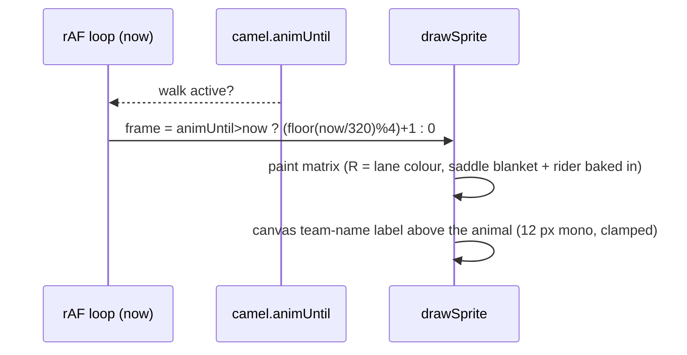

# Camel drafts v5 - reference-traced decorated dromedary with rider

Pixel art for the **desert** theme racer. Faces **right**, one camel per lane. Traced from
the user reference `camel-pixelart-new.png` (repo root, gitignored): 760x696 px, camel bbox
**645x534 px** (x65..709, y118..651) - a **long-legged dromedary with one hump**, a high
head on a thick neck, a long dark tail and a **decorated saddle blanket** (green cloth,
cream + red stripes, white fringe). No image files at runtime: the matrices below drive
`drawSprite`. Conventions follow [`docs/art/camel-sprite.md`](camel-sprite.md) (legend
discipline, `O`-enclosure pass, single 4-connected blob, feet on the bottom row, 1 standing
+ 4 walk frames) and [`docs/art/boar-sprite.md`](boar-sprite.md).

**User request driving this revision** - trace the new reference: one hump, longer legs,
high head on a thick neck, long dark tail, and the decorated saddle blanket back on the
camel (the boar stays blanket-free). Reuse the existing v7 turban rider glyph
byte-identical, seated where the **cream top cover** of the saddle pack was (user-picked
option 1): the cover cells around/behind the rider are removed, so the rider
silhouettes against the background while the striped bands / green cloth / fringe stay
visible around and below it (review round 1). No scaling of camel or rider.

**Status - shipped as v8 (`84 x 70`).** Implemented in `index.html`: `const CAMEL` = the
5 frames below (byte-identical), registry `{ id: 'camel', sprite: CAMEL, pal: CAMEL_PAL,
w: 84, h: 70, rider: 'turban' }`, `CAMEL_PAL` with `pad`/`padDark`/`stripeCream`/
`stripeRed`/`fringe`/`shadeDeepest` (plus six single-letter aliases, see the legend note).
Supersedes [`camel-drafts-v4.md`](camel-drafts-v4.md) (v7 `76x70`, no saddle blanket).

**Review round 1** (visual review): the cream cover cells around/behind the rider were
removed (only the green collar, the left shoulder pad corner and the saddle below stay);
`F` is constrained to the hanging fringe teeth + the eye glint (the leg light trim became
`C`); the pass-frame bob moves the rider +1 row with the body (paste before the bob); and
every enclosed transparent pocket in the saddle/rider area is sealed with `O` ink.

## Goals

| # | Goal | Met by |
|---|---|---|
| 1 | match the reference silhouette: one hump, longer legs, high head on a thick neck, long dark tail | the 82x68 trace below (painted bbox 80x68) |
| 2 | decorated saddle blanket back on the camel (green cloth, cream + red stripes, white fringe) | `P`/`Q` skirt + `X`/`C` stripes + `F` fringe, rows 19-40 |
| 3 | v7 rider glyph (W/K/R) byte-identical, seated as the saddle seat (replaces the cream top cover - removed around it) | rider glyph (W/K/R) byte-identical; the window's cover/outline cells were removed by design - rider pasted at art (27, 2) |
| 4 | stay inside the lane budget (84x70, feet on the bottom row, faces right) | painted 80x68, hooves on the bottom matrix row 69 |
| 5 | animation-ready: standing + 4 walk frames, 1 px bob baked in | `const CAMEL` below |
| 6 | lane identity unchanged: team-name label + per-lane robe `R` | lane colour swap, 58 `R` px per frame |

## Where it renders

Race canvas **1280x720**; 8 lanes -> lane height **74 px** (`laneFit.laneMinPx`), terrain
bob +-2 px, feet 2 px above the lane bottom -> usable sprite box **<= 84 x <= 70**
(shipped camel matrix `84 x 70`; `laneFit.spriteHMax: 70`). The sprite is drawn at 1x by
`drawSprite` (no scaling, no image load). Sprites are centred on the lane's `left` +
`laneW/2 - w/2`; the painted content is horizontally centred (matrix cols 2..81, centre
**41.5 of 84**), so the animal sits dead centre in its lane.




## Reference mapping - what was traced, what was adapted

Measured on the reference at the recovered **82x68 grid** (1 cell = 7.866 reference px).
"Traced" = the span was read off the reference and kept; "adapted" = changed for the game
(blockiness, legend colours, lane budget, the rider seat, the walk cycle). Art coords below
are the 82x68 art space; the shipped matrix = art offset by **(col +1, row +2)** inside
84x70.

| Feature | Reference (82x68 grid) | v8 (art coords) | |
|---|---|---|---|
| overall | bbox 645x534 px = 82x68 cells | painted 80x68, matrix cols 2..81 / rows 2..69 | traced (AA trimmed) |
| head + muzzle | rows 1-18, cols 56-80; muzzle tip col 80 | rows 1-18, cols 56-80 (matrix 57-81) | traced |
| ear | rows 1-4, cols 59-64, two dark blocks | rows 0-4 (top row added for the 68-row bbox), cols 59-64 | traced + trimmed |
| eye | rows 9-10, cols 66-69: dark socket with a light glint | `O` socket rows 9-10, `F` glint at (67,10) | traced, glint emphasised |
| muzzle markings | mauve bridge stripe cols 74-77, dark mouth rows 15-17 | `D`/`Z` muzzle marking (+ `C`/`S` highlights), `O` mouth line + nostril | traced |
| neck | rows 5-27, cols 55-70, thick | rows 5-27; the reference's slate neck-strap cells sit on the silhouette edge and ship as `O` (no `G` on the neck) | traced |
| hump + cream cover | cover rows 3-18, cols 22-49; `F` trim row 3; vertical stripes | cover cells removed around/behind the rider (review round 1); green collar `P`/`Q` + left shoulder pad corner kept; rider silhouettes against the background | adapted (user option 1) |
| saddle striped bands | rows 19-35, cols 16-54: `X`/`C` herringbone row 20, `Z`/`Q`/`P` bands below | rows 19-35 (`X C Z Q P`), same spans | traced |
| saddle fringe | rows 36-37, cols 22-41: seven light teeth | `F` teeth at cols 23/26/29/32/35/38/41 over `O` | cleaned (even spacing) |
| green cloth | `P`/`Q` right shoulder cols 44-54 rows 15-31 + left corner cols 16-17 | `P`/`Q`, same spans | traced |
| body | rows 25-45 barrel; rump rear col 10, chest front col 54 | `B` body, `S`/`D` shading | traced |
| legs | rows 40-66; rear pair cols 9-26, front pair cols 34-54; near legs `B` + light trim, far legs `D`/`Z` | rows 40-67 (one row extension), same pair split; leg trim painted `C` (review round 1) | traced + 1 row |
| hooves | rows 64-66, stepped right | art rows 65-67: `O` outline + `Z` soles | adapted colour (legend fixes hooves to `O`) |
| tail | rows 28-46, cols 1-9, dark, tufted | rows 28-46; `O` silhouette / `Z` interior; flicks +-1 | traced |
| rider seat | (no rider in the reference) | rider glyph (W/K/R) byte-identical, pasted at art (27, 2); the window's cover/outline cells were removed by design; boots on the saddle top trim (art row 19); moves +1 with the bob | adapted (user option 1) |
| walk cycle | not in the reference (single standing pose) | 4 hand-authored frames: rigid leg shifts, 1 px bob, tail flick | invented |

## Legend & palette

Chars (**14**, no `L`): `.` transparent, `O` outline + hooves + eye + nostril, `B` body
light, `S` body mid (mauve shadow), `D` body deep, `Z` body deepest (hoof soles / deep
shadow), `G` slate leg/hoof band, `W` turban, `K` skin, `R` robe = lane colour, `P` saddle
pad green, `Q` saddle pad dark green, `C` stripe cream, `X` stripe red, `F` fringe
(hanging fringe teeth + eye glint only).

| char | palette key | hex | notes |
|---|---|---|---|
| `.` | - | - | transparent |
| `O` | `outline` | `#1c1208` | outline + hooves + eye + nostril |
| `B` | `body` | `#d8a662` | body light (lit surfaces); reference-exact |
| `S` | `shade` | `#b0786b` | body mid / mauve shadow; reference-exact |
| `D` | `shadeDeep` | `#6f473e` | body deep; reference-exact |
| `Z` | `shadeDeepest` | `#55312e` | body deepest (hoof soles, deep shadow); reference-exact |
| `G` | `harness` | `#53565e` | slate leg/hoof band only: frame 0 has 3 cells at matrix (17, 66), (43, 66), (44, 66); the band shifts with the walk leg pairs (frame 4: 1 cell at (17, 66)); no `G` on the neck |
| `W` | `eyeWhite` | `#f0ece0` | turban (shared v7 token) |
| `K` | `skin` | `#d8a878` | rider skin (face/hands); v7 token |
| `R` | `robe` | lane colour | rider robe; only per-lane token |
| `P` | `pad` | `#4a7f65` | saddle pad green; reference-exact |
| `Q` | `padDark` | `#37634e` | saddle pad dark green; reference-exact |
| `C` | `stripeCream` | `#efd39e` | blanket stripe cream; reference-exact (cover + bands) |
| `X` | `stripeRed` | `#e18683` | blanket stripe red; reference-exact |
| `F` | `fringe` | `#e7e8ea` | hanging fringe teeth (rows 36-37) + eye glint only; the leg light trim uses `C` |

`CAMEL_PAL` also carries six **single-letter aliases** (`Z Q P C X F`). `drawSprite`
resolves `palette[ch]` first; the global `CHAR_KEY` tokens for `C`/`P`/`X`/`F`
(`cap`/`pole`/`checkerDark`/`flag`) belong to the boar and the finish flag, and `Z`/`Q`
have no `CHAR_KEY` token, so the aliases keep the camel self-contained. All semantic keys
the user fixed exist; `L` and `blanket` do not.

Lane robe colours (unchanged, shared with the boar):

| Lane | 0 | 1 | 2 | 3 | 4 | 5 | 6 | 7 |
|---|---|---|---|---|---|---|---|---|
| | `#e84a3a` | `#3a6ae8` | `#3aa84a` | `#e8c83a` | `#9a4ae8` | `#e88a3a` | `#3ad8d8` | `#e85a9a` |

WCAG contrast (computed): `O` vs `B` **8.38**:1, `O` vs `S` **5.04**:1, `O` vs `D`
**2.32**:1, `O` vs `Z` **1.64**:1, `O` vs dune sand `#c9a25a` **7.72**:1. The reference's
deep tones are dark, so the outline-on-deep contrast is below 3:1; the silhouette is read
from the outline against the sand (7.72:1), and the deep tones only ever shade the interior
(`B` vs `D` 3.61:1). Stripe/fringe tokens sit on the dark bands: `C` vs `D` 5.47:1,
`X` vs `D` 3.00:1, `F` vs `D` 6.47:1.

## Geometry budget

| matrix | painted bbox | painted px (frame 0; camel + rider) | feet row | lane slack |
|---|---|---|---|---|
| 84 x 70 | 80 x 68 @ matrix (2, 2) | 2592 = 2424 + 168 | matrix row 69 (bottom) | 0 px (height budget exact) |

Per-frame painted px: 2592 / 2585 / 2622 / 2592 / 2593 (frames 0-4). Bob frames 2/4 keep
the hooves on row 69, so the bbox bottom never moves.

## Frames (v8 - authoritative)

5 frames, each **70 rows x 84 chars**. Frame 0 = standing; 1-4 = walk
(`contact A -> pass A -> contact B -> pass B`), i.e.
`[stand, contactA, passA, contactB, passB]`. Bob (upper body +1 px up) is baked into
frames 2/4. The block below is byte-identical to `const CAMEL` in `index.html`.

```js
  const CAMEL = [
    [ // frame 0 - standing (idle)
      '....................................................................................',
      '....................................................................................',
      '.............................................................OOO....................',
      '.............................................................OOO....................',
      '.............................OOOOOOOO....................OOOODDDO...................',
      '............................OOOOWWWOOO....................OOOZDDO...................',
      '............................OOWWWWWWOO...................OBBBBDDDOO.................',
      '............................OOWWWWWWOO....................OBBBBBDOOOOOO.............',
      '.............................OKKKKKKOO....................OSSBBBSDZDZZO.............',
      '.............................OKKKKKKOO.....................OOBBBBBBBBBBOOOOO........',
      '..............................OKKKKKOOO............O.......OOSBBBBBSDDSBBBZZOOO.....',
      '..............................OKKKKKOOOOO..........O.......OOSBBBBBDOOOSSZBCBBCO....',
      '............................ORRRRRRROOOOO....OOO.OOO.......OOSBBBBBDFOOSSZBBBBCO....',
      '............................ORRRRRRRRRRKO....OQQOOOO.......OOBBBBBBBBBBBBSBBBDDBOO..',
      '............................ORRRRRRRRROOO...OQQQQOOO.......OOBBBBBBBBBBBBZBBBBBBOO..',
      '............................ORRRRRRRO......OOQQQQOOO.......OOBBBBBBBBBBBCZBBBBBBOO..',
      '..................OOO.......ORRRRRRRO......OOQQQOPPPO......OOBBBSBBBBBBBBSBBBSSSOO..',
      '.................OQQO.......ORRRRRRRO......OOOQQPPPPO......OOBBBBSSSBBOOOOBBBBCO....',
      '.................OQQO.......ORRRRRRRO......OOOQQPPPPPOO....OOBBBBSSSBBOOOOBBBBCO....',
      '.................OQQO.......ORRRROOOO.....OOOOOOQPPPPPO....OOSSSSSSZOO....OOOOO.....',
      '.................OQQOOOOOOOOOOOOOOOOOOO...OOOOOOOPPPPPO....OOBBBBCCO................',
      '.................OQQOOOOOOOOOOOOOOOOOOOOOOOOOOOOQPPPPPO....OOBBBBBBO................',
      '.................OOOSOZXCCXCXXCXXCSXCXXCXSOSSSSSSQQQQQO....OOBBBBBBO................',
      '.................OSSSOOZZZZZZZZZZZZZZDZZZZOSSSSSSSSOQQO....OOBBBBOO.................',
      '.................OSSSOOZZZZZZZZZZZZZZZZZZZOSSSSSSSSOQQO....OOBBBBOO.................',
      '.................OSSSOOQPPPPPPPPPPPPPPPPPPOBBBSSSSSSOOO....OOBBBBOO.................',
      '...............OOSSSSOOZZZZZZZZZZZZZZZZZZZOBBBSSSBBSSSO...OSSBBBBOO.................',
      '...............OOSSSSOOZZZZZZZZZZZZZZZZZZZOBBBSSSBBSSSO...OSSBBBBOO.................',
      '..............OSSSSSSOOQPPQPQQPPQPQQPQQPQQOBBBBBSBBBBBBOOOSBBBBBBOO.................',
      '..............OSSBBBSOZSZDSZDSZDSZSSZSSZSSOBBBBBSBBBBBBBBBBBBBBBBOO.................',
      '..............OSSBBBSOZSZDSZDSZDSZSSZSSZSSOBBBBBSBBBBBBBBBBBBBBBBOO.................',
      '............OOSBBBBBSOOZZZZZZZZZZZZZZZZZZZOBBBBBSBBBBBBBBBBBBBBBSOO.................',
      '...........OOOSBBBBBSOOQQQPPPPPPPPPPPPPQQQOBBBBBSBBBBBBBBBBBBBBBO...................',
      '...........OOOSBBBBBSOOQQQPPPPPPPPPPPPPQQQOBBBBBSBBBBBBBBBBBBBBBO...................',
      '.........OOOOOBBBBBBSOOZZZZZZZZZZZZZZZZZZZOBBBBBSSSBBBBBBBBBBBSSO...................',
      '........OOO.OOBBBBBBSOOQQQPPPPPPPPPPPPPQQQOBBBBBSSSBBBBBBBBBBBOO....................',
      '........OOO.OOBBBBBBSOOPQQPPPPPPPPOPPPPQPQOBBBBBSSSBBBBBBBBBBBOO....................',
      '......OOO...OOBBBBBBBOQOOOOOOOOOOOOOOOOOOOOBBBBBSSSBBBBBBBBBBSOO....................',
      '......OOO...OOBBBBBBBOQOFOOFOOFOOFOOFOOFOOFBBBBBDSSSBBBBBBBSSO......................',
      '......OOO...OOBBBBBBBODOFOOFOOFOOFOOFOOFOOFBBBBBDSSSBBBBBBBSSO......................',
      '.....OOOO...OOBBBBBBBBBSSSDDZOOZDDDDDSSSSSBBBBBBDDDSBBBBBBSOO.......................',
      '.....OZOO...OOBBBBBBBBBBDDDDDDOOOODDDBBBBBBBBBBBDDDDDDDDZOOO........................',
      '..OOOOZZO...OOBBBBBBBBBBDDDDDDOO..OZZBBBBBBBBBSSDDDDDDZZO...........................',
      '..OOOOOOO...OOBBBBBBBBBBDDDDDDO...OOOBBBBBBBBBDDDDDDDDOOO...........................',
      '...OOOOO....OOBBBBBBBBBDDDDDZO......OBBBBBBBBBDDDDDDDDO.............................',
      '..OOOOOO....OOBBBBBBBBBDDDDDOO......OBBBBBBBBBDDDDDDOOO.............................',
      '..OOOOOO....OOBBBBBBBBBDDDDDOO......OBBBBBBBBBDDDDDDOO..............................',
      '...OOO......OOBBBSSSBDDDDDDO........OBBBBBSSSODDDDDDOO..............................',
      '............OOBSSBBBBDDDDDDO........OBBBSSBBCODDDDZO................................',
      '............OOBSSBBBBDDDDDDO........OBBBSSBBCODDDDDO................................',
      '............OOBSSBBCDDDDDDO.........OBBBSSBBCODDDDDO................................',
      '............OOBBBSOODDDDDDO.........OBBBSSBOOODDDDDO................................',
      '............OOBBBSOODDDDDDO.........OCBBSSBOOODDDDDO................................',
      '...........OBBBBBBOODDDDDDO..........OOBBBSOOODDDDDO................................',
      '...........OBBBBBOOODDDDOOO..........OOBBBOCCODDDOO.................................',
      '...........OBBBBBOOODDDDOO...........OOBBBOOCODDDOO.................................',
      '...........OBBBOOOOODDDDOO...........OOBBBOOCODDDOO.................................',
      '...........OBBBOOOOODDZO.............OOBBBOOCODDDOO.................................',
      '...........OBBBOOOOODDZO.............OOBBBOOCODDDOO.................................',
      '...........OBBBOOOOODDDO.............OOBBBOOCODDDOO.................................',
      '...........OBBBOOOOODDDO.............OOBBBOOCODDDOO.................................',
      '...........OBBBOOOOODDDO.............OOBBBOOCODDDOO.................................',
      '...........OBBBOOOOODDDO.............OOBBBOOCODDDOO.................................',
      '...........OBBBOOOOODDDO.............OOBBBOOCODDDOO.................................',
      '...........OBBBOOOOODDZO.............OOBBBOCCODDDOO.................................',
      '...........OBBBBBOOOODDDOO...........OOBBBBOOOOODDDOOO..............................',
      '...........OBBBBBGDDZOODQZO..........OOBBBBGGDZZODDDQQO.............................',
      '...........OOOOOOOOOOOOOOOOO.........OOOOOOOOOOOOOOOOOO.............................',
      '...........OZZZZZOOZZZZZZZZO.........OOZZZZOOOOZZZZZOOO.............................',
      '...........OOOOOOOOOOOOOOOOO.........OOOOOOOOOOOOOOOOOO.............................',
    ],
    [ // frame 1 - contact A (near-rear pair forward, near-front pair back)
      '....................................................................................',
      '....................................................................................',
      '.............................................................OOO....................',
      '.............................................................OOO....................',
      '.............................OOOOOOOO....................OOOODDDO...................',
      '............................OOOOWWWOOO....................OOOZDDO...................',
      '............................OOWWWWWWOO...................OBBBBDDDOO.................',
      '............................OOWWWWWWOO....................OBBBBBDOOOOOO.............',
      '.............................OKKKKKKOO....................OSSBBBSDZDZZO.............',
      '.............................OKKKKKKOO.....................OOBBBBBBBBBBOOOOO........',
      '..............................OKKKKKOOO............O.......OOSBBBBBSDDSBBBZZOOO.....',
      '..............................OKKKKKOOOOO..........O.......OOSBBBBBDOOOSSZBCBBCO....',
      '............................ORRRRRRROOOOO....OOO.OOO.......OOSBBBBBDFOOSSZBBBBCO....',
      '............................ORRRRRRRRRRKO....OQQOOOO.......OOBBBBBBBBBBBBSBBBDDBOO..',
      '............................ORRRRRRRRROOO...OQQQQOOO.......OOBBBBBBBBBBBBZBBBBBBOO..',
      '............................ORRRRRRRO......OOQQQQOOO.......OOBBBBBBBBBBBCZBBBBBBOO..',
      '..................OOO.......ORRRRRRRO......OOQQQOPPPO......OOBBBSBBBBBBBBSBBBSSSOO..',
      '.................OQQO.......ORRRRRRRO......OOOQQPPPPO......OOBBBBSSSBBOOOOBBBBCO....',
      '.................OQQO.......ORRRRRRRO......OOOQQPPPPPOO....OOBBBBSSSBBOOOOBBBBCO....',
      '.................OQQO.......ORRRROOOO.....OOOOOOQPPPPPO....OOSSSSSSZOO....OOOOO.....',
      '.................OQQOOOOOOOOOOOOOOOOOOO...OOOOOOOPPPPPO....OOBBBBCCO................',
      '.................OQQOOOOOOOOOOOOOOOOOOOOOOOOOOOOQPPPPPO....OOBBBBBBO................',
      '.................OOOSOZXCCXCXXCXXCSXCXXCXSOSSSSSSQQQQQO....OOBBBBBBO................',
      '.................OSSSOOZZZZZZZZZZZZZZDZZZZOSSSSSSSSOQQO....OOBBBBOO.................',
      '.................OSSSOOZZZZZZZZZZZZZZZZZZZOSSSSSSSSOQQO....OOBBBBOO.................',
      '.................OSSSOOQPPPPPPPPPPPPPPPPPPOBBBSSSSSSOOO....OOBBBBOO.................',
      '...............OOSSSSOOZZZZZZZZZZZZZZZZZZZOBBBSSSBBSSSO...OSSBBBBOO.................',
      '...............OOSSSSOOZZZZZZZZZZZZZZZZZZZOBBBSSSBBSSSO...OSSBBBBOO.................',
      '..............OSSSSSSOOQPPQPQQPPQPQQPQQPQQOBBBBBSBBBBBBOOOSBBBBBBOO.................',
      '..............OSSBBBSOZSZDSZDSZDSZSSZSSZSSOBBBBBSBBBBBBBBBBBBBBBBOO.................',
      '..............OSSBBBSOZSZDSZDSZDSZSSZSSZSSOBBBBBSBBBBBBBBBBBBBBBBOO.................',
      '............OOSBBBBBSOOZZZZZZZZZZZZZZZZZZZOBBBBBSBBBBBBBBBBBBBBBSOO.................',
      '...........OOOSBBBBBSOOQQQPPPPPPPPPPPPPQQQOBBBBBSBBBBBBBBBBBBBBBO...................',
      '...........OOOSBBBBBSOOQQQPPPPPPPPPPPPPQQQOBBBBBSBBBBBBBBBBBBBBBO...................',
      '.........OOOOOBBBBBBSOOZZZZZZZZZZZZZZZZZZZOBBBBBSSSBBBBBBBBBBBSSO...................',
      '........OOO.OOBBBBBBSOOQQQPPPPPPPPPPPPPQQQOBBBBBSSSBBBBBBBBBBBOO....................',
      '........OOO.OOBBBBBBSOOPQQPPPPPPPPOPPPPQPQOBBBBBSSSBBBBBBBBBBBOO....................',
      '......OOO...OOBBBBBBBOQOOOOOOOOOOOOOOOOOOOOBBBBBSSSBBBBBBBBBBSOO....................',
      '......OOO...OOBBBBBBBOQOFOOFOOFOOFOOFOOFOOFBBBBBDSSSBBBBBBBSSO......................',
      '......OOO...OOBBBBBBBODOFOOFOOFOOFOOFOOFOOFBBBBBDSSSBBBBBBBSSO......................',
      '.....OOOO...OOBBBBBBBBBSSSDDZOOZDDDDDSSSSSBBBBBBDDDSBBBBBBSOO.......................',
      '.....OZOO...OOBBBBBBBBBBDDDDDDOOOODDDBBBBBBBBBBBDDDDDDDDZOOO........................',
      '..OOOOZZO...OOBBBBBBBBBBDDDDDDOO..OZZBBBBBBBBBSSDDDDDDZOO...........................',
      '..OOOOOOO.....OOBBBBBBBBBBDDDDO...OBBBBBBBBBDDDDDDDDOOO.............................',
      '...OOOOO......OOBBBBBBBBBDDDDDO...OBBBBBBBBBDDDDDDDDO...............................',
      '..OOOOOO......OOBBBBBBBBBDDDDDO...OBBBBBBBBBDDDDDDOOO...............................',
      '..OOOOOO......OOBBBBBBBBBDDDDDO...OBBBBBBBBBDDDDDDOO................................',
      '...OOO........OOBBBSSSBDDDDDDO....OBBBBBSSSODDDDDDOO................................',
      '..............OOBSSBBBBDDDDDDO....OBBBSSBBCODDDDZO..................................',
      '..............OOBSSBBBBDDDDDDO....OBBBSSBBCODDDDDO..................................',
      '..............OOBSSBBCDDDDDDO.....OBBBSSBBCODDDDDO..................................',
      '..............OOBBBSOODDDDDDO.....OBBBSSBOOODDDDDO..................................',
      '..............OOBBBSOODDDDDDO.....OCBBSSBOOODDDDDO..................................',
      '.............OBBBBBBOODDDDDDO......OOBBBSOOODDDDDO..................................',
      '.............OBBBBBOOODDDDOOO......OOBBBOCCODDDOO...................................',
      '.............OBBBBBOOODDDDOO.......OOBBBOOCODDDOO...................................',
      '.............OBBBOOOOODDDDOO.......OOBBBOOCODDDOO...................................',
      '.............OBBBOOOOODDZO.........OOBBBOOCODDDOO...................................',
      '.............OBBBOOOOODDZO.........OOBBBOOCODDDOO...................................',
      '.............OBBBOOOOODDDO.........OOBBBOOCODDDOO...................................',
      '.............OBBBOOOOODDDO.........OOBBBOOCODDDOO...................................',
      '.............OBBBOOOOODDDO.........OOBBBOOCODDDOO...................................',
      '.............OBBBOOOOODDDO.........OOBBBOOCODDDOO...................................',
      '.............OBBBOOOOODDDO.........OOBBBOOCODDDOO...................................',
      '.............OBBBOOOOODDZO.........OOBBBOCCODDDOO...................................',
      '.............OBBBBBOOOODDDOO.......OOBBBBOOOOODDDOOO................................',
      '.............OBBBBBGDDZOODQZO......OOBBBBGGDZZODDDQQO...............................',
      '.............OOOOOOOOOOOOOOOOO.....OOOOOOOOOOOOOOOOOO...............................',
      '.............OZZZZZOOZZZZZZZZO.....OOZZZZOOOOZZZZZOOO...............................',
      '.............OOOOOOOOOOOOOOOOO.....OOOOOOOOOOOOOOOOOO...............................',
    ],
    [ // frame 2 - pass A (1 px bob, legs under body, tail +1)
      '....................................................................................',
      '....................................................................................',
      '.............................................................OOO....................',
      '.............................OOOOOOOO....................OOOODDDO...................',
      '............................OOOOWWWOOO....................OOOZDDO...................',
      '............................OOWWWWWWOO...................OBBBBDDDOO.................',
      '............................OOWWWWWWOO....................OBBBBBDOOOOOO.............',
      '.............................OKKKKKKOO....................OSSBBBSDZDZZO.............',
      '.............................OKKKKKKOO.....................OOBBBBBBBBBBOOOOO........',
      '..............................OKKKKKOOO............O.......OOSBBBBBSDDSBBBZZOOO.....',
      '..............................OKKKKKOOOOO..........O.......OOSBBBBBDOOOSSZBCBBCO....',
      '............................ORRRRRRROOOOO....OOO.OOO.......OOSBBBBBDFOOSSZBBBBCO....',
      '............................ORRRRRRRRRRKO....OQQOOOO.......OOBBBBBBBBBBBBSBBBDDBOO..',
      '............................ORRRRRRRRROOO...OQQQQOOO.......OOBBBBBBBBBBBBZBBBBBBOO..',
      '............................ORRRRRRRO......OOQQQQOOO.......OOBBBBBBBBBBBCZBBBBBBOO..',
      '..................OOO.......ORRRRRRRO......OOQQQOPPPO......OOBBBSBBBBBBBBSBBBSSSOO..',
      '.................OQQO.......ORRRRRRRO......OOOQQPPPPO......OOBBBBSSSBBOOOOBBBBCO....',
      '.................OQQO.......ORRRRRRRO......OOOQQPPPPPOO....OOBBBBSSSBBOOOOBBBBCO....',
      '.................OQQO.......ORRRROOOO.....OOOOOOQPPPPPO....OOSSSSSSZOO....OOOOO.....',
      '.................OQQOOOOOOOOOOOOOOOOOOO...OOOOOOOPPPPPO....OOBBBBCCO................',
      '.................OQQOOOOOOOOOOOOOOOOOOOOOOOOOOOOQPPPPPO....OOBBBBBBO................',
      '.................OOOSOZXCCXCXXCXXCSXCXXCXSOSSSSSSQQQQQO....OOBBBBBBO................',
      '.................OSSSOOZZZZZZZZZZZZZZDZZZZOSSSSSSSSOQQO....OOBBBBOO.................',
      '.................OSSSOOZZZZZZZZZZZZZZZZZZZOSSSSSSSSOQQO....OOBBBBOO.................',
      '.................OSSSOOQPPPPPPPPPPPPPPPPPPOBBBSSSSSSOOO....OOBBBBOO.................',
      '...............OOSSSSOOZZZZZZZZZZZZZZZZZZZOBBBSSSBBSSSO...OSSBBBBOO.................',
      '...............OOSSSSOOZZZZZZZZZZZZZZZZZZZOBBBSSSBBSSSO...OSSBBBBOO.................',
      '..............OSSSSSSOOQPPQPQQPPQPQQPQQPQQOBBBBBSBBBBBBOOOSBBBBBBOO.................',
      '..............OSSBBBSOZSZDSZDSZDSZSSZSSZSSOBBBBBSBBBBBBBBBBBBBBBBOO.................',
      '..............OSSBBBSOZSZDSZDSZDSZSSZSSZSSOBBBBBSBBBBBBBBBBBBBBBBOO.................',
      '............OOSBBBBBSOOZZZZZZZZZZZZZZZZZZZOBBBBBSBBBBBBBBBBBBBBBSOO.................',
      '...........OOOSBBBBBSOOQQQPPPPPPPPPPPPPQQQOBBBBBSBBBBBBBBBBBBBBBO...................',
      '...........OOOSBBBBBSOOQQQPPPPPPPPPPPPPQQQOBBBBBSBBBBBBBBBBBBBBBO...................',
      '.........OOOOOBBBBBBSOOZZZZZZZZZZZZZZZZZZZOBBBBBSSSBBBBBBBBBBBSSO...................',
      '........OOOOOOBBBBBBSOOQQQPPPPPPPPPPPPPQQQOBBBBBSSSBBBBBBBBBBBOO....................',
      '.........OOOOOBBBBBBSOOPQQPPPPPPPPOPPPPQPQOBBBBBSSSBBBBBBBBBBBOO....................',
      '.......OOO..OOBBBBBBBOQOOOOOOOOOOOOOOOOOOOOBBBBBSSSBBBBBBBBBBSOO....................',
      '.......OOO..OOBBBBBBBOQOFOOFOOFOOFOOFOOFOOFBBBBBDSSSBBBBBBBSSO......................',
      '.......OOO..OOBBBBBBBODOFOOFOOFOOFOOFOOFOOFBBBBBDSSSBBBBBBBSSO......................',
      '......OOOO..OOBBBBBBBBBSSSDDZOOZDDDDDSSSSSBBBBBBDDDSBBBBBBSOO.......................',
      '......OZOO..OOBBBBBBBBBBDDDDDDOOOODDDBBBBBBBBBBBDDDDDDDDZOOO........................',
      '...OOOOZZO..OOBBBBBBBBBBDDDDDDOO..OZZBBBBBBBBBSSDDDDDDZZO...........................',
      '...OOOOOOO..OOBBBBBBBBBBDDDDDDO...OOOBBBBBBBBBDDDDDDDDOOO...........................',
      '....OOOOO...OOBBBBBBBBBDDDDDZO......OBBBBBBBBBDDDDDDDDO.............................',
      '...OOOOOO...OOBBBBBBBBBDDDDDOO......OBBBBBBBBBDDDDDDOOO.............................',
      '...OOOOOO...OOBBBBBBBBBDDDDDOO......OBBBBBBBBBDDDDDDOO..............................',
      '....OOO.....OOBBBSSSBDDDDDDO........OBBBBBSSSODDDDDDOO..............................',
      '............OOBSSBBBBDDDDDDO........OBBBSSBBCODDDDZO................................',
      '............OOBSSBBBBDDDDDDO........OBBBSSBBCODDDDDO................................',
      '............OOBSSBBCDDDDDDO.........OBBBSSBBCODDDDDO................................',
      '............OOBBBSOODDDDDDO.........OBBBSSBOOODDDDDO................................',
      '............OOBBBSOODDDDDDO.........OCBBSSBOOODDDDDO................................',
      '...........OBBBBBBOODDDDDDO..........OOBBBSOOODDDDDO................................',
      '...........OBBBBBOOODDDDOOO..........OOBBBOCCODDDOO.................................',
      '...........OBBBBBOOODDDDOO...........OOBBBOOCODDDOO.................................',
      '...........OBBBOOOOODDDDOO...........OOBBBOOCODDDOO.................................',
      '...........OBBBOOOOODDZO.............OOBBBOOCODDDOO.................................',
      '...........OBBBOOOOODDZO.............OOBBBOOCODDDOO.................................',
      '...........OBBBOOOOODDDO.............OOBBBOOCODDDOO.................................',
      '...........OBBBOOOOODDDO.............OOBBBOOCODDDOO.................................',
      '...........OBBBOOOOODDDO.............OOBBBOOCODDDOO.................................',
      '...........OBBBOOOOODDDO.............OOBBBOOCODDDOO.................................',
      '...........OBBBOOOOODDDO.............OOBBBOOCODDDOO.................................',
      '...........OBBBOOOOODDZO.............OOBBBOCCODDDOO.................................',
      '...........OBBBBBOOOODDDOO...........OOBBBBOOOOODDDOOO..............................',
      '...........OBBBBBOOOODDDOO...........OOBBBBOOOOODDDOOO..............................',
      '...........OBBBBBGDDZOODQZO..........OOBBBBGGDZZODDDQQO.............................',
      '...........OOOOOOOOOOOOOOOOO.........OOOOOOOOOOOOOOOOOO.............................',
      '...........OZZZZZOOZZZZZZZZO.........OOZZZZOOOOZZZZZOOO.............................',
      '...........OOOOOOOOOOOOOOOOO.........OOOOOOOOOOOOOOOOOO.............................',
    ],
    [ // frame 3 - contact B (mirror of contact A)
      '....................................................................................',
      '....................................................................................',
      '.............................................................OOO....................',
      '.............................................................OOO....................',
      '.............................OOOOOOOO....................OOOODDDO...................',
      '............................OOOOWWWOOO....................OOOZDDO...................',
      '............................OOWWWWWWOO...................OBBBBDDDOO.................',
      '............................OOWWWWWWOO....................OBBBBBDOOOOOO.............',
      '.............................OKKKKKKOO....................OSSBBBSDZDZZO.............',
      '.............................OKKKKKKOO.....................OOBBBBBBBBBBOOOOO........',
      '..............................OKKKKKOOO............O.......OOSBBBBBSDDSBBBZZOOO.....',
      '..............................OKKKKKOOOOO..........O.......OOSBBBBBDOOOSSZBCBBCO....',
      '............................ORRRRRRROOOOO....OOO.OOO.......OOSBBBBBDFOOSSZBBBBCO....',
      '............................ORRRRRRRRRRKO....OQQOOOO.......OOBBBBBBBBBBBBSBBBDDBOO..',
      '............................ORRRRRRRRROOO...OQQQQOOO.......OOBBBBBBBBBBBBZBBBBBBOO..',
      '............................ORRRRRRRO......OOQQQQOOO.......OOBBBBBBBBBBBCZBBBBBBOO..',
      '..................OOO.......ORRRRRRRO......OOQQQOPPPO......OOBBBSBBBBBBBBSBBBSSSOO..',
      '.................OQQO.......ORRRRRRRO......OOOQQPPPPO......OOBBBBSSSBBOOOOBBBBCO....',
      '.................OQQO.......ORRRRRRRO......OOOQQPPPPPOO....OOBBBBSSSBBOOOOBBBBCO....',
      '.................OQQO.......ORRRROOOO.....OOOOOOQPPPPPO....OOSSSSSSZOO....OOOOO.....',
      '.................OQQOOOOOOOOOOOOOOOOOOO...OOOOOOOPPPPPO....OOBBBBCCO................',
      '.................OQQOOOOOOOOOOOOOOOOOOOOOOOOOOOOQPPPPPO....OOBBBBBBO................',
      '.................OOOSOZXCCXCXXCXXCSXCXXCXSOSSSSSSQQQQQO....OOBBBBBBO................',
      '.................OSSSOOZZZZZZZZZZZZZZDZZZZOSSSSSSSSOQQO....OOBBBBOO.................',
      '.................OSSSOOZZZZZZZZZZZZZZZZZZZOSSSSSSSSOQQO....OOBBBBOO.................',
      '.................OSSSOOQPPPPPPPPPPPPPPPPPPOBBBSSSSSSOOO....OOBBBBOO.................',
      '...............OOSSSSOOZZZZZZZZZZZZZZZZZZZOBBBSSSBBSSSO...OSSBBBBOO.................',
      '...............OOSSSSOOZZZZZZZZZZZZZZZZZZZOBBBSSSBBSSSO...OSSBBBBOO.................',
      '..............OSSSSSSOOQPPQPQQPPQPQQPQQPQQOBBBBBSBBBBBBOOOSBBBBBBOO.................',
      '..............OSSBBBSOZSZDSZDSZDSZSSZSSZSSOBBBBBSBBBBBBBBBBBBBBBBOO.................',
      '..............OSSBBBSOZSZDSZDSZDSZSSZSSZSSOBBBBBSBBBBBBBBBBBBBBBBOO.................',
      '............OOSBBBBBSOOZZZZZZZZZZZZZZZZZZZOBBBBBSBBBBBBBBBBBBBBBSOO.................',
      '...........OOOSBBBBBSOOQQQPPPPPPPPPPPPPQQQOBBBBBSBBBBBBBBBBBBBBBO...................',
      '...........OOOSBBBBBSOOQQQPPPPPPPPPPPPPQQQOBBBBBSBBBBBBBBBBBBBBBO...................',
      '.........OOOOOBBBBBBSOOZZZZZZZZZZZZZZZZZZZOBBBBBSSSBBBBBBBBBBBSSO...................',
      '........OOO.OOBBBBBBSOOQQQPPPPPPPPPPPPPQQQOBBBBBSSSBBBBBBBBBBBOO....................',
      '........OOO.OOBBBBBBSOOPQQPPPPPPPPOPPPPQPQOBBBBBSSSBBBBBBBBBBBOO....................',
      '......OOO...OOBBBBBBBOQOOOOOOOOOOOOOOOOOOOOBBBBBSSSBBBBBBBBBBSOO....................',
      '......OOO...OOBBBBBBBOQOFOOFOOFOOFOOFOOFOOFBBBBBDSSSBBBBBBBSSO......................',
      '......OOO...OOBBBBBBBODOFOOFOOFOOFOOFOOFOOFBBBBBDSSSBBBBBBBSSO......................',
      '.....OOOO...OOBBBBBBBBBSSSDDZOOZDDDDDSSSSSBBBBBBDDDSBBBBBBSOO.......................',
      '.....OZOO...OOBBBBBBBBBBDDDDDDOOOODDDBBBBBBBBBBBDDDDDDDDZOOO........................',
      '..OOOOZZO...OOBBBBBBBBBBDDDOODOO..OZOOBBBBBBBBSSDDDDDDZZO...........................',
      '..OOOOOOO.OOBBBBBBBBBBDDDDO..OO...OO..OBBBBBBBBBDDDDDDDDOOO.........................',
      '...OOOOO..OOBBBBBBBBBDDDDDO..O........OBBBBBBBBBDDDDDDDDO...........................',
      '..OOOOOO..OOBBBBBBBBBDDDDDO..O........OBBBBBBBBBDDDDDDOOO...........................',
      '..OOOOOO..OOBBBBBBBBBDDDDDO..O........OBBBBBBBBBDDDDDDOO............................',
      '...OOO....OOBBBSSSBDDDDDDO............OBBBBBSSSODDDDDDOO............................',
      '..........OOBSSBBBBDDDDDDO............OBBBSSBBCODDDDZO..............................',
      '..........OOBSSBBBBDDDDDDO............OBBBSSBBCODDDDDO..............................',
      '..........OOBSSBBCDDDDDDO.............OBBBSSBBCODDDDDO..............................',
      '..........OOBBBSOODDDDDDO.............OBBBSSBOOODDDDDO..............................',
      '..........OOBBBSOODDDDDDO.............OCBBSSBOOODDDDDO..............................',
      '.........OBBBBBBOODDDDDDO..............OOBBBSOOODDDDDO..............................',
      '.........OBBBBBOOODDDDOOO..............OOBBBOCCODDDOO...............................',
      '.........OBBBBBOOODDDDOO...............OOBBBOOCODDDOO...............................',
      '.........OBBBOOOOODDDDOO...............OOBBBOOCODDDOO...............................',
      '.........OBBBOOOOODDZO.................OOBBBOOCODDDOO...............................',
      '.........OBBBOOOOODDZO.................OOBBBOOCODDDOO...............................',
      '.........OBBBOOOOODDDO.................OOBBBOOCODDDOO...............................',
      '.........OBBBOOOOODDDO.................OOBBBOOCODDDOO...............................',
      '.........OBBBOOOOODDDO.................OOBBBOOCODDDOO...............................',
      '.........OBBBOOOOODDDO.................OOBBBOOCODDDOO...............................',
      '.........OBBBOOOOODDDO.................OOBBBOOCODDDOO...............................',
      '.........OBBBOOOOODDZO.................OOBBBOCCODDDOO...............................',
      '.........OBBBBBOOOODDDOO...............OOBBBBOOOOODDDOOO............................',
      '.........OBBBBBGDDZOODQZO..............OOBBBBGGDZZODDDQQO...........................',
      '.........OOOOOOOOOOOOOOOOO.............OOOOOOOOOOOOOOOOOO...........................',
      '.........OZZZZZOOZZZZZZZZO.............OOZZZZOOOOZZZZZOOO...........................',
      '.........OOOOOOOOOOOOOOOOO.............OOOOOOOOOOOOOOOOOO...........................',
    ],
    [ // frame 4 - pass B (1 px bob, far legs +-1, tail -1)
      '....................................................................................',
      '....................................................................................',
      '.............................................................OOO....................',
      '.............................OOOOOOOO....................OOOODDDO...................',
      '............................OOOOWWWOOO....................OOOZDDO...................',
      '............................OOWWWWWWOO...................OBBBBDDDOO.................',
      '............................OOWWWWWWOO....................OBBBBBDOOOOOO.............',
      '.............................OKKKKKKOO....................OSSBBBSDZDZZO.............',
      '.............................OKKKKKKOO.....................OOBBBBBBBBBBOOOOO........',
      '..............................OKKKKKOOO............O.......OOSBBBBBSDDSBBBZZOOO.....',
      '..............................OKKKKKOOOOO..........O.......OOSBBBBBDOOOSSZBCBBCO....',
      '............................ORRRRRRROOOOO....OOO.OOO.......OOSBBBBBDFOOSSZBBBBCO....',
      '............................ORRRRRRRRRRKO....OQQOOOO.......OOBBBBBBBBBBBBSBBBDDBOO..',
      '............................ORRRRRRRRROOO...OQQQQOOO.......OOBBBBBBBBBBBBZBBBBBBOO..',
      '............................ORRRRRRRO......OOQQQQOOO.......OOBBBBBBBBBBBCZBBBBBBOO..',
      '..................OOO.......ORRRRRRRO......OOQQQOPPPO......OOBBBSBBBBBBBBSBBBSSSOO..',
      '.................OQQO.......ORRRRRRRO......OOOQQPPPPO......OOBBBBSSSBBOOOOBBBBCO....',
      '.................OQQO.......ORRRRRRRO......OOOQQPPPPPOO....OOBBBBSSSBBOOOOBBBBCO....',
      '.................OQQO.......ORRRROOOO.....OOOOOOQPPPPPO....OOSSSSSSZOO....OOOOO.....',
      '.................OQQOOOOOOOOOOOOOOOOOOO...OOOOOOOPPPPPO....OOBBBBCCO................',
      '.................OQQOOOOOOOOOOOOOOOOOOOOOOOOOOOOQPPPPPO....OOBBBBBBO................',
      '.................OOOSOZXCCXCXXCXXCSXCXXCXSOSSSSSSQQQQQO....OOBBBBBBO................',
      '.................OSSSOOZZZZZZZZZZZZZZDZZZZOSSSSSSSSOQQO....OOBBBBOO.................',
      '.................OSSSOOZZZZZZZZZZZZZZZZZZZOSSSSSSSSOQQO....OOBBBBOO.................',
      '.................OSSSOOQPPPPPPPPPPPPPPPPPPOBBBSSSSSSOOO....OOBBBBOO.................',
      '...............OOSSSSOOZZZZZZZZZZZZZZZZZZZOBBBSSSBBSSSO...OSSBBBBOO.................',
      '...............OOSSSSOOZZZZZZZZZZZZZZZZZZZOBBBSSSBBSSSO...OSSBBBBOO.................',
      '..............OSSSSSSOOQPPQPQQPPQPQQPQQPQQOBBBBBSBBBBBBOOOSBBBBBBOO.................',
      '..............OSSBBBSOZSZDSZDSZDSZSSZSSZSSOBBBBBSBBBBBBBBBBBBBBBBOO.................',
      '..............OSSBBBSOZSZDSZDSZDSZSSZSSZSSOBBBBBSBBBBBBBBBBBBBBBBOO.................',
      '............OOSBBBBBSOOZZZZZZZZZZZZZZZZZZZOBBBBBSBBBBBBBBBBBBBBBSOO.................',
      '...........OOOSBBBBBSOOQQQPPPPPPPPPPPPPQQQOBBBBBSBBBBBBBBBBBBBBBO...................',
      '...........OOOSBBBBBSOOQQQPPPPPPPPPPPPPQQQOBBBBBSBBBBBBBBBBBBBBBO...................',
      '.........OOOOOBBBBBBSOOZZZZZZZZZZZZZZZZZZZOBBBBBSSSBBBBBBBBBBBSSO...................',
      '........OOO.OOBBBBBBSOOQQQPPPPPPPPPPPPPQQQOBBBBBSSSBBBBBBBBBBBOO....................',
      '.......OOO..OOBBBBBBSOOPQQPPPPPPPPOPPPPQPQOBBBBBSSSBBBBBBBBBBBOO....................',
      '.....OOO....OOBBBBBBBOQOOOOOOOOOOOOOOOOOOOOBBBBBSSSBBBBBBBBBBSOO....................',
      '.....OOO....OOBBBBBBBOQOFOOFOOFOOFOOFOOFOOFBBBBBDSSSBBBBBBBSSO......................',
      '.....OOO....OOBBBBBBBODOFOOFOOFOOFOOFOOFOOFBBBBBDSSSBBBBBBBSSO......................',
      '....OOOO....OOBBBBBBBBBSSSDDZOOZDDDDDSSSSSBBBBBBDDDSBBBBBBSOO.......................',
      '....OZOO....OOBBBBBBBBBBDDDDDDOOOODDDBBBBBBBBBBBDDDDDDDDZOOO........................',
      '.OOOOZZO....OOBBBBBBBBBBDDDDODOO..OZZBBBBBBBOBSSDDDDDDZZO...........................',
      '.OOOOOOO....OOBBBBBBBBBDDDDO.OO...OOOBBBBBBO.OBDDDDDDDDOOO..........................',
      '..OOOOO.....OOBBBBBBBBDDDDDO.O......OBBBBBBO.OBDDDDDDDDO............................',
      '.OOOOOO.....OOBBBBBBBBDDDDDO.O......OBBBBBBO.OBDDDDDDOOO............................',
      '.OOOOOO.....OOBBBBBBBBDDDDDO.O......OBBBBBBO.OBDDDDDDOO.............................',
      '..OOO.......OOBBBSSBDDDDDDO.........OBBBBBSO.OODDDDDDOO.............................',
      '............OOBSSBBBDDDDDDO.........OBBBSSBO.OODDDDZO...............................',
      '............OOBSSBBBDDDDDDO.........OBBBSSBO.OODDDDDO...............................',
      '............OOBSSBBDDDDDDO..........OBBBSSBO.OODDDDDO...............................',
      '............OOBBBSODDDDDDO..........OBBBSSBO.OODDDDDO...............................',
      '............OOBBBSODDDDDDO..........OCBBSSBO.OODDDDDO...............................',
      '...........OBBBBBBODDDDDDO...........OOBBBSO.OODDDDDO...............................',
      '...........OBBBBBOODDDDOOO...........OOBBBOO.OODDDOO................................',
      '...........OBBBBBOODDDDOO............OOBBBOO.OODDDOO................................',
      '...........OBBBOOOODDDDOO............OOBBBOO.OODDDOO................................',
      '...........OBBBOOOODDZO..............OOBBBOO.OODDDOO................................',
      '...........OBBBOOOODDZO..............OOBBBOO.OODDDOO................................',
      '...........OBBBOOOODDDO..............OOBBBOO.OODDDOO................................',
      '...........OBBBOOOODDDO..............OOBBBOO.OODDDOO................................',
      '...........OBBBOOOODDDO..............OOBBBOO.OODDDOO................................',
      '...........OBBBOOOODDDO..............OOBBBOO.OODDDOO................................',
      '...........OBBBOOOODDDO..............OOBBBOO.OODDDOO................................',
      '...........OBBBOOOODDZO..............OOBBBOO.OODDDOO................................',
      '...........OBBBBBOOODDDOO............OOBBBBO.OOOODDDOOO.............................',
      '...........OBBBBBOOODDDOO............OOBBBBO.OOOODDDOOO.............................',
      '...........OBBBBBGDZOODQZO...........OOBBBBO.ODZZODDDQQO............................',
      '...........OOOOOOOOOOOOOOOO..........OOOOOOO.OOOOOOOOOOO............................',
      '...........OZZZZZOOZZZZZZZO..........OOZZZZO.OOOZZZZZOOO............................',
      '...........OOOOOOOOOOOOOOOO..........OOOOOOO.OOOOOOOOOOO............................',
    ],
  ];
```

## Walk cycle

- Cycle = 4 x 320 ms = **1280 ms**; frame index `(floor(now/320) % 4) + 1`, idle = 0.
- **Contact A (1)**: rear leg pair (near+far) slides **+2 px**, front pair **-2 px**;
  tail neutral. The leg fill stays anchored under the belly, hooves stay on row 69.
- **Pass A (2)**: legs under the body; upper body + head + saddle + rider shift **1 px
  up** (bob); tail flicks **+1 px**; the leg fill is refilled one row down so the hooves
  stay planted.
- **Contact B (3)**: mirror of contact A (rear -2, front +2).
- **Pass B (4)**: far legs +-1 px (near legs stay), bob 1 px, tail flicks **-1 px** -
  distinct from pass A.
- The rider rides the bob: it sits 1 px higher on pass frames (rider matrix rows 4-20
  on stand/contact, 3-19 on pass) while staying byte-identical.
- Only legs, the 1 px bob and the tail move; the saddle, rider and body outline are
  otherwise identical across frames -> no silhouette jitter.

## Validation (run on the matrices above)

Throwaway validator over all five frames (failed checks would name row/col):

| Check | Result |
|---|---|
| every row exactly 84 chars / 70 rows per frame | ok, all 5 frames |
| legend-only chars, no `L` | ok (`.` `O` `B` `S` `D` `Z` `G` `W` `K` `R` `P` `Q` `C` `X` `F`) |
| O-enclosure (camel body only; rider cells silhouette against the background by design) | 0 camel-body offenders, all frames |
| no transparent cell enclosed by the camel/rider silhouette | 0 pockets, all 5 frames |
| 4-connected blob over non-`.` non-rider pixels | 1 component per frame |
| rider cells 8-connected to the saddle | ok, all frames |
| rider seat: 8-connected contact (the right hem overhangs the saddle edge diagonally by 1 px per frame), no float | ok, all frames |
| rider rides the pass-frame bob (+1 row, byte-identical glyph) | ok, frames 2/4 |
| rider top row at or below the camel head top row | rider matrix rows 4-20 (3-19 on bob frames) >= head top matrix row 2 |
| exactly one hump crest left of the rider | 1 crest (matrix cols 2-27; peak row 16 on stand/contact, row 15 on bob frames) |
| robe lane-colour px per frame | 58 (`R`) |
| painted bbox <= 82 x 68 and centred | 80x68 / 80x68 / 79x68 / 80x68 / 81x68; centre 41.5 of 84 on stand/contact, 42 and 41 on the pass frames |
| feet/hooves on the bottom row 69 | ok; row 69 is all `O` |
| all 5 poses pairwise distinct | closest pair frames 2 vs 4 = 0.954 similarity |

## Process note

1. **82x68 recovery**: the reference was quantised with a throwaway PIL script to **21
   colour clusters** (letters `A..U`; `A` = background) on the recovered 7.866 px grid,
   giving an 82x68 ASCII cluster map.
2. **Mapping**: clusters were mapped to the v8 legend (exact hexes; `#d8a662` -> `B`,
   `#b0786b` -> `S`, `#6f473e` -> `D`, `#55312e` -> `Z`, `#efd39e` -> `C`, `#e18683` ->
   `X`, `#4a7f65` -> `P`, `#37634e` -> `Q`, `#e7e8ea` -> `F`, near-blacks -> `O`), then
   rule-cleaned: despeckle, fill enclosed background pockets, enforce the `O` outline.
3. **Hand cleaning**: the head (ear trim, eye socket + glint, muzzle band, jaw), the
   fringe band (seven evenly spaced `F` teeth over `O`), the hooves (`O` boxes with `Z`
   soles) and the tail (transparent gap to the rump, `Z` tuft interior) were authored by
   hand against the reference crops.
4. **Walk invention**: the reference is a single standing pose, so the 4 walk frames were
   hand-authored: rigid leg-pair shifts (+-2 / +-1), a 1 px bob on the pass frames, and a
   +-1 px tail flick - the same grammar as the v7 walk set.
5. **Rider transplant**: the rider's `W`/`K`/`R` cells (v7 rows 18-34, cols 33-48) are
   pasted byte-identical (asserted cell-by-cell against the v7 `CAMEL` frame 0) at art
   (27, 2); the surrounding cover cells were dropped by design and the turban keeps its
   v7 top-outline row. Seat contact is 8-connected: the right hem overhangs the saddle
   edge diagonally by one pixel per frame; no float.
6. **Iteration**: matrices were rendered at 8x/14x to PNGs in a temp dir (outside the
   repo) after every change and compared against the reference before the final
   validator run.
7. **Review round 1** (post-review fixes): the cream cover cells around/behind the rider
   were removed (green collar + left shoulder pad corner kept), `F` was constrained to the
   hanging fringe + eye glint (the leg light trim became `C`), and the rider paste moved
   before the bob so the rider rides the +1 row pass-frame bob.
