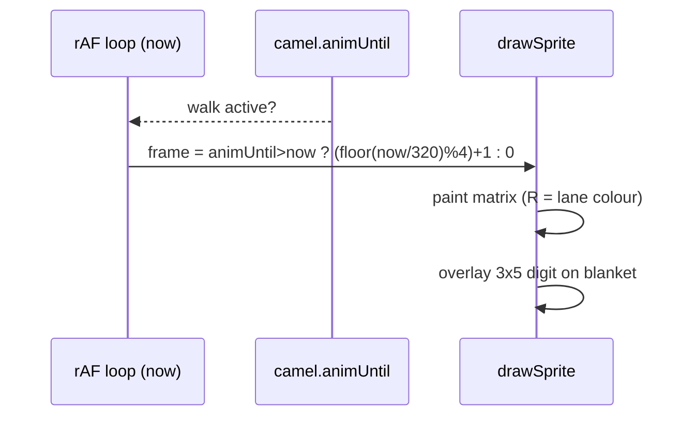

# Camel sprite v2 — 34×24 rider + numbered saddle blanket

Procedural pixel art for the Kamel Derby racer. Facing **right**, one lane per camel.
No image files: the matrices below drive the existing `drawSprite` pixel loop
(extended legend — see [Legend](#legend-char--palette)).

| Item | Value |
|---|---|
| Size | **34 × 24** buffer px (was 32×20) |
| Frames | 1 standing + 4-frame walk: `contact → pass → mirrored contact → mirrored pass` |
| Feet | on the **bottom row** (row 23) in every frame |
| Height budget | ≤ 24 px so it fits a ~26.7 px lane with ±2 px dune bobbing |
| Preview | `/tmp/camel-sprite-preview-v2.png` (also written to `/tmp/camel-sprite-preview.png`) |
| Status | v2, replaces the 32×20 design; implemented in `index.html` by frontend/go-wasm dev |

Body is **brown** per the pixel-art reference. The **rider's robe** takes the lane
color (palette-swap). The **saddle blanket** is light blue and carries a
**3×5 pixel digit** (the camel's number) drawn by code.

## Goal

Match the user's reference art: a single-hump brown dromedary with dark shading and a
black outline, now carrying a Volksfest rider and a numbered saddle blanket so each
lane reads as a distinct racer at a glance.

## Reference art

Moved into the repo for future reference (not loaded at runtime — art stays procedural):

-  — `../reference/camel-pixel-art.png`
  (brown dromedary, dark shading, black outline — the approved silhouette/colour source).
-  — `../reference/real-life-camel-race.jpg`
  (Volksfest mechanical race: coloured riders, white/light-blue numbered blankets, undulating sand lanes).

## At a glance

```
 r0                          ▄▄▄▄▄▄        ▄▄▄▄
 r1                         ██WWWW██     ██BB██      W turban · B body
 r2   rider head + turban   █WWWWWW█    ██BBHHBB█     H highlight
 r3                        █WWWWWW█    █BBBBBB██
 r4                        ██KKKKK█  ███BBBBEBB█      K skin · E eye
 r5   ──────────── rider ──██KKKKK███HHBBBBBBB█
 r6                     ███BBHH█RRRR█OOOBBBSSBBBOO   R robe (lane) · S shade
 r7                   ███BBHHBBRRRRRRRRBBSSOOO       L blanket
 r8   camel hump ▄▄  ███BHBBBBRRRRRRRRBBSSOO
 r9           ▄▄██▄▄ ███BLLLLLLBRRRRRRBSSOO
 r10        ▄███████▄██BBLLLLLLBRRRRRBSSOO
 r11      ▄▄████████████BLLLLLLBBBOOBBBBO
 r12     ▄██SSS███L████O ▀▀▀▀███  ████
  ...   legs (near B · far S) down to hooves on row 23
```

(ASCII is illustrative; the authoritative art is the matrices below.)

## Palette

Fixed tones (tuned toward the reference pixel art). Contrast ratios are WCAG.

| Token | Hex | Use |
|---|---|---|
| `outline` | `#1a1208` | silhouette outline, hooves, rider boots |
| `body` | `#c9803a` | camel body |
| `shade` | `#8a5220` | far legs, belly band, haunch, throat, tail |
| `highlight` | `#e0a45f` | hump crest, neck, head top |
| `white` | `#f0ece0` | rider turban |
| `skin` | `#d8a878` | rider face |
| `blanket` | `#bfe3ea` | saddle blanket (light blue) |
| `digit` | `#123a44` | number on the blanket (contrast on blanket **8.98** ✓ AA) |
| `eye` | `#0a0a0a` | camel eye |
| `robe` | **lane colour** | rider robe — 8-colour game palette (below) |

Lane colours (robe only, in lane order):

| Lane | 0 | 1 | 2 | 3 | 4 | 5 | 6 | 7 |
|---|---|---|---|---|---|---|---|---|
| | `#e84a3a` | `#3a6ae8` | `#3aa84a` | `#e8c83a` | `#9a4ae8` | `#e88a3a` | `#3ad8d8` | `#e85a9a` |

## Legend (char → palette)

Every char resolves through the sprite's palette object (see
[Implementer notes](#implementer-notes)). Only **`R` is per-lane**; all others are fixed.

| char | meaning | colour | per-lane? |
|---|---|---|---|
| `.` | transparent | — | — |
| `O` | outline | `#1a1208` | no |
| `B` | camel body | `#c9803a` | no |
| `S` | camel shade | `#8a5220` | no |
| `H` | camel highlight | `#e0a45f` | no |
| `R` | rider robe | lane colour | **yes** |
| `W` | white (turban) | `#f0ece0` | no |
| `K` | skin (face) | `#d8a878` | no |
| `L` | saddle blanket | `#bfe3ea` | no |
| `E` | eye | `#0a0a0a` | no |

> **Legend conflicts to handle.** In the current `drawSprite`, `H` = hoof and
> `K` = checker-dark (used by `FINISH_FLAG`). v2 reuses those letters for
> highlight/skin. Resolve by routing **all** legend chars through the passed
> palette (each sprite supplies its own), instead of a global `COL` lookup — see
> [Implementer notes](#implementer-notes). The old `D`/`T` shade aliases are gone;
> the tail is plain `S`.

## Matrices

`const CAMEL = [ ... ]` — 5 frames, **24 rows × 34 chars** each.

```
    [ // frame 0 — standing (idle)
      '..............OOOOOO......OOOO....',
      '.............OOWWWWOO....OOBBOO...',
      '.............OWWWWWWO...OOBHHBOO..',
      '.............OWWWWWWO...OBBBBBBOO.',
      '.............OOKKKKKO.OOOBBBBEBBO.',
      '.........OOOOOOKKKKKOOOHHBBBBBBBO.',
      '........OOBHHBRRRRROOOBBBSSBBBOOO.',
      '.......OOBHHBBRRRRRRRRBBSSOOOOO...',
      '......OOBHBBBBRRRRRRRRBSSOO.......',
      '.....OOBLLLLLLBRRRRRRBSSOO........',
      '....OOBBLLLLLLBRRRRRBSSOO.........',
      '..OOOBBBLLLLLLBBBOOBBBBO..........',
      '.OOSSSBBLLLLLLBBBOOBBOOO..........',
      'OOSSSSBBLLLLLLBBBBBBBOO...........',
      'OSOSSSBBLLLLLLBBBBBBBBO...........',
      'OSOOSSSBLLLLLLBBBBBBBBO...........',
      'OSOOOBSSSSSSSSSSSSSSSBO...........',
      'OSSOOOOBOOOSOOOOBOOOSOO...........',
      'OOOO..OBO.OSO..OBO.OSO............',
      '......OBO.OSO..OBO.OSO............',
      '......OBO.OSO..OBO.OSO............',
      '......OBO.OSO..OBO.OSO............',
      '......OBO.OSO..OBO.OSO............',
      '......OOO.OOO..OOO.OOO............',
    ],
    [ // frame 1 — contact A
      '..............OOOOOO.......OOOO...',
      '.............OOWWWWOO.....OOBBOO..',
      '.............OWWWWWWO....OOBHHBOO.',
      '.............OWWWWWWO....OBBBBBBOO',
      '.............OOKKKKKO.OOOOBBBBEBBO',
      '.........OOOOOOKKKKKOOOHHBBBBBBBBO',
      '........OOBHHBRRRRROOOBBBSSBBBBOOO',
      '.......OOBHHBBRRRRRRRRBBSSOOOOOO..',
      '......OOBHBBBBRRRRRRRRBSSOO.......',
      '.....OOBLLLLLLBRRRRRRBSSOO........',
      '....OOBBLLLLLLBRRRRRBSSOO.........',
      '..OOOBBBLLLLLLBBBOOBBBBO..........',
      '.OOSSSBBLLLLLLBBBOOBBOOO..........',
      'OOSSSSBBLLLLLLBBBBBBBOO...........',
      'OSOSSSBBLLLLLLBBBBBBBBO...........',
      'OSOOSSSBLLLLLLBBBBBBBBO...........',
      'OSOOOBSSSSSSSSSSSSSSSBO...........',
      'OSSOOOOBOOOSOOOOBOOOSOO...........',
      'OOOO..OBO.OSO..OBO.OSO............',
      '.....OOBO.OSOO.OBOOOSO............',
      '.....OBOO.OOSO.OOBOSOO............',
      '.....OBO...OSO..OBOSO.............',
      '.....OBO...OSO..OBOSO.............',
      '.....OOO...OOO..OOOOO.............',
    ],
    [ // frame 2 — pass A
      '..................................',
      '..............OOOOOO......OOOO....',
      '.............OOWWWWOO....OOBBOO...',
      '.............OWWWWWWO...OOBHHBOO..',
      '.............OWWWWWWO...OBBBBBBOO.',
      '.............OOKKKKKO.OOOBBBBEBBO.',
      '.........OOOOOOKKKKKOOOHHBBBBBBBO.',
      '........OOBHHBRRRRROOOBBBSSBBBOOO.',
      '.......OOBHHBBRRRRRRRRBBSSOOOOO...',
      '......OOBHBBBBRRRRRRRRBSSOO.......',
      '.....OOBLLLLLLBRRRRRRBSSOO........',
      '....OOBBLLLLLLBRRRRRBSSOO.........',
      '..OOOBBBLLLLLLBBBOOBBBBO..........',
      '.OOSSSBBLLLLLLBBBOOBBOOO..........',
      'OOSSSSBBLLLLLLBBBBBBBOO...........',
      'OSSSSSBBLLLLLLBBBBBBBBO...........',
      'OSSOSSSBLLLLLLBBBBBBBBO...........',
      'OSSSOBSSSSSSSSSSSSSSSBO...........',
      'OSSOOOOBOOOSOOOOBOOOSOO...........',
      'OOOO..OBO.OSO..OBO.OSO............',
      '......OBO.OSO..OBO.OSO............',
      '......OBO.OSO..OBO.OSO............',
      '......OBO.OSO..OBO.OSO............',
      '......OOO.OOO..OOO.OOO............',
    ],
    [ // frame 3 — contact B
      '..............OOOOOO.....OOOO.....',
      '.............OOWWWWOO...OOBBOO....',
      '.............OWWWWWWO..OOBHHBOO...',
      '.............OWWWWWWO..OBBBBBBOO..',
      '.............OOKKKKKO.OOBBBBEBBO..',
      '.........OOOOOOKKKKKOOOHHBBBBBBO..',
      '........OOBHHBRRRRROOOBBBSSBBOOO..',
      '.......OOBHHBBRRRRRRRRBBSSOOOO....',
      '......OOBHBBBBRRRRRRRRBSSOO.......',
      '.....OOBLLLLLLBRRRRRRBSSOO........',
      '....OOBBLLLLLLBRRRRRBSSOO.........',
      '..OOOBBBLLLLLLBBBOOBBBBO..........',
      '.OOSSSBBLLLLLLBBBOOBBOOO..........',
      'OOSSSSBBLLLLLLBBBBBBBOO...........',
      'OSOSSSBBLLLLLLBBBBBBBBO...........',
      'OSOOSSSBLLLLLLBBBBBBBBO...........',
      'OSOOOBSSSSSSSSSSSSSSSBO...........',
      'OSSOOOOBOOOSOOOOBOOOSOO...........',
      'OOOO..OBO.OSO..OBO.OSO............',
      '......OBOOOSO.OOBO.OSOO...........',
      '......OOBOSOO.OBOO.OOSO...........',
      '.......OBOSO..OBO...OSO...........',
      '.......OBOSO..OBO...OSO...........',
      '.......OOOOO..OOO...OOO...........',
    ],
    [ // frame 4 — pass B (mirrored pass: near/far legs swapped vs frame 2, tail swayed back)
      '..................................',
      '..............OOOOOO......OOOO....',
      '.............OOWWWWOO....OOBBOO...',
      '.............OWWWWWWO...OOBHHBOO..',
      '.............OWWWWWWO...OBBBBBBOO.',
      '.............OOKKKKKO.OOOBBBBEBBO.',
      '.........OOOOOOKKKKKOOOHHBBBBBBBO.',
      '........OOBHHBRRRRROOOBBBSSBBBOOO.',
      '.......OOBHHBBRRRRRRRRBBSSOOOOO...',
      '......OOBHBBBBRRRRRRRRBSSOO.......',
      '.....OOBLLLLLLBRRRRRRBSSOO........',
      '....OOBBLLLLLLBRRRRRBSSOO.........',
      '..OOOBBBLLLLLLBBBOOBBBBO..........',
      '.OOSSSBBLLLLLLBBBOOBBOOO..........',
      'OOSSSSBBLLLLLLBBBBBBBOO...........',
      'OSOOSSBBLLLLLLBBBBBBBBO...........',
      'OSOOOSSBLLLLLLBBBBBBBBO...........',
      'OSOOOBSSSSSSSSSSSSSSSBO...........',
      'OSSOOOOSOOOBOOOOSOOOBOO...........',
      'OOOO..OSO.OBO..OSO.OBO............',
      '......OSO.OBO..OSO.OBO............',
      '......OSO.OBO..OSO.OBO............',
      '......OSO.OBO..OSO.OBO............',
      '......OOO.OOO..OOO.OOO............',
    ],
```

## Silhouette / anatomy (per frame, shared)

- Single broad **hump** (rows 6–11) with a lighter `H` crest.
- Long **neck** curving up-right (rows 5–11), `S` along the throat, `H` along the top.
- Wedge **head** (rows 1–6) with `H` forehead, **`E` eye**, fore-cast muzzle.
- **Ear** nub above the head (row 1, `B`).
- **Tail**: thin `S` line hanging from the rump with a small tuft (rows 12–17).
- **Legs**: near side `B`, far side `S`; hooves are the dark bottom outline (row 23).

## Gait & timing

```
contact A ──► pass A ──► contact B ──► pass B ──┐
    ▲                                            │
    └────────────────────────────────────────────┘
```

- Cycle = 4 walk frames × **320 ms** ≈ **1280 ms**; idle = frame 0, **no idle motion**.
- Index while animating: `(Math.floor(now / 320) % 4) + 1`, else `0`.
- **Contact** (1, 3): near-rear/near-front feet swing ±1 px, far legs opposite; head/neck sway `+1` px (frame 1) / `-1` px (frame 3).
- **Pass** (2, 4): legs vertical under the body; whole upper body drops **1 px** (the bob); tail flicks out.
- Only **legs, head/neck, tail and the 1 px bob** move. Hump, blanket, rider and body outline stay put → no silhouette jitter.



## Saddle blanket + number

- **Blanket flat area** = cols **8–13** × rows **9–15** (6 wide × 7 tall) in the sprite, all `L`, drawn *before* legs/rider so nothing overwrites it. On bob frames it simply shifts 1 px down with the body.
- **Digit** = 3 × 5 px, drawn by code **after** the sprite, anchored at sprite-relative
  `(col 9, row 10)` → occupies cols 9–11, rows 10–14 (padding L1 R2 T1 B1). Colour `#123a44`.
- Draw the camel's 1-based **lane index**; fall back to `0`/`9` if index > 8.
- `#` = digit pixel, `.` = transparent.

```
 1      2      3      4      5      6      7      8      9      0
.#.    ###    ###    #.#    ###    ###    ###    ###    ###    ###
##.    ..#    ..#    #.#    #..    #..    ..#    #.#    #.#    #.#
.#.    ###    ###    ###    ###    ###    ..#    ###    ###    #.#
.#.    #..    ..#    ..#    ..#    #.#    ..#    #.#    ..#    #.#
###    ###    ###    ..#    ###    ###    ..#    ###    ###    ###
```

Readability (validated): `#123a44` on `blanket #bfe3ea` = **8.98** (≥ AA 4.5);
light variant `#f0ece0` on `#123a44` = **10.37** for a dark-blanket fallback.
Digits 1–8 are legible at 1× and 4× on the blanket colour (see preview section D/E).

## Dune lane tokens (terrain feature, approved 1A)

Palette for the sand-dune lane ribbons under the dark night sky. Adds one shared
ribbon under each lane so camels appear to run along rolling dunes.

| Token | Hex | Use |
|---|---|---|
| `duneTop` | `#c9a25a` | lit sand (ribbon fill) |
| `duneShade` | `#a8813f` | shaded sand / lee side |
| `duneEdge` | `#6e4f2a` | dark crease between ribbons |
| `duneRim` | `#523a1e` | thin darker rim under the lit crest |

Contrast checks: `duneTop`↔`duneShade` 1.50, `duneTop`↔`duneEdge` 3.13,
`duneTop`↔sky `#1a1030` 7.58, `duneRim`↔`duneTop` 4.44.
The brown camel (`#c9803a`) on `duneTop` is only 1.33 — acceptable because the
camel's dark outline reads at **7.76** against the sand (see acceptance criteria).

### Shared terrain profile `h(x)`

One deterministic height field reused by every lane (lane-y offset only):

```
h(x) = A1*sin(2π*x/λ1 + φ1) + A2*sin(2π*x/λ2 + φ2)
A1 = 1.2 px,  λ1 = 160 px,  φ1 = 0
A2 = 0.8 px,  λ2 = 130 px,  φ2 = 1.7
```

| Requirement | Value |
|---|---|
| Amplitude | `A1 + A2 ≤ 2 px` (so camel + rider ≤ 24 px stays inside a ~26.7 px lane) |
| Wavelength | `λ ∈ [120, 200] px` → reads as rolling dunes, not noise |
| Deterministic | pure `Math.sin`, **no `Math.random`**, stable across frames |
| Smooth | max slope `2π(A1/λ1 + A2/λ2) ≈ 0.09 px/px` → `|h(x+1)-h(x)| ≤ 1 px` |
| Same for all lanes | identical `h(x)`; lanes differ only by their vertical offset |

Draw per lane *before* the camel: fill `laneTopY..laneBottomY` with `duneTop`, offset
the crest line by `h(worldX)`, stroke `duneRim` 1 px under the crest and `duneEdge`
along the ribbon bottom; clamp `h` to `[-2, +2]`.

## Palette-swap

Only `R` changes per camel. `K`/`W`/`L`/`O`/`B`/`S`/`H`/`E` are fixed, so the
silhouette, face, turban and blanket stay identical and every robe colour
(ranging 3.89–11.25 contrast against the dark outline) reads clearly.
Preview rows B and C prove red/blue/green robes and 1× readability on sand.

## Implementer notes

- **Constants**: `SPRITE_W = 34`, `SPRITE_H = 24`, `ANIM_FRAME_MS = 320`; the walk
  actually cycles at `1280 ms` when `ANIM_MS ≥ 1280`.
- **`drawSprite` legend**: route *every* char through the sprite's palette object,
  e.g. `O→outline, B→body, S→shade, H→highlight, R→robe, W→white, K→skin, L→blanket, E→eye`
  (`.` skipped), with a fallback to the existing `COL` for the decoration sprites
  (`PALM`, `CACTUS`, `ROCK`, `MILESTONE`, `FINISH_FLAG`). This removes the `H`/`K`
  collisions. Camel palette factory:

  ```js
  const CAMEL_PAL = (laneColor) => ({
    outline:'#1a1208', body:'#c9803a', shade:'#8a5220', highlight:'#e0a45f',
    robe: laneColor, white:'#f0ece0', skin:'#d8a878', blanket:'#bfe3ea', eye:'#0a0a0a',
  });
  ```
- **Lane math**: `camelTopY(i,n) = laneBottomY(i,n) - SPRITE_H - 2` keeps the feet 2 px
  above the lane bottom. This needs `laneHeight(n) ≥ ~26 px` — use a **512×288** buffer
  (`HORIZON_Y = 70`, `LANE_BOTTOM = 284`) so at `n = 8`, `laneHeight ≈ 26.75 px` and the
  24 px sprite (plus 1 px bob, ±2 px dunes) fits. If `laneHeight < 26`, clamp the offset:
  `off = Math.max(0, Math.min(2, Math.floor((laneHeight - SPRITE_H) / 2)))`.
- **Where the number is drawn**: after `drawSprite(CAMEL[frame], left, top, CAMEL_PAL(c.color))`,
  overlay the digit glyph at `(left + 9, top + 10)` in `#123a44`. One glyph per lane,
  index = camel's 1-based lane number.
- **Tail/shade aliases**: the old `D`/`T` shade letters are unused; add `T`→`shade`
  only if keeping backward compatibility with old matrices.
- `camelTargetLeft` clamp uses `SPRITE_W = 34` (update the `- 32` constant).

## Validation (run on the matrices above)

Throwaway validator (`/tmp`), all frames pass:

| Check | frame 0 | 1 | 2 | 3 | 4 |
|---|---|---|---|---|---|
| exact 24 rows × 34 chars | ✓ | ✓ | ✓ | ✓ | ✓ |
| legend-only chars (`. O B S H R W K L E`) | ✓ | ✓ | ✓ | ✓ | ✓ |
| outline encloses body (no fill pixel 8-adjacent to `.`) | ✓ | ✓ | ✓ | ✓ | ✓ |
| no fill pixel on the canvas border | ✓ | ✓ | ✓ | ✓ | ✓ |
| single 4-connected blob (no isolated pixels) | ✓ | ✓ | ✓ | ✓ | ✓ |
| feet present on the bottom row (row 23) | ✓ | ✓ | ✓ | ✓ | ✓ |
| bounding box ≤ 34 × 24 | 33×24 | 34×24 | 33×23 | 32×24 | 33×23 |
| distinct pose | ✓ | ✓ | ✓ | ✓ | ✓ |

All **5 poses are distinct** (no frame is byte-identical to another). The two pass
poses are the closest pair: **frame 2 vs frame 4 similarity 0.968** (< 0.98). Frame 4
is the mirrored pass — its near (`B`) legs sit where frame 2's far (`S`) legs were
(cols 7/16 → 11/20, and vice-versa) and its tail sways back; frames 0–14 stay
byte-identical, so the locked body/rider/blanket silhouette remains stable.

Digit font: every glyph exactly 3 × 5, chars `#`/`.` only, all ten defined.
Blanket: cols 8–13 × rows 9–15 are flat `L` on the standing/contact frames.

## Acceptance criteria (Playwright-testable)

1. **Sprite size** — for lane 0 with any score, the painted camel's bounding box is 34 px wide and ≤ 24 px tall.
2. **Feet on the lane** — the camel's lowest painted row equals `laneBottomY(0, n) - 2` (± dune `h`), i.e. the feet sit 2 px above the lane bottom.
3. **Standing frame** — with no score change, `page.evaluate` sampling the lane returns frame 0 (the standing matrix); no idle motion between two rAF ticks.
4. **Walk cycle** — after a score change, the frame index advances `1→2→3→4→1` at 320 ms steps and returns to 0 after `ANIM_MS`.
5. **Palette-swap** — the saddle blanket pixels are `#bfe3ea` for every camel; the rider-robe pixels equal the camel's lane colour (`#e84a3a` for lane 0, `#3a6ae8` for lane 1, …).
6. **Number** — the pixels at sprite-relative cols 9–11 / rows 10–14 match the 3×5 glyph for the camel's 1-based lane number, colour `#123a44`.
7. **Fixed tones** — body pixels are `#c9803a` and outline pixels `#1a1208` in every lane (i.e. `B`/`O` do not change with lane colour).
8. **Dune profile** — sampling the crest line gives the same `h(x)` for every lane; `|h| ≤ 2` for all `x` in `[0, canvasWidth]`; two samples `x` and `x+1` differ by ≤ 1.
9. **Readability** — with the camel drawn on `duneTop`, at least one outline pixel `#1a1208` remains adjacent to the camel in x for the silhouette to read (contrast 7.76).
