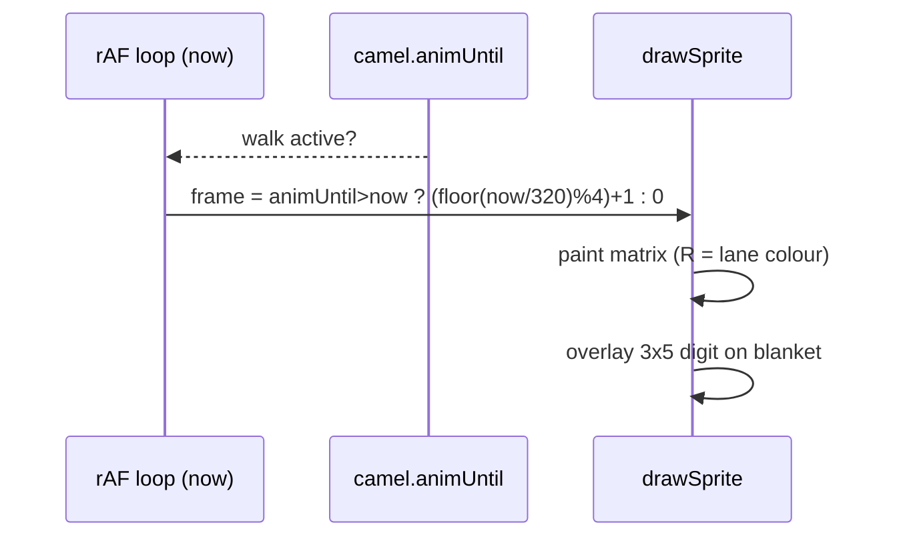

# Camel sprite v4 — 33×31 two-hump Bactrian rider + numbered saddle blanket

Procedural pixel art for the Kamel Derby racer. Facing **right**, one lane per camel.
No image files: the matrices below drive the existing `drawSprite` pixel loop
(extended legend — see [Legend](#legend-char--palette)).

This is **T2, the two-hump Bactrian** from `docs/art/camel-drafts-v2.md`,
promoted to the authoritative design. See [Selection](#selection).

| Item | Value |
|---|---|
| Size | **33 × 31** buffer px (matrix, uniform all frames); painted bbox 29–31 × 30–31 |
| Frames | 1 standing + 4-frame walk: `contact A → pass A → contact B → pass B` |
| Feet | on the **bottom row** (row 30) in every frame |
| Height budget | 31 px sprite in a ~33.5 px lane (640×360 buffer) with ±2 px dune bobbing |
| Previews | Generated locally during design (gitignored `test-results/ux-tmp/`): `t2-v4-frames.png` (5 frames 8× + grid), `t2-v4-loop.png` (1→2→3→4 4×), `t2-v4-dressed.png` (3 robe colours × digits 1–8), `t2-v4-1x.png` (1× strip on sand `#c9a25a`) |
| Status | v4, replaces the v3 34×24 design; **dressed form is what the game renders** |

Body is **brown** per the pixel-art reference. The **rider's robe** takes the lane
color (palette-swap). The **saddle blanket** is light blue and carries a
**3×5 pixel digit** (the camel's number) drawn by code.

## Goal

Match the user's reference art palette with the **T2 two-hump Bactrian** silhouette:
reference browns (`B`/`S`), dark outline `O`, grey harness `G`, thin hanging tail,
carrying a Volksfest rider and a numbered saddle blanket so each lane reads as a
distinct racer at a glance.

## Reference art

Moved into the repo for future reference (not loaded at runtime — art stays procedural):

-  — `../reference/camel-pixel-art.png`
  (brown dromedary, dark shading, black outline — the approved silhouette/colour source).
-  — `../reference/real-life-camel-race.png`
  (Volksfest mechanical race: coloured riders, white/light-blue numbered blankets, undulating sand lanes).

## Refinements over drafts-v2 T2

T2 (two-hump Bactrian, 33×31 trace) promoted with production walk frames.
Deltas vs the drafts-v2 standing matrix (bare-standing similarity 0.9844):

- **Enclosure pass** — ~13–17 exterior-adjacent fill cells per frame recolored to
  `O` (hump-crest edge, harness right edge, thigh-band fringes); silhouette kept.
- **Ear tip** — the lone `G` cell at (24,0) capped to `O` (was unenclosed grey).
- **Legs (standing)** — frame 0 legs thinned to match walk frames (user request): hock-down rows 23–30 redrawn as straight `OSO` shanks + 5-wide `OOOOO` hooves, same as the walk-frame style.
- **Gait** — head/neck block shifts ±1 px on contacts; body+bob 1 px on pass
  frames; hooves stride ±3 px; tail tuft flicks; no `H`/`E` (reference models
  light with bright `B`; eye reads via outline).

## At a glance

```
 r0                      OOO                       O outline · B body
 r1   rider turban  OOOOOO SSOO                    S shade · G harness
 r2                 OWWWO  BBBBO                   R robe (lane) · W turban
 r6   rear hump   OOOO     BSSSG                   K skin · L blanket
 r12  blanket    OBSSOLLLLOSSSBBB                  digit 3×5 @ (11,12)
 r18  tail root  OO.SSSSSSSSSSSO
 r23+ legs      OSO / OSO shanks → OOOOO hooves r30
```

(T2 silhouette: two humps — rear crest rows 6–7, main hump rows 7–10; grey
harness `G` runs neck→belly; thin tail hangs from rump rows 14–22. The
authoritative art is the matrices below.)

## Palette

Fixed tones (tuned toward the reference pixel art). Contrast ratios are WCAG.

| Token | Hex | Use |
|---|---|---|
| `outline` | `#1a1208` | silhouette outline, hooves |
| `body` | `#c9803a` | camel body (lit orange) |
| `shade` | `#8a5220` | bulk orange, legs, belly, tail |
| `harness` | `#53565e` | grey neck-strap / belly-band lines (T2 `G`) |
| `white` | `#f0ece0` | rider turban |
| `skin` | `#d8a878` | rider face |
| `blanket` | `#bfe3ea` | saddle blanket (light blue) |
| `digit` | `#123a44` | number on the blanket (contrast on blanket **8.98** ✓ AA) |
| `robe` | **lane colour** | rider robe — 8-colour game palette (below) |

T2 uses no `H`/`E`: the reference models light with bright `B`, not a separate
highlight tone (v3's `H`/`E` retired).

Lane colours (robe only, in lane order):

| Lane | 0 | 1 | 2 | 3 | 4 | 5 | 6 | 7 |
|---|---|---|---|---|---|---|---|---|
| | `#e84a3a` | `#3a6ae8` | `#3aa84a` | `#e8c83a` | `#9a4ae8` | `#e88a3a` | `#3ad8d8` | `#e85a9a` |

## Legend (char → palette)

Every char resolves through the sprite's palette object (see
[Implementer notes](#implementer-notes)). Only **`R` is per-lane**; all others are fixed.

| char | meaning | colour | per-lane? |
|---|---|---|---|
| `.` | transparent | — | — |
| `O` | outline | `#1a1208` | no |
| `B` | camel body | `#c9803a` | no |
| `S` | camel shade | `#8a5220` | no |
| `G` | harness grey | `#53565e` | no |
| `R` | rider robe | lane colour | **yes** |
| `W` | white (turban) | `#f0ece0` | no |
| `K` | skin (face) | `#d8a878` | no |
| `L` | saddle blanket | `#bfe3ea` | no |

> **Legend resolved.** Every legend char routes through the sprite's palette object
> via `CHAR_KEY`, so no `COL` collision matters: v4 drops `H`/`E` entirely, and the
> `FINISH_FLAG` checker-dark stays `X` — see [Implementer notes](#implementer-notes).
> `G` (harness) is a fixed tone, not per-lane. The game's checker/finish colours
> (`C`/`X`/flag) are disjoint from the camel legend.

## Matrices

### Bare camel — `const CAMEL_BARE = [ ... ]` (standing, 31 rows × 33 chars)

Bare form shown for the standing frame only (dressed set below is authoritative
for rendering). Bare standing is the enclosure-fixed T2 trace; walk-frame bare
forms exist 1:1 under the dressed overlays (same body/legs, no rider/blanket).

```
    [ // frame 0 — standing (idle)
      '......................OOO........',
      '......................OSSOO......',
      '....................OOSBBBBO.....',
      '....................OSBSSSBBOOO..',
      '....................OBBBBBBBGBBO.',
      '.....................OBBBBBGBBBO.',
      '........OOOO.........OSBSSSGOSSO.',
      '.......OOBBOO..OOO...OSBBBSGOOOO.',
      '........OOO...OBBBO...OSBBBGO....',
      '.......OBBBOOOBBBBBO..OSBBBGO....',
      '.......OBSBBGBBSSSBO..OSBBBO.....',
      '......OBSSSSGSSSSSBBOOSBBBGO.....',
      '.....OOBSSSSSGBSSSSBBBBBSGGO.....',
      '....OOBBSSSSSSGGSSSSSSSSGGO......',
      '...O.OBSSSSSSSSSGGGGGGGSSO.......',
      '...O.OBSSSSSSSSSSSSSSSSSSO.......',
      '...O.OBSSSSSSSSSSSSSSSSSO........',
      '...O..OSSSSSSSSSSSSSSSSOO........',
      '...OO.OSSSSSSSSSSSSSSSO..........',
      '..O.OOSSSSSSSOOOSSSSSO...........',
      '..O.OSSSSSSSO...OSSSSO...........',
      '..OOOSSSSSSO....OSSSSO...........',
      '..O.SSSSSSO.....OSSSO............',
      '...OSSSSSSO.....OSSSO............',
      '....OSSSSO.....OSSSO.............',
      '.....OSSSO......OSSO.............',
      '......OSO........OSO.............',
      '......OSO........OSO.............',
      '......OSO........OSO.............',
      '......OSO........OSO.............',
      '.....OOOOO......OOOOO............',
    ],
```

### Dressed camel — `const CAMEL = [ ... ]` (5 frames, 31 rows × 33 chars)

**This is what the game renders.** T2 body/legs with the rider (`O/W/K/R`, lane-colour
robe) and the flat `L` blanket overlaid; the digit is painted by code (see
[Saddle blanket + number](#saddle-blanket--number)). Rider and blanket drift +1 px with
the body on the bob frames (2, 4).

```
    [ // frame 0 — standing (idle)
      '......................OOO........',
      '..........OOOOOO......OSSOO......',
      '..........OWWWWO....OOSBBBBO.....',
      '..........OWWWWO....OSBSSSBBOOO..',
      '..........OWWWWO....OBBBBBBBGBBO.',
      '..........OOKKOO.....OBBBBBGBBBO.',
      '........OOORRRRO.....OSBSSSGOSSO.',
      '.......OOBORRRROOO...OSBBBSGOOOO.',
      '........OOORRRROBBO...OSBBBGO....',
      '.......OBBORRRROBBBO..OSBBBGO....',
      '.......OBSORRRROSSBO..OSBBBO.....',
      '......OBSSORRRROSSBBOOSBBBGO.....',
      '.....OOBSSOLLLLOSSSBBBBBSGGO.....',
      '....OOBBSSOLLLLOSSSSSSSSGGO......',
      '...O.OBSSSOLLLLOGGGGGGGSSO.......',
      '...O.OBSSSOLLLLOSSSSSSSSSO.......',
      '...O.OBSSSOLLLLOSSSSSSSSO........',
      '...O..OSSSOOOOOOSSSSSSSOO........',
      '...OO.OSSSSSSSSSSSSSSSO..........',
      '..O.OOSSSSSSSOOOSSSSSO...........',
      '..O.OSSSSSSSO...OSSSSO...........',
      '..OOOSSSSSSO....OSSSSO...........',
      '..O.SSSSSSO.....OSSSO............',
      '...OSSSSSSO.....OSSSO............',
      '....OSSSSO.....OSSSO.............',
      '.....OSSSO......OSSO.............',
      '......OSO........OSO.............',
      '......OSO........OSO.............',
      '......OSO........OSO.............',
      '......OSO........OSO.............',
      '.....OOOOO......OOOOO............',
    ],
    [ // frame 1 — contact A
      '.......................OOO.......',
      '..........OOOOOO.......OSSOO.....',
      '..........OWWWWO.....OOSBBBBO....',
      '..........OWWWWO.....OSBSSSBBOOO.',
      '..........OWWWWO.....OBBBBBBBGBBO',
      '..........OOKKOO......OBBBBBGBBBO',
      '........OOORRRRO......OSBSSSGOSSO',
      '.......OOBORRRROOO....OSBBBSGOOOO',
      '........OOORRRROBBO...OSBBBGO....',
      '.......OBBORRRROBBBO..OSBBBGO....',
      '.......OBSORRRROSSBO..OSBBBO.....',
      '......OBSSORRRROSSBBOOSBBBGO.....',
      '.....OOBSSOLLLLOSSSBBBBBSGGO.....',
      '....OOBBSSOLLLLOSSSSSSSSGGO......',
      '...O.OBSSSOLLLLOGGGGGGGSSO.......',
      '...O.OBSSSOLLLLOSSSSSSSSSO.......',
      '...O.OBSSSOLLLLOSSSSSSSSO........',
      '...O..OSSSOOOOOOSSSSSSSOO........',
      '...OO.OSSSSSSSSSSSSSSSO..........',
      '..O.OOSSSSSSSOOOSSSSSO...........',
      '..O.OSSSSSSSO...OSSSSO...........',
      '..OOOSSSSSSO....OSSSSO...........',
      '..O.OOSSSOO.....OOOSO............',
      '......OSO..........OSO...........',
      '......OSO..........OSO...........',
      '......OSO..........OSO...........',
      '.....OSO............OSO..........',
      '.....OSO............OSO..........',
      '....OSO..............OSO.........',
      '...OSO................OSO........',
      '..OOOOO..............OOOOO.......',
    ],
    [ // frame 2 — pass A (bob)
      '.................................',
      '......................OOO........',
      '..........OOOOOO......OSSOO......',
      '..........OWWWWO....OOSBBBBO.....',
      '..........OWWWWO....OSBSSSBBOOO..',
      '..........OWWWWO....OBBBBBBBGBBO.',
      '..........OOKKOO.....OBBBBBGBBBO.',
      '........OOORRRRO.....OSBSSSGOSSO.',
      '.......OOBORRRROOO...OSBBBSGOOOO.',
      '........OOORRRROBBO...OSBBBGO....',
      '.......OBBORRRROBBBO..OSBBBGO....',
      '.......OBSORRRROSSBO..OSBBBO.....',
      '......OBSSORRRROSSBBOOSBBBGO.....',
      '.....OOBSSOLLLLOSSSBBBBBSGGO.....',
      '....OOBBSSOLLLLOSSSSSSSSGGO......',
      '...O.OBSSSOLLLLOGGGGGGGSSO.......',
      '...O.OBSSSOLLLLOSSSSSSSSSO.......',
      '...O.OBSSSOLLLLOSSSSSSSSO........',
      '...O..OSSSOOOOOOSSSSSSSOO........',
      '..OOO.OSSSSSSSSSSSSSSSO..........',
      '..O.OOSSSSSSSOOOSSSSSO...........',
      '..O.OSSSSSSSO...OSSSSO...........',
      '..OOOOSSSOOO....OOOSSO...........',
      '......OSO..........OSO...........',
      '......OSO..........OSO...........',
      '......OSO..........OSO...........',
      '......OSO..........OSO...........',
      '......OSO..........OSO...........',
      '.....OSO............OSO..........',
      '.....OSO............OSO..........',
      '....OOOOO..........OOOOO.........',
    ],
    [ // frame 3 — contact B
      '.....................OOO.........',
      '..........OOOOOO.....OSSOO.......',
      '..........OWWWWO...OOSBBBBO......',
      '..........OWWWWO...OSBSSSBBOOO...',
      '..........OWWWWO...OBBBBBBBGBBO..',
      '..........OOKKOO....OBBBBBGBBBO..',
      '........OOORRRRO....OSBSSSGOSSO..',
      '.......OOBORRRROOO..OOBBBSGOOOO..',
      '........OOORRRROBBO...OSBBBGO....',
      '.......OBBORRRROBBBO..OSBBBGO....',
      '.......OBSORRRROSSBO..OSBBBO.....',
      '......OBSSORRRROSSBBOOSBBBGO.....',
      '.....OOBSSOLLLLOSSSBBBBBSGGO.....',
      '....OOBBSSOLLLLOSSSSSSSSGGO......',
      '...O.OBSSSOLLLLOGGGGGGGSSO.......',
      '...O.OBSSSOLLLLOSSSSSSSSSO.......',
      '...O.OBSSSOLLLLOSSSSSSSSO........',
      '...O..OSSSOOOOOOSSSSSSSOO........',
      '...OO.OSSSSSSSSSSSSSSSO..........',
      '..O.OOSSSSSSSOOOSSSSSO...........',
      '..O.OSSSSSSSO...OSSSSO...........',
      '..OOOSSSSSSO....OSSSSO...........',
      '..O.OOSSSOO.....OOOSO............',
      '......OSO..........OSO...........',
      '......OSO..........OSO...........',
      '......OSO..........OSO...........',
      '.......OSO........OSO............',
      '.......OSO........OSO............',
      '........OSO......OSO.............',
      '.........OSO....OSO..............',
      '........OOOOO..OOOOO.............',
    ],
    [ // frame 4 — pass B (bob)
      '.................................',
      '......................OOO........',
      '..........OOOOOO......OSSOO......',
      '..........OWWWWO....OOSBBBBO.....',
      '..........OWWWWO....OSBSSSBBOOO..',
      '..........OWWWWO....OBBBBBBBGBBO.',
      '..........OOKKOO.....OBBBBBGBBBO.',
      '........OOORRRRO.....OSBSSSGOSSO.',
      '.......OOBORRRROOO...OSBBBSGOOOO.',
      '........OOORRRROBBO...OSBBBGO....',
      '.......OBBORRRROBBBO..OSBBBGO....',
      '.......OBSORRRROSSBO..OSBBBO.....',
      '......OBSSORRRROSSBBOOSBBBGO.....',
      '.....OOBSSOLLLLOSSSBBBBBSGGO.....',
      '....OOBBSSOLLLLOSSSSSSSSGGO......',
      '...O.OBSSSOLLLLOGGGGGGGSSO.......',
      '...O.OBSSSOLLLLOSSSSSSSSSO.......',
      '...O.OBSSSOLLLLOSSSSSSSSO........',
      '...O..OSSSOOOOOOSSSSSSSOO........',
      '...OOOOSSSSSSSSSSSSSSSO..........',
      '..O.OOSSSSSSSOOOSSSSSO...........',
      '..O.OSSSSSSSO...OSSSSO...........',
      '..OOOOOSSSOO....OOSSSO...........',
      '.......OSO........OSO............',
      '.......OSO........OSO............',
      '.......OSO........OSO............',
      '.......OSO........OSO............',
      '.......OSO........OSO............',
      '........OSO......OSO.............',
      '........OSO......OSO.............',
      '.......OOOOO....OOOOO............',
    ],
```

## Silhouette / anatomy (per frame, shared)

- **Two humps** (Bactrian): rear crest rows 6–7 (`O B B O`), main hump rows 7–10;
  valley cols 12–14; lit `B` over `S` bulk, `O` rim.
- **Harness** `G`: grey neck-strap/belly-band lines (neck rows 4–8, belly rows 13–17).
- **Neck** rising right (rows 5–10); wedge **head** rows 0–5, fore-cast muzzle.
- **Ear** nub row 0 (cols 22–24, `O`-capped).
- **Tail**: thin `S`/`O` line hanging from the rump (rows 14–22) with a small tuft;
  tuft flicks ±1 px on pass frames.
- **Legs**: `O`-edged shanks with `S` midline, `O` hoof blocks on **row 30**;
  thigh rows 19–22 shared with the trace; hock-down rows 23–30 per-frame.

## Gait & timing

```
contact A ──► pass A ──► contact B ──► pass B ──┐
    ▲                                            │
    └────────────────────────────────────────────┘
```

- Cycle = 4 walk frames × **320 ms** ≈ **1280 ms**; idle = frame 0, **no idle motion**.
- Index while animating: `(Math.floor(now / 320) % 4) + 1`, else `0`.
- **Contact** (1, 3): hooves stride ±3 px (rear 4/forward 23 vs rear 10/inner 17),
  shanks curving from nominal centres (rear 7, front 20); head/neck block shifts
  `+1` px (frame 1) / `-1` px (frame 3); tail tuft swings.
- **Pass** (2, 4): legs near-vertical under the body (hooves 6/21 vs 9/18); whole
  upper body drops **1 px** (the bob); A/B poses differ in hoof placement, shank
  centres (7/20 vs 8/19) and tail flick (no duplicate frames).
- Only **legs, head/neck, tail and the 1 px bob** move. Humps, blanket, rider and body
  outline stay put → no silhouette jitter.



## Saddle blanket + number

- **Blanket area** = rows **12–17** × cols **10–15** (6 wide × 6 tall), drawn
  *before* legs/rider so nothing overwrites it. On bob frames (2, 4) it shifts
  **1 px down** with the body (rows 13–18).
- **Digit** = 3 × 5 px, drawn by code **after** the sprite, anchored at
  **sprite-local `(col 11, row 12)`** → occupies **cols 11–13, rows 12–16**.
  On bob frames add +1 to the row (anchor `(11, 13)` → rows 13–17). Colour `#123a44`.
  Verified: the **digit area = cols 11–13 × rows 12–16 is flat `L` in all five
  frames** (+1 row on the bob frames 2/4).
- Draw the camel's 1-based **lane index**; fall back to `0` if index > 8.
- `#` = digit pixel, `.` = transparent.

```
 1      2      3      4      5      6      7      8      9      0
.#.    ###    ###    #.#    ###    ###    ..#    ###    ###    ###
##.    ..#    ..#    #.#    #..    #..    ..#    #.#    #.#    #.#
.#.    ###    ###    ###    ###    ###    ..#    ###    ###    #.#
.#.    #..    ..#    ..#    ..#    #.#    ..#    #.#    ..#    #.#
###    ###    ###    ..#    ###    ###    ..#    ###    ###    ###
```

(Glyphs match the in-repo `DIGIT_FONT` in `index.html` verbatim — e.g. `7` is the
bare right column.)

Readability (validated): `#123a44` on `blanket #bfe3ea` = **8.98** (≥ AA 4.5);
light variant `#f0ece0` on `#123a44` = **10.37** for a dark-blanket fallback.
Digits 1–8 are legible at 1× and 4× on the blanket colour (see the gitignored
`t2-v4-dressed.png` / `t2-v4-1x.png` in `test-results/ux-tmp/`).

## Dune lane tokens (terrain feature, approved 1A)

Palette for the sand-dune lane ribbons under the dark night sky. Adds one shared
ribbon under each lane so camels appear to run along rolling dunes.

| Token | Hex | Use |
|---|---|---|
| `duneTop` | `#c9a25a` | lit sand (ribbon fill) |
| `duneShade` | `#a8813f` | shaded sand / lee side |
| `duneEdge` | `#6e4f2a` | dark crease between ribbons |
| `duneRim` | `#523a1e` | thin darker rim under the lit crest |

Contrast checks: `duneTop`↔`duneShade` 1.50, `duneTop`↔`duneEdge` 3.13,
`duneTop`↔sky `#1a1030` 7.58, `duneRim`↔`duneTop` 4.44.
The brown camel (`#c9803a`) on `duneTop` is only 1.33 — acceptable because the
camel's dark outline reads at **7.76** against the sand (see acceptance criteria).

### Shared terrain profile `h(x)`

One deterministic height field reused by every lane (lane-y offset only):

```
h(x) = A1*sin(2π*x/λ1 + φ1) + A2*sin(2π*x/λ2 + φ2)
A1 = 1.2 px,  λ1 = 160 px,  φ1 = 0
A2 = 0.8 px,  λ2 = 130 px,  φ2 = 1.7
```

| Requirement | Value |
|---|---|
| Amplitude | `A1 + A2 ≤ 2 px` (kept; at 640×360 the same ±2 px renders 1.25× larger on screen) |
| Wavelength | `λ ∈ [120, 200] px` → reads as rolling dunes, not noise |
| Deterministic | pure `Math.sin`, **no `Math.random`**, stable across frames |
| Smooth | max slope `2π(A1/λ1 + A2/λ2) ≈ 0.09 px/px` → `|h(x+1)-h(x)| ≤ 1 px` |
| Same for all lanes | identical `h(x)`; lanes differ only by their vertical offset |

Draw per lane *before* the camel: fill `laneTopY..laneBottomY` with `duneTop`, offset
the crest line by `h(worldX)`, stroke `duneRim` 1 px under the crest and `duneEdge`
along the ribbon bottom; clamp `h` to `[-2, +2]` (unchanged).

### v4 geometry (buffer 640×360, sprite 33×31, 8 lanes)

| Constant | Value | Derivation |
|---|---|---|
| Buffer | **640 × 360** (16:9) | 1.25× the 512×288 buffer; keeps 16:9 and deterministic layout |
| `SPRITE_W` / `SPRITE_H` | **33 / 31** | exact T2 matrix dims; uniform across frames, no padding (bbox 29–31 × 30–31) |
| `HORIZON_Y` | **88** | 70 × 1.25 (proportional scale) |
| `LANE_BOTTOM` | **356** | 360 − 4 (same 4 px bottom margin as v3) |
| Lane height (n=8) | **33.5 px** | (356 − 88) / 8 |
| `TERRAIN_FEET_OFFSET` | **2** | unchanged: feet rest 2 px above lane bottom at h = 0 |
| Terrain amplitude | **±2 px (keep)** | exact no-clamp budget is `min(laneH − spriteH − feetOffset, feetOffset)` = `min(0.5, 2)` = **0.5 px** — any visible dune motion needs the existing `camelTopY` clamp, which v4 keeps. So: keep the current amplitudes (`A1 = 1.2, A2 = 0.8`, `|h| ≤ 2`) and the clamp. At 640×360 the same ±2 px renders 1.25× larger on screen, which is the visibility gain. Larger amplitudes (±3) would slam the clamp on every crest — not recommended. Clamp stays necessary by design (it already exists); the sprite never leaves its lane because `camelTopY` clamps to `[laneTopY, laneBottomY − SPRITE_H]` |
| `camelTopY` | unchanged formula | `laneSurfaceY − SPRITE_H` clamped to `[laneTopY, laneBottomY − SPRITE_H]` (binding under v4: 31 px sprite in a 33.5 px lane leaves 2.5 px slack vs ±2 px dunes) |
| `camelTargetLeft` clamp | `SPRITE_W = 33` | `max(LANE_MARGIN, min(640 − 33 − MARGIN, cx − 33/2))` |
| `ANIM_FRAME_MS` | 320 (unchanged) | gait cycle 1280 ms; frame order 1→2→3→4→1 |

## Design tokens — removed (not implemented)

The `:root` CSS vars, `[data-theme]` toggle, and `localStorage` persistence
previously specified here were never built: `index.html` hardcodes its palette
in script constants and has no theme switcher. Values removed, not reframed —
see the geometry/palette tables above and `CAMEL_PAL` for the shipped tokens.

## Palette-swap

Only `R` changes per camel. `K`/`W`/`L`/`O`/`B`/`S`/`G` are fixed, so the
silhouette, face, turban, blanket and harness stay identical and every robe colour
(ranging 3.89–11.25 contrast against the dark outline) reads clearly.
The gitignored `t2-v4-dressed.png` proves red/blue/green robes and digits 1–8 at 4×.

## Implementer notes

- **Constants**: `SPRITE_W = 33`, `SPRITE_H = 31`, buffer **640×360**,
  `HORIZON_Y = 88`, `LANE_BOTTOM = 356` (360 − 4), `ANIM_FRAME_MS = 320`
  (walk cycle `1280 ms` when `ANIM_MS ≥ 1280`). Canvas element `width`/`height`
  become 640/360; `CAMEL_PAL` gains `harness`, drops `highlight`/`eye`.
- **`drawSprite` legend**: route *every* char through the sprite's palette object,
  e.g. `O→outline, B→body, S→shade, G→harness, R→robe, W→white, K→skin, L→blanket`
  (`.` skipped), with a fallback to the existing `COL` for the decoration sprites
  (`PALM`, `CACTUS`, `ROCK`, `MILESTONE`, `FINISH_FLAG`). V4 uses no `H`/`E`, so the
  old collisions are gone; keep `X` = checker-dark. Camel palette factory:

  ```js
  const CAMEL_PAL = (laneColor) => ({
    outline:'#1a1208', body:'#c9803a', shade:'#8a5220', harness:'#53565e',
    robe: laneColor, white:'#f0ece0', skin:'#d8a878', blanket:'#bfe3ea',
  });
  ```
- **Lane math**: `camelTopY(i,n) = laneBottomY(i,n) - SPRITE_H - 2` keeps the feet 2 px
  above the lane bottom. Buffer **640×360** (`HORIZON_Y = 88`, `LANE_BOTTOM = 356`)
  so at `n = 8`, `laneHeight = 33.5 px` and the 31 px sprite (±2 px dunes, 1 px bob)
  fits via the existing clamp to `[laneTopY, laneBottomY − SPRITE_H]`.
- **Where the number is drawn**: after `drawSprite(CAMEL[frame], left, top, CAMEL_PAL(c.color))`,
  overlay the digit glyph at **`(left + 11, top + 12)`** (was `left+10, top+10`) in
  `#123a44`, adding **+1 to the row on the bob frames (2, 4)** so the digit tracks the
  blanket. One glyph per lane, index = camel's 1-based lane number.
- **Tail/shade aliases**: the old `D`/`T` shade letters are unused; add `T`→`shade`
  only if keeping backward compatibility with old matrices.
- `camelTargetLeft` clamp uses `SPRITE_W = 33` against width 640.

## Validation (run on the matrices above)

A throwaway Python validator was run on the matrices above (re-run from the code
blocks; the script itself is not kept), **all frames pass**:

| Check | frame 0 | 1 | 2 | 3 | 4 |
|---|---|---|---|---|---|
| exact 31 rows × 33 chars | ✓ | ✓ | ✓ | ✓ | ✓ |
| legend-only chars (bare `. O B S G` / dressed +`R W K L`) | ✓ | ✓ | ✓ | ✓ | ✓ |
| outline encloses body (no fill 4-adjacent to exterior `.`) | ✓ | ✓ | ✓ | ✓ | ✓ |
| no stray pixels / no fill on the canvas border | ✓ | ✓ | ✓ | ✓ | ✓ |
| single 4-connected blob (no isolated pixels) | ✓ | ✓ | ✓ | ✓ | ✓ |
| feet present on the bottom row (row 30) | ✓ (10/10/10/10/10 cells) | ✓ | ✓ | ✓ | ✓ |
| bounding box ≤ 33 × 31 | 30×31 | 31×31 | 30×30 | 29×31 | 30×30 |
| all 5 poses distinct (sim < 0.98) | ✓ | ✓ | ✓ | ✓ | ✓ |

All **5 poses are distinct**. Frame similarity (fraction of identical pixels,
dressed set — 1.000 = identical; bare set matches within 0.001):

```
              stand  cA     pA     cB     pB
standing      1.000  0.861  0.749  0.882  0.762
contactA      0.861  1.000  0.769  0.877  0.723
passA         0.749  0.769  1.000  0.761  0.921
contactB      0.882  0.877  0.761  1.000  0.777
passB         0.762  0.723  0.921  0.777  1.000
```

Closest pair is **pass A vs pass B = 0.921** (< 0.98) — the two pass poses differ in
hoof placement (6/21 vs 9/18), shank centres and tail flick. No pair reaches 0.98,
so **no duplicate frames**. The 4 walk frames loop sensibly: `1→2→3→4→1` alternates
contact/pass with the body bob on 2/4.

Enclosure method: fill (`B/S/G/R/W/K/L`) 4-adjacent to *exterior* `.` is recolored
to `O` (concave notches and inter-leg gaps stay open; border fill banned outright).
The T2 trace's interior AA-gap adjacencies are thereby closed without touching the
silhouette; walk-leg rows 23–30 are drawn enclosed from scratch.

Digit font: every glyph exactly 3 × 5, chars `#`/`.` only, all ten defined.
Blanket: the digit area cols 11–13 × rows 12–16 is flat `L` on the standing/contact
frames; on bob frames it shifts to rows 13–17. Digits 1–8 render legibly at 1× on
sand `#c9a25a` (see `t2-v4-1x.png`).

## Acceptance criteria (Playwright-testable)

1. **Sprite size** — for lane 0 with any score, the painted camel's bounding box is ≤ 33 px wide and ≤ 31 px tall.
2. **Feet on the lane** — the camel's lowest painted row equals `laneBottomY(0, n) - 2` (± dune `h`, clamped inside the lane), i.e. the feet sit 2 px above the lane bottom.
3. **Standing frame** — with no score change, `page.evaluate` sampling the lane returns frame 0 (the standing matrix); no idle motion between two rAF ticks.
4. **Walk cycle** — after a score change, the frame index advances `1→2→3→4→1` at 320 ms steps and returns to 0 after `ANIM_MS`.
5. **Palette-swap** — the saddle blanket pixels are `#bfe3ea` for every camel; the rider-robe pixels equal the camel's lane colour (`#e84a3a` for lane 0, `#3a6ae8` for lane 1, …); harness pixels are `#53565e` in every lane.
6. **Number** — the pixels at sprite-relative **cols 11–13 / rows 12–16** (+1 row on the bob frames 2, 4) match the 3×5 glyph for the camel's 1-based lane number, colour `#123a44`.
7. **Fixed tones** — body pixels are `#c9803a` and outline pixels `#1a1208` in every lane (i.e. `B`/`O` do not change with lane colour).
8. **Dune profile** — sampling the crest line gives the same `h(x)` for every lane; `|h| ≤ 2` for all `x` in `[0, canvasWidth]`; two samples `x` and `x+1` differ by ≤ 1.
9. **Readability** — with the camel drawn on `duneTop`, at least one outline pixel `#1a1208` remains adjacent to the camel in x for the silhouette to read (contrast 7.76).

## Selection

**T2 (Two-hump Bactrian)** was chosen by the user from `docs/art/camel-drafts-v2.md`
on **2026-10-04**, over the v3 single-hump design below. This file is the authoritative,
living spec. See [Refinements over drafts-v2 T2](#refinements-over-drafts-v2-t2) for
the deltas applied when promoting T2 to v4 (full 5-frame production set).

v3 history: **Draft A** had been chosen from `docs/art/camel-drafts.md` on 2026-10-03
(a 34×24 single-hump design; drafts doc deleted after promotion). v4 replaces it.
