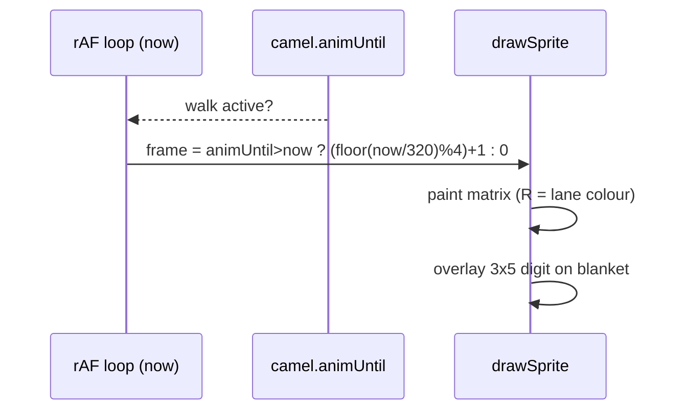

# Camel sprite v3 — 34×24 rider + numbered saddle blanket

Procedural pixel art for the Kamel Derby racer. Facing **right**, one lane per camel.
No image files: the matrices below drive the existing `drawSprite` pixel loop
(extended legend — see [Legend](#legend-char--palette)).

This is **Draft A refined** (the reference-faithful slim camel chosen from the drafts),
promoted to the authoritative design. See [Selection](#selection).

| Item | Value |
|---|---|
| Size | **34 × 24** buffer px (matrix); camel bounding box 29–32 × 23–24 |
| Frames | 1 standing + 4-frame walk: `contact A → pass A → contact B → pass B` |
| Feet | on the **bottom row** (row 23) in every frame |
| Height budget | ≤ 24 px so it fits a ~26.7 px lane with ±2 px dune bobbing |
| Previews | Generated locally during design (not committed): `camel-v3-frames.png`, `camel-v3-loop.png`, `camel-v3-vs-reference.png`, `camel-v3-dressed.png` |
| Status | v3, replaces the v2 34×24 design; **dressed form is what the game renders** |

Body is **brown** per the pixel-art reference. The **rider's robe** takes the lane
color (palette-swap). The **saddle blanket** is light blue and carries a
**3×5 pixel digit** (the camel's number) drawn by code.

## Goal

Match the user's reference art: a single-hump brown dromedary with dark shading and a
black outline, now carrying a Volksfest rider and a numbered saddle blanket so each
lane reads as a distinct racer at a glance.

## Reference art

Moved into the repo for future reference (not loaded at runtime — art stays procedural):

-  — `../reference/camel-pixel-art.png`
  (brown dromedary, dark shading, black outline — the approved silhouette/colour source).
-  — `../reference/real-life-camel-race.png`
  (Volksfest mechanical race: coloured riders, white/light-blue numbered blankets, undulating sand lanes).

## Refinements over Draft A

Draft A was slim and reference-faithful; v3 keeps that silhouette and fixes the areas
where A still deviated from `camel-pixel-art.png` (side-by-side proof generated
locally during design, not committed: `camel-v3-vs-reference.png`):

- **Hump** — one taller, rounder single hump with a broad `H` crest (Draft A's was a
  low bump); hump now reads as the dominant back feature.
- **Saddle patch** — a `S` saddle patch sits on the back behind the hump crest
  (visible in the **bare** form only; the dressed/rendered form's `L` blanket covers it).
- **Neck** — 2 px-wide `H` fill rising more steeply to a taller head (was a thin
  staircase).
- **Head** — longer wedge muzzle, clearer `E` eye, single `H` fill.
- **Legs** — still thin (1 px fill / 3 px with outline) but with a knee band; the
  four legs are grouped into a rear and a front pair with a wide belly gap.
- **Tail** — thin `S`/`O` line hanging from the rump to near the ground with a small
  tuft (Draft A's was a short stub).

## At a glance

```
 r0                           ▄▄         ▄▄▄▄
 r1                          ██W█        ████       W turban · B body
 r2   rider turban            █WW█       ██████      H highlight
 r3                          █WW█       ██E███       E eye
 r4                          █K█       ████
 r5        ───── rider ───── ███
 r6                        ▄▄▄ RRR        ██
 r7   camel hump ▄▄▄▄▄    ███ RRR      ███
 r8            ▄▄██████▄  ████████   ████
 r9   saddle  ▄████████████ LLLLLL H ███
 r10       ▄███████████ ███ LLLLLL  ███
 r11     ▄██ S S S ██████████ LLLLLL ███
 r12   ▄█████████████████ ████ LLLLLL
 r13  █████████████████████████
 r14   ███████████████████████
   ... legs (near B · far S) down to hooves on row 23
```

(ASCII is illustrative and shows the **bare** saddle patch; the authoritative art is
the matrices below. In the dressed/rendered form the `L` blanket covers cols 9–15 /
rows 9–14, so the `S S S` patch is fully occluded.)

## Palette

Fixed tones (tuned toward the reference pixel art). Contrast ratios are WCAG.

| Token | Hex | Use |
|---|---|---|
| `outline` | `#1a1208` | silhouette outline, hooves, rider boots |
| `body` | `#c9803a` | camel body |
| `shade` | `#8a5220` | far legs, belly band, haunch, throat, tail, saddle patch |
| `highlight` | `#e0a45f` | hump crest, neck, head top |
| `white` | `#f0ece0` | rider turban |
| `skin` | `#d8a878` | rider face |
| `blanket` | `#bfe3ea` | saddle blanket (light blue) |
| `digit` | `#123a44` | number on the blanket (contrast on blanket **8.98** ✓ AA) |
| `eye` | `#0a0a0a` | camel eye |
| `robe` | **lane colour** | rider robe — 8-colour game palette (below) |

Lane colours (robe only, in lane order):

| Lane | 0 | 1 | 2 | 3 | 4 | 5 | 6 | 7 |
|---|---|---|---|---|---|---|---|---|
| | `#e84a3a` | `#3a6ae8` | `#3aa84a` | `#e8c83a` | `#9a4ae8` | `#e88a3a` | `#3ad8d8` | `#e85a9a` |

## Legend (char → palette)

Every char resolves through the sprite's palette object (see
[Implementer notes](#implementer-notes)). Only **`R` is per-lane**; all others are fixed.

| char | meaning | colour | per-lane? |
|---|---|---|---|
| `.` | transparent | — | — |
| `O` | outline | `#1a1208` | no |
| `B` | camel body | `#c9803a` | no |
| `S` | camel shade | `#8a5220` | no |
| `H` | camel highlight | `#e0a45f` | no |
| `R` | rider robe | lane colour | **yes** |
| `W` | white (turban) | `#f0ece0` | no |
| `K` | skin (face) | `#d8a878` | no |
| `L` | saddle blanket | `#bfe3ea` | no |
| `E` | eye | `#0a0a0a` | no |

> **Legend resolved (as implemented).** Every legend char routes through the
> sprite's palette object via `CHAR_KEY`, so the letters that once collided in the
> global `COL` lookup no longer clash: `H` = highlight, `K` = skin, and the
> `FINISH_FLAG` checker-dark is `X` — see
> [Implementer notes](#implementer-notes). The old `D`/`T` shade aliases are gone;
> the tail is plain `S`.

## Matrices

### Bare camel — `const CAMEL_BARE = [ ... ]` (5 frames, 24 rows × 34 chars)

The outline is derived (a solid silhouette's outer 1 px ring becomes `O`), then baked
into the matrix. Shown for design/reference and for the silhouette checks.

```
    [ // frame 0 — standing (idle)
      '...........................OO.....',
      '..........................OOOOO...',
      '.........................OOHHHOO..',
      '.........................OOHEHHO..',
      '..........................OHHHOOO.',
      '.........................OOHHOO...',
      '.........................OHHOO....',
      '............OOOOO......OOOHOO.....',
      '..........OOOHHHOO....OOHHOO......',
      '.........OOHHHHHHOOOO.OHHOO.......',
      '........OOBBBBBBBBBBOOOBOO........',
      '......OOOBBBBBBBBBBBBBBBO.........',
      '...OOOOBBBBBBBBBBBBBBBBBOO........',
      '...O.OBBBBBBSSSSBBBBBBBBBO........',
      '...O.OOOBBBBBBBBBBBBBBBBOO........',
      '...O...OOBOOOBOOOOBOOOBOO.........',
      '...O....OSO.OBO..OSO.OBO..........',
      '...O....OSO.OBO..OSO.OBO..........',
      '..OO....OSO.OBO..OSO.OBO..........',
      '..OO....OSO.OBO..OSO.OBO..........',
      '........OSO.OBO..OSO.OBO..........',
      '........OSO.OBO..OSO.OBO..........',
      '........OSO.OBO..OSO.OBO..........',
      '........OOO.OOO..OOO.OOO..........',
    ],
    [ // frame 1 — contact A (head +1 px, near-front foot forward / near-rear back)
      '............................OO....',
      '...........................OOOOO..',
      '..........................OOHHHOO.',
      '..........................OOHEHHO.',
      '...........................OHHOOOO',
      '.........................OOOHOO...',
      '.........................OHHOO....',
      '............OOOOO......OOOHOO.....',
      '..........OOOHHHOO....OOHHOO......',
      '.........OOHHHHHHOOOO.OHHOO.......',
      '........OOBBBBBBBBBBOOOBOO........',
      '......OOOBBBBBBBBBBBBBBBO.........',
      '...OOOOBBBBBBBBBBBBBBBBBOO........',
      '...O.OBBBBBBSSSSBBBBBBBBBO........',
      '...O.OOOBBBBBBBBBBBBBBBBOO........',
      '...O...OOBOOOBOOOOBOOOBOO.........',
      '...O....OSO.OBO..OSO.OBO..........',
      '..OO....OSO.OBO..OSO.OBO..........',
      '..OO....OOO.OOO..OOO.OOO..........',
      '..OO.....OOOOO..OOO...OOO.........',
      '.........OSBBO..OSO...OBO.........',
      '.........OSBBO..OSO...OBO.........',
      '.........OSBBO..OSO...OBO.........',
      '.........OOOOO..OOO...OOO.........',
    ],
    [ // frame 2 — pass A (body bob +1 px, legs vertical, tail flicked left)
      '..................................',
      '...........................OO.....',
      '..........................OOOOO...',
      '.........................OOHHHOO..',
      '.........................OOHEHHO..',
      '..........................OHHHOOO.',
      '.........................OOHHOO...',
      '.........................OHHOO....',
      '............OOOOO......OOOHOO.....',
      '..........OOOHHHOO....OOHHOO......',
      '.........OOHHHHHHOOOO.OHHOO.......',
      '........OOBBBBBBBBBBOOOBOO........',
      '...O..OOOBBBBBBBBBBBBBBBO.........',
      '...OOOOBBBBBBBBBBBBBBBBBOO........',
      '..OO.OBBBBBBSSSSBBBBBBBBBO........',
      '..OO.OOOBBBBBBBBBBBBBBBBOO........',
      '..OO...OOBOOOBOOOOBOOOBOO.........',
      '..OO....OSO.OBO..OSO.OBO..........',
      '..OO....OSO.OBO..OSO.OBO..........',
      '..OO....OSO.OBO..OSO.OBO..........',
      '........OSO.OBO..OSO.OBO..........',
      '........OSO.OBO..OSO.OBO..........',
      '........OSO.OBO..OSO.OBO..........',
      '........OOO.OOO..OOO.OOO..........',
    ],
    [ // frame 3 — contact B (head −1 px, mirrored strides, near/far legs swapped)
      '..........................OO......',
      '.........................OOOOO....',
      '........................OOHHHOO...',
      '........................OOHEHHO...',
      '.........................OHHHHOO..',
      '.........................OHHHOO...',
      '.........................OHHOO....',
      '............OOOOO......OOOHOO.....',
      '..........OOOHHHOO....OOHHOO......',
      '.........OOHHHHHHOOOO.OHHOO.......',
      '........OOBBBBBBBBBBOOOBOO........',
      '......OOOBBBBBBBBBBBBBBBO.........',
      '...OOOOBBBBBBBBBBBBBBBBBOO........',
      '...O.OBBBBBBSSSSBBBBBBBBBO........',
      '...O.OOOBBBBBBBBBBBBBBBBOO........',
      '...O...OOBOOOBOOOOBOOOBOO.........',
      '...O....OBO.OSO..OBO.OSO..........',
      '...OO...OBO.OSO..OBO.OSO..........',
      '...OO...OOO.OOO..OOO.OOO..........',
      '...OO..OOO...OOO..OOOOO...........',
      '.......OBO...OSO..OBSSO...........',
      '.......OBO...OSO..OBSSO...........',
      '.......OBO...OSO..OBSSO...........',
      '.......OOO...OOO..OOOOO...........',
    ],
    [ // frame 4 — pass B (body bob +1 px, near/far legs swapped vs frame 2, tail right)
      '..................................',
      '...........................OO.....',
      '..........................OOOOO...',
      '.........................OOHHHOO..',
      '.........................OOHEHHO..',
      '..........................OHHHOOO.',
      '.........................OOHHOO...',
      '.........................OHHOO....',
      '............OOOOO......OOOHOO.....',
      '..........OOOHHHOO....OOHHOO......',
      '.........OOHHHHHHOOOO.OHHOO.......',
      '........OOBBBBBBBBBBOOOBOO........',
      '...O..OOOBBBBBBBBBBBBBBBO.........',
      '...OOOOBBBBBBBBBBBBBBBBBOO........',
      '...OSBBBBBBBSSSSBBBBBBBBBO........',
      '...OOOOOBBBBBBBBBBBBBBBBOO........',
      '...OO..OOBOOOBOOOOBOOOBOO.........',
      '...OO...OBO.OSO..OBO.OSO..........',
      '...OO...OBO.OSO..OBO.OSO..........',
      '...OO...OBO.OSO..OBO.OSO..........',
      '........OBO.OSO..OBO.OSO..........',
      '........OBO.OSO..OBO.OSO..........',
      '........OBO.OSO..OBO.OSO..........',
      '........OOO.OOO..OOO.OOO..........',
    ],
```

### Dressed camel — `const CAMEL = [ ... ]` (5 frames, 24 rows × 34 chars)

**This is what the game renders.** Identical body/legs to the bare set with the rider
(`O/W/K/R`) and the flat `L` blanket overlaid; the digit is painted by code (see
[Saddle blanket + number](#saddle-blanket--number)). Rider and blanket drift +1 px with
the body on the bob frames.

```
    [ // frame 0 — standing (idle)
      '...........................OO.....',
      '..........OOOOOO..........OOOOO...',
      '..........OWWWWO.........OOHHHOO..',
      '..........OWWWWO.........OOHEHHO..',
      '..........OWWKKO..........OHHHOOO.',
      '..........OKKKKOO........OOHHOO...',
      '..........ORRRRRO........OHHOO....',
      '..........ORRRRRO......OOOHOO.....',
      '..........ORRRRROO....OOHHOO......',
      '.........OOLLLLLHOOOO.OHHOO.......',
      '........OOLLLLLLBBBBOOOBOO........',
      '......OOOLLLLLLLBBBBBBBBO.........',
      '...OOOOBBLLLLLLLBBBBBBBBOO........',
      '...O.OBBBLLLLLLLBBBBBBBBBO........',
      '...O.OOOBLLLLLLLBBBBBBBBOO........',
      '...O...OOBOOOBOOOOBOOOBOO.........',
      '...O....OSO.OBO..OSO.OBO..........',
      '...O....OSO.OBO..OSO.OBO..........',
      '..OO....OSO.OBO..OSO.OBO..........',
      '..OO....OSO.OBO..OSO.OBO..........',
      '........OSO.OBO..OSO.OBO..........',
      '........OSO.OBO..OSO.OBO..........',
      '........OSO.OBO..OSO.OBO..........',
      '........OOO.OOO..OOO.OOO..........',
    ],
    [ // frame 1 — contact A
      '............................OO....',
      '..........OOOOOO...........OOOOO..',
      '..........OWWWWO..........OOHHHOO.',
      '..........OWWWWO..........OOHEHHO.',
      '..........OWWKKO...........OHHOOOO',
      '..........OKKKKOO........OOOHOO...',
      '..........ORRRRRO........OHHOO....',
      '..........ORRRRRO......OOOHOO.....',
      '..........ORRRRROO....OOHHOO......',
      '.........OOLLLLLHOOOO.OHHOO.......',
      '........OOLLLLLLBBBBOOOBOO........',
      '......OOOLLLLLLLBBBBBBBBO.........',
      '...OOOOBBLLLLLLLBBBBBBBBOO........',
      '...O.OBBBLLLLLLLBBBBBBBBBO........',
      '...O.OOOBLLLLLLLBBBBBBBBOO........',
      '...O...OOBOOOBOOOOBOOOBOO.........',
      '...O....OSO.OBO..OSO.OBO..........',
      '..OO....OSO.OBO..OSO.OBO..........',
      '..OO....OOO.OOO..OOO.OOO..........',
      '..OO.....OOOOO..OOO...OOO.........',
      '.........OSBBO..OSO...OBO.........',
      '.........OSBBO..OSO...OBO.........',
      '.........OSBBO..OSO...OBO.........',
      '.........OOOOO..OOO...OOO.........',
    ],
    [ // frame 2 — pass A (bob)
      '..................................',
      '...........................OO.....',
      '..........OOOOOO..........OOOOO...',
      '..........OWWWWO.........OOHHHOO..',
      '..........OWWWWO.........OOHEHHO..',
      '..........OWWKKO..........OHHHOOO.',
      '..........OKKKKOO........OOHHOO...',
      '..........ORRRRRO........OHHOO....',
      '..........ORRRRRO......OOOHOO.....',
      '..........ORRRRROO....OOHHOO......',
      '.........OOLLLLLHOOOO.OHHOO.......',
      '........OOLLLLLLBBBBOOOBOO........',
      '...O..OOOLLLLLLLBBBBBBBBO.........',
      '...OOOOBBLLLLLLLBBBBBBBBOO........',
      '..OO.OBBBLLLLLLLBBBBBBBBBO........',
      '..OO.OOOBLLLLLLLBBBBBBBBOO........',
      '..OO...OOBOOOBOOOOBOOOBOO.........',
      '..OO....OSO.OBO..OSO.OBO..........',
      '..OO....OSO.OBO..OSO.OBO..........',
      '..OO....OSO.OBO..OSO.OBO..........',
      '........OSO.OBO..OSO.OBO..........',
      '........OSO.OBO..OSO.OBO..........',
      '........OSO.OBO..OSO.OBO..........',
      '........OOO.OOO..OOO.OOO..........',
    ],
    [ // frame 3 — contact B (near/far legs swapped)
      '..........................OO......',
      '..........OOOOOO.........OOOOO....',
      '..........OWWWWO........OOHHHOO...',
      '..........OWWWWO........OOHEHHO...',
      '..........OWWKKO.........OHHHHOO..',
      '..........OKKKKOO........OHHHOO...',
      '..........ORRRRRO........OHHOO....',
      '..........ORRRRRO......OOOHOO.....',
      '..........ORRRRROO....OOHHOO......',
      '.........OOLLLLLHOOOO.OHHOO.......',
      '........OOLLLLLLBBBBOOOBOO........',
      '......OOOLLLLLLLBBBBBBBBO.........',
      '...OOOOBBLLLLLLLBBBBBBBBOO........',
      '...O.OBBBLLLLLLLBBBBBBBBBO........',
      '...O.OOOBLLLLLLLBBBBBBBBOO........',
      '...O...OOBOOOBOOOOBOOOBOO.........',
      '...O....OBO.OSO..OBO.OSO..........',
      '...OO...OBO.OSO..OBO.OSO..........',
      '...OO...OOO.OOO..OOO.OOO..........',
      '...OO..OOO...OOO..OOOOO...........',
      '.......OBO...OSO..OBSSO...........',
      '.......OBO...OSO..OBSSO...........',
      '.......OBO...OSO..OBSSO...........',
      '.......OOO...OOO..OOOOO...........',
    ],
    [ // frame 4 — pass B (bob, near/far legs swapped vs frame 2)
      '..................................',
      '...........................OO.....',
      '..........OOOOOO..........OOOOO...',
      '..........OWWWWO.........OOHHHOO..',
      '..........OWWWWO.........OOHEHHO..',
      '..........OWWKKO..........OHHHOOO.',
      '..........OKKKKOO........OOHHOO...',
      '..........ORRRRRO........OHHOO....',
      '..........ORRRRRO......OOOHOO.....',
      '..........ORRRRROO....OOHHOO......',
      '.........OOLLLLLHOOOO.OHHOO.......',
      '........OOLLLLLLBBBBOOOBOO........',
      '...O..OOOLLLLLLLBBBBBBBBO.........',
      '...OOOOBBLLLLLLLBBBBBBBBOO........',
      '...OSBBBBLLLLLLLBBBBBBBBBO........',
      '...OOOOOBLLLLLLLBBBBBBBBOO........',
      '...OO..OOBOOOBOOOOBOOOBOO.........',
      '...OO...OBO.OSO..OBO.OSO..........',
      '...OO...OBO.OSO..OBO.OSO..........',
      '...OO...OBO.OSO..OBO.OSO..........',
      '........OBO.OSO..OBO.OSO..........',
      '........OBO.OSO..OBO.OSO..........',
      '........OBO.OSO..OBO.OSO..........',
      '........OOO.OOO..OOO.OOO..........',
    ],
```

## Silhouette / anatomy (per frame, shared)

- Single broad **hump** (rows 7–10) with a lighter `H` crest.
- **Saddle patch**: `S` block on the back behind the hump crest (row 13, cols 12–15),
  visible in the **bare** form only. In the dressed/rendered form the `L` blanket
  (cols 9–15, rows 9–14) covers it entirely.
- Long **neck** curving up-right (rows 5–10), 2 px `H` fill, `S`/`O` along the throat.
- Wedge **head** (rows 0–5) with `H` forehead, a single `E` eye (row 3, col 28),
  fore-cast muzzle.
- **Ear** nub above the head (row 0, cols 27–28).
- **Tail**: thin `S`/`O` line hanging from the rump (rows 12–19) with a small tuft.
- **Legs**: near side `B`, far side `S`; hooves are the dark bottom outline (row 23).

## Gait & timing

```
contact A ──► pass A ──► contact B ──► pass B ──┐
    ▲                                            │
    └────────────────────────────────────────────┘
```

- Cycle = 4 walk frames × **320 ms** ≈ **1280 ms**; idle = frame 0, **no idle motion**.
- Index while animating: `(Math.floor(now / 320) % 4) + 1`, else `0`.
- **Contact** (1, 3): near-front / near-rear feet stride ±1 px, far legs opposite;
  head/neck sways `+1` px (frame 1) / `-1` px (frame 3); tail tuft swings.
- **Pass** (2, 4): legs vertical under the body; whole upper body drops **1 px**
  (the bob); near/far leg colours are swapped between the two pass poses (no duplicate
  frames).
- Only **legs, head/neck, tail and the 1 px bob** move. Hump, blanket, rider and body
  outline stay put → no silhouette jitter.



## Saddle blanket + number

- **Blanket area** = rows **9–14** × cols **9–15** (7 wide × 6 tall), drawn
  *before* legs/rider so nothing overwrites it. On bob frames (2, 4) it shifts
  **1 px down** with the body (rows 10–15).
- **Digit** = 3 × 5 px, drawn by code **after** the sprite, anchored at
  **sprite-local `(col 10, row 10)`** → occupies **cols 10–12, rows 10–14**
  (padding L1 R3 T1 B0). On bob frames add +1 to the row. Colour `#123a44`.
  Verified: the **digit area = cols 10–12 × rows 10–14 is flat `L` in all five
  frames** (+1 row on the bob frames 2/4).
- Draw the camel's 1-based **lane index**; fall back to `0` if index > 8.
- `#` = digit pixel, `.` = transparent.

```
 1      2      3      4      5      6      7      8      9      0
.#.    ###    ###    #.#    ###    ###    ..#    ###    ###    ###
##.    ..#    ..#    #.#    #..    #..    ..#    #.#    #.#    #.#
.#.    ###    ###    ###    ###    ###    ..#    ###    ###    #.#
.#.    #..    ..#    ..#    ..#    #.#    ..#    #.#    ..#    #.#
###    ###    ###    ..#    ###    ###    ..#    ###    ###    ###
```

(Glyphs match the in-repo `DIGIT_FONT` in `index.html` verbatim — e.g. `7` is the
bare right column.)

Readability (validated): `#123a44` on `blanket #bfe3ea` = **8.98** (≥ AA 4.5);
light variant `#f0ece0` on `#123a44` = **10.37** for a dark-blanket fallback.
Digits 1–8 are legible at 1× and 4× on the blanket colour (see the locally generated,
not committed `camel-v3-dressed.png`).

## Dune lane tokens (terrain feature, approved 1A)

Palette for the sand-dune lane ribbons under the dark night sky. Adds one shared
ribbon under each lane so camels appear to run along rolling dunes.

| Token | Hex | Use |
|---|---|---|
| `duneTop` | `#c9a25a` | lit sand (ribbon fill) |
| `duneShade` | `#a8813f` | shaded sand / lee side |
| `duneEdge` | `#6e4f2a` | dark crease between ribbons |
| `duneRim` | `#523a1e` | thin darker rim under the lit crest |

Contrast checks: `duneTop`↔`duneShade` 1.50, `duneTop`↔`duneEdge` 3.13,
`duneTop`↔sky `#1a1030` 7.58, `duneRim`↔`duneTop` 4.44.
The brown camel (`#c9803a`) on `duneTop` is only 1.33 — acceptable because the
camel's dark outline reads at **7.76** against the sand (see acceptance criteria).

### Shared terrain profile `h(x)`

One deterministic height field reused by every lane (lane-y offset only):

```
h(x) = A1*sin(2π*x/λ1 + φ1) + A2*sin(2π*x/λ2 + φ2)
A1 = 1.2 px,  λ1 = 160 px,  φ1 = 0
A2 = 0.8 px,  λ2 = 130 px,  φ2 = 1.7
```

| Requirement | Value |
|---|---|
| Amplitude | `A1 + A2 ≤ 2 px` (so camel + rider ≤ 24 px stays inside a ~26.7 px lane) |
| Wavelength | `λ ∈ [120, 200] px` → reads as rolling dunes, not noise |
| Deterministic | pure `Math.sin`, **no `Math.random`**, stable across frames |
| Smooth | max slope `2π(A1/λ1 + A2/λ2) ≈ 0.09 px/px` → `|h(x+1)-h(x)| ≤ 1 px` |
| Same for all lanes | identical `h(x)`; lanes differ only by their vertical offset |

Draw per lane *before* the camel: fill `laneTopY..laneBottomY` with `duneTop`, offset
the crest line by `h(worldX)`, stroke `duneRim` 1 px under the crest and `duneEdge`
along the ribbon bottom; clamp `h` to `[-2, +2]`.

## Palette-swap

Only `R` changes per camel. `K`/`W`/`L`/`O`/`B`/`S`/`H`/`E` are fixed, so the
silhouette, face, turban and blanket stay identical and every robe colour
(ranging 3.89–11.25 contrast against the dark outline) reads clearly.
The locally generated (not committed) `camel-v3-dressed.png` proves red/blue/green
robes and digits 1–8 at 4×.

## Implementer notes

- **Constants**: `SPRITE_W = 34`, `SPRITE_H = 24` (**unchanged** from v2),
  `ANIM_FRAME_MS = 320`; the walk cycles at `1280 ms` when `ANIM_MS ≥ 1280`.
  Only the **matrices** and the **digit anchor** change.
- **`drawSprite` legend**: route *every* char through the sprite's palette object,
  e.g. `O→outline, B→body, S→shade, H→highlight, R→robe, W→white, K→skin, L→blanket, E→eye`
  (`.` skipped), with a fallback to the existing `COL` for the decoration sprites
  (`PALM`, `CACTUS`, `ROCK`, `MILESTONE`, `FINISH_FLAG`). This removes the `H`/`K`
  collisions. Camel palette factory:

  ```js
  const CAMEL_PAL = (laneColor) => ({
    outline:'#1a1208', body:'#c9803a', shade:'#8a5220', highlight:'#e0a45f',
    robe: laneColor, white:'#f0ece0', skin:'#d8a878', blanket:'#bfe3ea', eye:'#0a0a0a',
  });
  ```
- **Lane math**: `camelTopY(i,n) = laneBottomY(i,n) - SPRITE_H - 2` keeps the feet 2 px
  above the lane bottom. This needs `laneHeight(n) ≥ ~26 px` — use a **512×288** buffer
  (`HORIZON_Y = 70`, `LANE_BOTTOM = 284`) so at `n = 8`, `laneHeight ≈ 26.75 px` and the
  24 px sprite (plus 1 px bob, ±2 px dunes) fits. If `laneHeight < 26`, clamp the offset:
  `off = Math.max(0, Math.min(2, Math.floor((laneHeight - SPRITE_H) / 2)))`.
- **Where the number is drawn**: after `drawSprite(CAMEL[frame], left, top, CAMEL_PAL(c.color))`,
  overlay the digit glyph at **`(left + 10, top + 10)`** (was `left+9, top+10`) in
  `#123a44`, adding **+1 to the row on the bob frames (2, 4)** so the digit tracks the
  blanket. One glyph per lane, index = camel's 1-based lane number.
- **Tail/shade aliases**: the old `D`/`T` shade letters are unused; add `T`→`shade`
  only if keeping backward compatibility with old matrices.
- `camelTargetLeft` clamp uses `SPRITE_W = 34` (unchanged).

## Validation (run on the matrices above)

A throwaway Node validator was run on the matrices above (re-run from the code
blocks; the script itself is not kept), **both forms of all frames pass**:

| Check | frame 0 | 1 | 2 | 3 | 4 |
|---|---|---|---|---|---|
| exact 24 rows × 34 chars | ✓ | ✓ | ✓ | ✓ | ✓ |
| legend-only chars (`. O B S H R W K L E`) | ✓ | ✓ | ✓ | ✓ | ✓ |
| outline encloses body (no fill pixel 8-adjacent to `.`) | ✓ | ✓ | ✓ | ✓ | ✓ |
| no stray pixels / no fill on the canvas border | ✓ | ✓ | ✓ | ✓ | ✓ |
| single 4-connected blob (no isolated pixels) | ✓ | ✓ | ✓ | ✓ | ✓ |
| feet present on the bottom row (row 23) | ✓ | ✓ | ✓ | ✓ | ✓ |
| bounding box ≤ 34 × 24 | 31×24 | 32×24 | 31×23 | 29×24 | 30×23 |
| all 5 poses distinct | ✓ | ✓ | ✓ | ✓ | ✓ |

All **5 poses are distinct**. Frame similarity (fraction of identical pixels, bare
set — 1.000 = identical):

```
              stand  cA     pA     cB     pB
standing      1.000  0.895  0.852  0.880  0.816
contactA      0.895  1.000  0.761  0.859  0.748
passA         0.852  0.761  1.000  0.756  0.955
contactB      0.880  0.859  0.756  1.000  0.767
passB         0.816  0.748  0.955  0.767  1.000
```

Closest pair is **pass A vs pass B = 0.955** (< 0.98) — the two pass poses differ by
the swapped near/far leg colours and the opposite tail flick. No pair reaches 0.98, so
**no duplicate frames** (the previous v2 set had a duplicate pass pair; v3 does not).
The 4 walk frames loop sensibly: `1→2→3→4→1` alternates contact/pass with the body
bob on 2/4.

Digit font: every glyph exactly 3 × 5, chars `#`/`.` only, all ten defined.
Blanket: the digit area cols 10–12 × rows 10–14 is flat `L` on the standing/contact
frames; on bob frames it shifts to rows 11–15.

## Acceptance criteria (Playwright-testable)

1. **Sprite size** — for lane 0 with any score, the painted camel's bounding box is ≤ 34 px wide and ≤ 24 px tall.
2. **Feet on the lane** — the camel's lowest painted row equals `laneBottomY(0, n) - 2` (± dune `h`), i.e. the feet sit 2 px above the lane bottom.
3. **Standing frame** — with no score change, `page.evaluate` sampling the lane returns frame 0 (the standing matrix); no idle motion between two rAF ticks.
4. **Walk cycle** — after a score change, the frame index advances `1→2→3→4→1` at 320 ms steps and returns to 0 after `ANIM_MS`.
5. **Palette-swap** — the saddle blanket pixels are `#bfe3ea` for every camel; the rider-robe pixels equal the camel's lane colour (`#e84a3a` for lane 0, `#3a6ae8` for lane 1, …).
6. **Number** — the pixels at sprite-relative **cols 10–12 / rows 10–14** (+1 row on the bob frames 2, 4) match the 3×5 glyph for the camel's 1-based lane number, colour `#123a44`.
7. **Fixed tones** — body pixels are `#c9803a` and outline pixels `#1a1208` in every lane (i.e. `B`/`O` do not change with lane colour).
8. **Dune profile** — sampling the crest line gives the same `h(x)` for every lane; `|h| ≤ 2` for all `x` in `[0, canvasWidth]`; two samples `x` and `x+1` differ by ≤ 1.
9. **Readability** — with the camel drawn on `duneTop`, at least one outline pixel `#1a1208` remains adjacent to the camel in x for the silhouette to read (contrast 7.76).

## Selection

**Draft A** was chosen by the user from `docs/art/camel-drafts.md` on **2026-10-03**.
The drafts doc was a transient exploration and has been deleted; this file is the
authoritative, living spec. See [Refinements over Draft A](#refinements-over-draft-a)
for the deltas applied when promoting A to v3.
