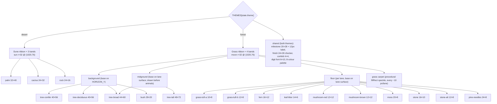

# Theme art — 2× desert decor + fonts + 120 px sky, and the new forest decor set

Procedural pixel art for the `1280×720` buffer. No image files: the matrices below
drive the same `drawSprite` pixel loop as [`camel-sprite.md`](camel-sprite.md).
This doc is the authoritative source for the **decor / sky / font** sprites;

- Tasks 7–9 copy the matrices and constants below verbatim into `index.html`.
- The camel (`66×62`) is owned by `camel-sprite.md`; the boar (`≤76×70`) by
  `boar-sprite.md`. This doc does **not** redefine the animals.

| Item | Value |
|---|---|
| Buffer | **1280 × 720** (16:9), `ctx.imageSmoothingEnabled = false` |
| `HORIZON_Y` | **120** |
| `LANE_BOTTOM` | **712** (`720 − 8`) |
| lane region | **592** |
| `laneHeight(8)` | **74.0** |
| Decor spacing / cull | **32 / 48 / 20** (background / midground / floor, world points) / **1500** (`SEED = 1337`) |
| Themes | `desert` (camel + dunes), `forest` (boar + grass/treeline) |
| Previews | gitignored `test-results/ux-tmp/` (see [Previews](#6-previews)) |
| Reference | `camel-sprite.md` dune tokens + the shipped `640×360` art in `index.html` |

Everything here is an **exact 2× re-author** of the current `640×360` art (desert)
or a brand-new **forest** set. The terrain silhouette math (`h(x)`, amplitude `±2`)
is unchanged; only the palette and the sprite matrices change per theme.

---

## 1. Digit font `6 × 10`

Single source of truth: the existing `3×5` `DIGIT_FONT` (`index.html`). The `6×10`
glyphs are **derived**, not re-authored: the renderer must double the source, never
ship a second table.

### 1.1 Source — `DIGIT_FONT` (`3 × 5`, `#` lit, `.` transparent)

```js
const DIGIT_FONT = {
  '1': ['.#.', '##.', '.#.', '.#.', '###'],
  '2': ['###', '..#', '###', '#..', '###'],
  '3': ['###', '..#', '###', '..#', '###'],
  '4': ['#.#', '#.#', '###', '..#', '..#'],
  '5': ['###', '#..', '###', '..#', '###'],
  '6': ['###', '#..', '###', '#.#', '###'],
  '7': ['..#', '..#', '..#', '..#', '..#'],
  '8': ['###', '#.#', '###', '#.#', '###'],
  '9': ['###', '#.#', '###', '..#', '###'],
  '0': ['###', '#.#', '#.#', '#.#', '###'],
};
```

### 1.2 Derivation rule (renderer)

```
upscale2x(row)   = row[0]*2 + row[1]*2 + row[2]*2        // 3 chars -> 6 chars
upscale2x(glyph) = [row for r in glyph for row in (u(r), u(r))]  // 5 rows -> 10
```

Equivalent per-pixel draw for a glyph at render origin `(ox, oy)`:

```js
for (let ry = 0; ry < 5; ry++)
  for (let rx = 0; rx < 3; rx++)
    if (DIGIT_FONT[n][ry][rx] === '#')
      ctx.fillRect(ox + 2*rx, oy + 2*ry, 2, 2);   // 2x2 block
```

Validation asserts `upscale2x(DIGIT_FONT[n]) === GLYPH_6x10[n]` for all `n` in `0–9`
(see [Validation](#5-validation)). At `SCALE_MAX = 2` a `6×10` glyph renders at the
same on-screen size as today's `3×5` at `4×` → identical legibility, no re-authoring.
Digit ink `#123a44`; drops `2 px` with the body on bob frames `2, 4` per animal doc.

### 1.3 Reference matrices — `6 × 10` (2× nearest-neighbour of §1.1)

```
 1       2       3       4       5       6       7       8       9       0
..##..  ######  ######  ##..##  ######  ######  ....##  ######  ######  ######
..##..  ######  ######  ##..##  ######  ######  ....##  ######  ######  ######
####..  ....##  ....##  ##..##  ##....  ##....  ....##  ##..##  ##..##  ##..##
####..  ....##  ....##  ##..##  ##....  ##....  ....##  ##..##  ##..##  ##..##
..##..  ######  ######  ######  ######  ######  ....##  ######  ######  ##..##
..##..  ######  ######  ######  ######  ######  ....##  ######  ######  ##..##
..##..  ##....  ....##  ....##  ....##  ##..##  ....##  ##..##  ....##  ##..##
..##..  ##....  ....##  ....##  ....##  ##..##  ....##  ##..##  ....##  ##..##
######  ######  ######  ....##  ######  ######  ....##  ######  ######  ######
######  ######  ######  ....##  ######  ######  ....##  ######  ######  ######
```

Exact strings (for tests / copying):

```js
const DIGIT_6x10 = {
  '1': ['..##..','..##..','####..','####..','..##..','..##..','..##..','..##..','######','######'],
  '2': ['######','######','....##','....##','######','######','##....','##....','######','######'],
  '3': ['######','######','....##','....##','######','######','....##','....##','######','######'],
  '4': ['##..##','##..##','##..##','##..##','######','######','....##','....##','....##','....##'],
  '5': ['######','######','##....','##....','######','######','....##','....##','######','######'],
  '6': ['######','######','##....','##....','######','######','##..##','##..##','######','######'],
  '7': ['....##','....##','....##','....##','....##','....##','....##','....##','....##','....##'],
  '8': ['######','######','##..##','##..##','######','######','##..##','##..##','######','######'],
  '9': ['######','######','##..##','##..##','######','######','....##','....##','######','######'],
  '0': ['######','######','##..##','##..##','##..##','##..##','##..##','##..##','######','######'],
};
// derived only — regenerated by upscale2x(DIGIT_FONT) at load time
```

> `7` staying a bare right column is faithful to the source `3×5` — do **not** add a
> top bar; that would diverge from the single source of truth.

---

## 2. Desert theme at 2×

Palette of the shipped `640×360` art, re-authored at `1280×720`. All matrices below
are exactly 2× the current dimensions (more internal detail allowed).

| Element | Old (640×360) | New (1280×720) | Matrix |
|---|---|---|---|
| Sky bands | 3 tones, 88 px strip | 3 tones, 120 px strip (`40 px`/band) | procedural |
| Sun | `cx 510, cy 38, r 16` | `cx 1020, cy 76, r 32` | procedural |
| `PALM` | `16×20` | **`32×40`** | `O B S G` |
| `CACTUS` | `12×16` | **`24×32`** | `O B S` |
| `ROCK` | `12×8` | **`24×16`** | `O B S` |
| `MILESTONE` | `10×14` | **`20×28`** | `O P F` |
| `FINISH_FLAG` | `12×14` | **`24×28`** | `O P C X` |
| Milestone label | `6px` mono | **`12px` mono** | — |
| Team label | — | **`12px` mono** `#e8e0d0` | — |
| Winner banner | `8px` mono | **`16px` mono** | — |
| Confetti particle | `2×2` | **`4×4`** | — |

### 2.1 Sky bands + sun

```js
const SKY_BANDS = ['#1a1030', '#241640', '#2e1c4a'];   // unchanged tones
// bandH = Math.ceil(HORIZON_Y / SKY_BANDS.length) = Math.ceil(120/3) = 40
```

| Token | Hex | Use |
|---|---|---|
| `skyBand0` | `#1a1030` | deep night (top, 40 px) |
| `skyBand1` | `#241640` | mid band |
| `skyBand2` | `#2e1c4a` | horizon band |
| `sun` | `#e8a03a` | sun disc fill |
| `sunRim` | `#f0c060` | outer ring (`|dy| > r − 6` at 2×) |

Sun is procedural (no matrix): centre `(1020, 76)`, radius `32`; ring thickness `6 px`
(2× the old `3 px`). Spans rows `44–108` — fully inside the `120 px` sky.
Contrast `#f0c060` on `#241640` = **10.09** ✓ AA; on `#1a1030` higher.

### 2.2 Dune tokens (existing sand palette — unchanged)

| Token | Hex | Use |
|---|---|---|
| `ground.top` | `#c9a25a` | lit sand ribbon fill |
| `ground.shade` | `#a8813f` | shaded sand / lee side |
| `ground.edge` | `#6e4f2a` | crease between ribbons / under `LANE_BOTTOM` |
| `ground.rim` | `#523a1e` | thin darker rim under the lit crest |

Terrain profile `h(x)` is unchanged: `A1=1.2, L1=160, PH1=0, A2=0.8, L2=130, PH2=1.7`,
clamped `±2 px`. `#1a1208` outline on `#c9a25a` = **7.76** ✓ AA.

### 2.3 Decor sprites — legend + palette

`PALM_PAL`, `CACTUS_PAL`, `ROCK_PAL` extend the shipped ones (added `shade`):

```js
const PALM_PAL   = { body:'#6b4a2a', shade:'#4a3320', harness:'#2f6b3a' }; // G = fronds
const CACTUS_PAL = { body:'#2f6b3a', shade:'#1f4a26' };
const ROCK_PAL   = { body:'#6b5570', shade:'#4a3a52' };
```

| char | meaning | colour | per-lane? |
|---|---|---|---|
| `.` | transparent | — | — |
| `O` | outline | `#1a1208` | no |
| `B` | body (trunk/rock/cactus body) | per sprite | no |
| `S` | shade | per sprite | no |
| `G` | fronds | `#2f6b3a` | no |

`yOffset` (relative to `HORIZON_Y`, base on the horizon): palm `−40`, cactus `−32`,
rock `−16` (= minus the sprite height).

**`PALM` — `const PALM` (`32 × 40`)**

```
................................
................................
................O...............
...............OGO.....O........
........OO.....OGO...OOGO.......
.......OGGOOO..OGO.OOGGO........
........OOGGGO.OGOOGGGO.........
..........OGGGOOGOGGGO..........
..........OOGGGOGGGGGGOOOOOO....
....OOOOOOGGGGGGGGGGGGGGGGGGO...
...OGGGGGGGGGGGGGGGGGGOOOOOO....
....OOOOOOGGGGGGGGGGGGGO........
......OOOGGGGGGGGGGGGGGGOOO.....
.....OGGGOGGGOOBBSOOGGGOGGGO....
...OOGGOO.OOO.OBBSO.OOO.OOGGOO..
..OGGOO.......OBBSO.......OOGGO.
...OO.........OBBSO.........OO..
..............OBBSO.............
...............OBBSO............
...............OBBSO............
...............OBBSO............
...............OBBSO............
...............OBBSO............
...............OBBSO............
...............OBBSO............
...............OBBSO............
...............OBBSO............
...............OBBSO............
...............OBBSO............
................OBBSO...........
................OBBSO...........
................OBBSO...........
................OBBSO...........
................OBBSO...........
...............OOBBSO...........
..............OBOBBSO...........
...............O.OOO............
................................
................................
................................
```

**`CACTUS` — `const CACTUS` (`24 × 32`)**

```
........................
.........OOOO...........
........OBBBBO..........
........OBBBBO..........
........OBBBSO..........
........OBBBSO..OOOO....
........OBBBSO.OBBBBO...
........OBBBSO.OBBBBO...
...OOOO.OBBBSO.OBBBBO...
..OBBBBOOBBBSO.OBBBBO...
..OBBBBOOBBBSO.OBBBBO...
..OBBBBOOBBBSO.OBBBBO...
..OBBBBOOBBBSO.OBBBBO...
..OBBBBOOBBBSO.OBBBBO...
..OBBBBOOBBBSOOOBBBBO...
..OBBBBOOBBBSBBBBBBBO...
..OBBBBOOBBBSOOOOOOO....
..OBBBBOOBBBSO..........
..OBBBBOOBBBSO..........
..OBBBBBBBBBSO..........
...OOOOOOBBBSO..........
........OBBBSO..........
........OBBBSO..........
........OBBBSO..........
........OBBBSO..........
........OBBBSO..........
........OBBBSO..........
........OBBBSO..........
........OBBBSO..........
........OBBBSO..........
.........OOOO...........
........................
```

**`ROCK` — `const ROCK` (`24 × 16`)**

```
........................
........................
.......OOO..............
.....OOBBBOO............
....OBBBBBBBOOOO........
....OBBBBBBBBBBBOO......
....OBBBBBBBBBBBBBO.....
...OBBBBBBBBBBBBBBBO....
....OBBBBBBBBBBBBBBBO...
...OBBBBBBBBBBBBBBBBBO..
..OBBBBBBBBBBBBBBBBBBBO.
..OBBBBBBBBBBBBBBBBBBBO.
..OBBBBBBBBBSSSSSSSSSBO.
..OBBBBBBBBBSSSSSSSSSBO.
...OOOOOOOOOOOOOOOOOOO..
........................
```

### 2.4 Milestone flag + `6×10` label placement

Legend adds `P` pole `#d8d8d8`, `F` flag `#e8c83a`. Base stands on the terrain:
`flagY = HORIZON_Y − 28 − round(terrainHeightAt(m))` (2× the old `−14`).

**`MILESTONE` — `const MILESTONE` (`20 × 28`)**

```
....................
....................
..OO................
.OPPOOOOOOOOOOOOOO..
.OPPFFFFFFFFFFFFFFO.
.OPPFFFFFFFFFFFFFFO.
.OPPFFFFFFFFFFFFFFO.
.OPPFFFFFFFFFFFFFFO.
.OPPFFFFFFFFFFFFFFO.
.OPPFFFFFFFFFFFFFFO.
.OPPFFFFFFFFFFFFFFO.
.OPPFFFFFFFFFFFFFFO.
.OPPFFFFFFFFFFFFFFO.
.OPPOOOOOOOOOOOOOO..
.OPPO...............
.OPPO...............
.OPPO...............
.OPPO...............
.OPPO...............
.OPPO...............
.OPPO...............
.OPPO...............
.OPPO...............
.OPPO...............
.OPPO...............
.OPPO...............
..OO................
....................
```

**Label placement rule:**

```js
ctx.font = '12px monospace';      // was 6px
ctx.textBaseline = 'top';
const label = String(m);          // m = milestone world value (step 50)
const x = mapX(m, win) - 4;       // was -2
const flagY = HORIZON_Y - 28 - Math.round(core.terrainHeightAt(m));
drawSprite(MILESTONE, x, flagY, { outline:'#1a1208', pole:'#d8d8d8', flag:'#e8c83a' });
// skip the number (flag still drawn) when the 50-pt step is narrower than the label:
if (stepPx < ctx.measureText(label).width + 8) continue;   // was +4
ctx.fillStyle = '#e8e0d0';
ctx.fillText(label, x + 20, flagY + 8);            // was (x+10, flagY+3)
```

Label ink `#e8e0d0` on the band behind it (`#241640`) = **12.66** ✓ AA.

### 2.5 Checkered finish pole / flag

`COL` unchanged: `{ outline:'#1a1208', pole:'#d8d8d8', checkerLight:'#f0f0f0',
checkerDark:'#1a1a1a', flag:'#e8c83a' }`. The pole stripe drawn by code becomes
`8×8` cells (was `4×4`), starting at `stripeX = x + 8` (was `x + 4`).

**`FINISH_FLAG` — `const FINISH_FLAG` (`24 × 28`)**

```
........................
........................
..OO....................
.OPPOOOOOOOOOOOOOOOOOO..
.OPPCCXXCCXXCCXXCCXXCCO.
.OPPCCXXCCXXCCXXCCXXCCO.
.OPPXXCCXXCCXXCCXXCCXXO.
.OPPXXCCXXCCXXCCXXCCXXO.
.OPPCCXXCCXXCCXXCCXXCCO.
.OPPCCXXCCXXCCXXCCXXCCO.
.OPPXXCCXXCCXXCCXXCCXXO.
.OPPXXCCXXCCXXCCXXCCXXO.
.OPPCCXXCCXXCCXXCCXXCCO.
.OPPCCXXCCXXCCXXCCXXCCO.
.OPPXXCCXXCCXXCCXXCCXXO.
.OPPXXCCXXCCXXCCXXCCXXO.
.OPPCCXXCCXXCCXXCCXXCCO.
.OPPCCXXCCXXCCXXCCXXCCO.
.OPPOOOOOOOOOOOOOOOOOO..
.OPPO...................
.OPPO...................
.OPPO...................
.OPPO...................
.OPPO...................
.OPPO...................
.OPPO...................
..OO....................
........................
```

**Pole stripe (code):**

```js
const stripeX = x + 8;
for (let y = poleTop; y < LANE_BOTTOM; y += 8)
  ctx.fillStyle = (Math.floor((y - poleTop) / 8) % 2 === 0)
    ? COL.checkerLight : COL.checkerDark,
  ctx.fillRect(stripeX, y, 8, 8);
```

`#e8c83a` flag on `#1a1208` = **11.25** ✓, on sky `#241640` = **10.09** ✓.

### 2.6 Confetti (2×)

| Token | Old | New |
|---|---|---|
| particle | `2×2` | **`4×4`** |
| `CONFETTI_COUNT` | 60 | **60** (unchanged) |
| gravity | `140` | **`280`** px/s² |
| `vx` | `(rng()*2−1)*60` | **`(rng()*2−1)*120`** |
| `vy` | `−(rng()*60+30)` | **`−(rng()*120+60)`** |
| life | `900 + rng()*300` | **`900 + rng()*300`** (unchanged) |

`CONFETTI_COLORS` unchanged (8 lane colours + `#f0f0f0`). Winner banner font
`16px monospace`, box height `24` (was `12`), padding `16`.

### 2.7 Desert `THEMES.desert` wiring (excerpt)

```js
palette: { sky: ['#1a1030','#241640','#2e1c4a'], sun:'#e8a03a', sunRim:'#f0c060', accent:'#e8c83a' },
ground:  { top:'#c9a25a', shade:'#a8813f', edge:'#6e4f2a', rim:'#523a1e' },
decor: { spacing:90, maxSpan:1500, kinds: [
  { kind:'palm',   weight:0.34, sprite:PALM,   pal:PALM_PAL,   yOffset:-40 },
  { kind:'cactus', weight:0.33, sprite:CACTUS, pal:CACTUS_PAL, yOffset:-32 },
  { kind:'rock',   weight:0.33, sprite:ROCK,   pal:ROCK_PAL,   yOffset:-16 },
]},
```

Placement is byte-identical to today (same `SEED=1337`, `mulberry32(hash2(SEED,k))`,
`spacing 90`, `maxSpan 1500`, jitter `⌊rng()*40−20⌋`, thresholds `0.34 / 0.67`).

---

## 3. Forest theme (new)

Dusk sky + moon over grass lanes with a treeline, midground trees standing in the
track, and dense procedural floor cover (grass carpet + sprites).

### 3.1 Dusk sky bands + moon

```js
const FOREST_SKY = ['#241a3a', '#3a2450', '#5a3050', '#7a3f4a'];  // 4 x 30 px = 120
```

| Token | Hex | Use |
|---|---|---|
| `sky[0]` | `#241a3a` | top night violet (30 px) |
| `sky[1]` | `#3a2450` | upper dusk |
| `sky[2]` | `#5a3050` | dusk mauve |
| `sky[3]` | `#7a3f4a` | warm horizon glow |
| `moon` | `#f0e8c0` | moon disc fill |
| `moonRim` | `#d8c890` | moon outer ring |
| `accent` | `#e8c83a` | milestone flag / UI accent (shared) |

Moon is procedural (no matrix): centre `(1020, 76)`, radius `32`, ring `6 px` —
same slot the desert sun occupies, so composition never shifts between themes.
Contrast `#f0e8c0` on `#3a2450` = **10.99** ✓ AA (its top edge overlaps band 1).

### 3.2 Forest floor / grass ground tokens

Same **dune-ribbon rendering model** as desert (one ribbon per lane, lit crest offset
by the shared `h(x)`, `rim` 1 px under the crest, `edge` at the ribbon bottom and
below `LANE_BOTTOM`). Only the palette changes — the terrain silhouette math is
identical, so lane geometry / fit are untouched.

| Token | Hex | Use |
|---|---|---|
| `ground.top` | `#4a7a3a` | lit grass fill |
| `ground.shade` | `#3a6030` | grass shade stripe (`crest + 3`, 2 px) |
| `ground.edge` | `#26401f` | crease between ribbons / under `LANE_BOTTOM` |
| `ground.rim` | `#1c3018` | darker rim under the lit crest |

`#1a1208` outline on `#4a7a3a` = **3.65** ≥ 3:1 (non-text UI / silhouettes) ✓.
`ground.top` vs `ground.shade`, `ground.edge`, `ground.rim` all separate cleanly
(darker greens); grass reads as a continuous band with a `#1c3018` crest line.

### 3.3 Decor set — inventory, sizes, legends

Every forest sprite has a 1 px **transparent margin on all four sides** (clean border,
no clipping); sprites are a single 4-connected blob, fully `O`-enclosed. `yOffset`:
**background** kinds (trees/bush) base on `HORIZON_Y`; **floor** kinds anchor on the
lane's `terrainSurfaceY` (negative = up).

| kind | sprite | matrix | legend | layer | `yOffset` |
|---|---|---|---|---|---|
| `tree-conifer` | `FOREST_TREE_CONIFER` | `40 × 56` | `O T S B` | background | −56 |
| `tree-deciduous` | `FOREST_TREE_DECIDUOUS` | `40 × 56` | `O T S B` | background | −56 |
| `tree-broad` | `FOREST_TREE_BROAD` | `44 × 60` | `O T S B R` | background **and** midground | −60 |
| `bush` | `FOREST_BUSH` | `28 × 20` | `O T S` | background | −20 |
| `tree-tall` | `FOREST_TREE_TALL` | `48 × 72` | `O T S B R` | midground | −72 |
| `grass-tuft-a` | `GRASS_TUFT_A` | `10 × 8` | `O G H` | floor | −8 |
| `grass-tuft-b` | `GRASS_TUFT_B` | `12 × 8` | `O G H` | floor | −8 |
| `fern` | `FERN` | `16 × 12` | `O G H` | floor | −12 |
| `leaf-litter` | `LEAF_LITTER` | `14 × 6` | `O L H` | floor | −6 |
| `mushroom-red` | `MUSHROOM_RED` | `12 × 12` | `O C W T` | floor | −12 |
| `mushroom-brown` | `MUSHROOM_BROWN` | `12 × 12` | `O C G T` | floor | −12 |
| `moss` | `MOSS` | `20 × 8` | `O M N` | floor | −8 |
| `stone` | `STONE` | `16 × 10` | `O B S` | floor | −10 |
| `stone-alt` | `STONE_ALT` | `12 × 8` | `O B S` | floor | −8 |
| `pine-needles` | `PINE_NEEDLES` | `24 × 8` | `O P` | floor | −8 |

Sizes are exact (validated, §5). `yOffset` is signed from the anchor: background
kinds from `HORIZON_Y`, midground/floor kinds from the lane `terrainSurfaceY`
(negative = up). **Weights are per placement stream** (background / midground /
floor), not global — see §3.4.1.

Legend chars (forest): `.` transparent, `O` outline; `T` canopy light,
`S` canopy/stone shade, `B` trunk / stone body, `R` root/base dark; `C` mushroom
cap, `W` cap spot, `G` blade-mid / frond-rib / gills, `H` blade/frond/leaf light,
`L` leaf body, `M` moss light, `N` moss dark, `P` pine needles.

```js
const FOREST_TREE_PAL_CONIFER   = { outline:'#1a1208', T:'#2f6b3a', S:'#1f4a2a', B:'#4a3320' };
const FOREST_TREE_PAL_DECIDUOUS = { outline:'#1a1208', T:'#3a8a4a', S:'#2a6234', B:'#4a3320' };
const FOREST_BUSH_PAL   = { outline:'#1a1208', T:'#3a8a4a', S:'#2a6234' };
const MUSHROOM_RED_PAL  = { outline:'#1a1208', C:'#c0392b', W:'#f0ece0', T:'#e8dcc0' };
const MUSHROOM_BROWN_PAL= { outline:'#1a1208', C:'#8a5a3a', G:'#6b4a2a', T:'#e8dcc0' };
const MOSS_PAL          = { outline:'#1a1208', M:'#3f7a35', N:'#2f5a28' };
const STONE_PAL         = { outline:'#1a1208', B:'#8a8a92', S:'#5a5a62' };
const NEEDLES_PAL       = { outline:'#1a1208', P:'#8a5a3a' };
// --- new floor cover (grass tufts / fern share the floor-green legend O G H) ---
const GRASS_TUFT_PAL  = { outline:'#1a1208', G:'#2f6b3a', H:'#7ac25a' };
const FERN_PAL        = { outline:'#1a1208', G:'#2f6b3a', H:'#7ac25a' };
const LEAF_LITTER_PAL = { outline:'#1a1208', L:'#8a5a3a', H:'#b07a4a' };
// --- new trees (R = dark root/base tone so the trunk reads as standing) ---
const FOREST_TREE_TALL_PAL  = { outline:'#1a1208', T:'#2f6b3a', S:'#1f4a2a', B:'#4a3320', R:'#2a1c10' };
const FOREST_TREE_BROAD_PAL = { outline:'#1a1208', T:'#3a8a4a', S:'#2a6234', B:'#4a3320', R:'#2a1c10' };
```

**`FOREST_TREE_CONIFER` — `const FOREST_TREE_CONIFER` (`40 × 56`)**

```
........................................
........................................
..................OOOO..................
.................OTTTTO.................
.................OTTTTO.................
................OTTTTTTO................
...............OTTTTTTTTO...............
...............OTTTTTTTTO...............
..............OTTTTTTTTTTO..............
.............OTTTTTTTSTTTTO.............
............OTTTTTTTTSSTTTTO............
............OTTTTTTTTSSTTTTO............
.............OOOTTTTTSSSOOO.............
..............OTTTTTTSSSSO..............
..............OTTTTTTSSSSO..............
.............OTTTTTTTSSSSSO.............
..............OTTTTTTSSSSO..............
.............OTTTTTTTSSSSSO.............
............OTTTTTTTTSSSSSSO............
...........OTTTTTTTTTSSSSSSSO...........
..........OTTTTTTTTTTSSSSSSSSO..........
.........OTTTTTTTTTTTSSSSSSSSSO.........
..........OOOOTTTTTTTSSSSSOOOO..........
...........OOTTTTTTTTSSSSSSOO...........
..........OTTTTTTTTTTSSSSSSSSO..........
........OOTTTTTTTTTTTSSSSSSSSSOO........
.......OTTTTTTTTTTTTTSSSSSSSSSSSO.......
......OTTTTTTTTTTTTTTSSSSSSSSSSSSO......
.......OOOOOOTTTTTTTTSSSSSSOOOOOO.......
.........OOTTTTTTTTTTSSSSSSSSOO.........
.......OOTTTTTTTTTTTTSSSSSSSSSSOO.......
......OTTTTTTTTTTTTTTSSSSSSSSSSSSO......
....OOTTTTTTTTTTTTTTTSSSSSSSSSSSSSOO....
...OTTTTTTTTTTTTTTTTTSSSSSSSSSSSSSSSO...
....OOOOOOOOTTTTTTTTTSSSSSSSOOOOOOOO....
.........OTTTTTTTTTTTSSSSSSSSSO.........
.......OOTTTTTTTTTTTTSSSSSSSSSSOO.......
.....OOTTTTTTTTTTTTTTSSSSSSSSSSSSOO.....
...OOTTTTTTTTTTTTTTTTSSSSSSSSSSSSSSOO...
..OTTTTTTTTTTTTTTTTTTSSSSSSSSSSSSSSSSO..
...OOOOOOOOOOOOOOOBBBBOOOOOOOOOOOOOOO...
.................OBBBBO.................
.................OBBBBO.................
.................OBBBBO.................
.................OBBBBO.................
.................OBBBBO.................
.................OBBBBO.................
.................OBBBBO.................
.................OBBBBO.................
................OBBBBBBO................
................OBBBBBBO................
................OBBBBBBO................
.................OOOOOO.................
........................................
........................................
........................................
```

**`FOREST_TREE_DECIDUOUS` — `const FOREST_TREE_DECIDUOUS` (`40 × 56`)**

```
........................................
..................OOOOO.................
................OOTTTTTOO...............
...............OTTTTTTTTTO..............
..............OTTTTTTTTTTTO.............
..............OTTTTTTTTTTTO.............
..........OOOOTTTTTTTTTTTTTO............
.........OTTTTTTTTTTTTTTTTTSOOO.........
........OTTTTTTTTTTTTTTTTTTTTTTO........
.......OTTTTTTTTTTTTTTTTTTTTTTTTO.......
......OTTTTTTTTTTTTTTTTTTTTTTTTTTO......
......OTTTTTTTTTTTTTTTTTTTTTTTTTTTO.....
......OTTTTTTTTTTTTTTTTTTTTTTTTTTTO.....
......OTTTTTTTTTTTTTTTTTTTTTTTTTTTO.....
......OTTTTTTTTTTTTTTTTTTTTTTTTTTTO.....
.....OTTTTTTTTTTTTTTTSSTTTTTTTTTTTSO....
.....OTTTTTTTTTTTTTTTSSSTTTTTTTTTSSO....
.....OTTTTTTTTTTTTTTTSSSSTTTTTTTSSSO....
.....OTTTTTTTTTTTTTTTSSSSSTTTTTSSSSO....
.....OTTTTTTTTTTTTTTTSSSSSSSSSSSSSSO....
....OTTTTTTTTTTTTTTTTSSSSSSSSSSSSSSSO...
.....OSSSSSSSSSSSSSSSSSSTTTTTSSSSSSO....
.....OSSSSSSSTTTTTSSSSSTTTTTTTSSSSSO....
.....OSSSSSSTTTTTTTSSSTTTTTTTTTSSSSO....
.....OSSSSSTTTTTTTTTSTTTTTTTTTTTSSSO....
.....OSSSSTTTTTTTTTTTTTTTTTTTTTTSSSO....
......OSSSTTTTTTTTTTTTTTTTTTTTTTSSO.....
......OSSSTTTTTTTTTTTTTTTTTTTTTTSSO.....
.......OSSTTTTTTTTTTTTTTTTTTTTTTSO......
.......OSSTTTTTTTTTTTSTTTTTTTTTSSO......
........OSSTTTTTTTTTSSSTTTTTTTSSO.......
.........OSSTTTTTTTSSSSSTTTTTSSO........
..........OSSTTTTTSSSSSSSSSSSSO.........
...........OOSSSSSSSSSSSSSSSOO..........
.............OOSSSSSSSSSSSOO............
...............OOOBBSBBOOO..............
..................OBBBBO................
..................OBBBBO................
..................OBBBBO................
..................OBBBBO................
..................OBBBBO................
..................OBBBBO................
..................OBBBBO................
..................OBBBBO................
..................OBBBBO................
..................OBBBBO................
..................OBBBBO................
..................OBBBBO................
..................OBBBBO................
..................OBBBBO................
..................OBBBBO................
..................OBBBBO................
..................OBBBBO................
..................OBBBBO................
...................OOOO.................
........................................
```

**`FOREST_BUSH` — `const FOREST_BUSH` (`28 × 20`)**

```
............................
............................
..............O.............
........OOOOOOTOOOOO........
.......OTTTTTTTSSSSSOO......
.....OOTTTTTTTTSSTTTTTOO....
....OTTTTTTTTTTSTTTTTTTSO...
....OTTTTTTTTTTTTTTTTTTTO...
...OTTTTTTTTTTTTTTTTTTTTSO..
...OTTTTTTTTTTTTTTTTTTTTSO..
..OTTTTTTTTTTTTTTTTTTTTTSSO.
...OTTTTTTTTTTTTTTTTTTTTSO..
...OTTTTTTTTTTTSTTTTTTTSSO..
....OTTTTTTTTTTSSTTTTTSSO...
....OTTTTTTTTTTSSSSSSSSSO...
.....OOTTTTTTTTSSSSSSSOO....
.......OOTTTTTTSSSSSOO......
.........OOOOOTOOOOO........
..............O.............
............................
```

**`MUSHROOM_RED` — `const MUSHROOM_RED` (`12 × 12`)**

```
............
......O.....
.....OCO....
....OWCCO...
...OCCCCWO..
...OWCCCCO..
..OCCTTCCCO.
...OOTTOOO..
....OTTO....
....OTTO....
.....OO.....
............
```

**`MUSHROOM_BROWN` — `const MUSHROOM_BROWN` (`12 × 12`)**

```
............
......O.....
.....OCO....
....OCCCO...
...OCCCCCO..
...OCCCCCO..
..OGGTTGGGO.
...OOTTOOO..
....OTTO....
....OTTO....
.....OO.....
............
```

**`MOSS` — `const MOSS` (`20 × 8`)**

```
....................
......OOOOOOOO......
....OONMMNMMNMOOO...
...OMNMMNMMNMMNMMO..
..OMNMMNMMNMMNMMNMO.
.OMNMMNMMNMMNMMNMMO.
..OOOOOOOOOOOOOOOO..
....................
```

**`STONE` — `const STONE` (`16 × 10`)**

```
................
.....OOOOOO.....
...OOBBBBBBOO...
..OBBBBBBBBBBO..
.OBBBBBBBBBBBBO.
.OBBBBBBSSSSSSO.
.OBBBBBBSSSSSSO.
.OBBBBBBBBBBBBO.
..OOOOOOOOOOOO..
................
```

**`STONE_ALT` — `const STONE_ALT` (`12 × 8`)**

```
............
....OOOO....
..OOBBBBOO..
.OBBBBBBBBO.
.OBBBBBBBBO.
.OBBBBBBBBO.
..OOOOOOOO..
............
```

**`PINE_NEEDLES` — `const PINE_NEEDLES` (`24 × 8`)**

```
........................
.......OOOOOOO.OOOOO....
.....OOPPPPPPPOPPPPPO...
....OPPPPOPPOPPPPPPPO...
....OOPOOPPOOOPOOPOO....
...OPPOOPOOOPPOOPO......
....OO..O...OO..O.......
........................
```

**`GRASS_TUFT_A` — `const GRASS_TUFT_A` (`10 × 8`)** — 2-blade cluster; mid tone `G`, light blade `H` so it reads on the `#4a7a3a` floor.

```
..........
....OO....
...OGGO...
...OGHO...
.OOGHGGOO.
.OGGGGGGO.
..OOOOOO..
..........
```

**`GRASS_TUFT_B` — `const GRASS_TUFT_B` (`12 × 8`)** — taller 3-blade cluster, same `O G H` legend.

```
............
...OO...OO..
..OGGO.OGGO.
..OGHO.OGHO.
.OOGHGOOGGO.
.OGGGGGGGGO.
..OOOOOOOO..
............
```

**`FERN` — `const FERN` (`16 × 12`)** — arching frond (rib `G`, pinnae `H`), deliberately asymmetric so it never reads as a mini-conifer.

```
................
.............OO.
...........OOHO.
.........OOHHHO.
.......OOHHHHO..
.....OOHHGHHO...
...OOHHGHHOO....
..OHHGHHOO......
..OHGHOO........
..OOOO..........
................
................
```

**`LEAF_LITTER` — `const LEAF_LITTER` (`14 × 6`)** — a few fallen leaves, legend `O L H` (leaf body / leaf light); readable at 1×.

```
..............
..OO..OOO.....
.OLLOOLLHO....
.OLLLLLLHO....
..OOOOOOO.....
..............
```

**`FOREST_TREE_TALL` — `const FOREST_TREE_TALL` (`48 × 72`)** — the **midground** conifer: tall layered canopy (`T`/`S`), a visible 6-px trunk (`B`), root flare in the dark base tone `R` `#2a1c10` so the base reads as standing on the ground.

```
................................................
................................................
......................OOO.......................
......................OTO.......................
.....................OTTSO......................
.....................OTTSO......................
....................OOTTSOO.....................
......................OTO.......................
...................OOOTTSOOO....................
...................OTTTTSSSO....................
...................OTTTTSSSO....................
..................OTTTTTSSSSO...................
..................OTTTTTSSSSO...................
...................OTTTTSSSO....................
.................OOTTTTTSSSSOO..................
.................OTTTTTTSSSSSO..................
................OTTTTTTTSSSSSSO.................
................OTTTTTTTSSSSSSO.................
...............OOTTTTTTTSSSSSSOO................
.................OTTTTTTSSSSSO..................
..............OOOTTTTTTTSSSSSSOOO...............
..............OTTTTTTTTTSSSSSSSSO...............
..............OTTTTTTTTTSSSSSSSSO...............
.............OTTTTTTTTTTSSSSSSSSSO..............
.............OTTTTTTTTTTSSSSSSSSSO..............
..............OTTTTTTTTTSSSSSSSSO...............
............OOTTTTTTTTTTSSSSSSSSSOO.............
...........OTTTTTTTTTTTTSSSSSSSSSSSO............
...........OTTTTTTTTTTTTSSSSSSSSSSSO............
...........OTTTTTTTTTTTTSSSSSSSSSSSO............
..........OOTTTTTTTTTTTTSSSSSSSSSSSOO...........
............OTTTTTTTTTTTSSSSSSSSSSO.............
.........OOOTTTTTTTTTTTTSSSSSSSSSSSOOO..........
.........OTTTTTTTTTTTTTTSSSSSSSSSSSSSO..........
.........OTTTTTTTTTTTTTTSSSSSSSSSSSSSO..........
........OTTTTTTTTTTTTTTTSSSSSSSSSSSSSSO.........
........OTTTTTTTTTTTTTTTSSSSSSSSSSSSSSO.........
.........OTTTTTTTTTTTTTTSSSSSSSSSSSSSO..........
.......OOTTTTTTTTTTTTTTTSSSSSSSSSSSSSSOO........
......OTTTTTTTTTTTTTTTTTSSSSSSSSSSSSSSSSO.......
......OTTTTTTTTTTTTTTTTTSSSSSSSSSSSSSSSSO.......
......OTTTTTTTTTTTTTTTTTSSSSSSSSSSSSSSSSO.......
.....OOTTTTTTTTTTTTTTTTTSSSSSSSSSSSSSSSSOO......
.......OTTTTTTTTTTTTTTTTSSSSSSSSSSSSSSSO........
....OOOTTTTTTTTTTTTTTTTTSSSSSSSSSSSSSSSSOOO.....
....OTTTTTTTTTTTTTTTTTTTSSSSSSSSSSSSSSSSSSO.....
....OTTTTTTTTTTTTTTTTTTTSSSSSSSSSSSSSSSSSSO.....
...OTTTTTTTTTTTTTTTTTTTTSSSSSSSSSSSSSSSSSSSO....
...OTTTTTTTTTTTTTTTTTTTTSSSSSSSSSSSSSSSSSSSO....
....OTTTTTTTTTTTTTTTTTTTSSSSSSSSSSSSSSSSSSO.....
..OOTTTTTTTTTTTTTTTTTTTTSSSSSSSSSSSSSSSSSSSOO...
..OOOOOOOOOOOOOOOOOOOTTTSSSOOOOOOOOOOOOOOOOOO...
.....................OBBBBO.....................
.....................OBBBBO.....................
.....................OBBBBO.....................
.....................OBBBBO.....................
.....................OBBBBO.....................
.....................OBBBBO.....................
.....................OBBBBO.....................
.....................OBBBBO.....................
.....................OBBBBO.....................
.....................OBBBBO.....................
.....................OBBBBO.....................
.....................OBBBBO.....................
.....................OBBBBO.....................
.....................OBBBBO.....................
....................ORRRRRRO....................
...................ORRRRRRRRO...................
..................ORRRRRRRRRRO..................
..................OOOOOOOOOOOO..................
................................................
................................................
```

**`FOREST_TREE_BROAD` — `const FOREST_TREE_BROAD` (`44 × 60`)** — broad upright tree with branch stubs; same `O T S B R` legend, used for background variety **and** as the midground minority.

```
............................................
............................................
............................................
...............OOOOOOOOOOOOO................
...............OTTTTTTTTSSSO................
............OOOTTTTTTTTTSSSSOOO.............
...........OTTTTTTTTTTTTSSSSSSSO............
.........OOTTTTTTTTTTTTTSSSSSSSSOO..........
........OTTTTTTTTTTTTTTTSSSSSSSSSSO.........
.......OTTTTTTTTTTTTTTTTSSSSSSSSSSSO........
......OTTTTTTTTTTTTTTTTTSSSSSSSSSSSSO.......
.....OTTTTTTTTTTTTTTTTTTSSSSSSSSSSSSSO......
.....OTTTTTTTTTTTTTTTTTTSSSSSSSSSSSSSO......
....OTTTTTTTTTTTTTTTTTTTSSSSSSSSSSSSSSO.....
....OTTTTTTTTTTTTTTTTTTTSSSSSSSSSSSSSSO.....
...OTTTTTTTTTTTTTTTTTTTTSSSSSSSSSSSSSSSO....
...OTTTTTTTTTTTTTTTTTTTTSSSSSSSSSSSSSSSO....
...OTTTTTTTTTTTTTTTTTTTTSSSSSSSSSSSSSSSO....
..OTTTTTTTTTTTTTTTTTTTTTSSSSSSSSSSSSSSSSO...
..OTTTTTTTTTTTTTTTTTTTTTSSSSSSSSSSSSSSSSO...
..OTTTTTTTTTTTTTTTTTTTTTSSSSSSSSSSSSSSSSO...
..OTTTTTTTTTTTTTTTTTTTTTSSSSSSSSSSSSSSSSO...
..OTTTTTTTTTTTTTTTTTTTTTSSSSSSSSSSSSSSSSO...
..OTTTTTTTTTTTTTTTTTTTTTSSSSSSSSSSSSSSSSO...
..OTTTTTTTTTTTTTTTTTTTTTSSSSSSSSSSSSSSSSO...
..OTTTTTTTTTTTTTTTTTTTTTSSSSSSSSSSSSSSSSO...
..OSSSSSSTTTTTTTTTTTTTTTSSSSSSSSSSSSSSSO....
...OTTTTTTTTTTTTTTTTTTTTSSSSSSSSSSSSSSSO....
...OTTTTTTTTTTTTTTTTTTTTSSSSSSSSSSSSSSSO....
....OTTTTTTTTTTTTTTTTTTTSSSSSSSSSSSSSSO.....
....OTTTTTTTTTTTTTTTTTTTSSSSSSSSSSSSSSO.....
.....OTTTTTTTTTTTTTTTTTTSSSSSSSSSSSSSSOOOO..
.....OTTTTTTTTTTTTTTTTTTSSSSSSSSSSSSSO......
......OTTTTTTTTTTTTTTTTTSSSSSSSSSSSSO.......
.......OTTTTTTTTTTTTTTTTSSSSSSSSSSSO........
........OTTTTTTTTTTTTTTTSSSSSSSSSSO.........
.........OOTTTTTTTTTTTTTSSSSSSSSOO..........
...........OTTTTTTTTTTTTSSSSSSSO............
............OOOTTTTTTTTTSSSSOOO.............
...............OTTTTTTTTSSSO................
...............OOOOTTTTTSOOO................
...................OBBBBO...................
...................OBBBBO...................
...................OBBBBO...................
...................OBBBBO...................
...................OBBBBO...................
...................OBBBBO...................
...................OBBBBO...................
...................OBBBBO...................
...................OBBBBO...................
...................OBBBBO...................
...................OBBBBO...................
...................OBBBBO...................
...................OBBBBO...................
...................OBBBBO...................
...................OBBBBO...................
..................ORRRRRRO..................
.................ORRRRRRRRO.................
.................OOOOOOOOOO.................
............................................
```

### 3.4 Deterministic placement — per-layer streams

Each layer draws from its **own** seeded candidate stream
(`mulberry32(hash2(SEED ^ DECOR_STREAM[layer], key))`, **no `Math.random`**),
world-anchored and deterministic. The key is `k` for background/midground and
`k*8 + L` for the floor's per-lane streams; distinct salts keep the three
densities independent:

```js
const SEED = 1337, DECOR_MAX_SPAN = 1500, FLOOR_LANES = 8;
const DECOR_STREAM  = { background: 0x11, midground: 0x22, floor: 0x33 };
const DECOR_SPACING = { background: 32,      midground: 48,      floor: 20 };
const DECOR_CAP     = { background: 14,      midground: 10,      floor: 120 };

function streamRng(layer, key) { return mulberry32(hash2(SEED ^ DECOR_STREAM[layer], key)); }
```

For each layer, iterate candidate index `k` from `startK = ⌊(win.min − spacing)/spacing⌋`
to `endK = ⌈(win.max + spacing)/spacing⌉` **inclusive** (the loop reaches one spacing
beyond each window edge, so it spans `⌊W/spacing⌋` interior cells **plus edge cells**):

- **background / midground:** `key = k`; `point = k*spacing + ⌊rng()*(spacing/2) − spacing/4⌋`
  (jitter ±8 / ±12 world points).
- **floor:** one stream **per lane** `L` (`0 ≤ L < laneCount ≤ 8`); `key = k*8 + L`;
  `point = k*20 + ⌊rng()*10 − 5⌋` (±5) in lane `L`.

Per-cell draw order is **roll → jitter(point) → lane** (`roll` = weighted kind pick
= first `rng()` draw; the lane is the third draw, floor/midground only) — the same
order as the shipped `drawDecor`, so a stream reproduces i to i.

**Cull / cap:** skip a candidate whose `point` is outside `[win.min − margin, win.max +
margin]`, `margin = (win.max − win.min)*(16/CANVAS_W)`. The floor cap is spread per
lane (`perLaneCap = ⌊120/L⌋` = `15` at `L=8`); each lane keeps at most `perLaneCap`
props and samples every `step = max(1, ⌈cells/perLaneCap⌉)`-th cell, so capped props
spread across the whole window instead of bunching at the left edge, and
`background / midground` stop at their cap (14 / 10). `perLaneCap * lanes ≤ cap`, so the
total stays `≤ 120`. Past `DECOR_MAX_SPAN` all world decor is culled (sky, ground and
the carpet stay).

**Anchors:** background kinds base on `HORIZON_Y + yOffset`; midground and floor
kinds base on `laneSurfaceY(lane, laneCount, point) + yOffset`.

#### 3.4.1 Stream weights (each column sums to 1.00)

| layer | kind | weight |
|---|---|---|
| background | `FOREST_TREE_CONIFER` | 0.30 |
| background | `FOREST_TREE_DECIDUOUS` | 0.26 |
| background | `FOREST_TREE_BROAD` | 0.22 |
| background | `FOREST_BUSH` | 0.22 |
| midground | `FOREST_TREE_TALL` | 0.65 |
| midground | `FOREST_TREE_BROAD` | 0.35 |
| floor | `GRASS_TUFT_A` | 0.22 |
| floor | `GRASS_TUFT_B` | 0.20 |
| floor | `FERN` | 0.12 |
| floor | `MOSS` | 0.12 |
| floor | `PINE_NEEDLES` | 0.10 |
| floor | `LEAF_LITTER` | 0.08 |
| floor | `MUSHROOM_RED` | 0.08 |
| floor | `MUSHROOM_BROWN` | 0.03 |
| floor | `STONE` | 0.04 |
| floor | `STONE_ALT` | 0.01 |

Floor is grass-tuft dominated (0.42), then moss/fern/needles (0.34), then
leaf/mushroom (0.19), stones rarest (0.05).

#### 3.4.2 Grass carpet (procedural, not sprites)

Per lane, stamp **1–2** `1×1` specks between the lane crest `+5` and the lane bottom
`−2`, at seeded positions (`mulberry32(hash2(SEED ^ 0x44, k*8 + lane))`); tone
alternates `ground.speckle #5a8a48` (lighter) / `ground.shade #3a6030` (darker).
Spacing is derived from the current window
(`worldSpacing = (win.max − win.min)/CANVAS_W × 10`) and cells are seeded by world
index, so at a fixed zoom the columns hold the ~10 screen px pitch and stay
world-anchored (scrolling with the ground); a zoom change re-spaces them. This is a
plain `fillRect` loop (≈128 columns × 2 × lanes per frame), **not** `drawSprite`, so it stays cheap
*and* survives the zoom-out cull (props thin out, the carpet stays), keeping the
floor reading as grass at every zoom.

#### 3.4.3 Renderer pass order

```
drawSky → drawCelestial → drawDunes
→ drawDecor('background') → drawMilestones        // behind the lanes
→ drawLanes
→ drawDecor('floor') → drawDecor('midground')     // on the lanes
→ drawCamels → drawTeamLabels                      // boars pass IN FRONT; labels over animals
→ drawFinish → drawConfetti → drawBanner
```

`drawDecor('background')` resets frame bookkeeping (`decorKinds`, `decorDrawn`);
the `floor` and `midground` passes accumulate, so `getScene()` still reports every
kind drawn. Midground trees stand on the track and are over-painted by the animals,
so boars read in the foreground.

`drawTeamLabels` overlays one team-name label per lane above its animal: a dark
pill + light text anchored to the animal's lerped visual x, `4 px` above the sprite
top, clamped to the canvas.

#### 3.4.4 Expected on-screen counts (per frame)

Let `W = win.max − win.min`, `L` = lane count (default 4, max 8):

| layer | candidates | cap | at `W=100` | at `W=250` |
|---|---|---|---|---|
| background | `⌊W/32⌋` + edge | 14 | ≈4 (L-independent) | ≈8 |
| midground | `⌊W/48⌋` + edge | 10 | ≈3 | ≈5 |
| floor | `(⌊W/20⌋ + edge) × L` | 120 (`15`/lane at `L=8`) | 20 (L4) / 40 (L8) | 50 (L4) / 100 (L8) |
| carpet specks | `≈128 × 2 × L` rects | — | 1024 (L4) | 1024 (L4, W-independent) |

At the default camera (`MIN_WINDOW = 100`, 4 lanes) expect **≈4 background trees,
≈3 midground trees, ≈20 floor props**; the approved "≈8–30 floor props visible at
default zoom" holds for `L ≤ 6`, `W ≤ 150`. The carpet is always present. The old
world-point spacing of `90` (≈1 item per screen) is **superseded** by this per-layer
model.

Candidate counts iterate the inclusive `k` range `⌊(win.min − spacing)/spacing⌋ …
⌈(win.max + spacing)/spacing⌉` (`+edge`, one spacing past each window edge). Floor
props are capped per lane (`⌊120/L⌋`, `15` at `L=8`) and stride-sampled across the
window (§3.4).

### 3.5 Size budget at `1280×720`

| Quantity | Value |
|---|---|
| lane region | `712 − 120 = 592` px |
| `laneHeight(8)` | `74.0` px |
| tallest floor decor | `FERN 16×12` px (≪ 74, no lane overflow) |
| tallest background decor | `FOREST_TREE_BROAD 44×60` px (base `120`, top `60`, inside sky) |
| midground tree | `FOREST_TREE_TALL 48×72` px — ≈ one 8-lane lane tall, stands on the surface |
| boar lane fit | `≤76×70` incl. bob; slack `74 − 70 = 4` px (unchanged) |
| max decor sprites / frame | `background 14 + midground 10 + floor 120 = 144` (worst case; typical ≈25) |
| grass carpet | `≈128 × 2 × L` `fillRect` specks/frame (no sprite loop) |

### 3.6 Forest palette table (every token)

| Token | Hex | Used by |
|---|---|---|
| `sky[0]` | `#241a3a` | dusk band 0 |
| `sky[1]` | `#3a2450` | dusk band 1 |
| `sky[2]` | `#5a3050` | dusk band 2 |
| `sky[3]` | `#7a3f4a` | dusk band 3 (horizon) |
| `moon` | `#f0e8c0` | moon disc |
| `moonRim` | `#d8c890` | moon ring |
| `accent` | `#e8c83a` | milestone flag / accents |
| `ground.top` | `#4a7a3a` | grass fill |
| `ground.shade` | `#3a6030` | grass shade stripe |
| `ground.edge` | `#26401f` | lane crease / bottom |
| `ground.rim` | `#1c3018` | crest rim |
| tree canopy light | `#2f6b3a` (conifer) / `#3a8a4a` (deciduous) | `T` |
| tree canopy dark | `#1f4a2a` (conifer) / `#2a6234` (deciduous) | `S` |
| tree trunk | `#4a3320` | `B` |
| mushroom red cap | `#c0392b` | `C` |
| mushroom spot | `#f0ece0` | `W` |
| mushroom brown cap | `#8a5a3a` | `C` |
| mushroom gills | `#6b4a2a` | `G` |
| mushroom stem | `#e8dcc0` | `T` |
| moss light | `#3f7a35` | `M` |
| moss dark | `#2f5a28` | `N` |
| stone light | `#8a8a92` | `B` |
| stone shade | `#5a5a62` | `S` |
| pine needles | `#8a5a3a` | `P` |
| blade/frond light | `#7ac25a` | `H` (grass tuft / fern) |
| leaf body | `#8a5a3a` | `L` (leaf litter; = pine-needle tone) |
| leaf light | `#b07a4a` | `H` (leaf litter) |
| tree base dark | `#2a1c10` | `R` (root flare / base grounding) |
| carpet speckle | `#5a8a48` | grass-carpet light speck (dark speck = `ground.shade`) |
| outline | `#1a1208` | `O` (all sprites) |

Contrast spot checks: spot `#f0ece0` on cap `#c0392b` = **4.60** ✓ AA;
outline `#1a1208` on grass = **3.65** ≥ 3:1 (silhouettes); moon on sky = **10.99** ✓;
blade light `#7ac25a` on grass `#4a7a3a` = **1.83**, blade mid `#2f6b3a` on grass = **1.21**
(grass tufts are silhouetted by the `O` outline, so they read despite the low fill
contrast). `moss`/`pine-needles`/carpet are intentionally low-contrast floor texture.

### 3.7 Forest `THEMES.forest` wiring (excerpt)

```js
palette: { sky:['#241a3a','#3a2450','#5a3050','#7a3f4a'], sun:'#f0e8c0', sunRim:'#d8c890', accent:'#e8c83a', distant:[] },
ground:  { top:'#4a7a3a', shade:'#3a6030', edge:'#26401f', rim:'#1c3018', speckle:'#5a8a48' },
decor: {
  maxSpan: 1500,
  streams: {
    background: { spacing: 32, cap: 14 },
    midground:  { spacing: 48, cap: 10 },
    floor:      { spacing: 20, cap: 120 },
  },
  kinds: [
    // background (base on HORIZON_Y + yOffset)
    { kind:'trees',        layer:'background', sprite:FOREST_TREE_CONIFER,   pal:FOREST_TREE_PAL_CONIFER,   yOffset:-56, weight:0.30 },
    { kind:'trees',        layer:'background', sprite:FOREST_TREE_DECIDUOUS, pal:FOREST_TREE_PAL_DECIDUOUS, yOffset:-56, weight:0.26 },
    { kind:'trees',        layer:'background', sprite:FOREST_TREE_BROAD,     pal:FOREST_TREE_BROAD_PAL,     yOffset:-60, weight:0.22 },
    { kind:'trees',        layer:'background', sprite:FOREST_BUSH,           pal:FOREST_BUSH_PAL,           yOffset:-20, weight:0.22 },
    // midground (base on lane terrainSurfaceY + yOffset)
    { kind:'midground',    layer:'midground',  sprite:FOREST_TREE_TALL,      pal:FOREST_TREE_TALL_PAL,      yOffset:-72, weight:0.65 },
    { kind:'midground',    layer:'midground',  sprite:FOREST_TREE_BROAD,     pal:FOREST_TREE_BROAD_PAL,     yOffset:-60, weight:0.35 },
    // floor (per lane)
    { kind:'grass_tufts',  layer:'floor',      sprite:GRASS_TUFT_A,          pal:GRASS_TUFT_PAL,            yOffset:-8,  weight:0.22 },
    { kind:'grass_tufts',  layer:'floor',      sprite:GRASS_TUFT_B,          pal:GRASS_TUFT_PAL,            yOffset:-8,  weight:0.20 },
    { kind:'fern',         layer:'floor',      sprite:FERN,                  pal:FERN_PAL,                  yOffset:-12, weight:0.12 },
    { kind:'moss',         layer:'floor',      sprite:MOSS,                  pal:MOSS_PAL,                  yOffset:-8,  weight:0.12 },
    { kind:'pine_needles', layer:'floor',      sprite:PINE_NEEDLES,          pal:NEEDLES_PAL,               yOffset:-8,  weight:0.10 },
    { kind:'leaf_litter',  layer:'floor',      sprite:LEAF_LITTER,           pal:LEAF_LITTER_PAL,           yOffset:-6,  weight:0.08 },
    { kind:'mushrooms',    layer:'floor',      sprite:MUSHROOM_RED,          pal:MUSHROOM_RED_PAL,          yOffset:-12, weight:0.08 },
    { kind:'mushrooms',    layer:'floor',      sprite:MUSHROOM_BROWN,        pal:MUSHROOM_BROWN_PAL,        yOffset:-12, weight:0.03 },
    { kind:'stones',       layer:'floor',      sprite:STONE,                 pal:STONE_PAL,                 yOffset:-10, weight:0.04 },
    { kind:'stones',       layer:'floor',      sprite:STONE_ALT,             pal:STONE_PAL,                 yOffset:-8,  weight:0.01 },
  ],
},
```

**Kind names are family-level.** The `kind` field uses the family names above
(not the per-sprite labels in §3.3); `weight` is resolved **within its own layer's
stream** (§3.4.1). Mapping: `trees` → `tree-conifer` / `tree-deciduous` / `tree-broad`
/ `bush`; `midground` → `tree-tall` / `tree-broad`; `grass_tufts` → `grass-tuft-a` /
`grass-tuft-b`; `fern` → `fern`; `mushrooms` → `mushroom-red` / `mushroom-brown`;
`moss` → `moss`; `stones` → `stone` / `stone-alt`; `pine_needles` → `pine-needles`;
`leaf_litter` → `leaf-litter`.

---

## 4. Decor kind → theme map



---

## 5. Validation

Throwaway generator/validator (not committed):
`test-results/ux-tmp/gen-theme-art.py` (+ `previews.py`) for the base set, and
`test-results/ux-tmp/gen-forest-art.py` for the dense-forest extension (floor
sprites, tall/broad trees, mock previews). Run either with plain `python3`.
`test-results/` is gitignored and **wiped by every `pnpm test` run** — copy any
needed PNG out before running the suite.

Checks (all pass):

| Check | Scope |
|---|---|
| exact dims (`dims_ok`) | every matrix (`32×40 … 10×8`) |
| legend-only chars | every matrix vs its own legend |
| single 4-connected blob | every sprite |
| outline / enclosure (no fill 4-adjacent to exterior `.`) | every sprite |
| clean transparent border, no stray/border pixels | every sprite |
| no isolated fill pixels | every sprite |
| digit derivation `upscale2x(3×5) === 6×10` | all `0–9` |
| determinism | pure functions; placement seeded `mulberry32(hash2(SEED ^ salt, k))`, no `Math.random` |

Expected output:

```
PALM: 32x40 cells=335
CACTUS: 24x32 cells=323
ROCK: 24x16 cells=207
MILESTONE: 20x28 cells=248
FINISH_FLAG: 24x28 cells=382
FOREST_TREE_CONIFER: 40x56 cells=852
FOREST_TREE_DECIDUOUS: 40x56 cells=966
FOREST_BUSH: 28x20 cells=294
MUSHROOM_RED: 12x12 cells=49
MUSHROOM_BROWN: 12x12 cells=49
MOSS: 20x8 cells=87
STONE: 16x10 cells=96
STONE_ALT: 12x8 cells=50
PINE_NEEDLES: 24x8 cells=82
GRASS_TUFT_A: 10x8 cells=32
GRASS_TUFT_B: 12x8 cells=48
FERN: 16x12 cells=54
LEAF_LITTER: 14x6 cells=30
FOREST_TREE_TALL: 48x72 cells=1272
FOREST_TREE_BROAD: 44x60 cells=1285
ALL OK
digits 6x10: derivation equality OK (upscale2x(src) == glyph for 0-9)
```

Outline/enclosure method: every fill (`B/S/G/F/C/X/W/T/M/N/P`) 4-adjacent to *exterior*
`.` is recolored `O`; sprite shapes are drawn inset so the `O` ring fits and the outer
1 px frame stays transparent. Placement determinism is by construction (seeded PRNG,
world-anchored spacing).

---

## 6. Previews

Written to the gitignored `test-results/ux-tmp/`:

| Path | Content |
|---|---|
| `test-results/ux-tmp/theme-desert-2x.png` | all desert decor + sky bands + sun + milestone + finish at **8×** |
| `test-results/ux-tmp/theme-forest-8x.png` | all forest decor variants at **8×** (conifer, deciduous, bush, both mushrooms, moss, both stones, pine needles) |
| `test-results/ux-tmp/theme-forest-floor.png` | **1280×720** mock: dusk sky + moon, grass lanes, seeded decor placement, and a magenta **boar silhouette placeholder** rectangle (`76×70`, label `BOAR 76x70`) in lane 1 |
| `test-results/ux-tmp/digits-6x10.png` | digits `1–8` at **1×** and **4×**, on blanket `#bfe3ea` + the 8 wild lane colours |
| `test-results/ux-tmp/forest-new-sprites.png` | the six new forest sprites (`GRASS_TUFT_A/B`, `FERN`, `LEAF_LITTER`, `FOREST_TREE_TALL`, `FOREST_TREE_BROAD`) at **8×** with grid + a **1×** strip on the grass floor `#4a7a3a` |
| `test-results/ux-tmp/forest-floor-dense.png` | **1280×720** mock of the dense forest: dusk sky + moon, grass lanes + carpet, a dense floor-prop pass (per-lane spacing `20`), background trees (spacing `32`) and midground trees (spacing `48`) with magenta **boar placeholders** (`76×70`) drawn in front in lanes 0 and 2 |

> `pnpm test` wipes `test-results/`. Move any PNG needed for human review out of
> `test-results/ux-tmp/` first.

---

## 7. Acceptance criteria (Playwright-testable)

1. **Digit font** — sampling any rendered lane digit yields the `6×10` glyph that
   equals `upscale2x(DIGIT_FONT[n])`; the table is never duplicated in source.
2. **Sky** — desert draws 3 `#1a1030/#241640/#2e1c4a` bands of `40 px` filling
   `0..120`; forest draws 4 dusk bands of `30 px` filling `0..120`.
3. **Sun / moon** — desert sun centre `(1020,76)` r`32` `#e8a03a` with `#f0c060`
   ring; forest moon centre `(1020,76)` r`32` `#f0e8c0` with `#d8c890` ring; both
   fully inside `0 ≤ y ≤ 120`.
4. **Ground** — every lane ribbon uses `theme.ground.top` with a `ground.rim` crest
   line offset by the shared `h(x)` and an `ground.edge` seam at the ribbon bottom;
   terrain samples equal across themes (`h(x)` unchanged).
5. **Desert decor** — `PALM`/`CACTUS`/`ROCK` bounding boxes are exactly `32×40`,
   `24×32`, `24×16`; placed deterministically for seed `1337`, spacing `90`, at
   `HORIZON_Y + yOffset`.
6. **Forest decor kinds** — `getScene().decorKinds` (or equivalent) reports the
   forest families; every floor family (`grass_tufts`, `fern`, `leaf_litter`,
   `mushroom*`, `moss`, `stones`, `pine_needles`) plus a tree can appear across a run.
7. **Forest sizes** — conifer/deciduous bbox `40×56`, broad `44×60`, tall `48×72`,
   bush `28×20`, grass tufts `10×8`/`12×8`, fern `16×12`, leaf litter `14×6`,
   mushrooms `12×12`, moss `20×8`, stones `16×10`/`12×8`, needles `24×8`; each fits
   its layer budget (floor ≤ lane height, background inside the sky, tall ≈ one lane).
8. **Placement determinism** — two identical runs produce identical decor positions;
   `Math.random` is never called for decor; past `maxSpan 1500` world decor is culled
   while sky + ground + carpet still render.
9. **Density** — at a 4-lane, `W ≈ 100` window expect ≈3 background trees, ≈2
   midground trees and ≈20 floor props (carpet always on); caps respected
   (background ≤14, midground ≤10, floor ≤120).
10. **Midground layering** — a midground `FOREST_TREE_TALL` on a lane is over-painted
    by a boar at the same screen x (boar passes in front).
11. **Grass carpet** — grass lanes carry procedural speckle (`#5a8a48`/`#3a6030`
    `fillRect`s, ~every 10 px per lane) that survives the zoom-out cull.
12. **Milestone** — sprite `20×28`, label font `12px monospace`, label at
    `(x+20, flagY+8)` in `#e8e0d0`, skipped when the step is narrower than the label.
13. **Finish** — sprite `24×28`; code stripe `8×8` checker starting `x+8`,
    alternating light/dark from `poleTop` to `LANE_BOTTOM`.
14. **Confetti** — particle `4×4`, gravity `280`, spawn speed ≈2× (vx ±120,
    vy `−60…−120`), `CONFETTI_COUNT = 60`.
15. **Theme switch** — toggling swaps decor + sky + ground within one frame and does
    not change scores (shared with the animals' theme tests).
16. **No new assets** — art is procedural; no image request is made; `theme-art.md`
    only carries matrices.

---

## Handoff to the implementing agent

**Constants to add / change in `index.html`** (`#app` art section):
`SKY_BANDS` (desert, unchanged) + `FOREST_SKY`; `HORIZON_Y = 120`,
`LANE_BOTTOM = 712`, `DECOR_MAX_SPAN = 1500`; per-layer
`DECOR_SPACING = { background:32, midground:48, floor:20 }`,
`DECOR_CAP = { background:14, midground:10, floor:120 }`,
`DECOR_STREAM = { background:0x11, midground:0x22, floor:0x33 }`;
sun/moon `cx 1020, cy 76, r 32`; milestone font `12px`, finish stripe `8×8`,
confetti `4×4`, banner `16px`.

**Sprite constant names:** `PALM`, `CACTUS`, `ROCK`, `MILESTONE`, `FINISH_FLAG`
(desert, 2×); `FOREST_TREE_CONIFER`, `FOREST_TREE_DECIDUOUS`, `FOREST_TREE_BROAD`,
`FOREST_BUSH`, `FOREST_TREE_TALL`, `GRASS_TUFT_A`, `GRASS_TUFT_B`, `FERN`,
`LEAF_LITTER`, `MUSHROOM_RED`, `MUSHROOM_BROWN`, `MOSS`, `STONE`, `STONE_ALT`,
`PINE_NEEDLES` (forest) — paste matrices verbatim, register `T/S/B/R/C/W/G/H/L/M/N/P`
in `CHAR_KEY` (per-sprite palettes win first, so shared letters are safe).

**Palette keys** (`THEMES[id].palette` / `ground`): `sky[]`, `sun`, `sunRim`,
`accent`; `ground.{top,shade,edge,rim,speckle}`. Per-sprite palettes as in
§2.3 / §3.3 (`GRASS_TUFT_PAL`, `FERN_PAL`, `LEAF_LITTER_PAL`,
`FOREST_TREE_TALL_PAL`, `FOREST_TREE_BROAD_PAL` added).

**Decor generator wiring** (`THEMES[id].decor`): store per-layer
`{spacing,cap}` streams (§3.4) and one `kinds` list with
`{kind,layer,sprite,pal,yOffset,weight}`; pick the kind by cumulative weight
**within its own layer's stream**; background anchors `HORIZON_Y + yOffset`,
midground/floor anchor `laneSurfaceY + yOffset`; render passes
`background → lanes → floor → midground → animals` (§3.4.3); draw the grass carpet
as a per-lane `fillRect` speckle pass (§3.4.2).

**Size budgets:** floor decor ≤ `12` px tall (lane `74` px at 8 lanes); background
trees ≤ `60` px basing at `HORIZON_Y`; midground tree `72` px (≈ one lane); worst-case
`14 + 10 + 120 = 144` decor sprites/frame (typical ≈25) plus the carpet `fillRect`
pass; boar `≤76×70` unchanged. Art only — no game code, tests, or commits in this task.
