# Theme art — 2× desert decor + 120 px sky, and the new forest decor set

Procedural pixel art for the `1280×720` buffer. No image files: the matrices below
drive the same `drawSprite` pixel loop as [`camel-sprite.md`](camel-sprite.md).
This doc is the authoritative source for the **decor / sky** sprites;

- Tasks 7–9 copy the matrices and constants below verbatim into `index.html`.
- The camel (`76×70`) is owned by `camel-sprite.md`; the boar (`60×42`) by
  `boar-sprite.md`. This doc does **not** redefine the animals.

| Item | Value |
|---|---|
| Buffer | **1280 × 720** (16:9), `ctx.imageSmoothingEnabled = false` |
| `HORIZON_Y` | **120** |
| `LANE_BOTTOM` | **712** (`720 − 8`) |
| lane region | **592** |
| `laneHeight(8)` | **74.0** |
| Decor spacing / cull | **32 / 48 / 20** (background / midground / floor, world points; desert v2 floor **12**, §2.14) / **1500** (`SEED = 1337`) |
| Themes | `desert` (camel + dunes + v2 dune shading/floor, §2.7–§2.14), `forest` (boar + grass/treeline) — both run the per-layer decor streams |
| Previews | gitignored `test-results/ux-tmp/` (see [Previews](#6-previews)) |
| Reference | `camel-sprite.md` dune tokens + the shipped `640×360` art in `index.html` |

Everything here is an **exact 2× re-author** of the current `640×360` art (desert)
or a brand-new **forest** set. The terrain silhouette math (`h(x)`, amplitude `±2`)
is unchanged; only the palette and the sprite matrices change per theme.

---

## 1. Digit font `6 × 10` — **removed**

> **Removed:** the numbered saddle blanket is gone — `DIGIT_FONT`,
> `drawBlanketNumber`, the `blanket.{anchor,w,h,digitColor}` config and
> `CAMEL_ANCHOR`/`BOAR_ANCHOR` are deleted from `index.html`. Team identity is now a
> canvas team-name label above each animal (12 px monospace `#e8e0d0` on a dark pill,
> §3.4.3); no lane digit and no glyph table exist.

---

## 2. Desert theme at 2×

Palette of the shipped `640×360` art, re-authored at `1280×720`. All matrices below
are exactly 2× the current dimensions (more internal detail allowed).

| Element | Old (640×360) | New (1280×720) | Matrix |
|---|---|---|---|
| Sky bands | 3 tones, 88 px strip | 3 tones, 120 px strip (`40 px`/band) | procedural |
| Sun | `cx 510, cy 38, r 16` | `cx 1020, cy 76, r 32` | procedural |
| `PALM` | `16×20` | **`32×40`** | `O B S G` |
| `CACTUS` | `12×16` | **`24×32`** | `O B S` |
| `ROCK` | `12×8` | **`24×16`** | `O B S` |
| `MILESTONE` | `10×14` | **`20×28`** | `O P F` |
| `FINISH_FLAG` | `12×14` | **`24×28`** | `O P C X` |
| Milestone label | `6px` mono | **`12px` mono** | — |
| Team label | — | **`12px` mono** `#e8e0d0` | — |
| Winner banner | `8px` mono | **`16px` mono** | — |
| Confetti particle | `2×2` | **`4×4`** | — |

### 2.1 Sky bands + sun

```js
const SKY_BANDS = ['#1a1030', '#241640', '#2e1c4a'];   // unchanged tones
// bandH = Math.ceil(HORIZON_Y / SKY_BANDS.length) = Math.ceil(120/3) = 40
```

| Token | Hex | Use |
|---|---|---|
| `skyBand0` | `#1a1030` | deep night (top, 40 px) |
| `skyBand1` | `#241640` | mid band |
| `skyBand2` | `#2e1c4a` | horizon band |
| `sun` | `#e8a03a` | sun disc fill |
| `sunRim` | `#f0c060` | outer ring (`|dy| > r − 6` at 2×) |

Sun is procedural (no matrix): centre `(1020, 76)`, radius `32`; ring thickness `6 px`
(2× the old `3 px`). Spans rows `44–108` — fully inside the `120 px` sky.
Contrast `#f0c060` on `#241640` = **10.09** ✓ AA; on `#1a1030` higher.

### 2.2 Dune tokens (existing sand palette — unchanged)

| Token | Hex | Use |
|---|---|---|
| `ground.top` | `#c9a25a` | lit sand ribbon fill |
| `ground.shade` | `#a8813f` | shaded sand / lee side |
| `ground.edge` | `#6e4f2a` | crease between ribbons / under `LANE_BOTTOM` |
| `ground.rim` | `#523a1e` | thin darker rim under the lit crest |

Terrain profile `h(x)` is unchanged: `A1=1.2, L1=160, PH1=0, A2=0.8, L2=130, PH2=1.7`,
clamped `±2 px`. `#1a1208` outline on `#c9a25a` = **7.76** ✓ AA.

### 2.3 Decor sprites — legend + palette

`PALM_PAL`, `CACTUS_PAL`, `ROCK_PAL` extend the shipped ones (added `shade`):

```js
const PALM_PAL   = { body:'#6b4a2a', shade:'#4a3320', harness:'#2f6b3a' }; // G = fronds
const CACTUS_PAL = { body:'#2f6b3a', shade:'#1f4a26' };
const ROCK_PAL   = { body:'#6b5570', shade:'#4a3a52' };
```

| char | meaning | colour | per-lane? |
|---|---|---|---|
| `.` | transparent | — | — |
| `O` | outline | `#1a1208` | no |
| `B` | body (trunk/rock/cactus body) | per sprite | no |
| `S` | shade | per sprite | no |
| `G` | fronds | `#2f6b3a` | no |

`yOffset` (relative to `HORIZON_Y`, base on the horizon): palm `−40`, cactus `−32`,
rock `−16` (= minus the sprite height).

**`PALM` — `const PALM` (`32 × 40`)**

```
................................
................................
................O...............
...............OGO.....O........
........OO.....OGO...OOGO.......
.......OGGOOO..OGO.OOGGO........
........OOGGGO.OGOOGGGO.........
..........OGGGOOGOGGGO..........
..........OOGGGOGGGGGGOOOOOO....
....OOOOOOGGGGGGGGGGGGGGGGGGO...
...OGGGGGGGGGGGGGGGGGGOOOOOO....
....OOOOOOGGGGGGGGGGGGGO........
......OOOGGGGGGGGGGGGGGGOOO.....
.....OGGGOGGGOOBBSOOGGGOGGGO....
...OOGGOO.OOO.OBBSO.OOO.OOGGOO..
..OGGOO.......OBBSO.......OOGGO.
...OO.........OBBSO.........OO..
..............OBBSO.............
...............OBBSO............
...............OBBSO............
...............OBBSO............
...............OBBSO............
...............OBBSO............
...............OBBSO............
...............OBBSO............
...............OBBSO............
...............OBBSO............
...............OBBSO............
...............OBBSO............
................OBBSO...........
................OBBSO...........
................OBBSO...........
................OBBSO...........
................OBBSO...........
...............OOBBSO...........
..............OBOBBSO...........
...............O.OOO............
................................
................................
................................
```

**`CACTUS` — `const CACTUS` (`24 × 32`)**

```
........................
.........OOOO...........
........OBBBBO..........
........OBBBBO..........
........OBBBSO..........
........OBBBSO..OOOO....
........OBBBSO.OBBBBO...
........OBBBSO.OBBBBO...
...OOOO.OBBBSO.OBBBBO...
..OBBBBOOBBBSO.OBBBBO...
..OBBBBOOBBBSO.OBBBBO...
..OBBBBOOBBBSO.OBBBBO...
..OBBBBOOBBBSO.OBBBBO...
..OBBBBOOBBBSO.OBBBBO...
..OBBBBOOBBBSOOOBBBBO...
..OBBBBOOBBBSBBBBBBBO...
..OBBBBOOBBBSOOOOOOO....
..OBBBBOOBBBSO..........
..OBBBBOOBBBSO..........
..OBBBBBBBBBSO..........
...OOOOOOBBBSO..........
........OBBBSO..........
........OBBBSO..........
........OBBBSO..........
........OBBBSO..........
........OBBBSO..........
........OBBBSO..........
........OBBBSO..........
........OBBBSO..........
........OBBBSO..........
.........OOOO...........
........................
```

**`ROCK` — `const ROCK` (`24 × 16`)**

```
........................
........................
.......OOO..............
.....OOBBBOO............
....OBBBBBBBOOOO........
....OBBBBBBBBBBBOO......
....OBBBBBBBBBBBBBO.....
...OBBBBBBBBBBBBBBBO....
....OBBBBBBBBBBBBBBBO...
...OBBBBBBBBBBBBBBBBBO..
..OBBBBBBBBBBBBBBBBBBBO.
..OBBBBBBBBBBBBBBBBBBBO.
..OBBBBBBBBBSSSSSSSSSBO.
..OBBBBBBBBBSSSSSSSSSBO.
...OOOOOOOOOOOOOOOOOOO..
........................
```

### 2.4 Milestone flag + distance label

Legend adds `P` pole `#d8d8d8`, `F` flag `#e8c83a`. Base stands on the terrain:
`flagY = HORIZON_Y − 28 − round(terrainHeightAt(m))` (2× the old `−14`).

**`MILESTONE` — `const MILESTONE` (`20 × 28`)**

```
....................
....................
..OO................
.OPPOOOOOOOOOOOOOO..
.OPPFFFFFFFFFFFFFFO.
.OPPFFFFFFFFFFFFFFO.
.OPPFFFFFFFFFFFFFFO.
.OPPFFFFFFFFFFFFFFO.
.OPPFFFFFFFFFFFFFFO.
.OPPFFFFFFFFFFFFFFO.
.OPPFFFFFFFFFFFFFFO.
.OPPFFFFFFFFFFFFFFO.
.OPPFFFFFFFFFFFFFFO.
.OPPOOOOOOOOOOOOOO..
.OPPO...............
.OPPO...............
.OPPO...............
.OPPO...............
.OPPO...............
.OPPO...............
.OPPO...............
.OPPO...............
.OPPO...............
.OPPO...............
.OPPO...............
.OPPO...............
..OO................
....................
```

**Label placement rule:**

```js
ctx.font = '12px monospace';      // was 6px
ctx.textBaseline = 'top';
const label = String(m);          // m = milestone world value (step 50)
const x = mapX(m, win) - 4;       // was -2
const flagY = HORIZON_Y - 28 - Math.round(core.terrainHeightAt(m));
drawSprite(MILESTONE, x, flagY, { outline:'#1a1208', pole:'#d8d8d8', flag:'#e8c83a' });
// skip the number (flag still drawn) when the 50-pt step is narrower than the label:
if (stepPx < ctx.measureText(label).width + 8) continue;   // was +4
ctx.fillStyle = '#e8e0d0';
ctx.fillText(label, x + 20, flagY + 8);            // was (x+10, flagY+3)
```

The label draws its own text (`String(m)`, `ctx.fillText`) with `12px monospace` — no
bitmap glyph table (the retired digit font in §1 is not involved).

Label ink `#e8e0d0` on the band behind it (`#241640`) = **12.66** ✓ AA.

### 2.5 Checkered finish pole / flag

`COL` unchanged: `{ outline:'#1a1208', pole:'#d8d8d8', checkerLight:'#f0f0f0',
checkerDark:'#1a1a1a', flag:'#e8c83a' }`. The pole stripe drawn by code becomes
`8×8` cells (was `4×4`), starting at `stripeX = x + 8` (was `x + 4`).

**`FINISH_FLAG` — `const FINISH_FLAG` (`24 × 28`)**

```
........................
........................
..OO....................
.OPPOOOOOOOOOOOOOOOOOO..
.OPPCCXXCCXXCCXXCCXXCCO.
.OPPCCXXCCXXCCXXCCXXCCO.
.OPPXXCCXXCCXXCCXXCCXXO.
.OPPXXCCXXCCXXCCXXCCXXO.
.OPPCCXXCCXXCCXXCCXXCCO.
.OPPCCXXCCXXCCXXCCXXCCO.
.OPPXXCCXXCCXXCCXXCCXXO.
.OPPXXCCXXCCXXCCXXCCXXO.
.OPPCCXXCCXXCCXXCCXXCCO.
.OPPCCXXCCXXCCXXCCXXCCO.
.OPPXXCCXXCCXXCCXXCCXXO.
.OPPXXCCXXCCXXCCXXCCXXO.
.OPPCCXXCCXXCCXXCCXXCCO.
.OPPCCXXCCXXCCXXCCXXCCO.
.OPPOOOOOOOOOOOOOOOOOO..
.OPPO...................
.OPPO...................
.OPPO...................
.OPPO...................
.OPPO...................
.OPPO...................
.OPPO...................
..OO....................
........................
```

**Pole stripe (code):**

```js
const stripeX = x + 8;
for (let y = poleTop; y < LANE_BOTTOM; y += 8)
  ctx.fillStyle = (Math.floor((y - poleTop) / 8) % 2 === 0)
    ? COL.checkerLight : COL.checkerDark,
  ctx.fillRect(stripeX, y, 8, 8);
```

`#e8c83a` flag on `#1a1208` = **11.25** ✓, on sky `#241640` = **10.09** ✓.

### 2.6 Confetti (2×)

| Token | Old | New |
|---|---|---|
| particle | `2×2` | **`4×4`** |
| `CONFETTI_COUNT` | 60 | **60** (unchanged) |
| gravity | `140` | **`280`** px/s² |
| `vx` | `(rng()*2−1)*60` | **`(rng()*2−1)*120`** |
| `vy` | `−(rng()*60+30)` | **`−(rng()*120+60)`** |
| life | `900 + rng()*300` | **`900 + rng()*300`** (unchanged) |

`CONFETTI_COLORS` unchanged (8 lane colours + `#f0f0f0`). Winner banner font
`16px monospace`, box height `24` (was `12`), padding `16`.

### 2.7 Desert `THEMES.desert` wiring (excerpt)

Desert now runs the **same per-layer stream model as the forest** (§3.4), with its own
seed salts, so the dune floor is covered instead of empty. Full spec: §2.8–§2.14
(§2.12–§2.14 are the v2 density pass — dune shading, stronger carpet, mid-lane floor
marks, rebalanced placement — and supersede the v1 floor numbers).

```js
palette: { sky: ['#1a1030','#241640','#2e1c4a'], sun:'#e8a03a', sunRim:'#f0c060', accent:'#e8c83a', distant: ['#3a2a4a','#4a3550'] },
ground:  { top:'#c9a25a', ramp:['#c39d5a','#bd985a','#b8935a'], shade:'#a8813f', edge:'#6e4f2a', rim:'#523a1e', speckle:'#dcb87a', speckleShare: 0.6, speckleWidth: 2, carpetSpacing: 7, clusterShare: 0.18 }, // v2: ramp §2.12, carpet §2.8
decor: {
  maxSpan: 1500,
  streams: {                     // §2.11 — desert salts 0x55 / 0x66 / 0x77
    background: { spacing: 32, cap: 14 },
    midground:  { spacing: 48, cap: 10 },
    floor:      { spacing: 12, cap: 180 },     // v2 §2.14 (was 20 / 120)
  },
  kinds: [                       // family-level kind, weight within its own layer's stream
    // background (base on HORIZON_Y + yOffset)
    { kind:'palms',         layer:'background', weight:0.17, sprite:PALM,            pal:PALM_PAL,            yOffset:-40 },
    { kind:'cacti',         layer:'background', weight:0.14, sprite:CACTUS,          pal:CACTUS_PAL,          yOffset:-32 },
    { kind:'saguaros',      layer:'background', weight:0.17, sprite:SAGUARO,         pal:SAGUARO_PAL,         yOffset:-64 },
    { kind:'barrels',       layer:'background', weight:0.10, sprite:BARREL_CLUSTER,  pal:BARREL_CLUSTER_PAL,  yOffset:-20 },
    { kind:'shrubs',        layer:'background', weight:0.14, sprite:DESERT_SHRUB,    pal:DESERT_SHRUB_PAL,    yOffset:-14 },
    { kind:'mesas',         layer:'background', weight:0.09, sprite:MESA,            pal:MESA_PAL,            yOffset:-24 },
    { kind:'dead_trees',    layer:'background', weight:0.10, sprite:DEAD_TREE,       pal:DEAD_TREE_PAL,       yOffset:-56 },
    { kind:'rocks',         layer:'background', weight:0.09, sprite:ROCK,            pal:ROCK_PAL,            yOffset:-16 },
    // midground (base on lane surface; drawn before the animals)
    { kind:'saguaros_tall', layer:'midground',  weight:0.65, sprite:SAGUARO_TALL,    pal:SAGUARO_TALL_PAL,    yOffset:-72 },
    { kind:'dead_trees',    layer:'midground',  weight:0.35, sprite:DEAD_TREE,       pal:DEAD_TREE_PAL,       yOffset:-56 },
    // floor (one stream per lane; `flat:true` kinds roam the lane field, §2.14)
    { kind:'wind_streaks',  layer:'floor',      weight:0.10, sprite:WIND_STREAK_A,  pal:WIND_STREAK_PAL,     flat:true   },
    { kind:'wind_streaks',  layer:'floor',      weight:0.07, sprite:WIND_STREAK_B,  pal:WIND_STREAK_PAL,     flat:true   },
    { kind:'drift_mounds',  layer:'floor',      weight:0.09, sprite:DRIFT_MOUND,   pal:DRIFT_MOUND_PAL,     flat:true   },
    { kind:'hoof_trails',   layer:'floor',      weight:0.05, sprite:HOOF_TRAIL,    pal:HOOF_PRINTS_PAL,     flat:true   },
    { kind:'sand_ripples',  layer:'floor',      weight:0.13, sprite:SAND_RIPPLE,   pal:SAND_RIPPLE_PAL,     yOffset:-6  },
    { kind:'pebbles',       layer:'floor',      weight:0.09, sprite:PEBBLE_A,      pal:PEBBLE_PAL,          yOffset:-7  },
    { kind:'pebbles',       layer:'floor',      weight:0.05, sprite:PEBBLE_B,      pal:PEBBLE_PAL,          yOffset:-8  },
    { kind:'scrub',         layer:'floor',      weight:0.09, sprite:SCRUB_A,       pal:SCRUB_PAL,           yOffset:-10 },
    { kind:'scrub',         layer:'floor',      weight:0.07, sprite:SCRUB_B,       pal:SCRUB_PAL,           yOffset:-12 },
    { kind:'barrel_cacti',  layer:'floor',      weight:0.07, sprite:BARREL_CACTUS, pal:BARREL_CACTUS_PAL,   yOffset:-12 },
    { kind:'tumbleweeds',   layer:'floor',      weight:0.06, sprite:TUMBLEWEED,    pal:TUMBLEWEED_PAL,      yOffset:-14 },
    { kind:'deadwood',      layer:'floor',      weight:0.05, sprite:DEAD_BRANCH,   pal:DEAD_BRANCH_PAL,     yOffset:-10 },
    { kind:'hoof_prints',   layer:'floor',      weight:0.05, sprite:HOOF_PRINTS,   pal:HOOF_PRINTS_PAL,     yOffset:-8  },
    { kind:'bones',         layer:'floor',      weight:0.03, sprite:BONES,         pal:BONES_PAL,           yOffset:-8  },
  ],
},
```

> **Supersedes the shipped single stream.** The old `spacing: 90` / `kinds:[palm,cactus,rock]`
> block (weights `0.34/0.33/0.33`, jitter `⌊rng()*40−20⌋`) is retired — 3 kinds at
> ≈1 prop/screen is exactly the "empty dune" problem. `PALM`/`CACTUS`/`ROCK` survive at
> weights `0.17 / 0.14 / 0.09` inside the background stream (§2.11.1). Legacy determinism
> is **not** preserved (new salt ⇒ new positions); the *look* is (§2.10 matrices are
> unchanged for the three shipped sprites).
>
> **v2 floor pass (§2.12–§2.14) supersedes the v1 floor rows above**: `spacing 20 → 12`,
> `cap 120 → 180`, four new mid-lane `flat:true` marks, rebalanced weights (§2.14). The
> background/midground rows are unchanged.

`kind` names are family-level (same rule as §3.7): `pebbles` → `PEBBLE_A`/`PEBBLE_B`,
`scrub` → `SCRUB_A`/`SCRUB_B`, `dead_trees` → background **and** midground
`DEAD_TREE`; weights resolve **within their own layer's stream**.

---

### 2.8 Sand carpet (procedural, not sprites)

Desert twin of the grass carpet (§3.4.2): per lane, stamp **1–2 `fillRect` specks** of
**1–2 px** width between the lane crest `+5` and the lane bottom `−2`, at seeded world
positions, **never culled**. Same code path — only the tones come from the theme:

| Token | Hex | Share | Role |
|---|---|---|---|
| `ground.speckle` | **`#dcb87a`** | 60 % | light sand grain (lit crest of the grain) |
| `ground.shade` | **`#a8813f`** | 40 % | dark sand grain (v2 — was `ground.ripple #b8935a`, too close to the fill) |

**v2 (density pass).** Pitch **`7` screen px per lane** (`ground.carpetSpacing: 7`;
forest keeps `10` via the `CARPET_SPACING` fallback — its pixels must not move), plus
**grain clusters**: at **`clusterShare = 0.18`** per column, a 4 px cluster = 3 px dark
run + 1 lit pixel on top (reads as a grain fragment, not noise):

```js
const worldSpacing = span / CANVAS_W * (ground.carpetSpacing || CARPET_SPACING);  // 7 | 10
for (let j = 0; j < count; j++) {                       // count = 1 + (rng() < 0.5 ? 1 : 0)
  const y = lo + Math.floor(nextPrng() * (hi - lo));     // lo = crest + 5, hi = bottom − 2
  ctx.fillStyle = (nextPrng() < share) ? ground.speckle : dark;   // dark = ripple ?? shade
  ctx.fillRect(px, y, 1 + (nextPrng() < 0.5 ? 1 : 0), 1);  // 1–2 px dot
}
if (ground.ramp && nextPrng() < (ground.clusterShare || 0)) {     // desert v2 only (1 rng draw)
  const cy = lo + 1 + Math.floor(nextPrng() * Math.max(1, hi - lo - 2));
  ctx.fillStyle = dark;             ctx.fillRect(px, cy, 3, 1);    // dark run
  ctx.fillStyle = ground.speckle;   ctx.fillRect(px + 1, cy - 1, 1, 1);  // lit grain above
}
```

Spacing is derived from the current window
(`worldSpacing = (win.max − win.min)/CANVAS_W × carpetSpacing`) and cells are seeded by
world index, so the columns hold the **7 screen px pitch per lane** at fixed zoom and
stay **world-anchored** (they scroll with the dune); a zoom change re-spaces them.
Because it is a plain `fillRect` loop (≈183 columns × 1–2 dots + ≈33 clusters per lane
≈ **1.3 k rects/frame** at 4 lanes, ≈2.6 k at 8) it survives the zoom-out cull: past
`maxSpan 1500` every world prop is skipped, the **carpet stays**, so the dune never
reads as a flat empty ribbon.

The dark grain key stays `ground.ripple ?? ground.shade`; desert **retires
`ground.ripple`** in v2 (§2.12 folds its tone into `ground.ramp[2]`), so the key now
resolves to `ground.shade #a8813f` in **both** themes — no code change in the carpet
path, forest pixels untouched. Tone rationale: `#dcb87a` / `#a8813f` bracket the lane
fill and its ramp zones (measured contrast against `ground.top` **1.27 / 1.50**,
against the `#b8935a` toe **1.06 / 1.25**) — the desert grain now separates like the
grass carpet's (1.83 / 1.57) instead of the shipped, near-invisible 1.27 / 1.20.

---

### 2.9 Desert ambience decor set — inventory, legends, palettes

16 new sprites turn the desert floor from ~1 prop/screen into a dressed dune field.
Every sprite has a 1 px transparent margin on all four sides, is a single 4-connected
blob (`HOOF_PRINTS` is the one intentional 2-blob sprite), fully `O`-enclosed, with no
isolated fill pixels.

| Sprite | Dims | Layer / kind | Legend | Palette | `yOffset` | What it is (Δ = improved in the interrupted pass) |
|---|---|---|---|---|---|---|
| `SAND_RIPPLE` | `20×6` | floor / `sand_ripples` | `O R S` | `O #1a1208` `R #dcb87a` `S #b8935a` | `−6` | low wind-ripple band; shares the carpet's two tones |
| `PEBBLE_A` | `12×7` | floor / `pebbles` | `O B S` | `B #8f7a5c` `S #6a573e` | `−7` | single rounded pebble |
| `PEBBLE_B` | `14×8` | floor / `pebbles` | `O B S` | `B #8f7a5c` `S #6a573e` | `−8` | two overlapping pebbles (Δ — reads as a pair, not a smear) |
| `SCRUB_A` | `16×10` | floor / `scrub` | `O T S` | `T #7a7a3e` `S #4f4f28` | `−10` | low dry-shrub dome |
| `SCRUB_B` | `14×12` | floor / `scrub` | `O T S` | `T #7a7a3e` `S #4f4f28` | `−12` | taller twiggy shrub, two side spikes |
| `TUMBLEWEED` | `16×14` | floor / `tumbleweeds` | `O T S` | `T #a89058` `S #7a683a` | `−14` | tangled ball (Δ — punched holes so it reads as woven twigs, not a solid ball) |
| `BARREL_CACTUS` | `14×12` | floor / `barrel_cacti` | `O B S` | `B #2f6b3a` `S #1f4a26` | `−12` | small ribbed barrel cactus |
| `DEAD_BRANCH` | `20×10` | floor / `deadwood` | `O B S` | `B #6b4a2a` `S #4a3320` | `−10` | driftwood branch with two stubs |
| `BONES` | `16×10` | floor / `bones` | `O W S` | `W #e8e2d2` `S #b8ae94` | `−8` | bleached bone, sun-whitened |
| `HOOF_PRINTS` | `12×8` | floor / `hoof_prints` | `O D S` | `O #5f4522` `D #8a6f3e` `S #b8935a` | `−8` | two camel hoof marks (Δ — stride offset; **no black ring**: prints are surface marks, the `O` char is a sand-brown `#5f4522`) |
| `SAGUARO` | `28×64` | background / `saguaros` | `O B S` | `B #2f6b3a` `S #1f4a26` | `−64` | classic two-armed saguaro silhouette |
| `SAGUARO_TALL` | `32×72` | midground / `saguaros_tall` | `O B S R` | `B #2f6b3a` `S #1f4a26` `R #2a1c10` | `−72` | tallest saguaro, three arms (Δ — added `R` root flare so it is planted on the lane, not floating) |
| `BARREL_CLUSTER` | `24×20` | background / `barrels` | `O B S` | `B #2f6b3a` `S #1f4a26` | `−20` | 3-barrel cluster with one upright pad (Δ) |
| `DESERT_SHRUB` | `20×14` | background / `shrubs` | `O T S` | `T #7a7a3e` `S #4f4f28` | `−14` | three-stem desert shrub |
| `MESA` | `48×24` | background / `mesas` | `O B S L` | `B #4a3550` `S #3a2a4a` `L #5f4360` `O #2a1a3a` | `−24` | distant flat-top butte (Δ — haze outline + lit top edge `L`, atmospheric perspective instead of a black ring) |
| `DEAD_TREE` | `32×56` | background + midground / `dead_trees` | `O B S R` | `B #6b4a2a` `S #4a3320` `R #2a1c10` | `−56` | fork trunk, two stair branches (Δ — added `R` root flare; **dim corrected `32×66 → 32×56`** in the interrupted pass, §2.10 is authoritative) |

**Legend chars reused from the forest set are safe** — `T` (dry olive `#7a7a3e`), `S`,
`B`, `R`, `W` (bones `#e8e2d2`), `L` (mesa lit `#5f4360`), `D` (hoof ink `#8a6f3e`) all
collide with forest meanings, resolved by the shipped rule *per-sprite palette wins
before the shared `CHAR_KEY`* (§3.3 / handoff). No new letters are required.

`yOffset` = minus the sprite height for background kinds (base sits on `HORIZON_Y`);
floor/midground `yOffset` is also `−height`, so every prop's **bottom edge lands exactly
on the lane surface**. `DEAD_TREE` is the one sprite registered in two layers (same
matrix + palette, `−56` under both — in the background it reads as a distant dead trunk,
in the midground as a foreground one).

---

### 2.10 Desert ambience matrices (16 sprites)

**`SAND_RIPPLE` — `const SAND_RIPPLE` (`20 × 6`)**

```
....................
...OOOOOOOOOOOOOO...
...ORRSSSRRRSSSRO...
...OSSRRRSSSRRRSO...
...OOOOOOOOOOOOOO...
....................
```

**`PEBBLE_A` — `const PEBBLE_A` (`12 × 7`)**

```
............
....OOOOO...
..OOBBBBBOO.
..OBBBSSSSO.
..OBBBSSSSO.
...OOOOOOO..
............
```

**`PEBBLE_B` — `const PEBBLE_B` (`14 × 8`)**

```
..............
..............
......OOOOOOO.
.OOOOOBSSSSSO.
.OBBBBBSSSSSO.
.OBBBBBBBBBBO.
.OOOOOOOOOOOO.
..............
```

**`SCRUB_A` — `const SCRUB_A` (`16 × 10`)**

```
................
......OOOO......
....OOTTTSOO....
....OTTTTSSO....
..OOTTTSSSSSOO..
..OTTTTSSSSSSO..
..OTTTTSSSSSSO..
..OTTTTSSSSSSO..
..OOOOOOOOOOOO..
................
```

**`SCRUB_B` — `const SCRUB_B` (`14 × 12`)**

```
..............
..........OOO.
..OOO.....OSO.
..OTTOOOOOTSO.
..OTTTSSSSTSO.
..OTTTSSSSTOO.
...OTTSSSSO...
...OTTSSSSO...
...OTTSSSSO...
...OTTSSSSO...
...OOOOOOOO...
..............
```

**`TUMBLEWEED` — `const TUMBLEWEED` (`16 × 14`)**

```
................
................
.....OOOOOO.....
...OOTTSTTSOO...
...OTTSTT.TTO...
..OTT.TTST.STO..
..OTST.STTS.TO..
..OSTTS.TSTTSO..
..OTTSTT.TTSTO..
...OSTTST.STO...
...OOTSTTSTOO...
.....OOOOOO.....
................
................
```

**`BARREL_CACTUS` — `const BARREL_CACTUS` (`14 × 12`)**

```
..............
......OO......
....OOBSOO....
...OBBBSSSO...
..OBBBBSSSSO..
..OBBBBSSSSO..
..OBBBBSSSSO..
..OBBBBSSSSO..
...OBBBSSSO...
....OOBSOO....
......OO......
..............
```

**`DEAD_BRANCH` — `const DEAD_BRANCH` (`20 × 10`)**

```
....................
....OOO.....OOO.....
....OSO.....OSO.....
....OSO.....OSO.....
..OOBSSOOOOOBBBOOO..
..OBBBBBBBBBBBBBBO..
..OBBBBBBBBBBBBBBO..
..OOOOOOOOOOOOOOOO..
....................
....................
```

**`BONES` — `const BONES` (`16 × 10`)**

```
................
................
..OOOOO..OOOOO..
..OWWWWOOWWWWO..
..OWWWWWWWWWWO..
..OWSSSOOSSSWO..
..OOOOO..OOOOO..
................
................
................
```

**`HOOF_PRINTS` — `const HOOF_PRINTS` (`12 × 8`)**

```
............
..OO........
.ODSO.......
..OO....OO..
.......ODSO.
........OO..
............
............
```

**`SAGUARO` — `const SAGUARO` (`28 × 64`)**

```
............................
.............OOOO...........
............OBBBSO..........
............OBBBSO..........
............OBBBSO..........
............OBBBSO..........
............OBBBSO..........
............OBBBSO..........
............OBBBSO..........
............OBBBSO..........
............OBBBSO..........
............OBBBSO..........
......OOOOO.OBBBSO..........
......OBBSO.OBBBSO..........
......OBBSO.OBBBSO..........
......OBBSO.OBBBSO..........
......OBBSO.OBBBSO..........
......OBBSO.OBBBSO..........
......OBBSO.OBBBSO.OOOOOO...
......OBBSO.OBBBSO.OBBSSO...
......OBBSO.OBBBSO.OBBSSO...
......OBBSO.OBBBSO.OBBSSO...
......OBBSO.OBBBSO.OBBSSO...
......OBBSO.OBBBSO.OBBSSO...
......OBBBBOSBBBSO.OBBSSO...
......OBBBBSSBBBSO.OBBSSO...
......OBBBBSSBBBSO.OBBSSO...
......OBBBBSSBBBSO.OBBSSO...
......OBBBBSSBBBSO.OBBSSO...
......OBBBBSSBBBSO.OBBSSO...
......OOOOOOSBBBSO.OBBSSO...
............OBBBSO.OBBSSO...
............OBBBBBOSSSSSO...
............OBBBBBSSSSSSO...
............OBBBBBSSSSSSO...
............OBBBBBSSSSSSO...
............OBBBBBSSSSSSO...
............OBBBBBSSSSSSO...
............OBBBBBOOOOOOO...
............OBBBSO..........
............OBBBSO..........
............OBBBSO..........
............OBBBSO..........
............OBBBSO..........
............OBBBSO..........
............OBBBSO..........
............OBBBSO..........
............OBBBSO..........
............OBBBSO..........
............OBBBSO..........
............OBBBSO..........
............OBBBSO..........
............OBBBSO..........
............OBBBSO..........
............OBBBSO..........
............OBBBSO..........
............OBBBSO..........
............OBBBSO..........
............OBBBSO..........
............OBBBSO..........
............OBBBSO..........
............OBBBSO..........
............OOOOOO..........
............................
```

**`SAGUARO_TALL` — `const SAGUARO_TALL` (`32 × 72`)**

```
................................
................OOOO............
...............OBBBSO...........
...............OBBBSO...........
...............OBBBSO...........
...............OBBBSO...........
...............OBBBSO...........
...............OBBBSO...........
...............OBBBSO...........
...............OBBBSO...........
...............OBBBSO...........
...............OBBBSO...........
...............OBBBSO...........
...............OBBBSO...........
.......OOOOOO..OBBBSO...........
.......OBBBSO..OBBBSO...........
.......OBBBSO..OBBBSO...........
.......OBBBSO..OBBBSO...........
.......OBBBSO..OBBBSO...........
.......OBBBSO..OBBBSO...........
.......OBBBSO..OBBBSO...........
.......OBBBSO..OBBBSO...........
.......OBBBSO..OBBBSO..OOOOOO...
.......OBBBSO..OBBBSO..OBBBSO...
.......OBBBSO..OBBBSO..OBBBSO...
.......OBBBSO..OBBBSO..OBBBSO...
.......OBBBSO..OBBBSO..OBBBSO...
.......OBBBSO..OBBBSO..OBBBSO...
.......OBBBSO..OBBBSO..OBBBSO...
.......OBBBSO..OBBBSO..OBBBSO...
.......OBBBSO..OBBBSO..OBBBSO...
.......OBBBSO..OBBBSO..OBBBSO...
.......OBBBBBOOBBBBSO..OBBBSO...
.......OBBBBBSSBBBBSO..OBBBSO...
.......OBBBBBSSBBBBSO..OBBBSO...
.......OBBBBBSSBBBBSO..OBBBSO...
.......OBBBBBSSBBBBSO..OBBBSO...
.......OBBBBBSSBBBBSO..OBBBSO...
.......OOOOOOOOBBBBSO..OBBBSO...
...............OBBBSO..OBBBSO...
...............OBBBBBOOSSSSSO...
...............OBBBBBSSSSSSSO...
...............OBBBBBSSSSSSSO...
...............OBBBBBSSSSSSSO...
...............OBBBBBSSSSSSSO...
...............OBBBBBSSSSSSSO...
...............OBBBBBOOOOOOOO...
...............OBBBSO...........
...............OBBBSO...........
...............OBBBSO...........
...............OBBBSO...........
...............OBBBSO...........
...............OBBBSO...........
...............OBBBSO...........
...............OBBBSO...........
...............OBBBSO...........
...............OBBBSO...........
...............OBBBSO...........
...............OBBBSO...........
...............OBBBSO...........
...............OBBBSO...........
...............OBBBSO...........
...............OBBBSO...........
...............OBBBSO...........
...............OBBBSO...........
...............OBBBSO...........
............OOORRRRRROOO........
............ORRRRRRRRRRO........
............ORRRRRRRRRRO........
............OORRRRRRRROO........
..............OOOOOOOO..........
................................
```

**`BARREL_CLUSTER` — `const BARREL_CLUSTER` (`24 × 20`)**

```
........................
............OOO.........
...........OBSO.........
...........OBSO.........
...........OBSO.........
...........OBSO.........
...........OBSO.........
.....OOOOOOBBSO.........
....OBBBBBSBBSO.........
...OBBBBBBSBBSO..OOO....
...OBBBBBBSBBSSOOBBBOO..
...OBBBBBBSSSS.BBBBBSO..
..OBBBBBBBSSSSBBBBBBSSO.
...OBBBBBBBBBSSBBBBBSSO.
...OBBBBBBBBBSSSBBBBSSO.
...OBBBBBBBBBSSSBBBBSO..
....OBBBBBBBBSSSOBBBOO..
.....OOOOOBBBSSO.OOO....
..........OOOOO.........
........................
```

**`DESERT_SHRUB` — `const DESERT_SHRUB` (`20 × 14`)**

```
....................
....................
.........OOOO.......
.........OTTO.......
....OOOO.OTTO.......
....OTTO.OTTO.OOOO..
....OTTO.OTTO.OTTO..
....OTTTOTTTTOTTTO..
....OTTTTTTTSSTTTO..
...OTTTTTTTTSSSSSO..
...OTTTTTTTTSSSSSO..
....OOTTTTTTSSSOO...
......OOOOOOOOO.....
....................
```

**`MESA` — `const MESA` (`48 × 24`)**

```
................................................
................................................
................................................
................................................
................................................
................................................
................................................
................................................
................................................
........OOOOOOOOOOOOOOOOOOOOOOOOOOOOOOOO........
........OLLLLLLLLLLLLLLLLLLLLLLLLLLLLLLO........
........OBBBBBBBBBBBBBBBBBBBBBBBBBBBSSSO........
........OBBBBBBBBBBBBBBBBBBBBBBBBBBBSSSO........
........OBBBBBBBBBBBBBBBBBBBBBBBBBBBSSSO........
........OBBBBBBBBBBBBBBBBBBBBBBBBBBBSSSO........
....OOOOBBBBBBBBBBBBBBBBBBBBBBBBBBBBBBBBOOOO....
....OBBBBBBBBBBBBBBBBBBBBBBBBBBBBBBBBBBBSSSO....
....OBBBBBBBBBBBBBBBBBBBBBBBBBBBBBBBBBBBSSSO....
....OBBBBBBBBBBBBBBBBBBBBBBBBBBBBBBBBBBBSSSO....
.OOOBBBBBBBBBBBBBBBBBBBBBBBBBBBBBBBBBBBBBBBBOOO.
.OBBBBBBBBBBBBBBBBBBBBBBBBBBBBBBBBBBBBBBBBBSSSO.
.OOOOOOOOOOOOOOOOOOOOOOOOOOOOOOOOOOOOOOOOOOOOOO.
................................................
................................................
```

**`DEAD_TREE` — `const DEAD_TREE` (`32 × 56`)**

```
................................
................................
.................OOOO...........
.................OBBO...........
............OOOO.OBBO...........
............OBBO.OBBO...........
............OBBO.OBBO...........
...OOOO.....OBBO.OBBO...........
...OBBO.....OBBBOBBOO...........
...OBBBOO...OBBBSSO.............
...OOBBBO...OBBBSSO.............
.....OBBO....OBBSSO.............
.....OBBBOO..OBBSSO...OOOO......
.....OOBBBO..OBBSSO...OBBO......
.......OBBO..OBBSSO...OBBO......
.......OBBBOOBBBSSO...OBBO......
.......OOBBBBBBBSSO.OOBBBO......
.........OBBBBBBSSO.OBBBOO......
.........OBBBBBBSSO.OBBO........
.........OOBBBBBSSO.OBBO........
...........OBBBBSSBOBBBO........
...........OBBBBSSBBBBOO........
...........OOBBBSSBBBO..........
.............OBBSSBBBO..........
.............OBBBBBBBO..........
.............OBBBBBBOO..........
.............OBBBBBO............
.............OBBBBBO............
.............OBBBBBO............
.............OBBSSO.............
.............OBBSSO.............
.............OBBSSO.............
.............OBBSSO.............
.............OBBSSO.............
.............OBBSSO.............
.............OBBSSO.............
.............OBBSSO.............
.............OBBSSO.............
.............OBBSSO.............
.............OBBSSO.............
.............OBBSSO.............
.............OBBSSO.............
.............OBBSSO.............
.............OBBSSO.............
.............OBBSSO.............
.............OBBSSO.............
.............OBBSSO.............
.............OBBSSO.............
.............OBBSSO.............
.............OBBSSO.............
............ORRRRRRO............
..........OORRRRRRRROO..........
..........ORRRRRRRRRRO..........
..........OOOOOOOOOOOO..........
................................
................................
```

---

### 2.11 Desert deterministic placement — per-layer streams

Identical machinery to §3.4, **different salts**, so a desert run never reproduces a
forest layout:

```js
const DESERT_DECOR_STREAM  = { background: 0x55, midground: 0x66, floor: 0x77 };
const DESERT_CARPET_STREAM = 0x88;   // vs forest 0x11 / 0x22 / 0x33 / 0x44
```

- **keys:** `k` (background/midground); `k * FLOOR_LANES + L` (`FLOOR_LANES = 8`) per
  lane for the floor.
- **jitter:** `point = k*spacing + ⌊rng()*(spacing/2) − spacing/4⌋` → ±8 (background),
  ±12 (midground), ±5 (floor) world points.
- **draw order per candidate:** `roll` (weighted kind) → `jitter(point)` → `lane`
  (floor: own lane; midground: `⌊rng()*laneCount⌋`; background: none).
- **anchors:** background `HORIZON_Y + yOffset`; midground/floor
  `laneSurfaceY(lane, laneCount, point) + yOffset`.
- **cull:** skip `point` outside `[win.min − margin, win.max + margin]`,
  `margin = (win.max − win.min) * (16/CANVAS_W)`.
- **caps:** background ≤14, midground ≤10; the floor cap is spread per lane
  (`perLaneCap = ⌊120/L⌋` = `15` at `L=8`), each lane stride-samples every
  `step = max(1, ⌈cells/perLaneCap⌉)`-th cell so capped props spread across the window
  and `perLaneCap × L ≤ 120` holds at every zoom.
- **zoom-out thinning:** past `DECOR_MAX_SPAN = 1500` all world decor is skipped (sky,
  dune bands and the sand carpet keep rendering).
- **carpet never culled:** §2.8 runs before the `maxSpan` early-out returns.

#### 2.11.1 Stream weights (each column sums to 1.00)

| layer | kind | weight |
|---|---|---|
| background | `palms` | 0.17 |
| background | `saguaros` | 0.17 |
| background | `cacti` | 0.14 |
| background | `shrubs` | 0.14 |
| background | `barrels` | 0.10 |
| background | `dead_trees` | 0.10 |
| background | `mesas` | 0.09 |
| background | `rocks` | 0.09 |
| midground | `saguaros_tall` | 0.65 |
| midground | `dead_trees` | 0.35 |
| floor | `sand_ripples` | 0.22 |
| floor | `pebbles` (`PEBBLE_A`/`PEBBLE_B`) | 0.15 + 0.09 |
| floor | `scrub` (`SCRUB_A`/`SCRUB_B`) | 0.15 + 0.11 |
| floor | `barrel_cacti` | 0.10 |
| floor | `tumbleweeds` | 0.07 |
| floor | `deadwood` | 0.05 |
| floor | `hoof_prints` | 0.04 |
| floor | `bones` | 0.02 |

Floor is ripple/pebble/scrub dominated (**0.72** — soft sand detail), cactus/tumbleweed
mid (0.17), wood/prints/bones rarest (0.11) — the eye finds bone and driftwood, never
trips over them. Background keeps all six requested families (palms, cacti, mesas,
shrubs, rocks, dead trees = 0.73) plus saguaros/barrels (0.27) for vertical interest;
midground is tall-saguaro dominated so a single one can be read as a landmark.

#### 2.11.2 Renderer pass order

Desert uses the **same order as the forest** (§3.4.3):

```
drawSky → drawCelestial (sun) → drawDunes (2 distant bands)
→ drawDecor('background') → drawMilestones        // behind the lanes
→ drawLanes (+ dune ramp/streaks inside the pass, §2.12)
→ drawSandCarpet                                  // carpet ON the lanes, above the streaks
→ drawDecor('floor') → drawDecor('midground')     // on the lanes, before the animals
→ drawCamels → drawTeamLabels                      // camels pass IN FRONT
→ drawFinish → drawConfetti → drawBanner
```

> v2 adds **no new top-level pass**: the ramp + streak `fillRect`s run inside
> `drawLanes` (after its crest rim/shade loop), so the carpet and every kind of prop
> still land on top of the shading and the pass order above stays valid.

`drawDecor('background')` resets `decorKinds`/`decorDrawn`; `floor`+`midground` accumulate.
A midground `SAGUARO_TALL` on a lane is over-painted by the camel — it reads as scenery the
caravan walks *behind*, never as an obstacle.

#### 2.11.3 Expected on-screen counts (per frame)

`W = win.max − win.min`; measured with the generator's `counts` mode (`SEED = 1337`,
desert salts):

| `W` | lanes `L` | background | midground | floor | total props |
|---|---|---|---|---|---|
| **100** (default `MIN_WINDOW`) | 4 | 3 | 2 | **21** | ≈26 |
| 100 | 8 | 3 | 2 | 43 | ≈48 |
| **250** (default zoom-out) | 4 | 8 | 5 | **51** | ≈64 |
| 250 | 8 | 8 | 5 | 48 | ≈61 |

At the default camera (`MIN_WINDOW = 100`) the desert shows **≈26 props** (3 background,
2 midground, 21 floor); widening to `W = 250` gives **≈64** (8 / 5 / 51) — plus
**≈512–1024 carpet specks** at any zoom. Under the v1 caps the frame is bounded at
`14 + 10 + 120 = 144` sprites worst case (v2: floor cap 180 → 204, §2.14.2); the retired legacy desert showed ≈1 prop. Keep `sand_ripples`/`pebbles`/
`scrub` dominant so the density reads as *dune texture*, not clutter (floor cap is the
clutter guard at wide zoom: 15/lane).

> **Floor density v2 (§2.14) supersedes the floor column above** — `spacing 20 → 12`,
> `cap 120 → 180`, four new `flat` marks: **35 / 68** floor props at `W = 100` (4 / 8
> lanes, engine window `[−20, 80]`; §2.14.1) and **85 / 88** at `W = 250`, cap 180 →
> 204-sprite worst case. Background, midground and the carpet-survival behaviour are
> unchanged.

#### 2.11.4 Size budget at `1280×720`

| Quantity | Value |
|---|---|
| lane region | `712 − 120 = 592` px |
| `laneHeight(8)` | `74.0` px |
| tallest floor decor | `TUMBLEWEED 16×14` px (≪ 74, no lane overflow) |
| widest floor decor | `DEAD_BRANCH 20×10`, `SAND_RIPPLE 20×6` px |
| tallest background decor | `SAGUARO 28×64` → top `y = 120 − 64 = 56` (inside the sky, no clipping) |
| landed background decor | `DEAD_TREE 32×56` (top `y = 64`), `MESA 48×24` (top `y = 96`) |
| midground landmark | `SAGUARO_TALL 32×72` = one 8-lane lane tall (slack `74 − 72 = 2` px) |
| camel lane fit | `76×70` + feet `2` → `72` px in a `74` px lane (slack `2` px) |
| max decor sprites / frame | `14 + 10 + 180 = 204` (v2 worst case, §2.14.2; typical 40 at default zoom) |

---

### 2.12 Dune shading (v2) — the sand field is never a flat fill

The shipped lane pass paints `ground.top` across the whole lane, so the desert reads as
one flat ribbon with a crest rim and a `2 px` shade stripe — the forest reads layered
because its floor carries wide tone structure plus dense cover. This pass adds the
desert analogue, procedurally, **inside the lane pass** (no new sprite, no new pass,
never culled):

**(a) per-lane vertical ramp** — 3 extra `fillRect`s per lane: hard-edged zones at
`40 % / 60 % / 80 %` of the lane height `laneH = bottom − top` (one zone per
`ground.ramp` entry; zone 1 is the base `ground.top` fill):

| Zone | Rows | Token | Hex | Contrast vs zone 1 |
|---|---|---|---|---|
| 1 lit crest | `0 – 40 %` | `ground.top` | `#c9a25a` | — |
| 2 | `40 – 60 %` | `ground.ramp[0]` | `#c39d5a` | 1.05 |
| 3 | `60 – 80 %` | `ground.ramp[1]` | `#bd985a` | 1.10 |
| 4 toe / shadow | `80 – 100 %` | `ground.ramp[2]` | `#b8935a` | 1.20 (was `ground.ripple`) |

```js
// inside the per-lane loop of drawLanes, after the ground.top base fill, before the edge row:
const ramp = ground.ramp;                    // desert v2; THEMES.forest.ground leaves it undefined
if (ramp) {
  const laneH = bottom - top;
  for (let i = 0; i < ramp.length; i++) {
    const yA = top + Math.round((0.40 + 0.20 * i) * laneH);
    const yB = (i === ramp.length - 1) ? bottom : top + Math.round((0.40 + 0.20 * (i + 1)) * laneH);
    ctx.fillStyle = ramp[i];
    ctx.fillRect(0, yA, CANVAS_W, yB - yA);
  }
}
```

The ramp is **theme data only** (`ground.ramp`, 3 tones, +1 key, `−ground.ripple`):
steps of ≈`1.05`, total top → toe **1.20** (the forest's `top/shade` is 1.57). No PRNG,
no culling, `3 × L` rects/frame (`12` at 4 lanes, `24` at 8).

**(b) three dune-streak bands per lane** — broad wind-ripple lines across the field in
`ground.shade #a8813f` (contrast **1.50 / 1.42 / 1.36 / 1.25** against zones 1–4, so a
streak reads on every zone — unlike a light tone, which would vanish on the toe):

| Band | Thickness | Amplitude | On-screen wavelength | Phase | `y₀` |
|---|---|---|---|---|---|
| A | `2 px` | `±7 px` | `360 px` | `0.00` | `top + 0.30·laneH` |
| B | `1 px` | `±5 px` | `260 px` | `0.33` | `top + 0.55·laneH` |
| C | `1 px` | `±8 px` | `400 px` | `0.66` | `top + 0.80·laneH` |

```js
// same per-lane loop, AFTER the crest rim/shade pass (so ripple lines never cross
// the rim, the 2 px shade stripe, the lane edge or the next lane):
const span = Math.max(1e-6, win.max - win.min);
for (const b of DUNE_STREAKS) {                 // const DUNE_STREAKS = [{thick,amp,periodPx,phase,frac}, ...]
  const periodWorld = span / CANVAS_W * b.periodPx;   // 360 px of sand = 28.1 world pts at W = 100
  const y0 = top + Math.round(b.frac * laneH);
  let runX = 0, runY = null;
  for (let x = 0; x <= CANVAS_W; x++) {
    let y = runY;
    if (x < CANVAS_W) {
      const world = win.min + ((x + 0.5) / CANVAS_W) * span;
      let crest = Math.max(HORIZON_Y, top - heights[x]);
      if (crest > bottom - 2) crest = bottom - 2;
      y = y0 + Math.round(b.amp * Math.sin(2 * Math.PI * (world / periodWorld + b.phase + i * 0.17)));
      y = Math.min(Math.max(y, crest + 5), bottom - 2 - (b.thick - 1));
    }
    if (y !== runY) {                            // emit one fillRect per equal-row run
      if (runY !== null) { ctx.fillStyle = ground.shade; ctx.fillRect(runX, runY, x - runX, b.thick); }
      runX = x; runY = y;
    }
  }
  ctx.fillStyle = ground.shade;                  // flush the final run
  ctx.fillRect(runX, runY, CANVAS_W - runX, b.thick);
}
```

The wavelength is **derived from the current window exactly like the carpet pitch**
(`periodWorld = span/CANVAS_W × periodPx`): the streak scrolls with the dune when
panning, a zoom change re-spaces it, and its **on-screen** shape is zoom-stable (the
same 360/260/400 px sine at every `W`). Per-lane phase `+ i·0.17` keeps the three
bands, and the lanes, from stacking into vertical moiré. `heights` is the same
`terrainHeightBuf` `drawLanes` already computed; the clamp reuses its crest rule.

**Cheap + never culled.** Run-coalesced `fillRect` row runs: **≈1 200 rects/frame at
4 lanes, ≈2 400 at 8 lanes, independent of zoom** (≈100 runs per band per lane; the
pure-sine y changes every ≈12 px) — no PRNG, no allocation. Drawn inside the lane pass,
so it survives `maxSpan = 1500` like the carpet and the lanes themselves.

**Perceptual effect at 1×:** each lane becomes a dune slope — bright windward crest,
three broad, gently undulating ripple lines across the field, darker toe in shadow —
and the four lanes stack into a wind-worked dune field instead of one flat sand field.
The forest's analogue (crest rim + shade stripe + dense cover) now has a desert match.

---

### 2.13 Desert floor marks v2 — sprites that fill the field

Four new floor sprites give the desert the **size variety** the forest has (tall tufts,
wide litter, mid ferns). All four are `flat` marks (§2.14): they are placed **anywhere
in the lane field**, not on the lane bottom line, and their `O` is a **sand tone, not
black** (the `HOOF_PRINTS` / `MESA` precedent — surface marks must not ring like solid
props).

| Sprite | Dims | Layer / kind | Legend | Palette | What it is |
|---|---|---|---|---|---|
| `WIND_STREAK_A` | `44×8` | floor / `wind_streaks` | `O R S` | `O #a8813f` `R #dcb87a` `S #b8935a` | short wind streak: flat lens, ripple body, lit grain dashes |
| `WIND_STREAK_B` | `64×10` | floor / `wind_streaks` | `O R S` | `O #a8813f` `R #dcb87a` `S #b8935a` | long twin-ripple streak, widest floor mark |
| `DRIFT_MOUND` | `32×10` | floor / `drift_mounds` | `O B S` | `O #a8813f` `B #d8b87a` `S #b8935a` | low sand drift: lit windward crest, shaded lee, soft sand edge |
| `HOOF_TRAIL` | `40×10` | floor / `hoof_trails` | `O D S` | `O #5f4522` `D #8a6f3e` `S #b8935a` | 4 hoof prints in a short trot stride (`HOOF_PRINTS` ink) |

```js
const WIND_STREAK_PAL = { O:'#a8813f', R:'#dcb87a', S:'#b8935a' };
const DRIFT_MOUND_PAL = { O:'#a8813f', B:'#d8b87a', S:'#b8935a' };
// HOOF_TRAIL reuses HOOF_PRINTS_PAL
```

Legend chars all exist in `CHAR_KEY` (`O R S B D`); no new letters. Sizes are exact and
validated (§5). **Blob rule extension:** `HOOF_TRAIL` is a 4-blob sprite (one blob per
print) — the second documented exception next to the 2-blob `HOOF_PRINTS`; the other
three are single 4-connected blobs, `O`-enclosed, with a 1 px transparent margin.

Readability at 1×: on `ground.top` the streak body sits at 1.20 with lit dashes at
1.27 and the soft edge at 1.50; the mound crest reads 1.26 / lee 1.20 behind the same
1.50 edge; the hoof ink is 1.99 inside a 3.73 ring. On the darker ramp zones each mark
is carried by its soft `#a8813f` edge or its lit dashes (≥1.25), so no mark disappears
into the lane toe — the sprite `S` tone (`#b8935a`) intentionally matches the toe tone
(`ground.ramp[2]`) and is never the only thing making the mark read.

**`WIND_STREAK_A` — `const WIND_STREAK_A` (`44 × 8`)**

```
............................................
............................................
.........OOOOOOOOOOOOOOOOOOOOOOOOOO.........
.....OOOORRSSSSRRRSSSSRRRSSSSRRRSSSOOOO.....
...OOSRRSSSSSSSSSSSSSSSSSSSSSSSSSSRRSSSOO...
....OOOOOOSSSSSSSSSSSSSSSSSSSSSSSSOOOOOO....
..........OOOOOOOOOOOOOOOOOOOOOOOO..........
............................................
```

**`WIND_STREAK_B` — `const WIND_STREAK_B` (`64 × 10`)**

```
................................................................
................................................................
................................................................
..........OOOOOOOOOOOOOOOOOOOOOOOOOOOOOOOOOOOOOOOOOOOO..........
.....OOOOORRRSSSSSSSRRRRSSSSSSSRRRRSSSSSSSRRRRSSSSSRRROOOOO.....
..OOOSRRRSSSSSSSSSSSSSSSSSSSSSSSSSSSSSSSSSSSSSSSSSSSSSSRRRSOOO..
....OOOOOOOSSSSSRRRSSSSSSSSSSSSSSSSSSSSSSSSSRRRSSSSSSOOOOOOO....
...........OOOOOOOOOOOOOOOOOOOOOOOOOOOOOOOOOOOOOOOOOO...........
................................................................
................................................................
```

**`DRIFT_MOUND` — `const DRIFT_MOUND` (`32 × 10`)**

```
................................
................................
................................
..............OOOOOO............
...........OOOBBBBBBOOO.........
........OOOBBBBBBBBBBBBOOO......
.....OOOBBBBBBBBBBBBBBBBBSOO....
...OOBBBBBBBBBBBBBBBBBBBBBBSOO..
..OOOOOOOOOOOOOOOOOOOOOOOOOOOOO.
................................
```

**`HOOF_TRAIL` — `const HOOF_TRAIL` (`40 × 10`)**

```
........................................
....OO..................OO..............
...ODSO................ODSO.............
....OO..................OO..............
........................................
..............OO..................OO....
.............ODSO................ODSO...
..............OO..................OO....
........................................
........................................
```

---

### 2.14 Desert placement v2 — rebalanced floor density

Floor stream: **`spacing 20 → 12`, `cap 120 → 180`** (`perLaneCap = ⌊180/L⌋` = `45` at
`L=4`, `22` at `L=8`). Background `32/14` and midground `48/10` are **unchanged**. The
v1 floor weights are replaced by:

| floor kind | weight | role |
|---|---|---|
| `wind_streaks` (`WIND_STREAK_A` / `B`) | `0.10 + 0.07` | flat — wide marks fill the field |
| `drift_mounds` | `0.09` | flat — mid-size mass |
| `hoof_trails` | `0.05` | flat — the narrative mark, kept rare |
| `sand_ripples` | `0.13` | small surface detail |
| `pebbles` (`PEBBLE_A` / `B`) | `0.09 + 0.05` | small |
| `scrub` (`SCRUB_A` / `B`) | `0.09 + 0.07` | small rooted |
| `barrel_cacti` | `0.07` | rooted, mid |
| `tumbleweeds` | `0.06` | rooted, mid |
| `deadwood` | `0.05` | rooted, rare |
| `hoof_prints` | `0.05` | small surface mark |
| `bones` | `0.03` | rarest |

Flat marks are `0.31` of every floor draw, small surface/rooted detail
(`sand_ripples`/`pebbles`/`scrub`/`hoof_prints`) `0.48`, and the rare rooted trio
cactus/wood/bones `0.21` — small marks dominate, cactus/wood/bones stay rare.

**Flat-mark placement rule** (new; only the four `flat:true` kinds):

```js
// after roll → jitter → lane, floor streams consume ONE extra nextPrng() draw for flat kinds:
const FLAT_TOP = 8, FLAT_BOTTOM = 6;
const h = chosen.sprite[1].length;                     // sprite rows
const room = laneH - FLAT_TOP - FLAT_BOTTOM - h;       // h = 8–10
const y = laneTopY(lane, laneCount) + FLAT_TOP + Math.floor(nextPrng() * (room + 1));
// drawSprite(sprite, cx - w/2, y, pal)  — top edge at y, never below laneBottom − 6
```

Rooted kinds keep `laneSurfaceY(lane, laneCount, point) + yOffset` and **do not**
consume the extra draw, so their stream positions are unchanged by this rule. Flat marks
stay inside `[laneTop + 8, laneBottom − 6 − h]`: below the crest rim + shade stripe,
above the lane edge, deterministic (same seed ⇒ same y), world-anchored via the
candidate's seeded `k`/lane key like every other prop.

#### 2.14.1 Expected on-screen counts (per frame, default zoom)

Measured in the shipped renderer (`Chromium`, `index.html`) with the §2.14 params
(`SEED 1337`, desert salts). Window: `computeCameraWindow` samples
`win = [minScore − PAD, max(maxScore + PAD, minScore − PAD + MIN_WINDOW)]` with
`PAD = 20`, `MIN_WINDOW = 100`; all scores `0` ⇒ `win = [−20, 80]` (`W = 100`). The
`counts` generator harness sampled `[0, 100]`, so its rows shift by a cell.

| `W` | lanes `L` | background | midground | floor | flat marks | total props |
|---|---|---|---|---|---|---|
| **100** (default `MIN_WINDOW`) | 4 | 3 | 2 | **35** | 12 | 40 |
| 100 | 8 | 3 | 2 | **68** | 22 | 73 |
| **250** (default zoom-out) | 4 | 8 | 6 | **85** | 28 | 99 |
| 250 | 8 | 8 | 6 | **88** | 29 | 102 |
| 1400 (near `maxSpan`) | 4 / 8 | 11 | 7 | **160** / **159** | 50 / 56 | 178 / 177 |

So the default 4-lane window goes from 21 → **35 floor marks**, of which 12 are large
flat marks that roam the lane field (the shipped desert had none — all 21 sat on the lane
bottom line). Forest at the same camera shows ≈20 floor props; the desert is now the
richer field, as requested.

#### 2.14.2 Size + perf budget

| Quantity | Value |
|---|---|
| widest floor decor | `WIND_STREAK_B 64×10` (was `DEAD_BRANCH 20×10`) |
| tallest floor decor | `TUMBLEWEED 16×14` (new marks ≤ `10`) |
| flat mark footprint | ≤ `64×10` in a `74×1280` lane (8 lanes) — never overflows a lane |
| max decor sprites / frame | `14 + 10 + 180 = 204` (v1: 144; typical 40 at default zoom) |
| ramp rects | `3 × L` = `12 / 24` |
| streak run-rects | ≈`1 200 / 2 400` (zoom-independent) |
| carpet rects | ≈`1.3 k / 2.6 k` (7 px pitch + clusters; v1 ≈`1.0 k` flat) |

All additions are plain `fillRect`s (plus the existing sprite cell loop for ≤180 props)
on top of a lane pass that already paints `2 × 1280 × L` rects; the streak + ramp + carpet
delta is ≈15 % of that. The `≥55 fps` gate (currently 60) keeps headroom, but the
implementer must re-run the perf test after wiring — this doc pass cannot (a green
suite is the baseline, and the game must not be touched here).

---

## 3. Forest theme (new)

Dusk sky + moon over grass lanes with a treeline, midground trees standing in the
track, and dense procedural floor cover (grass carpet + sprites).

### 3.1 Dusk sky bands + moon

```js
const FOREST_SKY = ['#241a3a', '#3a2450', '#5a3050', '#7a3f4a'];  // 4 x 30 px = 120
```

| Token | Hex | Use |
|---|---|---|
| `sky[0]` | `#241a3a` | top night violet (30 px) |
| `sky[1]` | `#3a2450` | upper dusk |
| `sky[2]` | `#5a3050` | dusk mauve |
| `sky[3]` | `#7a3f4a` | warm horizon glow |
| `moon` | `#f0e8c0` | moon disc fill |
| `moonRim` | `#d8c890` | moon outer ring |
| `accent` | `#e8c83a` | milestone flag / UI accent (shared) |

Moon is procedural (no matrix): centre `(1020, 76)`, radius `32`, ring `6 px` —
same slot the desert sun occupies, so composition never shifts between themes.
Contrast `#f0e8c0` on `#3a2450` = **10.99** ✓ AA (its top edge overlaps band 1).

### 3.2 Forest floor / grass ground tokens

Same **dune-ribbon rendering model** as desert (one ribbon per lane, lit crest offset
by the shared `h(x)`, `rim` 1 px under the crest, `edge` at the ribbon bottom and
below `LANE_BOTTOM`). Only the palette changes — the terrain silhouette math is
identical, so lane geometry / fit are untouched.

| Token | Hex | Use |
|---|---|---|
| `ground.top` | `#4a7a3a` | lit grass fill |
| `ground.shade` | `#3a6030` | grass shade stripe (`crest + 3`, 2 px) |
| `ground.edge` | `#26401f` | crease between ribbons / under `LANE_BOTTOM` |
| `ground.rim` | `#1c3018` | darker rim under the lit crest |

`#1a1208` outline on `#4a7a3a` = **3.65** ≥ 3:1 (non-text UI / silhouettes) ✓.
`ground.top` vs `ground.shade`, `ground.edge`, `ground.rim` all separate cleanly
(darker greens); grass reads as a continuous band with a `#1c3018` crest line.

### 3.3 Decor set — inventory, sizes, legends

Every forest sprite has a 1 px **transparent margin on all four sides** (clean border,
no clipping); sprites are a single 4-connected blob, fully `O`-enclosed. `yOffset`:
**background** kinds (trees/bush) base on `HORIZON_Y`; **floor** kinds anchor on the
lane's `terrainSurfaceY` (negative = up).

| kind | sprite | matrix | legend | layer | `yOffset` |
|---|---|---|---|---|---|
| `tree-conifer` | `FOREST_TREE_CONIFER` | `40 × 56` | `O T S B` | background | −56 |
| `tree-deciduous` | `FOREST_TREE_DECIDUOUS` | `40 × 56` | `O T S B` | background | −56 |
| `tree-broad` | `FOREST_TREE_BROAD` | `44 × 60` | `O T S B R` | background **and** midground | −60 |
| `bush` | `FOREST_BUSH` | `28 × 20` | `O T S` | background | −20 |
| `tree-tall` | `FOREST_TREE_TALL` | `48 × 72` | `O T S B R` | midground | −72 |
| `grass-tuft-a` | `GRASS_TUFT_A` | `10 × 8` | `O G H` | floor | −8 |
| `grass-tuft-b` | `GRASS_TUFT_B` | `12 × 8` | `O G H` | floor | −8 |
| `fern` | `FERN` | `16 × 12` | `O G H` | floor | −12 |
| `leaf-litter` | `LEAF_LITTER` | `14 × 6` | `O L H` | floor | −6 |
| `mushroom-red` | `MUSHROOM_RED` | `12 × 12` | `O C W T` | floor | −12 |
| `mushroom-brown` | `MUSHROOM_BROWN` | `12 × 12` | `O C G T` | floor | −12 |
| `moss` | `MOSS` | `20 × 8` | `O M N` | floor | −8 |
| `stone` | `STONE` | `16 × 10` | `O B S` | floor | −10 |
| `stone-alt` | `STONE_ALT` | `12 × 8` | `O B S` | floor | −8 |
| `pine-needles` | `PINE_NEEDLES` | `24 × 8` | `O P` | floor | −8 |

Sizes are exact (validated, §5). `yOffset` is signed from the anchor: background
kinds from `HORIZON_Y`, midground/floor kinds from the lane `terrainSurfaceY`
(negative = up). **Weights are per placement stream** (background / midground /
floor), not global — see §3.4.1.

Legend chars (forest): `.` transparent, `O` outline; `T` canopy light,
`S` canopy/stone shade, `B` trunk / stone body, `R` root/base dark; `C` mushroom
cap, `W` cap spot, `G` blade-mid / frond-rib / gills, `H` blade/frond/leaf light,
`L` leaf body, `M` moss light, `N` moss dark, `P` pine needles.

```js
const FOREST_TREE_PAL_CONIFER   = { outline:'#1a1208', T:'#2f6b3a', S:'#1f4a2a', B:'#4a3320' };
const FOREST_TREE_PAL_DECIDUOUS = { outline:'#1a1208', T:'#3a8a4a', S:'#2a6234', B:'#4a3320' };
const FOREST_BUSH_PAL   = { outline:'#1a1208', T:'#3a8a4a', S:'#2a6234' };
const MUSHROOM_RED_PAL  = { outline:'#1a1208', C:'#c0392b', W:'#f0ece0', T:'#e8dcc0' };
const MUSHROOM_BROWN_PAL= { outline:'#1a1208', C:'#8a5a3a', G:'#6b4a2a', T:'#e8dcc0' };
const MOSS_PAL          = { outline:'#1a1208', M:'#3f7a35', N:'#2f5a28' };
const STONE_PAL         = { outline:'#1a1208', B:'#8a8a92', S:'#5a5a62' };
const NEEDLES_PAL       = { outline:'#1a1208', P:'#8a5a3a' };
// --- new floor cover (grass tufts / fern share the floor-green legend O G H) ---
const GRASS_TUFT_PAL  = { outline:'#1a1208', G:'#2f6b3a', H:'#7ac25a' };
const FERN_PAL        = { outline:'#1a1208', G:'#2f6b3a', H:'#7ac25a' };
const LEAF_LITTER_PAL = { outline:'#1a1208', L:'#8a5a3a', H:'#b07a4a' };
// --- new trees (R = dark root/base tone so the trunk reads as standing) ---
const FOREST_TREE_TALL_PAL  = { outline:'#1a1208', T:'#2f6b3a', S:'#1f4a2a', B:'#4a3320', R:'#2a1c10' };
const FOREST_TREE_BROAD_PAL = { outline:'#1a1208', T:'#3a8a4a', S:'#2a6234', B:'#4a3320', R:'#2a1c10' };
```

**`FOREST_TREE_CONIFER` — `const FOREST_TREE_CONIFER` (`40 × 56`)**

```
........................................
........................................
..................OOOO..................
.................OTTTTO.................
.................OTTTTO.................
................OTTTTTTO................
...............OTTTTTTTTO...............
...............OTTTTTTTTO...............
..............OTTTTTTTTTTO..............
.............OTTTTTTTSTTTTO.............
............OTTTTTTTTSSTTTTO............
............OTTTTTTTTSSTTTTO............
.............OOOTTTTTSSSOOO.............
..............OTTTTTTSSSSO..............
..............OTTTTTTSSSSO..............
.............OTTTTTTTSSSSSO.............
..............OTTTTTTSSSSO..............
.............OTTTTTTTSSSSSO.............
............OTTTTTTTTSSSSSSO............
...........OTTTTTTTTTSSSSSSSO...........
..........OTTTTTTTTTTSSSSSSSSO..........
.........OTTTTTTTTTTTSSSSSSSSSO.........
..........OOOOTTTTTTTSSSSSOOOO..........
...........OOTTTTTTTTSSSSSSOO...........
..........OTTTTTTTTTTSSSSSSSSO..........
........OOTTTTTTTTTTTSSSSSSSSSOO........
.......OTTTTTTTTTTTTTSSSSSSSSSSSO.......
......OTTTTTTTTTTTTTTSSSSSSSSSSSSO......
.......OOOOOOTTTTTTTTSSSSSSOOOOOO.......
.........OOTTTTTTTTTTSSSSSSSSOO.........
.......OOTTTTTTTTTTTTSSSSSSSSSSOO.......
......OTTTTTTTTTTTTTTSSSSSSSSSSSSO......
....OOTTTTTTTTTTTTTTTSSSSSSSSSSSSSOO....
...OTTTTTTTTTTTTTTTTTSSSSSSSSSSSSSSSO...
....OOOOOOOOTTTTTTTTTSSSSSSSOOOOOOOO....
.........OTTTTTTTTTTTSSSSSSSSSO.........
.......OOTTTTTTTTTTTTSSSSSSSSSSOO.......
.....OOTTTTTTTTTTTTTTSSSSSSSSSSSSOO.....
...OOTTTTTTTTTTTTTTTTSSSSSSSSSSSSSSOO...
..OTTTTTTTTTTTTTTTTTTSSSSSSSSSSSSSSSSO..
...OOOOOOOOOOOOOOOBBBBOOOOOOOOOOOOOOO...
.................OBBBBO.................
.................OBBBBO.................
.................OBBBBO.................
.................OBBBBO.................
.................OBBBBO.................
.................OBBBBO.................
.................OBBBBO.................
.................OBBBBO.................
................OBBBBBBO................
................OBBBBBBO................
................OBBBBBBO................
.................OOOOOO.................
........................................
........................................
........................................
```

**`FOREST_TREE_DECIDUOUS` — `const FOREST_TREE_DECIDUOUS` (`40 × 56`)**

```
........................................
..................OOOOO.................
................OOTTTTTOO...............
...............OTTTTTTTTTO..............
..............OTTTTTTTTTTTO.............
..............OTTTTTTTTTTTO.............
..........OOOOTTTTTTTTTTTTTO............
.........OTTTTTTTTTTTTTTTTTSOOO.........
........OTTTTTTTTTTTTTTTTTTTTTTO........
.......OTTTTTTTTTTTTTTTTTTTTTTTTO.......
......OTTTTTTTTTTTTTTTTTTTTTTTTTTO......
......OTTTTTTTTTTTTTTTTTTTTTTTTTTTO.....
......OTTTTTTTTTTTTTTTTTTTTTTTTTTTO.....
......OTTTTTTTTTTTTTTTTTTTTTTTTTTTO.....
......OTTTTTTTTTTTTTTTTTTTTTTTTTTTO.....
.....OTTTTTTTTTTTTTTTSSTTTTTTTTTTTSO....
.....OTTTTTTTTTTTTTTTSSSTTTTTTTTTSSO....
.....OTTTTTTTTTTTTTTTSSSSTTTTTTTSSSO....
.....OTTTTTTTTTTTTTTTSSSSSTTTTTSSSSO....
.....OTTTTTTTTTTTTTTTSSSSSSSSSSSSSSO....
....OTTTTTTTTTTTTTTTTSSSSSSSSSSSSSSSO...
.....OSSSSSSSSSSSSSSSSSSTTTTTSSSSSSO....
.....OSSSSSSSTTTTTSSSSSTTTTTTTSSSSSO....
.....OSSSSSSTTTTTTTSSSTTTTTTTTTSSSSO....
.....OSSSSSTTTTTTTTTSTTTTTTTTTTTSSSO....
.....OSSSSTTTTTTTTTTTTTTTTTTTTTTSSSO....
......OSSSTTTTTTTTTTTTTTTTTTTTTTSSO.....
......OSSSTTTTTTTTTTTTTTTTTTTTTTSSO.....
.......OSSTTTTTTTTTTTTTTTTTTTTTTSO......
.......OSSTTTTTTTTTTTSTTTTTTTTTSSO......
........OSSTTTTTTTTTSSSTTTTTTTSSO.......
.........OSSTTTTTTTSSSSSTTTTTSSO........
..........OSSTTTTTSSSSSSSSSSSSO.........
...........OOSSSSSSSSSSSSSSSOO..........
.............OOSSSSSSSSSSSOO............
...............OOOBBSBBOOO..............
..................OBBBBO................
..................OBBBBO................
..................OBBBBO................
..................OBBBBO................
..................OBBBBO................
..................OBBBBO................
..................OBBBBO................
..................OBBBBO................
..................OBBBBO................
..................OBBBBO................
..................OBBBBO................
..................OBBBBO................
..................OBBBBO................
..................OBBBBO................
..................OBBBBO................
..................OBBBBO................
..................OBBBBO................
..................OBBBBO................
...................OOOO.................
........................................
```

**`FOREST_BUSH` — `const FOREST_BUSH` (`28 × 20`)**

```
............................
............................
..............O.............
........OOOOOOTOOOOO........
.......OTTTTTTTSSSSSOO......
.....OOTTTTTTTTSSTTTTTOO....
....OTTTTTTTTTTSTTTTTTTSO...
....OTTTTTTTTTTTTTTTTTTTO...
...OTTTTTTTTTTTTTTTTTTTTSO..
...OTTTTTTTTTTTTTTTTTTTTSO..
..OTTTTTTTTTTTTTTTTTTTTTSSO.
...OTTTTTTTTTTTTTTTTTTTTSO..
...OTTTTTTTTTTTSTTTTTTTSSO..
....OTTTTTTTTTTSSTTTTTSSO...
....OTTTTTTTTTTSSSSSSSSSO...
.....OOTTTTTTTTSSSSSSSOO....
.......OOTTTTTTSSSSSOO......
.........OOOOOTOOOOO........
..............O.............
............................
```

**`MUSHROOM_RED` — `const MUSHROOM_RED` (`12 × 12`)**

```
............
......O.....
.....OCO....
....OWCCO...
...OCCCCWO..
...OWCCCCO..
..OCCTTCCCO.
...OOTTOOO..
....OTTO....
....OTTO....
.....OO.....
............
```

**`MUSHROOM_BROWN` — `const MUSHROOM_BROWN` (`12 × 12`)**

```
............
......O.....
.....OCO....
....OCCCO...
...OCCCCCO..
...OCCCCCO..
..OGGTTGGGO.
...OOTTOOO..
....OTTO....
....OTTO....
.....OO.....
............
```

**`MOSS` — `const MOSS` (`20 × 8`)**

```
....................
......OOOOOOOO......
....OONMMNMMNMOOO...
...OMNMMNMMNMMNMMO..
..OMNMMNMMNMMNMMNMO.
.OMNMMNMMNMMNMMNMMO.
..OOOOOOOOOOOOOOOO..
....................
```

**`STONE` — `const STONE` (`16 × 10`)**

```
................
.....OOOOOO.....
...OOBBBBBBOO...
..OBBBBBBBBBBO..
.OBBBBBBBBBBBBO.
.OBBBBBBSSSSSSO.
.OBBBBBBSSSSSSO.
.OBBBBBBBBBBBBO.
..OOOOOOOOOOOO..
................
```

**`STONE_ALT` — `const STONE_ALT` (`12 × 8`)**

```
............
....OOOO....
..OOBBBBOO..
.OBBBBBBBBO.
.OBBBBBBBBO.
.OBBBBBBBBO.
..OOOOOOOO..
............
```

**`PINE_NEEDLES` — `const PINE_NEEDLES` (`24 × 8`)**

```
........................
.......OOOOOOO.OOOOO....
.....OOPPPPPPPOPPPPPO...
....OPPPPOPPOPPPPPPPO...
....OOPOOPPOOOPOOPOO....
...OPPOOPOOOPPOOPO......
....OO..O...OO..O.......
........................
```

**`GRASS_TUFT_A` — `const GRASS_TUFT_A` (`10 × 8`)** — 2-blade cluster; mid tone `G`, light blade `H` so it reads on the `#4a7a3a` floor.

```
..........
....OO....
...OGGO...
...OGHO...
.OOGHGGOO.
.OGGGGGGO.
..OOOOOO..
..........
```

**`GRASS_TUFT_B` — `const GRASS_TUFT_B` (`12 × 8`)** — taller 3-blade cluster, same `O G H` legend.

```
............
...OO...OO..
..OGGO.OGGO.
..OGHO.OGHO.
.OOGHGOOGGO.
.OGGGGGGGGO.
..OOOOOOOO..
............
```

**`FERN` — `const FERN` (`16 × 12`)** — arching frond (rib `G`, pinnae `H`), deliberately asymmetric so it never reads as a mini-conifer.

```
................
.............OO.
...........OOHO.
.........OOHHHO.
.......OOHHHHO..
.....OOHHGHHO...
...OOHHGHHOO....
..OHHGHHOO......
..OHGHOO........
..OOOO..........
................
................
```

**`LEAF_LITTER` — `const LEAF_LITTER` (`14 × 6`)** — a few fallen leaves, legend `O L H` (leaf body / leaf light); readable at 1×.

```
..............
..OO..OOO.....
.OLLOOLLHO....
.OLLLLLLHO....
..OOOOOOO.....
..............
```

**`FOREST_TREE_TALL` — `const FOREST_TREE_TALL` (`48 × 72`)** — the **midground** conifer: tall layered canopy (`T`/`S`), a visible 6-px trunk (`B`), root flare in the dark base tone `R` `#2a1c10` so the base reads as standing on the ground.

```
................................................
................................................
......................OOO.......................
......................OTO.......................
.....................OTTSO......................
.....................OTTSO......................
....................OOTTSOO.....................
......................OTO.......................
...................OOOTTSOOO....................
...................OTTTTSSSO....................
...................OTTTTSSSO....................
..................OTTTTTSSSSO...................
..................OTTTTTSSSSO...................
...................OTTTTSSSO....................
.................OOTTTTTSSSSOO..................
.................OTTTTTTSSSSSO..................
................OTTTTTTTSSSSSSO.................
................OTTTTTTTSSSSSSO.................
...............OOTTTTTTTSSSSSSOO................
.................OTTTTTTSSSSSO..................
..............OOOTTTTTTTSSSSSSOOO...............
..............OTTTTTTTTTSSSSSSSSO...............
..............OTTTTTTTTTSSSSSSSSO...............
.............OTTTTTTTTTTSSSSSSSSSO..............
.............OTTTTTTTTTTSSSSSSSSSO..............
..............OTTTTTTTTTSSSSSSSSO...............
............OOTTTTTTTTTTSSSSSSSSSOO.............
...........OTTTTTTTTTTTTSSSSSSSSSSSO............
...........OTTTTTTTTTTTTSSSSSSSSSSSO............
...........OTTTTTTTTTTTTSSSSSSSSSSSO............
..........OOTTTTTTTTTTTTSSSSSSSSSSSOO...........
............OTTTTTTTTTTTSSSSSSSSSSO.............
.........OOOTTTTTTTTTTTTSSSSSSSSSSSOOO..........
.........OTTTTTTTTTTTTTTSSSSSSSSSSSSSO..........
.........OTTTTTTTTTTTTTTSSSSSSSSSSSSSO..........
........OTTTTTTTTTTTTTTTSSSSSSSSSSSSSSO.........
........OTTTTTTTTTTTTTTTSSSSSSSSSSSSSSO.........
.........OTTTTTTTTTTTTTTSSSSSSSSSSSSSO..........
.......OOTTTTTTTTTTTTTTTSSSSSSSSSSSSSSOO........
......OTTTTTTTTTTTTTTTTTSSSSSSSSSSSSSSSSO.......
......OTTTTTTTTTTTTTTTTTSSSSSSSSSSSSSSSSO.......
......OTTTTTTTTTTTTTTTTTSSSSSSSSSSSSSSSSO.......
.....OOTTTTTTTTTTTTTTTTTSSSSSSSSSSSSSSSSOO......
.......OTTTTTTTTTTTTTTTTSSSSSSSSSSSSSSSO........
....OOOTTTTTTTTTTTTTTTTTSSSSSSSSSSSSSSSSOOO.....
....OTTTTTTTTTTTTTTTTTTTSSSSSSSSSSSSSSSSSSO.....
....OTTTTTTTTTTTTTTTTTTTSSSSSSSSSSSSSSSSSSO.....
...OTTTTTTTTTTTTTTTTTTTTSSSSSSSSSSSSSSSSSSSO....
...OTTTTTTTTTTTTTTTTTTTTSSSSSSSSSSSSSSSSSSSO....
....OTTTTTTTTTTTTTTTTTTTSSSSSSSSSSSSSSSSSSO.....
..OOTTTTTTTTTTTTTTTTTTTTSSSSSSSSSSSSSSSSSSSOO...
..OOOOOOOOOOOOOOOOOOOTTTSSSOOOOOOOOOOOOOOOOOO...
.....................OBBBBO.....................
.....................OBBBBO.....................
.....................OBBBBO.....................
.....................OBBBBO.....................
.....................OBBBBO.....................
.....................OBBBBO.....................
.....................OBBBBO.....................
.....................OBBBBO.....................
.....................OBBBBO.....................
.....................OBBBBO.....................
.....................OBBBBO.....................
.....................OBBBBO.....................
.....................OBBBBO.....................
.....................OBBBBO.....................
....................ORRRRRRO....................
...................ORRRRRRRRO...................
..................ORRRRRRRRRRO..................
..................OOOOOOOOOOOO..................
................................................
................................................
```

**`FOREST_TREE_BROAD` — `const FOREST_TREE_BROAD` (`44 × 60`)** — broad upright tree with branch stubs; same `O T S B R` legend, used for background variety **and** as the midground minority.

```
............................................
............................................
............................................
...............OOOOOOOOOOOOO................
...............OTTTTTTTTSSSO................
............OOOTTTTTTTTTSSSSOOO.............
...........OTTTTTTTTTTTTSSSSSSSO............
.........OOTTTTTTTTTTTTTSSSSSSSSOO..........
........OTTTTTTTTTTTTTTTSSSSSSSSSSO.........
.......OTTTTTTTTTTTTTTTTSSSSSSSSSSSO........
......OTTTTTTTTTTTTTTTTTSSSSSSSSSSSSO.......
.....OTTTTTTTTTTTTTTTTTTSSSSSSSSSSSSSO......
.....OTTTTTTTTTTTTTTTTTTSSSSSSSSSSSSSO......
....OTTTTTTTTTTTTTTTTTTTSSSSSSSSSSSSSSO.....
....OTTTTTTTTTTTTTTTTTTTSSSSSSSSSSSSSSO.....
...OTTTTTTTTTTTTTTTTTTTTSSSSSSSSSSSSSSSO....
...OTTTTTTTTTTTTTTTTTTTTSSSSSSSSSSSSSSSO....
...OTTTTTTTTTTTTTTTTTTTTSSSSSSSSSSSSSSSO....
..OTTTTTTTTTTTTTTTTTTTTTSSSSSSSSSSSSSSSSO...
..OTTTTTTTTTTTTTTTTTTTTTSSSSSSSSSSSSSSSSO...
..OTTTTTTTTTTTTTTTTTTTTTSSSSSSSSSSSSSSSSO...
..OTTTTTTTTTTTTTTTTTTTTTSSSSSSSSSSSSSSSSO...
..OTTTTTTTTTTTTTTTTTTTTTSSSSSSSSSSSSSSSSO...
..OTTTTTTTTTTTTTTTTTTTTTSSSSSSSSSSSSSSSSO...
..OTTTTTTTTTTTTTTTTTTTTTSSSSSSSSSSSSSSSSO...
..OTTTTTTTTTTTTTTTTTTTTTSSSSSSSSSSSSSSSSO...
..OSSSSSSTTTTTTTTTTTTTTTSSSSSSSSSSSSSSSO....
...OTTTTTTTTTTTTTTTTTTTTSSSSSSSSSSSSSSSO....
...OTTTTTTTTTTTTTTTTTTTTSSSSSSSSSSSSSSSO....
....OTTTTTTTTTTTTTTTTTTTSSSSSSSSSSSSSSO.....
....OTTTTTTTTTTTTTTTTTTTSSSSSSSSSSSSSSO.....
.....OTTTTTTTTTTTTTTTTTTSSSSSSSSSSSSSSOOOO..
.....OTTTTTTTTTTTTTTTTTTSSSSSSSSSSSSSO......
......OTTTTTTTTTTTTTTTTTSSSSSSSSSSSSO.......
.......OTTTTTTTTTTTTTTTTSSSSSSSSSSSO........
........OTTTTTTTTTTTTTTTSSSSSSSSSSO.........
.........OOTTTTTTTTTTTTTSSSSSSSSOO..........
...........OTTTTTTTTTTTTSSSSSSSO............
............OOOTTTTTTTTTSSSSOOO.............
...............OTTTTTTTTSSSO................
...............OOOOTTTTTSOOO................
...................OBBBBO...................
...................OBBBBO...................
...................OBBBBO...................
...................OBBBBO...................
...................OBBBBO...................
...................OBBBBO...................
...................OBBBBO...................
...................OBBBBO...................
...................OBBBBO...................
...................OBBBBO...................
...................OBBBBO...................
...................OBBBBO...................
...................OBBBBO...................
...................OBBBBO...................
...................OBBBBO...................
..................ORRRRRRO..................
.................ORRRRRRRRO.................
.................OOOOOOOOOO.................
............................................
```

### 3.4 Deterministic placement — per-layer streams

Each layer draws from its **own** seeded candidate stream
(`mulberry32(hash2(SEED ^ DECOR_STREAM[layer], key))`, **no `Math.random`**),
world-anchored and deterministic. The key is `k` for background/midground and
`k*8 + L` for the floor's per-lane streams; distinct salts keep the three
densities independent:

```js
const SEED = 1337, DECOR_MAX_SPAN = 1500, FLOOR_LANES = 8;
const DECOR_STREAM  = { background: 0x11, midground: 0x22, floor: 0x33 };
const DECOR_SPACING = { background: 32,      midground: 48,      floor: 20 };
const DECOR_CAP     = { background: 14,      midground: 10,      floor: 120 };

function streamRng(layer, key) { return mulberry32(hash2(SEED ^ DECOR_STREAM[layer], key)); }
```

For each layer, iterate candidate index `k` from `startK = ⌊(win.min − spacing)/spacing⌋`
to `endK = ⌈(win.max + spacing)/spacing⌉` **inclusive** (the loop reaches one spacing
beyond each window edge, so it spans `⌊W/spacing⌋` interior cells **plus edge cells**):

- **background / midground:** `key = k`; `point = k*spacing + ⌊rng()*(spacing/2) − spacing/4⌋`
  (jitter ±8 / ±12 world points).
- **floor:** one stream **per lane** `L` (`0 ≤ L < laneCount ≤ 8`); `key = k*8 + L`;
  `point = k*20 + ⌊rng()*10 − 5⌋` (±5) in lane `L`.

Per-cell draw order is **roll → jitter(point) → lane** (`roll` = weighted kind pick
= first `rng()` draw; the lane is the third draw, floor/midground only) — the same
order as the shipped `drawDecor`, so a stream reproduces i to i.

**Cull / cap:** skip a candidate whose `point` is outside `[win.min − margin, win.max +
margin]`, `margin = (win.max − win.min)*(16/CANVAS_W)`. The floor cap is spread per
lane (`perLaneCap = ⌊120/L⌋` = `15` at `L=8`); each lane keeps at most `perLaneCap`
props and samples every `step = max(1, ⌈cells/perLaneCap⌉)`-th cell, so capped props
spread across the whole window instead of bunching at the left edge, and
`background / midground` stop at their cap (14 / 10). `perLaneCap * lanes ≤ cap`, so the
total stays `≤ 120`. Past `DECOR_MAX_SPAN` all world decor is culled (sky, ground and
the carpet stay).

**Anchors:** background kinds base on `HORIZON_Y + yOffset`; midground and floor
kinds base on `laneSurfaceY(lane, laneCount, point) + yOffset`.

#### 3.4.1 Stream weights (each column sums to 1.00)

| layer | kind | weight |
|---|---|---|
| background | `FOREST_TREE_CONIFER` | 0.30 |
| background | `FOREST_TREE_DECIDUOUS` | 0.26 |
| background | `FOREST_TREE_BROAD` | 0.22 |
| background | `FOREST_BUSH` | 0.22 |
| midground | `FOREST_TREE_TALL` | 0.65 |
| midground | `FOREST_TREE_BROAD` | 0.35 |
| floor | `GRASS_TUFT_A` | 0.22 |
| floor | `GRASS_TUFT_B` | 0.20 |
| floor | `FERN` | 0.12 |
| floor | `MOSS` | 0.12 |
| floor | `PINE_NEEDLES` | 0.10 |
| floor | `LEAF_LITTER` | 0.08 |
| floor | `MUSHROOM_RED` | 0.08 |
| floor | `MUSHROOM_BROWN` | 0.03 |
| floor | `STONE` | 0.04 |
| floor | `STONE_ALT` | 0.01 |

Floor is grass-tuft dominated (0.42), then moss/fern/needles (0.34), then
leaf/mushroom (0.19), stones rarest (0.05).

#### 3.4.2 Grass carpet (procedural, not sprites)

Per lane, stamp **1–2** `1×1` specks between the lane crest `+5` and the lane bottom
`−2`, at seeded positions (`mulberry32(hash2(SEED ^ 0x44, k*8 + lane))`); tone
alternates `ground.speckle #5a8a48` (lighter) / `ground.shade #3a6030` (darker).
Spacing is derived from the current window
(`worldSpacing = (win.max − win.min)/CANVAS_W × 10`) and cells are seeded by world
index, so at a fixed zoom the columns hold the ~10 screen px pitch and stay
world-anchored (scrolling with the ground); a zoom change re-spaces them. This is a
plain `fillRect` loop (≈128 columns × 2 × lanes per frame), **not** `drawSprite`, so it stays cheap
*and* survives the zoom-out cull (props thin out, the carpet stays), keeping the
floor reading as grass at every zoom.

#### 3.4.3 Renderer pass order

```
drawSky → drawCelestial → drawDunes
→ drawDecor('background') → drawMilestones        // behind the lanes
→ drawLanes
→ drawDecor('floor') → drawDecor('midground')     // on the lanes
→ drawCamels → drawTeamLabels                      // boars pass IN FRONT; labels over animals
→ drawFinish → drawConfetti → drawBanner
```

`drawDecor('background')` resets frame bookkeeping (`decorKinds`, `decorDrawn`);
the `floor` and `midground` passes accumulate, so `getScene()` still reports every
kind drawn. Midground trees stand on the track and are over-painted by the animals,
so boars read in the foreground.

`drawTeamLabels` overlays one team-name label per lane above its animal: a dark
pill + light text anchored to the animal's lerped visual x, `4 px` above the sprite
top, clamped to the canvas.

#### 3.4.4 Expected on-screen counts (per frame)

Let `W = win.max − win.min`, `L` = lane count (default 4, max 8):

| layer | candidates | cap | at `W=100` | at `W=250` |
|---|---|---|---|---|
| background | `⌊W/32⌋` + edge | 14 | ≈4 (L-independent) | ≈8 |
| midground | `⌊W/48⌋` + edge | 10 | ≈3 | ≈5 |
| floor | `(⌊W/20⌋ + edge) × L` | 120 (`15`/lane at `L=8`) | 20 (L4) / 40 (L8) | 50 (L4) / 100 (L8) |
| carpet specks | `≈128 × 2 × L` rects | — | 1024 (L4) | 1024 (L4, W-independent) |

At the default camera (`MIN_WINDOW = 100`, 4 lanes) expect **≈4 background trees,
≈3 midground trees, ≈20 floor props**; the approved "≈8–30 floor props visible at
default zoom" holds for `L ≤ 6`, `W ≤ 150`. The carpet is always present. The old
world-point spacing of `90` (≈1 item per screen) is **superseded** by this per-layer
model.

Candidate counts iterate the inclusive `k` range `⌊(win.min − spacing)/spacing⌋ …
⌈(win.max + spacing)/spacing⌉` (`+edge`, one spacing past each window edge). Floor
props are capped per lane (`⌊120/L⌋`, `15` at `L=8`) and stride-sampled across the
window (§3.4).

### 3.5 Size budget at `1280×720`

| Quantity | Value |
|---|---|
| lane region | `712 − 120 = 592` px |
| `laneHeight(8)` | `74.0` px |
| tallest floor decor | `FERN 16×12` px (≪ 74, no lane overflow) |
| tallest background decor | `FOREST_TREE_BROAD 44×60` px (base `120`, top `60`, inside sky) |
| midground tree | `FOREST_TREE_TALL 48×72` px — ≈ one 8-lane lane tall, stands on the surface |
| boar lane fit | `60×42` + feet `2` → `44` px in a `74` px lane (slack `30` px) |
| max decor sprites / frame | `background 14 + midground 10 + floor 120 = 144` (worst case; typical ≈25) |
| grass carpet | `≈128 × 2 × L` `fillRect` specks/frame (no sprite loop) |

### 3.6 Forest palette table (every token)

| Token | Hex | Used by |
|---|---|---|
| `sky[0]` | `#241a3a` | dusk band 0 |
| `sky[1]` | `#3a2450` | dusk band 1 |
| `sky[2]` | `#5a3050` | dusk band 2 |
| `sky[3]` | `#7a3f4a` | dusk band 3 (horizon) |
| `moon` | `#f0e8c0` | moon disc |
| `moonRim` | `#d8c890` | moon ring |
| `accent` | `#e8c83a` | milestone flag / accents |
| `ground.top` | `#4a7a3a` | grass fill |
| `ground.shade` | `#3a6030` | grass shade stripe |
| `ground.edge` | `#26401f` | lane crease / bottom |
| `ground.rim` | `#1c3018` | crest rim |
| tree canopy light | `#2f6b3a` (conifer) / `#3a8a4a` (deciduous) | `T` |
| tree canopy dark | `#1f4a2a` (conifer) / `#2a6234` (deciduous) | `S` |
| tree trunk | `#4a3320` | `B` |
| mushroom red cap | `#c0392b` | `C` |
| mushroom spot | `#f0ece0` | `W` |
| mushroom brown cap | `#8a5a3a` | `C` |
| mushroom gills | `#6b4a2a` | `G` |
| mushroom stem | `#e8dcc0` | `T` |
| moss light | `#3f7a35` | `M` |
| moss dark | `#2f5a28` | `N` |
| stone light | `#8a8a92` | `B` |
| stone shade | `#5a5a62` | `S` |
| pine needles | `#8a5a3a` | `P` |
| blade/frond light | `#7ac25a` | `H` (grass tuft / fern) |
| leaf body | `#8a5a3a` | `L` (leaf litter; = pine-needle tone) |
| leaf light | `#b07a4a` | `H` (leaf litter) |
| tree base dark | `#2a1c10` | `R` (root flare / base grounding) |
| carpet speckle | `#5a8a48` | grass-carpet light speck (dark speck = `ground.shade`) |
| outline | `#1a1208` | `O` (all sprites) |

Contrast spot checks: spot `#f0ece0` on cap `#c0392b` = **4.60** ✓ AA;
outline `#1a1208` on grass = **3.65** ≥ 3:1 (silhouettes); moon on sky = **10.99** ✓;
blade light `#7ac25a` on grass `#4a7a3a` = **1.83**, blade mid `#2f6b3a` on grass = **1.21**
(grass tufts are silhouetted by the `O` outline, so they read despite the low fill
contrast). `moss`/`pine-needles`/carpet are intentionally low-contrast floor texture.

### 3.7 Forest `THEMES.forest` wiring (excerpt)

```js
palette: { sky:['#241a3a','#3a2450','#5a3050','#7a3f4a'], sun:'#f0e8c0', sunRim:'#d8c890', accent:'#e8c83a', distant:[] },
ground:  { top:'#4a7a3a', shade:'#3a6030', edge:'#26401f', rim:'#1c3018', speckle:'#5a8a48' },
decor: {
  maxSpan: 1500,
  streams: {
    background: { spacing: 32, cap: 14 },
    midground:  { spacing: 48, cap: 10 },
    floor:      { spacing: 20, cap: 120 },
  },
  kinds: [
    // background (base on HORIZON_Y + yOffset)
    { kind:'trees',        layer:'background', sprite:FOREST_TREE_CONIFER,   pal:FOREST_TREE_PAL_CONIFER,   yOffset:-56, weight:0.30 },
    { kind:'trees',        layer:'background', sprite:FOREST_TREE_DECIDUOUS, pal:FOREST_TREE_PAL_DECIDUOUS, yOffset:-56, weight:0.26 },
    { kind:'trees',        layer:'background', sprite:FOREST_TREE_BROAD,     pal:FOREST_TREE_BROAD_PAL,     yOffset:-60, weight:0.22 },
    { kind:'trees',        layer:'background', sprite:FOREST_BUSH,           pal:FOREST_BUSH_PAL,           yOffset:-20, weight:0.22 },
    // midground (base on lane terrainSurfaceY + yOffset)
    { kind:'midground',    layer:'midground',  sprite:FOREST_TREE_TALL,      pal:FOREST_TREE_TALL_PAL,      yOffset:-72, weight:0.65 },
    { kind:'midground',    layer:'midground',  sprite:FOREST_TREE_BROAD,     pal:FOREST_TREE_BROAD_PAL,     yOffset:-60, weight:0.35 },
    // floor (per lane)
    { kind:'grass_tufts',  layer:'floor',      sprite:GRASS_TUFT_A,          pal:GRASS_TUFT_PAL,            yOffset:-8,  weight:0.22 },
    { kind:'grass_tufts',  layer:'floor',      sprite:GRASS_TUFT_B,          pal:GRASS_TUFT_PAL,            yOffset:-8,  weight:0.20 },
    { kind:'fern',         layer:'floor',      sprite:FERN,                  pal:FERN_PAL,                  yOffset:-12, weight:0.12 },
    { kind:'moss',         layer:'floor',      sprite:MOSS,                  pal:MOSS_PAL,                  yOffset:-8,  weight:0.12 },
    { kind:'pine_needles', layer:'floor',      sprite:PINE_NEEDLES,          pal:NEEDLES_PAL,               yOffset:-8,  weight:0.10 },
    { kind:'leaf_litter',  layer:'floor',      sprite:LEAF_LITTER,           pal:LEAF_LITTER_PAL,           yOffset:-6,  weight:0.08 },
    { kind:'mushrooms',    layer:'floor',      sprite:MUSHROOM_RED,          pal:MUSHROOM_RED_PAL,          yOffset:-12, weight:0.08 },
    { kind:'mushrooms',    layer:'floor',      sprite:MUSHROOM_BROWN,        pal:MUSHROOM_BROWN_PAL,        yOffset:-12, weight:0.03 },
    { kind:'stones',       layer:'floor',      sprite:STONE,                 pal:STONE_PAL,                 yOffset:-10, weight:0.04 },
    { kind:'stones',       layer:'floor',      sprite:STONE_ALT,             pal:STONE_PAL,                 yOffset:-8,  weight:0.01 },
  ],
},
```

**Kind names are family-level.** The `kind` field uses the family names above
(not the per-sprite labels in §3.3); `weight` is resolved **within its own layer's
stream** (§3.4.1). Mapping: `trees` → `tree-conifer` / `tree-deciduous` / `tree-broad`
/ `bush`; `midground` → `tree-tall` / `tree-broad`; `grass_tufts` → `grass-tuft-a` /
`grass-tuft-b`; `fern` → `fern`; `mushrooms` → `mushroom-red` / `mushroom-brown`;
`moss` → `moss`; `stones` → `stone` / `stone-alt`; `pine_needles` → `pine-needles`;
`leaf_litter` → `leaf-litter`.

---

## 4. Decor kind → theme map

```mermaid
flowchart TD
  T{"THEMES[state.theme]"} -->|desert| D["Dune ribbon + 3 bands<br/>sun r=32 @ (1020,76)"]
  T -->|forest| F["Grass ribbon + 4 bands<br/>moon r=32 @ (1020,76)"]
  D --> DB["background (base on HORIZON_Y)"]
  D --> DM["midground (base on lane surface; before the camels)"]
  D --> DF["floor (per lane, base on lane surface)"]
  D --> DCARP["sand carpet (procedural fillRect speckle, 7 px/lane, clusters)"]
  D --> DRAMP["dune shading (ramp 4 zones + 3 streak bands, §2.12)"]
  DB --> DP["palm 32×40"] & DC["cactus 24×32"] & DR["rock 24×16"] & DSA["saguaro 28×64"]
  DB --> DBA["barrel-cluster 24×20"] & DSH["desert-shrub 20×14"] & DME["mesa 48×24"] & DDT["dead-tree 32×56"]
  DM --> DST["saguaro-tall 32×72"] & DDT
  DF --> DSR["sand-ripple 20×6"] & DPA["pebble-a 12×7"] & DBP["pebble-b 14×8"]
  DF --> DSA1["scrub-a 16×10"] & DSB["scrub-b 14×12"] & DBC["barrel-cactus 14×12"]
  DF --> DTW["tumbleweed 16×14"] & DDB["dead-branch 20×10"] & DHP["hoof-prints 12×8"] & DBO["bones 16×10"]
  DF --> DWS["wind-streak-a 44×8 / b 64×10"] & DDM["drift-mound 32×10"] & DHT["hoof-trail 40×10"]
  F --> FB["background (base on HORIZON_Y)"]
  F --> FM["midground (base on lane surface; drawn before animals)"]
  F --> FF["floor (per lane, base on lane surface)"]
  F --> CARP["grass carpet (procedural fillRect speckle, every ~10 px/lane)"]
  FB --> FC["tree-conifer 40×56"] & FD["tree-deciduous 40×56"] & FBRO["tree-broad 44×60"] & FBU["bush 28×20"]
  FM --> FT["tree-tall 48×72"] & FBRO
  FF --> FGA["grass-tuft-a 10×8"] & FGB["grass-tuft-b 12×8"] & FFN["fern 16×12"] & FLL["leaf-litter 14×6"]
  FF --> FM1["mushroom-red 12×12"] & FM2["mushroom-brown 12×12"]
  FF --> FMOS["moss 20×8"] & FST["stone 16×10"] & FST2["stone-alt 12×8"] & FPN["pine-needles 24×8"]
  T --> SHARED["shared (both themes):<br/>milestone 20×28 + 12px label,<br/>finish 24×28 checker, confetti 4×4,<br/>team labels 12px mono, 8-colour palette"]
```



---

## 5. Validation

Throwaway generator/validator (not committed):
`test-results/ux-tmp/gen-theme-art.py` (+ `previews.py`) for the base set, and
`test-results/ux-tmp/gen-forest-art.py` for the dense-forest extension (floor
sprites, tall/broad trees, mock previews). Run either with plain `python3`.
`test-results/` is gitignored and **wiped by every `pnpm test` run** — copy any
needed PNG out before running the suite.

The desert ambience extension (§2.8–§2.11) was generated/validated by
`/tmp/art-gen/gen-desert-art.py` — `emit` re-prints the §2.10 blocks, `check` diffs
**every doc matrix against the generator** (byte-identical) and re-runs all structural
rules, `counts` prints §2.11.3, `preview` renders §6. It lives in `/tmp` so a test run
cannot wipe it; the matrices in §2.10 are still the source of truth.

The v2 density pass (§2.12–§2.14) was generated/validated by the same harness extended:
`test-results/ux-tmp/gen-desert-floor-v2.py` (+ a copy of `gen-desert-art.py` next to it,
falls back to `/tmp/art-gen/`) — `emit` prints the §2.13 blocks, `check` diffs the four
new doc matrices byte-identical, `counts` prints §2.14.1 on its `[0, 100]` harness
window (the shipped `[−20, 80]` window measures one cell differently), `preview` renders §6
(`/tmp/art-previews/desert-floor-v2.png`). Run with plain `python3`;
`test-results/` is gitignored and **wiped by every `pnpm test` run**.

Checks (all pass):

| Check | Scope |
|---|---|
| exact dims (`dims_ok`) | every matrix (`32×40 … 10×8`) |
| legend-only chars | every matrix vs its own legend |
| single 4-connected blob | every sprite |
| outline / enclosure (no fill 4-adjacent to exterior `.`) | every sprite |
| clean transparent border, no stray/border pixels | every sprite |
| no isolated fill pixels | every sprite |
| determinism | pure functions; placement seeded `mulberry32(hash2(SEED ^ salt, k))`, no `Math.random` |

Expected output:

```
PALM: 32x40 cells=335
CACTUS: 24x32 cells=323
ROCK: 24x16 cells=207
MILESTONE: 20x28 cells=248
FINISH_FLAG: 24x28 cells=382
FOREST_TREE_CONIFER: 40x56 cells=852
FOREST_TREE_DECIDUOUS: 40x56 cells=966
FOREST_BUSH: 28x20 cells=294
MUSHROOM_RED: 12x12 cells=49
MUSHROOM_BROWN: 12x12 cells=49
MOSS: 20x8 cells=87
STONE: 16x10 cells=96
STONE_ALT: 12x8 cells=50
PINE_NEEDLES: 24x8 cells=82
GRASS_TUFT_A: 10x8 cells=32
GRASS_TUFT_B: 12x8 cells=48
FERN: 16x12 cells=54
LEAF_LITTER: 14x6 cells=30
FOREST_TREE_TALL: 48x72 cells=1272
FOREST_TREE_BROAD: 44x60 cells=1285
ALL OK
```

Desert ambience set (§2.10, `gen-desert-art.py check`), cells = non-`.` pixels:

```
SAND_RIPPLE: 20x6 cells=56        PEBBLE_A: 12x7 cells=39       PEBBLE_B: 14x8 cells=55
SCRUB_A: 16x10 cells=80           SCRUB_B: 14x12 cells=82       TUMBLEWEED: 16x14 cells=92
BARREL_CACTUS: 14x12 cells=72     DEAD_BRANCH: 20x10 cells=82   BONES: 16x10 cells=56
HOOF_PRINTS: 12x8 cells=16        SAGUARO: 28x64 cells=605      SAGUARO_TALL: 32x72 cells=772
BARREL_CLUSTER: 24x20 cells=213   DESERT_SHRUB: 20x14 cells=120 MESA: 48x24 cells=490
DEAD_TREE: 32x56 cells=472
TOTAL cells=3302 across 16 sprites
DOC CHECK OK (16 desert-dense matrices byte-identical + all rules pass)
```

Rules the desert set is checked against (same harness as the forest, §2.10 is
generated so the doc cannot drift):

| Check | Scope |
|---|---|
| exact dims | each matrix header `W × H` equals the generated grid (`20×6 … 32×72`) |
| legend-only chars | each matrix vs its own legend (`O B S` / `O R S` / `O T S` / `O W S` / `O D S` / `O B S L` / `O B S R`) |
| single 4-connected blob | every sprite; `HOOF_PRINTS` is the one documented 2-blob sprite |
| outline / enclosure | no fill pixel 4-adjacent to exterior `.` (all 16 pass) |
| clean transparent border | row `0`/`h−1` and col `0`/`w−1` fully `.`, no strays |
| no isolated fill pixels | every sprite (no 1-px orphan fills) |
| doc ↔ generator | every §2.10 matrix byte-identical to the generated grid by construction |

Run at the time of writing: **DOC CHECK OK (16 desert-dense matrices byte-identical +
all rules pass)**, 0 errors. Two deliberate legend exceptions to the black-ring rule:
`HOOF_PRINTS` uses `#5f4522` (sand-ink, prints are surface marks) and `MESA` uses
`#2a1a3a` (haze outline, atmospheric perspective) as their `O` tone.

The v2 floor-mark set (§2.13, `gen-desert-floor-v2.py check`) — same rules, plus the
three soft `O` tones (`#a8813f` sand edge on streaks/drift, `#5f4522` hoof ink) and the
4-blob `HOOF_TRAIL`:

```
WIND_STREAK_A: 44x8 cells=158
WIND_STREAK_B: 64x10 cells=256
DRIFT_MOUND: 32x10 cells=115
HOOF_TRAIL: 40x10 cells=32
V2 DOC CHECK OK (4/4 matrices byte-identical + all rules pass)
```

| Check | v2 scope |
|---|---|
| exact dims | `WIND_STREAK_A 44×8`, `WIND_STREAK_B 64×10`, `DRIFT_MOUND 32×10`, `HOOF_TRAIL 40×10` |
| legend-only chars | `O R S` / `O B S` / `O D S` (all chars already in `CHAR_KEY`) |
| single 4-connected blob | `WIND_STREAK_A/B`, `DRIFT_MOUND`; `HOOF_TRAIL` = 4 blobs (one per print), second documented exception after the 2-blob `HOOF_PRINTS` |
| outline / enclosure + clean border + no isolated fill | all 4 pass |
| doc ↔ generator | §2.13 matrices byte-identical to the generated grids |
| placement model | `counts` (harness window `[0, 100]`) prints 33 / 68 at `W = 100`; the shipped `[−20, 80]` window measures 35 / 68 (§2.14.1); flat y rule seeded, no `Math.random` |

**Run at the time of writing: V2 DOC CHECK OK (4/4 matrices byte-identical + all rules
pass), 0 errors**; `counts` (harness window `[0, 100]`) printed
`W=100 lanes=4 floor=33 | W=100 lanes=8 floor=68`; the shipped `[−20, 80]` window
measures `35 / 68` (§2.14.1). The soft-`O` marks use sand tones on purpose (surface marks, not
black-ringed props) — the same exception class as `HOOF_PRINTS`/`MESA`.

Outline/enclosure method: every fill (`B/S/G/F/C/X/W/T/M/N/P`) 4-adjacent to *exterior*
`.` is recolored `O`; sprite shapes are drawn inset so the `O` ring fits and the outer
1 px frame stays transparent. Placement determinism is by construction (seeded PRNG,
world-anchored spacing).

---

## 6. Previews

Written to the gitignored `test-results/ux-tmp/`:

| Path | Content |
|---|---|
| `test-results/ux-tmp/theme-desert-2x.png` | all desert decor + sky bands + sun + milestone + finish at **8×** |
| `test-results/ux-tmp/theme-forest-8x.png` | all forest decor variants at **8×** (conifer, deciduous, bush, both mushrooms, moss, both stones, pine needles) |
| `test-results/ux-tmp/theme-forest-floor.png` | **1280×720** mock: dusk sky + moon, grass lanes, seeded decor placement, and a magenta **boar silhouette placeholder** rectangle (`76×70`, label `BOAR 76x70`; **historical mock row** — placeholder predates the shipped boar `60×42`, not a current spec value) in lane 1 |
| `test-results/ux-tmp/forest-new-sprites.png` | the six new forest sprites (`GRASS_TUFT_A/B`, `FERN`, `LEAF_LITTER`, `FOREST_TREE_TALL`, `FOREST_TREE_BROAD`) at **8×** with grid + a **1×** strip on the grass floor `#4a7a3a` |
| `test-results/ux-tmp/forest-floor-dense.png` | **1280×720** mock of the dense forest: dusk sky + moon, grass lanes + carpet, a dense floor-prop pass (per-lane spacing `20`), background trees (spacing `32`) and midground trees (spacing `48`) with magenta **boar placeholders** (`76×70`; **historical mock row** — placeholder predates the shipped boar `60×42`, not a current spec value) drawn in front in lanes 0 and 2 |
| `/tmp/art-previews/desert-floor-dense.png` | **1280×720** mock of the desert ambience (§2.8–§2.11) at `W = 250`: night-sky bands + sun, 2 distant dune bands, background palms/cacti/mesas/saguaros/shrubs at spacing `32`, **4 lanes** of sand carpet (spacing-`10` speckle) + floor props at spacing `20` + one midground `SAGUARO_TALL`, with **grey camel placeholder rectangles** (mock `66×62`; shipped camel `76×70`, `#9aa0a6`) drawn in front so midground-overpaint is visible |
| `/tmp/art-previews/desert-sprites-sheet.png` | all **16** desert ambience sprites at **8×** with `NAME WxH` labels, plus a **1×** strip on the sand floor `#c9a25a` |
| `/tmp/art-previews/desert-floor-v2.png` | **1280×720** before/after, same camera window (`W = 100`, 4 lanes, 1× height): **left** = shipped desert (flat fill, carpet `10 px` `#dcb87a`/`#b8935a`, floor spacing `20`/cap `120` = 21 marks on the lane bottom line), **right** = §2.12–§2.14 (4-zone ramp + 3 streak bands, carpet `7 px` + clusters, floor spacing `12`/cap `180` = 33 marks, 12 of them flat marks in the field); grey camel placeholders (mock `66×62`; shipped camel `76×70`) in both. Panels are half-width, so prop pitch is 1:1 while world-per-pixel is halved |

> The two desert previews are regenerated by
> `python3 /tmp/art-gen/gen-desert-art.py preview` (they live in `/tmp`, not
> `test-results/`, so a suite run cannot wipe them). The forest/desert `test-results/`
> previews above still come from the earlier throwaway scripts.
>
> `desert-floor-v2.png` is regenerated by
> `python3 test-results/ux-tmp/gen-desert-floor-v2.py preview` (script + its base
> harness copy live in the gitignored `test-results/ux-tmp/`; the PNG lands in
> `/tmp/art-previews/`, so a suite run cannot wipe the artifact — but re-wiping the
> script needs the copy from §5 or `/tmp/art-gen/`).

> `pnpm test` wipes `test-results/`. Move any PNG needed for human review out of
> `test-results/ux-tmp/` first.

---

## 7. Acceptance criteria (Playwright-testable)

1. **Digit font — removed.** The numbered saddle blanket is retired: `DIGIT_FONT` /
   `drawBlanketNumber` are absent from source, no lane digit renders, and team identity
   is the canvas team-name label above each animal (§3.4.3).
2. **Sky** — desert draws 3 `#1a1030/#241640/#2e1c4a` bands of `40 px` filling
   `0..120`; forest draws 4 dusk bands of `30 px` filling `0..120`.
3. **Sun / moon** — desert sun centre `(1020,76)` r`32` `#e8a03a` with `#f0c060`
   ring; forest moon centre `(1020,76)` r`32` `#f0e8c0` with `#d8c890` ring; both
   fully inside `0 ≤ y ≤ 120`.
4. **Ground** — every lane ribbon uses `theme.ground.top` with a `ground.rim` crest
   line offset by the shared `h(x)` and an `ground.edge` seam at the ribbon bottom;
   terrain samples equal across themes (`h(x)` unchanged).
5. **Desert decor** — `PALM`/`CACTUS`/`ROCK` bounding boxes are exactly `32×40`,
   `24×32`, `24×16`; placed from the **background stream** (seed `1337 ^ 0x55`,
   spacing `32`, cap `14`) at `HORIZON_Y + yOffset`. The legacy spacing-`90`
   single stream (weights `0.34/0.33/0.33`) is gone (§2.7).
6. **Forest decor kinds** — `getScene().decorKinds` (or equivalent) reports the
   forest families; every floor family (`grass_tufts`, `fern`, `leaf_litter`,
   `mushroom*`, `moss`, `stones`, `pine_needles`) plus a tree can appear across a run.
7. **Forest sizes** — conifer/deciduous bbox `40×56`, broad `44×60`, tall `48×72`,
   bush `28×20`, grass tufts `10×8`/`12×8`, fern `16×12`, leaf litter `14×6`,
   mushrooms `12×12`, moss `20×8`, stones `16×10`/`12×8`, needles `24×8`; each fits
   its layer budget (floor ≤ lane height, background inside the sky, tall ≈ one lane).
8. **Placement determinism** — two identical runs produce identical decor positions;
   `Math.random` is never called for decor; past `maxSpan 1500` world decor is culled
   while sky + ground + carpet still render.
9. **Density** — at a 4-lane, `W ≈ 100` window expect ≈3 background trees, ≈2
   midground trees and ≈20 floor props (carpet always on); caps respected
   (background ≤14, midground ≤10, floor ≤120).
10. **Midground layering** — a midground `FOREST_TREE_TALL` on a lane is over-painted
    by a boar at the same screen x (boar passes in front).
11. **Grass carpet** — grass lanes carry procedural speckle (`#5a8a48`/`#3a6030`
    `fillRect`s, ~every 10 px per lane) that survives the zoom-out cull.
12. **Milestone** — sprite `20×28`, label font `12px monospace`, label at
    `(x+20, flagY+8)` in `#e8e0d0`, skipped when the step is narrower than the label.
13. **Finish** — sprite `24×28`; code stripe `8×8` checker starting `x+8`,
    alternating light/dark from `poleTop` to `LANE_BOTTOM`.
14. **Confetti** — particle `4×4`, gravity `280`, spawn speed ≈2× (vx ±120,
    vy `−60…−120`), `CONFETTI_COUNT = 60`.
15. **Theme switch** — toggling swaps decor + sky + ground within one frame and does
    not change scores (shared with the animals' theme tests).
16. **No new assets** — art is procedural; no image request is made; `theme-art.md`
    only carries matrices.
17. **Desert ambience density** — 4 lanes, `W ≈ 100`: `getScene()` reports
    **3 background / 2 midground / 35 floor** props (40 total, floor ≥ 30, 12 of them
    flat marks; 8 lanes: 3 / 2 / 68, 22 flat); at `W ≈ 250`: 4 lanes 8 / 6 / 85,
    8 lanes 8 / 6 / 88; caps `background ≤ 14`, `midground ≤ 10`,
    `floor ≤ 180` hold at every zoom.
18. **Sand carpet** — desert lanes carry procedural speckle (`#dcb87a` / `#a8813f`
    `fillRect`s, 1–2 px, ~every 7 screen px per lane) plus 4 px grain clusters
    (~18 % of columns) that **survive the zoom-out cull**: at `W > 1500` decor props
    are 0 while carpet rects still render; forest pitch stays 10 px and its carpet
    pixels are byte-identical to the shipped build.
19. **Desert sprites + layers** — the 16 §2.10 bboxes are exact (`SAND_RIPPLE 20×6`,
    `PEBBLE_A 12×7`, `PEBBLE_B 14×8`, `SCRUB_A 16×10`, `SCRUB_B 14×12`,
    `TUMBLEWEED 16×14`, `BARREL_CACTUS 14×12`, `DEAD_BRANCH 20×10`, `BONES 16×10`,
    `HOOF_PRINTS 12×8`, `SAGUARO 28×64`, `SAGUARO_TALL 32×72`,
    `BARREL_CLUSTER 24×20`, `DESERT_SHRUB 20×14`, `MESA 48×24`, `DEAD_TREE 32×56`)
    plus the 4 §2.13 bboxes (`WIND_STREAK_A 44×8`, `WIND_STREAK_B 64×10`,
    `DRIFT_MOUND 32×10`, `HOOF_TRAIL 40×10`); background kinds bottom out on
    `HORIZON_Y`, rooted floor/midground kinds on `laneSurfaceY(lane, laneCount,
    point)`, flat kinds somewhere inside `[laneTop + 8, laneBottom − 6 − h]`.
20. **Desert determinism + families** — two identical desert runs produce identical
    prop positions (no `Math.random`); `decorKinds` reports desert families
    (`palms`, `cacti`, `saguaros`, `barrels`, `shrubs`, `mesas`, `dead_trees`, `rocks`
    background; `saguaros_tall`/`dead_trees` midground; `sand_ripples`, `pebbles`,
    `scrub`, `wind_streaks`, `drift_mounds`, `hoof_trails`, `barrel_cacti`,
    `tumbleweeds`, `deadwood`, `hoof_prints`, `bones` floor)
    and never a forest family; a midground `SAGUARO_TALL` at a camel's x is
    **over-painted by the camel** (animals draw in front), and sand-carpet grain
    colours → `theme.ground.speckle` / `theme.ground.shade`.
21. **Desert dune shading** — every desert lane paints the 4-zone ramp
    (`#c9a25a` 0–40 %, `#c39d5a` 40–60 %, `#bd985a` 60–80 %, `#b8935a` 80–100 % of the
    lane) and 3 `#a8813f` sine streak lines; sampling one lane column at two camera
    zooms yields the same on-screen streak wavelength (360 / 260 / 400 px), the
    streaks are world-anchored (panning scrolls them with the terrain) and survive
    `W > 1500`; no `Math.random`, `THEMES.forest.ground` has no `ramp`.
22. **Flat marks roam the lane field** — `wind_streaks`, `drift_mounds`,
    `hoof_trails` draw fully inside `[laneTop + 8, laneBottom − 6 − spriteH]`
    (never chained to the lane bottom line), while every rooted floor kind still
    bottoms out on `laneSurfaceY`; two runs produce identical y values.
23. **Forest untouched** — switching to forest renders byte-identical lane, carpet and
    decor pixels to the shipped build: every v2 branch is gated on `ground.ramp`,
    which `THEMES.forest.ground` does not define, and the desert-only stream/sprite
    changes live in `THEMES.desert.decor` only.

---

## Handoff to the implementing agent

**Constants to add / change in `index.html`** (`#app` art section):
`SKY_BANDS` (desert, unchanged) + `FOREST_SKY`; `HORIZON_Y = 120`,
`LANE_BOTTOM = 712`, `DECOR_MAX_SPAN = 1500`; per-layer
`DECOR_SPACING = { background:32, midground:48, floor:20 }`,
`DECOR_CAP = { background:14, midground:10, floor:120 }`,
`DECOR_STREAM = { background:0x11, midground:0x22, floor:0x33 }`;
sun/moon `cx 1020, cy 76, r 32`; milestone font `12px`, finish stripe `8×8`,
confetti `4×4`, banner `16px`.

**Desert ambience (§2.7–§2.11)** — desert switches to the same stream model with its
own salts: `DESERT_DECOR_STREAM = { background:0x55, midground:0x66, floor:0x77 }`,
`DESERT_CARPET_STREAM = 0x88`; same `DECOR_MAX_SPAN = 1500`, `FLOOR_LANES = 8`,
spacings `32/48/20`, caps `14/10/120`. Delete the desert `spacing:90` single stream and
its `kinds` weights `0.34/0.33/0.33`; keep `PALM`/`CACTUS`/`ROCK`, register the 13 new
matrices and re-use `DEAD_TREE`/`SAGUARO_TALL`-style layer entries for background **and**
midground `dead_trees` (`DEAD_TREE` is the one sprite listed in two layers).

**Sprite constant names:** `PALM`, `CACTUS`, `ROCK`, `MILESTONE`, `FINISH_FLAG`
(desert, 2×); `FOREST_TREE_CONIFER`, `FOREST_TREE_DECIDUOUS`, `FOREST_TREE_BROAD`,
`FOREST_BUSH`, `FOREST_TREE_TALL`, `GRASS_TUFT_A`, `GRASS_TUFT_B`, `FERN`,
`LEAF_LITTER`, `MUSHROOM_RED`, `MUSHROOM_BROWN`, `MOSS`, `STONE`, `STONE_ALT`,
`PINE_NEEDLES` (forest) — paste matrices verbatim; **no new `CHAR_KEY` entries**:
`T/S/B/R/C/W/G/H/P` are already there, and `L` (`LEAF_LITTER_PAL`), `M`/`N` (`MOSS_PAL`)
resolve **only** through their sprites' own palettes under the shipped order
`palette[ch]` → `palette[CHAR_KEY[ch]]` → `COL[CHAR_KEY[ch]]` — per-sprite palettes
win first, so shared letters are safe;
desert ambience: `SAND_RIPPLE`, `PEBBLE_A`, `PEBBLE_B`, `SCRUB_A`, `SCRUB_B`,
`TUMBLEWEED`, `BARREL_CACTUS`, `DEAD_BRANCH`, `BONES`, `HOOF_PRINTS`, `SAGUARO`,
`SAGUARO_TALL`, `BARREL_CLUSTER`, `DESERT_SHRUB`, `MESA`, `DEAD_TREE` (16, §2.10) —
no new legend letters needed (`T/S/B/R/W/D` are already in `CHAR_KEY`; `L` — mesa lit
top — ships only in `MESA_PAL`; per-sprite
palettes win, so `T` is forest mushroom-stem **and** desert dry-olive).

**Palette keys** (`THEMES[id].palette` / `ground`): `sky[]`, `sun`, `sunRim`,
`accent`; `ground.{top,shade,edge,rim,speckle}` (**desert adds `ground.ramp`** — the
3 dune-ramp tones `['#c39d5a','#bd985a','#b8935a']`; `speckle:'#dcb87a'`; the shipped
`ground.ripple` is **retired in v2** since `ramp[2]` carries `#b8935a` and the carpet
dark falls through to `ground.shade`). Per-sprite
palettes as in §2.3 / §2.9 / §3.3 (`GRASS_TUFT_PAL`, `FERN_PAL`, `LEAF_LITTER_PAL`,
`FOREST_TREE_TALL_PAL`, `FOREST_TREE_BROAD_PAL` added; desert adds `SAND_RIPPLE_PAL`,
`PEBBLE_PAL`, `SCRUB_PAL`, `TUMBLEWEED_PAL`, `BARREL_CACTUS_PAL`, `DEAD_BRANCH_PAL`,
`BONES_PAL`, `HOOF_PRINTS_PAL`, `SAGUARO_PAL`, `SAGUARO_TALL_PAL`,
`BARREL_CLUSTER_PAL`, `DESERT_SHRUB_PAL`, `MESA_PAL`, `DEAD_TREE_PAL`).

**Decor generator wiring** (`THEMES[id].decor`): store per-layer
`{spacing,cap}` streams (§3.4) and one `kinds` list with
`{kind,layer,sprite,pal,yOffset,weight}`; pick the kind by cumulative weight
**within its own layer's stream**; background anchors `HORIZON_Y + yOffset`,
midground/floor anchor `laneSurfaceY + yOffset`; render passes
`background → lanes → floor → midground → animals` (§3.4.3); draw the grass carpet
as a per-lane `fillRect` speckle pass (§3.4.2). **Desert uses the identical path** —
its carpet pass reads `ground.speckle` / `ground.ripple ?? ground.shade` (§2.8, v2
resolves the dark key to `ground.shade` because desert retires `ripple`) and its
decor salts are §2.7's; the only per-theme data is `palette` / `ground` / `decor`, so
`THEMES.forest` and `THEMES.desert` share one renderer (a desert-only `spacing:90` branch
must not survive).

**Desert floor v2 (§2.12–§2.14)** — theme data: `ground.ramp` (3 tones, §2.12),
`ground.carpetSpacing: 7`, `ground.clusterShare: 0.18`, drop `ground.ripple`; floor
stream `spacing 20 → 12`, `cap 120 → 180`; add the four floor kind entries
`wind_streaks` (`WIND_STREAK_A`/`B`, `WIND_STREAK_PAL`), `drift_mounds`
(`DRIFT_MOUND_PAL`), `hoof_trails` (re-uses `HOOF_PRINTS_PAL`) with the weights of
§2.14, and register `WIND_STREAK_A`, `WIND_STREAK_B`, `DRIFT_MOUND`, `HOOF_TRAIL`
matrices (`O R S` / `O B S` / `O D S`; no new `CHAR_KEY` letters). Kinds carrying
`flat:true` skip the lane-surface anchor: `y = laneTopY + 8 + ⌊nextPrng()·(laneH − 14
− spriteH + 1)⌋`, consuming **one extra `nextPrng()` after the jitter draw** (rooted
kinds keep their draw order). Renderer: the 3 lane-ramp `fillRect`s go into
`drawLanes` right after the `ground.top` base fill (before the edge row) and the 3
run-coalesced streak bands right after its crest rim/shade loop — all gated on
`ground.ramp`, so `THEMES.forest` pixels never move; the carpet cluster block is one
guarded `nextPrng()` in `drawGroundCarpet` (also gated on `ground.ramp`). No new
passes, no changed pass order (§2.11.2).

**Size budgets:** floor decor ≤ `12` px tall (lane `74` px at 8 lanes) — v2 flat marks
≤ `10` px tall / `64` px wide and stay inside one lane; background trees ≤ `60` px
basing at `HORIZON_Y`; midground tree `72` px (≈ one lane); worst-case
`14 + 10 + 180 = 204` decor sprites/frame (desert v2; forest still `14 + 10 + 120 = 144`;
typical 40 at default zoom) plus the carpet `fillRect` pass, the 4-zone ramp (`3 × L`
rects) and the streak run-rects (≈1.2 k / 2.4 k, zoom-independent) — see §2.14.2;
boar lane fit unchanged (`60×42`). Art only — no game code,
tests, or commits in this task.
