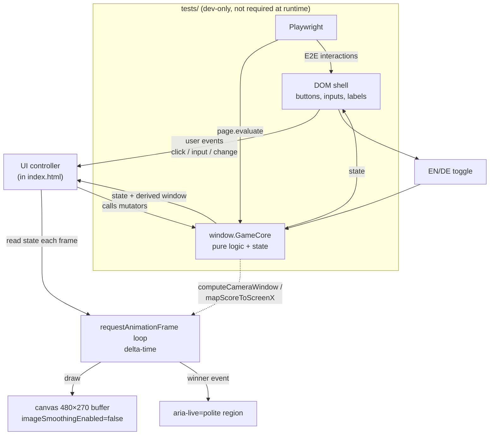

# Kamel Derby — Design Spec

Date: 2026-10-03
Status: approved by user
Deliverable: one file `index.html` at repo root

---

## Purpose

Single-page camel race game, similar to German Volksfest game "Kamel Derby".
Player sets money/points per camel, race to a goal score.
Open `index.html` directly. Play offline.

## Scope

| Item | Value |
|---|---|
| Deliverable | ONE file `index.html` at repo root |
| Runtime dependencies | zero |
| Build step | none |
| External assets | none (all art procedural) |
| Network access | none; must work from `file://` and offline |
| Browser support | current Chrome, Firefox, Safari |
| Dev-only test tooling | `tests/` dir + `package.json` + `playwright.config.*` at repo root; pnpm + Playwright. Dev files MUST NOT modify or be required by `index.html`. |
| Repo README | required (see [README requirement](#readme-requirement)); write in doc phase, not now |

## Non-Goals

Explicitly out of scope:

- sound
- localStorage persistence
- multiplayer
- betting/odds
- CI pipelines
- user-editable camel names

## UX Decisions

All confirmed by user.

| Topic | Decision |
|---|---|
| Score input style | per-camel buttons `+1 / +5 / +10` PLUS editable exact-score number input. No keyboard hotkey shortcuts. |
| View behavior | auto-fit — ALL camels always visible in canvas at any score spread (including infinite mode). No camel scrolled out of view, ever. |
| Race end | first camel to reach goal score wins → race stops, winner banner + pixel confetti, `aria-live` announcement. |
| New race | resets scores, re-enables controls, keeps config (camel count, goal, language). |
| Language | EN and DE, both complete. Toggle in header. Default EN. Session-only — resets on reload. |
| Language toggle UI | one control showing both labels `EN` and `DE`; current language highlighted |

## Architecture

One `index.html`. Three parts: DOM shell, canvas renderer, pure logic core.



Key rule: `window.GameCore` holds all scoring/camera/state logic and is testable without the DOM. The renderer and DOM only read state and call mutators.

## State Model

Camel:

```js
{ id, name, color, score, lane, animUntil }
```

Global state:

```js
{
  camels: Camel[],
  camelCount,
  goalScore: number|null,
  infinite: boolean,
  language: 'en'|'de',
  raceOver: boolean,
  winnerId: string|null
}
```

| Field | Type | Notes |
|---|---|---|
| `id` | string | stable per camel |
| `name` | string | auto-generated, localized, not user-editable |
| `color` | string | hex from 8-color palette, by lane index |
| `score` | integer | non-negative, the world position |
| `lane` | integer | 0-based lane index |
| `animUntil` | number | timestamp; walk animation active while `now < animUntil` |
| `goalScore` | number\|null | null when infinite |
| `infinite` | boolean | mutually exclusive with goal |
| `raceOver` | boolean | true after a win |
| `winnerId` | string\|null | camel id of winner |

World position = camel score ("point space"). World pixel scale for background/decoration mapping is cosmetic only — score is the position source of truth.

### Pure logic API (`window.GameCore`)

Required functions (at least):

| Function | Behavior |
|---|---|
| `addScore(camelId, n)` | add `n` to camel score |
| `setScore(camelId, n)` | set exact score |
| `setCamelCount(n)` | rebuild lanes, bounds 2–8 |
| `setGoal(scoreOrNull)` | `setGoal(n)` → goal mode with goal `n`; `setGoal(null)` → infinite mode |
| `resetRace()` | scores→0, raceOver→false, winner→null, confetti cleared, controls re-enabled; config untouched |
| `computeCameraWindow(scores, goalScore\|null)` | return `{min, max}` point window |
| `mapScoreToScreenX(score, window, canvasWidth)` | map point → screen x |

### Score rules

- Score is a non-negative integer.
- `+n` adds `n`.
- Exact input accepts integers ≥ 0 only.
- Invalid input rejected without changing state and without throwing.
- Setting a LOWER score moves the camel left.
- Values clamped/validated. No `NaN` anywhere.

## Camera Auto-Fit Algorithm

Critical requirement. Guarantees every camel always visible.

Each frame, with `minScore` and `maxScore` over all camels:

```
PAD = 20          // points
MIN_WINDOW = 100  // points
span = maxScore - minScore

wMin = minScore - PAD
wMax = max(maxScore + PAD, wMin + MIN_WINDOW)

// goal inclusion (goal mode only)
if (goalScore != null && (goalScore - wMin) <= (span + 80)) {
  wMax = max(wMax, goalScore + PAD)
}
```

| Constant | Value | Meaning |
|---|---|---|
| `PAD` | 20 points | margin each side |
| `MIN_WINDOW` | 100 points | minimum window width |
| goal-trigger slack | 80 points | finish line scrolls in as leader approaches |

- Map window to canvas width linearly: screen x = `mapScoreToScreenX(score, {min:wMin, max:wMax}, canvasWidth)`.
- Guarantee: window derived from minScore/maxScore every frame → every camel inside canvas horizontally. Clamp to canvas edges with a safety margin if rounding puts sprite slightly outside.
- Must hold with large spreads (e.g. scores 0 and 5000 concurrently) and in infinite mode.
- Degenerate spread: all scores equal → window still `MIN_WINDOW` wide, so scene does not zoom to absurd values.

## Rendering & Art

### Canvas

| Item | Value |
|---|---|
| Internal resolution | exactly 480×270 buffer pixels |
| Smoothing | `ctx.imageSmoothingEnabled = false`; CSS `image-rendering: pixelated` |
| Display size | scales up responsively; integer scale preferred (e.g. ×2/×3); never distorted; keep 16:9 |
| Camel sprite size | 24×16 buffer px at CONSTANT screen size, regardless of zoom |
| Position | only horizontal SCREEN POSITION comes from camera mapping |
| Lanes | one lane per camel, stacked vertically, fixed lane row height; each lane draws its own track band, camel, and DOM controls in side panel keyed by color |

### Art (all procedural, no image files)

- Palette: dark desert night/evening sky bands, sun, dunes, palm trees, cacti, rocks.
- Decorations placed with a seeded PRNG (fixed seed) → world stable across frames; drawn through camera mapping; may repeat/tile.
- Finish line: checkered, pole + flag at goal position (goal mode only).
- Milestone flags every 50 points, each with a 6px monospace numeric label drawn inside buffer. Required (not optional).
- Camel sprite 24×16, two humps, palette-swapped body color per camel, fixed outline/eye colors, 2-frame leg walk cycle.
- Idle camel bob: NOT required. Do not add.
- Confetti: small pixel squares, per-particle velocity/gravity, spawned from winner position, cleared on New race. Renderer-owned; core only exposes winner + reset.

### 8-color palette (lane index order)

| Lane idx | Color | Hex |
|---|---|---|
| 0 | red | `#e84a3a` |
| 1 | blue | `#3a6ae8` |
| 2 | green | `#3aa84a` |
| 3 | yellow | `#e8c83a` |
| 4 | purple | `#9a4ae8` |
| 5 | orange | `#e88a3a` |
| 6 | cyan | `#3ad8d8` |
| 7 | pink | `#e85a9a` |

## Movement & Animation

- Score change → camel target screen x from new score.
- Visual x eases/lerps toward target over ~300 ms (no jump teleports).
- Walk animation 600 ms (2-frame leg cycle) after any score change, including decreases (walk left).
- Idle = standing frame.
- `requestAnimationFrame` loop, delta-time based. No artificial fixed sleeps.
- Ties never overlap visually — each camel has its own lane.

## Goal & Infinite Mode

### Goal mode

- Number input, default 200, valid range 1–10000.
- First camel with `score >= goalScore` wins.
- Race stops immediately. Further score inputs disabled until New race.
- Winner banner in canvas (pixel art) + confetti particle burst + winner announced via `aria-live="polite"`.

### Infinite mode

- Checkbox `∞`, mutually exclusive with goal input.
- Enabling it disables/dims the goal input. Disabling it restores last goal value.
- No finish line, no winner, no end state.
- Auto-fit still guarantees all camels visible forever.

### New race

- scores → 0
- `raceOver` → false
- `winnerId` → null
- confetti cleared
- controls re-enabled
- config untouched

## Configuration & Controls

### Layout

```
┌──────────────────────────────────────────────┐
│ KAMEL DERBY  [EN|DE]                         │
├───────────────────────────────┬──────────────┤
│  canvas 480×270, upscaled     │ ⚙ camels 2-8 │
│  lane1 ▓▓▓▓🐪 ─────────── 🏁  │ goal [200] ☐∞│
│  lane2 ▓▓🐪  ──────────── 🏁  │ [+1][+5][+10]│
│  lane3 ▓▓▓▓▓🐪 ────────── 🏁  │ score [__] 𐄂 │
│  ...                          │ [New race]   │
└───────────────────────────────┴──────────────┘
```

- Left: game canvas. Right: control panel (config + per-lane score controls).
- Narrow screens: panel stacks below canvas.
- Real DOM controls styled pixel-art: hard 2px borders, no border-radius, monospace font, dark palette. No external fonts — system `monospace` only.

### Controls

| Control | Type | Range / default | Notes |
|---|---|---|---|
| Camel count | number input/stepper | 2–8, default 4 | rebuilds lanes; existing camels keep scores when count grows; removing camels drops highest-index ones |
| Goal score | number input | 1–10000, default 200 | disabled/dimmed in infinite mode |
| Infinite | checkbox `∞` | off default | mutually exclusive with goal input |
| Per-camel `+1/+5/+10` | buttons | — | one set per lane |
| Exact score | number input + set button | integers ≥ 0 | invalid rejected + show validation hint, score unchanged |
| New race | button | — | resets per [New race](#new-race) |

Camel names auto-generated and localized (see i18n table). Re-localized when language toggles. Not user-editable.

## i18n String Table

Complete. Both languages. Switch every visible UI string. No mixed-language UI.

| Key | EN | DE |
|---|---|---|
| `title` | KAMEL DERBY | KAMEL DERBY |
| `camelCountLabel` | Camels | Kamele |
| `goalLabel` | Goal | Ziel |
| `infiniteLabel` | ∞ | ∞ |
| `plus1` | +1 | +1 |
| `plus5` | +5 | +5 |
| `plus10` | +10 | +10 |
| `scoreLabel` | Score | Punktzahl |
| `setButton` | Set | Setzen |
| `newRace` | New race | Neues Rennen |
| `winnerBanner` | Camel {n} wins! | Kamel {n} gewinnt! |
| `languageToggle` | EN / DE | EN / DE |
| `validationHint` | Enter a whole number ≥ 0. | Bitte eine ganze Zahl ≥ 0 eingeben. |
| `camelName` | Camel {n} | Kamel {n} |

`{n}` = 1-based camel index. `camelName` used for EN `Camel 1..8`, DE `Kamel 1..8`.

## Accessibility

- Real `<button>`, `<input type="number">`, `<label>`, checkbox.
- All keyboard reachable.
- Visible focus outline.
- `aria-live="polite"` region for winner announcement.
- Canvas has accessible label describing the game.
- Input validation: exact-score input rejects non-integers/negatives. No silent clamping that surprises — show the validation hint string, leave the score unchanged.

## Responsiveness

- Works at 1024×768 and up.
- Narrow viewports (<900px): side panel stacks below canvas.
- Canvas never overflows viewport horizontally. No horizontal page scrollbar.

## Testing Strategy

Dev-only. `tests/` dir. pnpm + Playwright. Must NOT modify or be required by `index.html`.

### Unit-level (`page.evaluate` against `window.GameCore`)

- score add / set
- validation rejects bad input
- camel count bounds 2–8
- goal/infinite mutual exclusion
- `computeCameraWindow`: clustered, wide spread, goal inclusion, goal far away
- race-over on reaching goal
- reset

### E2E

- initial render shows 4 camels
- `+5` moves a camel right and updates score display
- exact score set moves right and left
- changing count to 6 adds lanes
- goal 200 → drive a camel to 200 → winner banner, inputs disabled
- New race resets to 0
- infinite mode enable → no finish line, score 5000 accepts more, all camel sprites remain within canvas bounds (assert via exposed sprite screen-x bounds)
- EN/DE toggle changes visible strings
- no console errors
- app loads from `file://` with no network requests

### Test constraints

- fast, deterministic
- no arbitrary sleeps beyond awaiting UI state
- must NOT require game served over HTTP

## README requirement

Specify a short repo README (do NOT create now — doc phase):

- Run: open `index.html` in a browser.
- Test: `pnpm install`, then `pnpm exec playwright install`, then `pnpm test`.

## Acceptance Criteria

1. `index.html` exists, opens from `file://`, no external network requests, no build step.
2. All visuals pixel art (canvas buffer 480×270 upscaled nearest-neighbor) plus pixel-styled DOM controls.
3. Camel count adjustable 2–8; default 4.
4. Goal score settable (default 200, range 1–10000); infinite mode available and mutually exclusive with goal.
5. Per-camel independent `+1/+5/+10` buttons and exact-score set; increases move that camel right proportionally; decreases move it left.
6. First camel reaching goal ends race with winner banner + confetti; inputs disabled; New race resets scores with config intact.
7. Infinite mode: no winner, no finish line, camels keep moving right indefinitely.
8. At every moment all camel sprites are horizontally inside the canvas, verified with extreme score spreads and in infinite mode; auto-fit window never zooms below `MIN_WINDOW` or hides a camel.
9. EN/DE toggle switches all UI strings.
10. Playwright test suite passes via `pnpm test` / `pnpm exec playwright test` as documented in a short repo README.

## Risks / Trade-offs

| Risk | Mitigation / trade-off |
|---|---|
| Auto-fit vs. constant sprite size: extreme spread compresses background but sprites stay 24×16 | Accept compression; camel screen x clamped to edge + safety margin |
| `file://` + Playwright | Tests must load from `file://`; no HTTP server allowed |
| Seeded PRNG decorations + camera mapping | Fixed seed → stable world; may tile/repeat |
| Lerp easing vs. determinism | Delta-time loop, no fixed sleeps; tests await UI state, not clocks |
| Exact-score invalid input | Reject without throwing, show hint, keep state — no silent clamp |

## Open Questions

none — all decisions confirmed.
