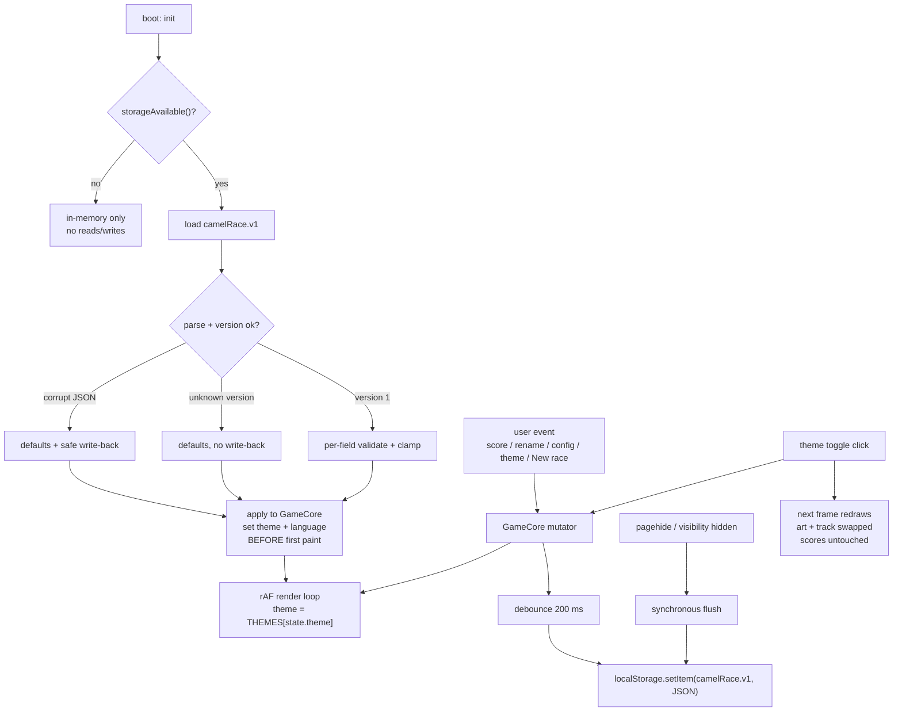

# Camel Race / Kamel Rennen — Persistence & Themes Design Spec

Date: 2026-10-04
Status: approved by user (decisions locked — do not re-litigate)
Deliverable: one file `index.html` at repo root (unchanged constraint: zero runtime deps, no build)
Base: extends [`2026-10-03-camel-derby-design.md`](2026-10-03-camel-derby-design.md)

---

## Purpose

Add (1) `localStorage` persistence so a page refresh restores the whole game, and
(2) a two-theme system — **desert** (camel + dunes, current) and **forest**
(Wildschwein/boar + rider, Wald background + grass) — switchable at any time
without resetting scores. Raise the canvas buffer `640×360` → `1280×720` so both
animals carry far more pixels.

## Scope

| Item | Value |
|---|---|
| Deliverable | ONE file `index.html` at repo root |
| Runtime dependencies | zero |
| Build step | none |
| External assets | none (all art procedural, no image files loaded) |
| Network access | none; works from `file://` and offline |
| Persistence | `localStorage`, namespace `camelRace.v1` |
| Themes | `desert`, `forest` — registry-driven, selection persisted |
| Buffer | `1280×720` (16:9), 2–8 lanes (default 4) |
| Dev-only test tooling | `tests/` + `package.json` + `playwright.config.js` (unchanged) |

## Non-Goals

- server-side or cross-device sync (no backend; `localStorage` is per-origin, per-device)
- accounts / login
- per-theme scores (one score set, shared across themes)
- sound
- new runtime dependencies or build step
- analytics / telemetry
- persisting confetti, `animUntil`, camera/motion runtime, or lane colours (derived)

---

## Persistence Design

### Key & namespace

| Item | Value |
|---|---|
| Key | `camelRace.v1` |
| Storage area | `window.localStorage` |
| Value | single JSON string |

### JSON schema (exact)

```json
{
  "version": 1,
  "camelCount": 4,
  "camels": [ { "name": "Team 1", "score": 0 }, { "name": "Team 2", "score": 0 } ],
  "goalScore": 200,
  "infinite": false,
  "language": "en",
  "theme": "desert",
  "raceOver": false,
  "winnerId": null
}
```

| Field | Type | Range / rule |
|---|---|---|
| `version` | integer | exactly `1`; any other value → ignored (see [Boot order](#boot-order)) |
| `camelCount` | integer | `2`–`8`; default `4` |
| `camels` | array | length `camelCount`; item `{ name: string, score: integer }` |
| `camels[].name` | string | trimmed, sanitized, `≤ 16` chars; default `Team {n}` (`{n}` = 1-based lane) |
| `camels[].score` | integer | `≥ 0`; default `0` |
| `goalScore` | integer \| null | `1`–`10000`; `null` iff `infinite` is `true`; default `200` |
| `infinite` | boolean | default `false` |
| `language` | string | `"en"` \| `"de"`; default `"en"` |
| `theme` | string | a `THEMES` id (`"desert"` \| `"forest"`); default `"desert"` |
| `raceOver` | boolean | default `false` |
| `winnerId` | string \| null | must equal `"camel-{lane}"` for an existing lane; else `null` |

Lane id convention is unchanged: `id = "camel-" + laneIndex`. Lane colour is derived
from `PALETTE[laneIndex % 8]` and never stored.

### Per-field validation with fallback

Load = parse → validate every field independently → missing/invalid → default.
Never throw on bad data; never propagate `NaN`.

| Field | Validation → fallback |
|---|---|
| root | not a JSON object → all defaults |
| `version` | `!== 1` → start from defaults, **do not write back** (forward-compat) |
| corrupt JSON | `JSON.parse` throws → all defaults + **safe write-back** of valid defaults |
| `camelCount` | integer → `clamp(2, 8)`; else `4` |
| `camels` | array → take first `camelCount`; missing lanes filled with defaults |
| `camels[i].name` | string → strip C0 controls (`U+0000`–`U+001F`) + `U+007F`, trim, truncate `≤ 16`; empty/absent → `Team {i+1}` |
| `camels[i].score` | integer `≥ 0` and `≤ Number.MAX_SAFE_INTEGER` → keep; else `0` |
| `infinite` | boolean → keep; else `false` |
| `goalScore` | if `infinite` → forced `null`; else integer → `clamp(1, 10000)`; absent/non-integer → `200` |
| `language` | `"en"` \| `"de"` → keep; else `"en"` |
| `theme` | id present in `THEMES` → keep; else `"desert"` |
| `raceOver` | boolean → keep; else `false` |
| `winnerId` | string equal to `"camel-0".."camel-{camelCount-1}"` → keep; else `null`. If `raceOver` is `false`, force `null` |

### Write timing

- **Debounced 200 ms** after any persisted state change. Rapid `+1` clicks collapse
  into one write → no thrash.
- **Synchronous flush** on `pagehide` and on `visibilitychange` when
  `document.visibilityState === 'hidden'`. Covers tab close / reload during the
  debounce window.
- No `beforeunload` write is needed.
- If `storageAvailable()` is `false`, all reads and writes are skipped (in-memory only).

### Boot order (restore before first paint)

1. `storageAvailable()` diagnostic; if `false`, skip load/save entirely.
2. Read + validate `camelRace.v1`; on corrupt JSON, write back valid defaults.
3. Apply restored state to `GameCore` **before** building the DOM and **before** the
   first `requestAnimationFrame`; set the active theme in the renderer and the
   active language strings + theme toggle `aria-pressed` before first paint →
   no flash of default theme/language.
4. Subscribe: every state change → schedule debounced save (200 ms). Confetti is
   never part of persisted state.

### Graceful degradation when storage is unavailable

`localStorage` can throw `SecurityError`/`QuotaExceededError` (opaque `file://`
origins, private mode, disabled storage, quota). Diagnostic:

```js
function storageAvailable() {
  try {
    const k = '__camel_probe__';
    localStorage.setItem(k, '1');
    localStorage.removeItem(k);
    return true;
  } catch (e) { return false; }
}
```

- `storageAvailable() === false` → game runs fully, no reads/writes, no unhandled errors.
- Exposed for tests as `window.GameStorage = { KEY, VERSION, available, load, save, clear }`
  (`KEY = "camelRace.v1"`, `VERSION = 1`).

### What persists vs. what does not

| Survives reload | Reset by New race (and persisted) | Never persisted |
|---|---|---|
| `camelCount`, `camels[].name`, `goalScore`, `infinite`, `language`, `theme` | `camels[].score` → 0, `raceOver` → false, `winnerId` → null | confetti particles, `animUntil`, camera window, lane colours, motion/visual runtime |

A **restored finished race** (`raceOver: true`) shows the winner banner on load but
does **not** replay confetti (confetti is spawn-only on a live win, cleared on reset).

### Persistence + theme flow



---

## Theming Architecture

### Registry

`THEMES` is keyed by theme id; each entry has the same shape:

```js
THEMES[id] = {
  id,                                   // 'desert' | 'forest'
  label: { en, de },                    // display name per language
  palette: { sky: [hex,…], sun / moon, accent, distant: [hex,…] },  // sky + celestial + distant-silhouette tokens
  ground: { top, shade, edge, rim },    // lane-band tokens
  decor: { spacing, maxSpan, kinds: [ { kind, layer, weight, sprite, pal, yOffset } ] },
  animal: {
    id, sprite, pal,                    // frame matrix table + palette factory(laneColor)
    w, h,                               // sprite budget px (see geometry)
    rider: 'turban' | 'hunter',
    blanket: { anchor: { x, y }, w: 6, h: 10, digitColor },
    bobOffset: 2
  },
  laneFit: { spriteHMax: 70, laneMinPx: 74 }
}
```

| Theme | `label.en` | `label.de` | animal | ground |
|---|---|---|---|---|
| `desert` | Desert | Wüste | camel (turban rider) | undulating sand dunes |
| `forest` | Forest | Wald | boar (hunter rider) | grass lanes + treeline |

### Renderer consumption

- One active theme: `const theme = THEMES[state.theme]`.
- Sky, ground bands, decor, and the animal all read from `theme`; nothing else is
  theme-specific.
- Camera math, scoring, lane layout, milestones, finish line and digit font are
  **theme-independent** and shared.
- Finish line (checkered pole) and milestone flags render in every theme.

### Switching

- Theme toggle click → `setTheme(id)` → update `state.theme` → redraw on the next
  frame. **No score reset, no race reset, scores keep running.**
- Selection is persisted (debounced save).
- Switching mid-race keeps `raceOver`/`winnerId`; only art + track swap.

### Lane colours, rider, blanket

- The 8-colour `PALETTE` (`#e84a3a #3a6ae8 #3aa84a #e8c83a #9a4ae8 #e88a3a #3ad8d8 #e85a9a`)
  is **theme-independent**: lane colour = `PALETTE[laneIndex % 8]`.
- The rider garment (`R`) takes the lane colour in both themes (camel robe = boar tunic).
- Saddle blanket (`L`, `#bfe3ea`) + digit ink (`#123a44`) and the 6×10 digit grid are
  **shared** across themes; only the `blanket.anchor` differs per animal.
- Forest decor (deterministic, no `Math.random`) uses the same seeded scheme as today
  (`mulberry32(hash2(SEED, k))`, `SEED = 1337`):
  - background **trees** along the horizon (treeline),
  - 4 floor kinds: **mushrooms**, **moss**, **stones**, **pine needles**.
  - `decor.kinds[].kind` is family-level: `trees` (conifer/deciduous/bush),
    `mushrooms` (red/brown), `moss`, `stones` (stone/stone-alt), `pine_needles`; each
    entry carries `layer: 'background' | 'floor'` (`background` bases on the horizon,
    `floor` on the lane's terrain surface).
  - Bounded exactly like current decor: `decor.spacing = 90` world points and the
    `decor.maxSpan = 1500` points cull gate; past the gate world decor is skipped
    (sky + ground bands still draw). Per-frame decor count stays bounded. Placement
    jitter is `⌊rng()*40−20⌋` (±20 world points, drawn after the kind roll) and the
    cull margin is `(win.max − win.min) * (16 / CANVAS_W)` (`16` px at full width).

---

## Resolution & Geometry

### Canvas

| Item | Value |
|---|---|
| Buffer | exactly `1280×720` (`<canvas width="1280" height="720">`) |
| Smoothing | `ctx.imageSmoothingEnabled = false`; CSS `image-rendering: pixelated` |
| Display scale | `scale = min(availW/1280, availH/720)`, `SCALE_MAX = 2`, snap to nearest integer when within `SNAP_TOLERANCE = 0.08` and it fits, else fractional, floor `SCALE_EPSILON = 0.05`; never larger than wrapper; never distorted; keep 16:9 |
| `SCALE_MAX` re-validation | `4 → 2` keeps the max display size at `2560×1440` (4×640×360 = 2×1280×720) |

### Vertical layout constants

| Constant | Old (640×360) | New (1280×720) | Derivation |
|---|---|---|---|
| `CANVAS_W` | 640 | **1280** | 2× |
| `CANVAS_H` | 360 | **720** | 2× |
| `HORIZON_Y` | 88 | **120** | keeps a 16.7% sky for composition while still fitting the boar budget at 8 lanes with no clamp |
| `LANE_BOTTOM` | 356 | **712** | `CANVAS_H − 8` (2× the old 4 px margin) |
| lane region | 268 | **592** | `LANE_BOTTOM − HORIZON_Y` |
| `laneHeight(8)` | 33.5 | **74.0** | `592 / 8` |
| `laneHeight(4)` | 67.0 | **148.0** | `592 / 4` |
| `LANE_MARGIN` | 2 | **4** | 2× |
| `TERRAIN_FEET_OFFSET` | 2 | **2** | kept; see terrain proof |

### Sprite budget

| Animal | Size (w×h px) | Notes |
|---|---|---|
| Camel v5 | **66 × 62** | budget ceiling; art doc fixes the exact matrix, painted bbox `≤ 66×62` |
| Boar | **cap ≤ 76 × 70; shipped 60 × 42** | height cap **70 px incl. 1 px bob**; shipped boar is **`60 × 42`** (blanket anchor `(18,18)`, `1 px` bob); traced from the reference; art doc fixes exact matrix |

**8-lane fit proof.** Slack at 8 lanes = `laneHeight(8) − 70 = 74 − 70 = 4 px`.
With `TERRAIN_FEET_OFFSET = 2` and terrain `∈ [−2, +2]`:
`top = laneTop + laneHeight − FEET_OFFSET − terrain − 70 = laneTop + 2 − terrain`,
so `top ∈ [laneTop, laneTop + 4]` = `[laneTop, laneBottom − 70]` → **the existing
`camelTopY` clamp never activates**; feet always land on the terrain surface.

### Terrain

| Constant | Value |
|---|---|
| `TERRAIN` | `A1 = 1.2, L1 = 160, PH1 = 0, A2 = 0.8, L2 = 130, PH2 = 1.7` |
| amplitude | `A1 + A2 = 2.0 px`, clamped `±2` |
| wavelengths | `160` / `130` world points (unchanged — world-space frequency preserved) |

Amplitude stays `±2` (not doubled) precisely so the 8-lane fit proof holds. Same
profile for every lane; precomputed per canvas column each frame (1280 columns).

### Re-authored art scale (1280×720)

| Element | Change |
|---|---|
| Sun / sky bands | re-authored for the 120 px sky strip (desert: night bands + sun; forest: dusk bands + moon) |
| Decor sprites | palms / cacti / rocks (desert) and trees / mushrooms / moss / stones / pine needles (forest) re-authored ≈2× |
| Milestone flag + label | sprite ≈2×; label font `6px → 12px` monospace |
| Winner banner | font `8px → 16px` monospace |
| Confetti | particle `2×2 → 4×4`; velocities/gravity ≈2× |
| Digit font | `3×5 → 6×10`: each glyph is a **2× nearest-neighbour upscale** of the existing 3×5 table (one source of truth). At `SCALE_MAX = 2` the on-screen digit size matches today's 3×5 at 4× → same legibility, no re-authoring risk. Digit drops `2 px` with the body on bob frames 2/4. |
| Blanket / digit | anchor moves with each animal's matrix; grid + ink shared |

### Performance acceptance

- Target: **average ≥ 55 fps** over `≥ 120` consecutive `requestAnimationFrame`
  frames, with **8 lanes** at an extreme score spread (e.g. scores `0` and `5000`
  concurrently), measured in Playwright.
- Mitigations: terrain heights precomputed once per frame; `DECOR_MAX_SPAN = 1500`
  cull gate; sky gradient cached (`createLinearGradient` once, not per frame);
  static sky/sun optionally cached to an offscreen canvas.

---

## i18n Additions

New keys (full existing table unchanged; add these):

| Key | EN | DE |
|---|---|---|
| `themeLabel` | Theme | Thema |
| `themeDesert` | Desert | Wüste |
| `themeForest` | Forest | Wald |

`canvasLabel` stays generic (no theme words). No other new strings.

## Accessibility

- Theme control: real `<button>` per theme, keyboard reachable, `role="group"` +
  `aria-label` = `themeLabel`, active button `aria-pressed="true"` (others `false`);
  visible focus outline (matches the existing `EN`/`DE` toggle pattern).
- Restoring persisted theme/language **must not steal focus** on load.
- Persistence is passive: it never reorders DOM or changes focus.
- `aria-live="polite"` winner announcement unchanged.

## Art Rules

- **Boar** traced from the user reference `wildschwein-pixelart.jpeg` (repo root,
  448×362, user-mirrored to face **right**). Similarity target: silhouette overlap
  `≥ 0.90` at the reference's native pixel grid before downscale.
- **Camel v5** redrawn at the matching visual scale (`66×62`) with the same palette
  discipline and enclosure pass as v4.
- Both animals share the rider / blanket / 6×10 digit convention; only the palette,
  silhouette, rider style (turban vs. hunter) and blanket anchor differ.
- The reference `wildschwein-pixelart.jpeg` **MUST stay out of git** (copyright); it
  is already covered by the `.gitignore` rule `wildschwein-pixelart.jpeg` — keep that
  rule. It is **never linked, embedded, or loaded at runtime**; all art is procedural.
- Art docs to update:
  - `docs/art/camel-sprite.md` → **v5** (new size, matrices, 6×10 digit).
  - `docs/art/boar-sprite.md` → **new** (trace method, legend, matrices, rider).
  - `docs/art/wildschwein-sprite-DRAFT.md` → **delete** (superseded).

## Test Strategy (storage)

| Tests | Origin |
|---|---|
| Persistence round-trip / validation / degradation | **local static HTTP server** started **inside the test process** |
| All other tests | `file://` (unchanged) |

- Server helper: Node builtins only (`node:http`, `node:fs`, `node:path`) serving the
  repo root on an **ephemeral port** (`server.listen(0)` → `server.address().port`);
  no new dependencies. One `beforeAll`/fixture starts it, tests use the
  `http://127.0.0.1:<port>/index.html` URL, `afterAll` closes it.
- Storage-failure test: `page.addInitScript` overrides `window.localStorage` with a
  getter that throws `SecurityError` → assert the game still plays, no console
  errors, and no writes attempted.
- No arbitrary sleeps; await UI/rAF state only.

## Acceptance Criteria

1. Buffer is exactly `1280×720`; `<canvas width="1280" height="720">`; display `scale = min(availW/1280, availH/720)` with `SCALE_MAX = 2`, 8% integer snap, no distortion; page never scrolls at 1024×768, 1280×720, 1920×1080.
2. `localStorage` key `camelRace.v1` holds JSON with `version`, `camelCount`, `camels[{name,score}]`, `goalScore`, `infinite`, `language`, `theme`, `raceOver`, `winnerId`; every field round-trips across a reload.
3. Reload restores camel count, each lane's name + score, goal score, infinite flag, language, theme, `raceOver`, and `winnerId` exactly.
4. Corrupt JSON → defaults used + safe write-back of valid defaults; unknown/missing `version` → fresh defaults with no overwrite.
5. Every field is validated/clamped per the table: count 2–8, goal 1–10000 or null, scores integer ≥0, names trimmed ≤16 and sanitized, language ∈ {en,de}, theme ∈ registry, `raceOver` boolean, `winnerId` ∈ camels else null.
6. With storage blocked (override throws `SecurityError`), the game is fully playable, raises no unhandled errors, and performs no writes.
7. Writes are debounced 200 ms and flushed synchronously on `pagehide` / `visibilitychange` hidden.
8. New race resets scores + `raceOver` + `winnerId` (persisted) and keeps names/count/goal/language/theme.
9. A restored finished race shows the winner banner but does not replay confetti.
10. Theme switch is instant (art + track swap within one frame), does not reset scores, and is persisted; both themes render.
11. Forest theme renders the boar + treeline + grass ground + the 4 floor decor kinds (mushrooms, moss, stones, pine needles); the boar is traced from `wildschwein-pixelart.jpeg`.
12. Desert theme still renders camel + dunes + palms/cacti/rocks at the new resolution.
13. 8 lanes fit the sprite budget: camel v5 `66×62` and boar `≤70` tall each stay fully inside their lane band including terrain bobbing; count range 2–8, default 4.
14. Performance: average ≥55 fps over ≥120 rAF frames with 8 lanes at score spread 0 vs 5000.
15. EN and DE include `themeLabel` + theme names; switching theme updates localized labels; digit font is 6×10.
16. No network requests; single-file constraint holds; the reference JPEG is not in git and not loaded at runtime.

## Risks / Trade-offs

| Risk | Mitigation / trade-off |
|---|---|
| 4× pixels vs. perf | precomputed terrain rows, decor cull gate, cached sky gradient; ≥55 fps acceptance gate |
| Sky is 120 px of 720 (16.7%) so a 70 px boar fits 8 lanes | accepted: composition preserved; boar still ~2.3× the old sprite height |
| Art-authoring effort (two animals + decor + fonts at 2×) | digit font derived by 2× upscale; decor via seeded generator; art docs pin exact matrices |
| `localStorage` origin quirks (`file://` opaque origin, private mode) | `storageAvailable()` probe + in-memory fallback; persistence tests via local HTTP server |
| Reference-image copyright | file gitignored, never linked/loaded; art traced procedurally; rule documented |
| Flash of default theme/language | restore + apply theme/language before first paint |
| Debounce window loses last input on hard kill | synchronous flush on `pagehide` + `visibilitychange` hidden |

## Open Questions

none — all decisions confirmed.
